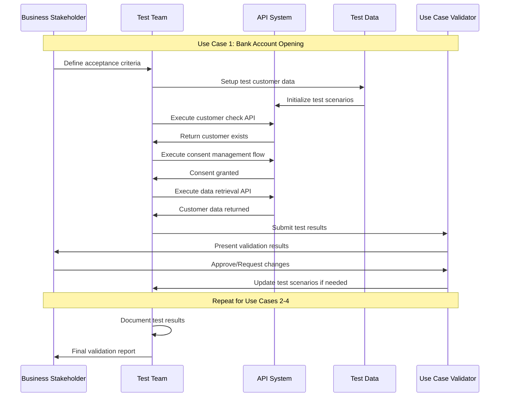
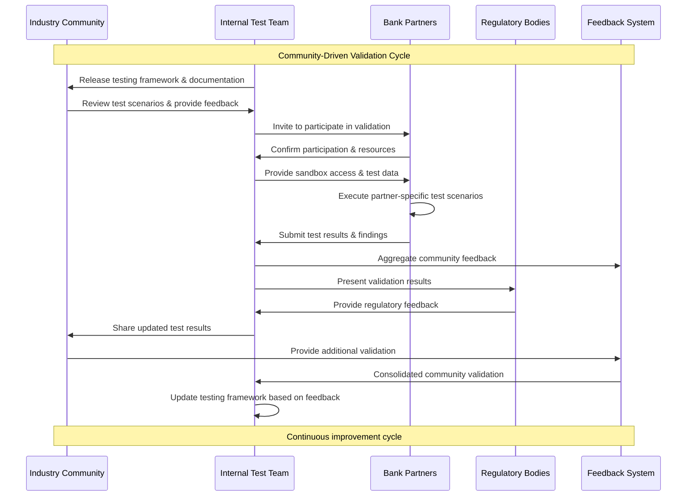

# OBP Testing und Verifikation Conclusion

## Inhalt

1. [Executive Summary](#executive-summary)
2. [Vorgehen und Ziele zu Testing und Verifikation](#vorgehen-und-ziele-zu-testing-und-verifikation)
3. [Vollständiges Testing-Konzept nach Developer Industry Standards](#vollständiges-testing-konzept-nach-developer-industry-standards)
4. [Use Case basierte Verifikation](#use-case-basierte-verifikation)
5. [Interaktive Demos und Visualisierung](#interaktive-demos-und-visualisierung)
6. [Community-basierte Verifikation und externe Validierung](#community-basierte-verifikation-und-externe-validierung)
7. [Fazit und Roadmap](#fazit-und-roadmap)

---

## Executive Summary

Das Testing und Verifikations-Framework für die Open API Kundenbeziehung etabliert comprehensive Qualitätssicherung auf allen Ebenen - von technischen Unit Tests bis hin zu community-basierten Use Case-Validierungen. Das Framework folgt Industry-Best-Practices und ermöglicht kontinuierliche Verifikation durch Stakeholder und Partner.

**Zentrale Ansätze:**
- Multi-Layer Testing Strategy von Unit Tests bis End-to-End Integration
- Use Case-basierte Verifikation mit den 4 priorisierten Anwendungsfällen
- Community-driven Validation durch Partner und Industry Experts
- Interactive Demos zur Stakeholder-Kommunikation und Feedback-Sammlung

**Ziele:**
- Sehr hohe Test Coverage für alle kritischen API-Funktionalitäten
- Automated Testing Pipeline für Continuous Integration/Deployment
- Stakeholder-validierte Use Case Implementation
- Production-ready Quality durch comprehensive Testing

---

## Testing und Verifikations-Diagramme

### Multi-Layer Testing Strategy

**Konzeptionelles Testing-Framework:**

Das Testing-Framework organisiert sich in vier aufeinander aufbauenden Schichten:

**Layer 1: Unit Testing**
- API Endpoint Tests für einzelne Funktionsmodule
- Business Logic Tests für Geschäftsregeln
- Data Model Tests für Datenstrukturen
- Security Function Tests für Sicherheitsfunktionen

**Layer 2: Integration Testing**
- API Contract Testing zwischen Systemkomponenten
- Database Integration für Datenpersistierung
- External Service Integration für Drittanbieter-Services
- Security Integration Tests für Ende-zu-Ende-Sicherheit

**Layer 3: System Testing**
- End-to-End API Flows für komplette Geschäftsprozesse
- Performance Testing für Skalierbarkeit und Response-Zeiten
- Security Testing für Penetration und Vulnerability Assessment
- Compliance Testing für regulatorische Anforderungen

**Layer 4: Acceptance Testing**
- Use Case Validation mit realen Anwendungsfällen
- Stakeholder Acceptance durch Fachbereiche
- Business Process Validation für Geschäftsabläufe
- User Experience Testing für Anwenderfreundlichkeit

**Hierarchischer Aufbau:** Jede Schicht baut auf den Ergebnissen der vorhergehenden auf, wodurch eine systematische Qualitätssicherung vom kleinsten Funktionsmodul bis zum vollständigen Geschäftsprozess gewährleistet wird.

### Automated Testing Pipeline

[Automated Testing Pipeline Diagram](./Resources/graphics/08-testing-verification/automated-testing-pipeline.mmd)

### Use Case Verification Process

**Consent Management Testing:** The consent management flow testing includes validation of granular permissions, consent lifecycle management, and GDPR compliance. → [Complete consent flow specifications and testing requirements in Conclusion 06 Consent und Security Flow](./06%20Consent%20und%20Security%20Flow.md)

### Community Validation Process

---

## Vorgehen und Ziele zu Testing und Verifikation

### Testing Framework Konzept

**Duale Testing-Philosophie:**
1. **Technical Testing:** Automated Testing für Code Quality, Performance und Security
2. **Business Validation:** Use Case-basierte Verifikation mit realen Stakeholdern

### Übergeordnete Ziele

#### Qualitätssicherung
- **Functional Correctness:** Alle API-Funktionalitäten arbeiten gemäss Spezifikation
- **Non-Functional Requirements:** Performance, Sicherheit, Skalierbarkeit erfüllt
- **Regulatory Compliance:** FAPI 2.0, GDPR/DSG, FINMA-Anforderungen eingehalten
- **User Experience:** Intuitive und frictionless Customer Journeys

#### Stakeholder Confidence
- **Developer Confidence:** Robust APIs mit comprehensive Documentation
- **Business Stakeholder Buy-in:** Validierte Business Value durch Use Case Testing
- **Regulatory Acceptance:** Compliance-nachgewiesene Implementation
- **Market Readiness:** Production-ready System mit nachgewiesener Stability

### Verifikations-Methodologie

#### Kontinuierliche Verifikation
**Iterative Validation Cycles:**
- **Sprint-basierte Testing:** Testing in 2-Wochen-Zyklen mit Stakeholder Feedback
- **Milestone-basierte Validation:** Major Use Case Testing bei Projektmeilensteinen
- **Community Reviews:** Regelmässige Partner und Expert Reviews
- **Public Demos:** Quarterly Public Demonstrations für Feedback

#### Multi-Stakeholder Approach
**Verschiedene Validation-Perspektiven:**
- **Technical Validation:** Developer und Architect Reviews
- **Business Validation:** Product Manager und Business Analyst Testing
- **User Validation:** Customer Journey Testing mit End Users
- **Regulatory Validation:** Compliance und Legal Expert Reviews

---

## Community-basierte Verifikation und externe Validierung

### Partner-basierte Validation

#### Banking Partner Program
**Structured Partner Validation:**
- **Tier 1 Partners:** Major Swiss Banks (3-5 institutions)
- **Tier 2 Partners:** Regional/Cantonal Banks (5-8 institutions)
- **Tier 3 Partners:** FinTechs und Service Providers (10+ companies)

**Validation Activities:**
- **Technical Integration Testing:** Real-world API integration
- **Business Process Validation:** Use Case feasibility assessment
- **Security Review:** Independent security assessment
- **User Experience Testing:** Customer journey validation

#### Industry Expert Reviews

**Expert Panel Composition:**
- **Technical Experts:** API Architecture und Security Specialists
- **Business Experts:** Banking und FinTech Industry Leaders
- **Regulatory Experts:** Compliance und Legal Specialists
- **Academic Experts:** Research Institution Representatives

**Review Methodology:**
- **Quarterly Expert Sessions:** Structured review meetings
- **Continuous Feedback Loop:** Ongoing expert input integration
- **Public Expert Endorsements:** Community credibility building
- **Best Practice Documentation:** Expert-validated implementation guides

### Community Engagement Framework

#### Open Source Contributions
**Community-Entwicklung:**
- **GitHub Repository:** Open source reference implementation
- **Developer Documentation:** Comprehensive API documentation
- **Code Examples:** Realitätsnahe Integrationsbeispiele
- **Community Forums:** Entwicklerbetreuung und Diskussion

#### Industry Standardization
**Standards-Gremien Engagement:**
- **Swiss FinTech Association:** Industry standard development
- **European Standards Bodies:** International alignment
- **OpenID Foundation:** Identity standard contributions
- **FIDO Alliance:** Authentication standard participation

### External Validation Processes

#### Third-Party Audits
**Independent Quality Assurance:**
- **Security Audits:** External penetration testing und security reviews
- **Compliance Audits:** Independent regulatory compliance assessment
- **Performance Audits:** Third-party performance benchmarking
- **Code Quality Reviews:** Independent code quality assessment

#### Academic Validation
**Research Collaboration:**
- **University Partnerships:** Academic research collaboration
- **Research Publications:** Peer-reviewed validation studies
- **Conference Presentations:** Industry conference validation
- **Academic Advisory Board:** Ongoing academic input

### Feedback Integration Methodology

#### Continuous Improvement Cycle
**Structured Feedback Processing:**
1. **Collection:** Multi-channel feedback gathering
2. **Analysis:** Systematic feedback categorization und prioritization
3. **Integration:** Rapid iteration based on validated feedback
4. **Communication:** Transparent communication of changes
5. **Validation:** Follow-up validation of implemented changes

#### Community-Driven Roadmap
**Kollaborative Entwicklung:**
- **Public Roadmap:** Transparent development planning
- **Community Voting:** Feature prioritization durch community input
- **Open Issues Tracking:** Public issue tracking und resolution
- **Regular Community Updates:** Transparent progress communication

---

## Fazit und Roadmap

### Strategische Bedeutung für Open API Kundenbeziehung

**Testing als Vertrauensbildende Massnahme:**
- Community Confidence durch transparente Quality Demonstration
- Regulatory Acceptance durch comprehensive Compliance Testing
- Market Readiness durch extensive Partner Validation
- Technical Excellence durch industry-leading Testing Standards

**Nachhaltiger Qualitätsansatz:**
- Continuous Improvement durch ongoing Community Feedback
- Adaptive Testing Framework für emerging Requirements
- Scalable Testing Infrastructure für Market Growth
- Innovation-fördernd durch Open Source Collaboration

Das Testing und Verifikations-Framework positioniert die Open API Kundenbeziehung als qualitativ führende Lösung im Schweizer Fintech-Markt und schafft das notwendige Vertrauen für breite Marktakzeptanz.

### Roadmap für Testing und Verifikation

Testing und Verifikation läuft parallel zu allen Implementierungsphasen mit spezifischem Fokus auf Community-basierte Validation und Multi-Layer Testing Strategy.

**Vollständige Timeline:** → [Siehe ROADMAP.md](../../ROADMAP.md)

---

**Version:** 1.0  
**Datum:** August 2025  
**Status:** Final Draft für Review

---

[Quellen und Referenzen](./Quellen%20und%20Referenzen.md)