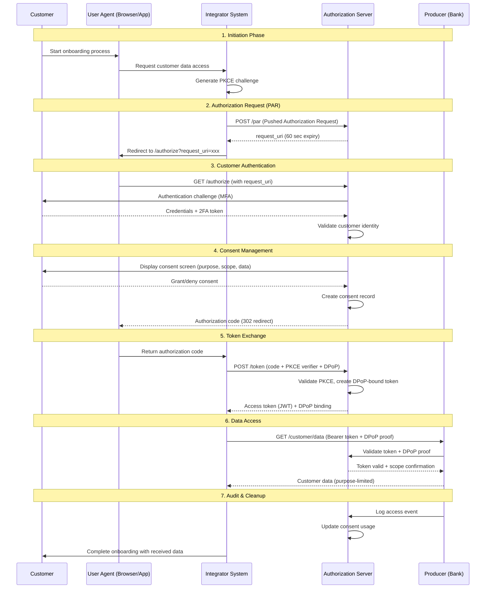
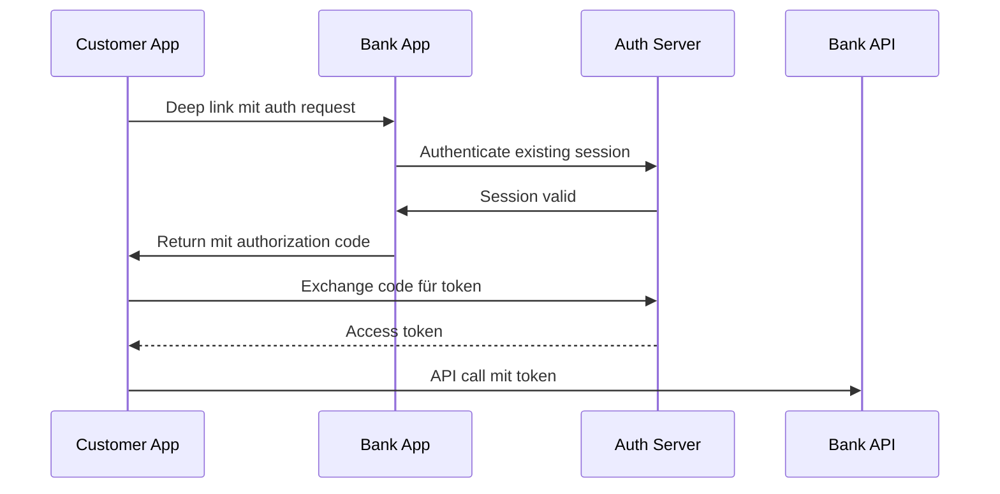
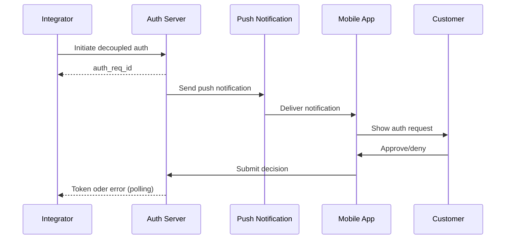
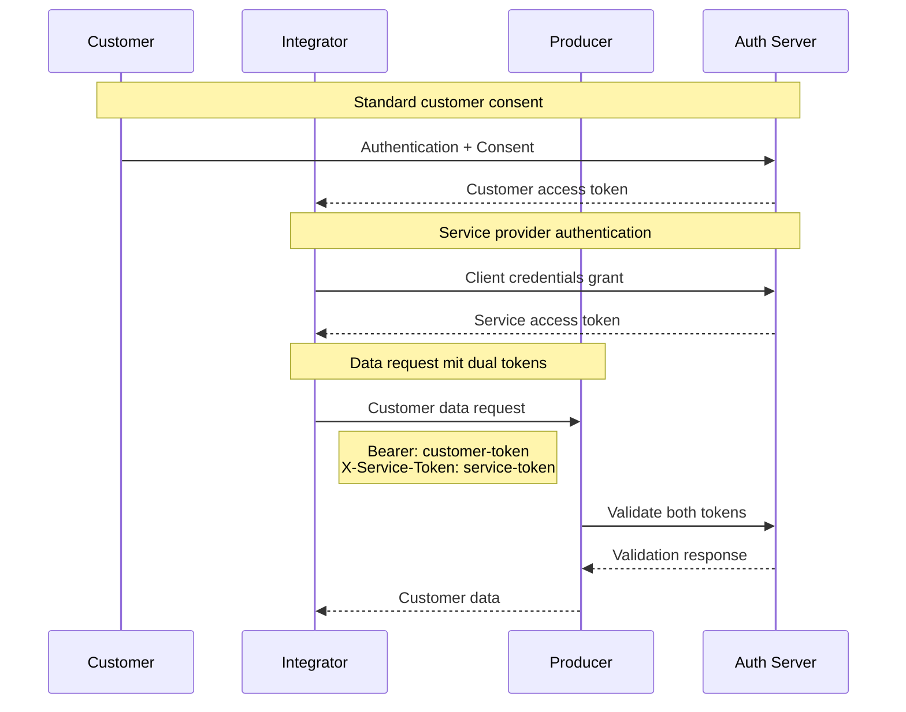

# 06 Consent and Security Flow - Inhaltsverzeichnis

## **Executive Summary**
- FAPI 2.0 konforme Security-Architektur für Financial-grade APIs
- Generisches Framework unabhängig vom Vertrauensnetzwerk-Modell
- Sequence Diagram-basierte Dokumentation aller Authentication Flows

---

## **1. Security Framework Grundlagen**

### **1.1 Scope und Unabhängigkeit**
- **Network Agnostic:** Funktioniert in dezentralen, hybriden und zentralen Architekturen
- **Universal Application:** Einheitliche Security für alle Use Cases und Zielbilder
- **Standards Compliance:** FAPI 2.0, OAuth 2.1, OIDC, PKCE mandatory implementation
- **Regulatory Alignment:** FINMA, PSD2, GDPR compliance built-in

### **1.2 Security Components Overview**

| Component | Purpose | Configuration Requirements |
|-----------|---------|----------------------------|
| **Authorization Server** | OAuth 2.1/OIDC endpoint für authentication | FAPI 2.0 compliance, PAR support, DPoP validation |
| **Customer Application** | User-facing authentication interface | PKCE implementation, secure credential storage |
| **Producer API** | Data source with customer information | mTLS/DPoP authentication, scope validation |
| **Integrator System** | Data consumer requesting customer access | Client credentials, purpose-based access |
| **Consent Management** | Granular permission tracking | Purpose limitation, audit trail, revocation |

### **1.3 Trust Relationships**
- **Customer ↔ Authorization Server:** Strong authentication, multi-factor verification
- **Authorization Server ↔ Producer:** Mutual authentication, certificate validation
- **Integrator ↔ Authorization Server:** Client authentication, scope limitation
- **Producer ↔ Integrator:** Token-based authorization, data minimization

---

## **2. Authentication Flow Architecture**

### **2.1 Core Authentication Sequence Diagram**



### **2.2 Sequence Flow Breakdown**

#### **Phase 1: Initiation (Steps 1-3)**
- **Step 1:** Customer initiates service request mit Integrator
- **Step 2:** Integrator prepares OAuth 2.1 flow mit PKCE challenge generation
- **Step 3:** PAR request sent to Authorization Server mit 60-second expiration

#### **Phase 2: Authentication (Steps 4-6)**
- **Step 4:** Authorization Server challenges customer with MFA
- **Step 5:** Customer provides credentials (username/password + 2FA)
- **Step 6:** Strong customer authentication verified (PSD2 compliance)

#### **Phase 3: Consent (Steps 7-9)**
- **Step 7:** Dynamic consent screen showing specific data und purpose
- **Step 8:** Customer makes informed consent decision
- **Step 9:** Authorization code issued with consent binding

#### **Phase 4: Token Exchange (Steps 10-12)**
- **Step 10:** Authorization code exchanged für access token
- **Step 11:** PKCE verification prevents code interception attacks
- **Step 12:** DPoP-bound token issued für sender-constrained access

#### **Phase 5: Data Access (Steps 13-16)**
- **Step 13:** API request mit Bearer token + DPoP proof-of-possession
- **Step 14:** Token validation including DPoP cryptographic proof
- **Step 15:** Scope-limited data returned (purpose binding)
- **Step 16:** Comprehensive audit logging

---

## **3. FAPI 2.0 Security Implementation**

### **3.1 Enhanced Authentication Requirements**

#### **PAR (Pushed Authorization Requests)**
```http
POST /as/par HTTP/1.1
Host: auth.producer-bank.ch
Content-Type: application/x-www-form-urlencoded

client_id=integrator-client-id&
request=eyJhbGciOiJQUzI1NiIsImtpZCI6IjEifQ.eyJpc3MiOiJjbGllbnQtaWQi...
```

**PAR Benefits:**
- **Security:** Request object transmitted securely über backend channel
- **Integrity:** JWS-signed request object prevents tampering
- **Performance:** Reduced URL length, improved mobile compatibility
- **Compliance:** FAPI 2.0 mandatory requirement

#### **DPoP (Demonstrating Proof-of-Possession)**
```http
POST /token HTTP/1.1
Host: auth.producer-bank.ch
DPoP: eyJ0eXAiOiJkcG9wK2p3dCIsImFsZyI6IkVTMjU2IiwiandrIjp7ImNydiI6I...

grant_type=authorization_code&
code=SplxlOBeZQQYbYS6WxSbIA&
client_id=integrator-client-id&
code_verifier=dBjftJeZ4CVP-mB92K27uhbUJU1p1r_wW1gFWFOEjXk
```

**DPoP Token Binding:**
- **Cryptographic Proof:** Every API call includes cryptographic evidence
- **Replay Protection:** Timestamps und nonces prevent replay attacks
- **Alternative to mTLS:** More flexible than mutual TLS certificates
- **Mobile Friendly:** Works well mit mobile app architectures

### **3.2 Algorithm und Crypto Requirements**

#### **Allowed Algorithms (FAPI 2.0 Compliance)**
- **Signing:** PS256, ES256, EdDSA only (no HS256, RS256)
- **Encryption:** A256GCM, A256CBC-HS512 für sensitive data
- **Key Exchange:** ECDH-ES, RSA-OAEP-256 für key wrapping
- **Hashing:** SHA-256 minimum für all cryptographic operations

#### **Certificate Requirements**
- **Client Certificates:** ECC P-256 or RSA 2048-bit minimum
- **Certificate Validation:** OCSP stapling, CRL checking mandatory
- **Certificate Pinning:** Recommended für mobile applications
- **Key Rotation:** Automated key rotation every 12 months

---

## **4. Consent Flow Variations**

### **4.1 App-to-App Flow (Mobile Optimized)**

#### **Components Involved**
- **Customer Mobile App:** Native iOS/Android application
- **Producer Banking App:** Bank's own mobile application
- **Deep Link Handler:** Custom URL scheme für seamless handover
- **Universal Links:** iOS/Android universal link support

#### **Flow Sequence**


#### **Implementation Details**
- **Deep Links:** Custom scheme `bankapp://authorize?request_uri=...`
- **Universal Links:** HTTPS URLs routed zu native app
- **Session Reuse:** Leverage existing bank app authentication
- **Biometric Auth:** Touch ID/Face ID för frictionless experience

### **4.2 Browser Redirect Flow (Web Standard)**

#### **Standard OAuth 2.1 Implementation**
- **Authorization Endpoint:** `/authorize` mit full parameter set
- **PKCE Protection:** S256 challenge method mandatory
- **State Parameter:** CSRF protection mit cryptographic random state
- **Nonce Handling:** OIDC nonce für ID token binding

#### **Security Enhancements**
- **Form Post Response:** `response_mode=form_post` för additional security
- **Request URI:** PAR-generated request URI für complex requests
- **SameSite Cookies:** Strict SameSite attribute für session cookies
- **CSP Headers:** Content Security Policy für XSS protection

### **4.3 Decoupled Flow (Asynchronous)**

#### **Push Notification Based**


#### **Use Cases**
- **Cross-Device:** Desktop web initiating mobile auth
- **Offline Scenarios:** Store-and-forward authentication
- **High-Security:** Out-of-band verification für sensitive operations
- **Batch Processing:** Multiple customer authorization requests

### **4.4 Embedded Flow (Integration Optimized)**

#### **iFrame Integration**
- **Secure Context:** Same-origin policy enforcement
- **PostMessage API:** Secure cross-frame communication
- **CSP Compliance:** frame-src directives für security
- **Mobile Considerations:** Limited mobile browser support

#### **Security Considerations**
- **Clickjacking:** X-Frame-Options und CSP frame-ancestors
- **Phishing Risk:** Clear branding und security indicators
- **JavaScript Security:** Content Security Policy mandatory
- **Session Management:** Separate iframe session context

---

## **5. JWT Token Architecture**

### **5.1 Access Token Structure**

#### **FAPI 2.0 Compliant JWT Header**
```json
{
  "alg": "PS256",
  "typ": "at+jwt", 
  "kid": "producer-bank-2024-01"
}
```

#### **JWT Payload Structure**
```json
{
  "iss": "https://auth.producer-bank.ch",
  "aud": ["https://api.producer-bank.ch", "integrator-client-id"],
  "sub": "customer-hash-sha256",
  "client_id": "integrator-client-id",
  "scope": "customer:basic customer:address customer:kyc",
  "purpose": "account_opening",
  "consent_id": "consent-uuid-v4",
  "cnf": {
    "jkt": "dpop-key-thumbprint"
  },
  "exp": 1640995200,
  "iat": 1640991600,
  "jti": "access-token-uuid"
}
```

#### **Token Validation Requirements**
- **Signature Verification:** RS256/PS256 signature validation
- **Audience Validation:** Token intended für specific API
- **Expiration:** Short-lived tokens (15 minutes maximum)
- **DPoP Binding:** Cryptographic binding zu client key

### **5.2 Consent Claims Integration**

#### **Purpose-Based Access Control**
```json
{
  "purpose": "account_opening",
  "purpose_details": {
    "process_stage": "kyc_verification",
    "completion_deadline": "2024-02-15T00:00:00Z",
    "data_retention": "P7Y"
  },
  "scope_mapping": {
    "customer:basic": ["firstName", "lastName", "dateOfBirth"],
    "customer:address": ["primaryAddress", "correspondenceAddress"],
    "customer:kyc": ["riskClassification", "pepStatus"]
  }
}
```

#### **Granular Data Access**
- **Field-Level Permissions:** Specific data fields authorized
- **Temporal Controls:** Time-limited access permissions
- **Purpose Limitation:** Data usage restricted to stated purpose
- **Audit Trail:** Complete access log für compliance

### **5.3 Refresh Token Handling**

#### **Secure Token Rotation**
- **Refresh Token Binding:** DPoP-bound refresh tokens
- **Token Rotation:** New refresh token issued mit each use
- **Revocation:** Immediate revocation of token families
- **Lifetime Management:** Sliding window expiration

---

## **6. Multi-Party Authentication Scenarios**

### **6.1 Customer ↔ Integrator ↔ Producer Flow**

#### **Three-Party Trust Chain**


#### **Dual Token Validation**
- **Customer Token:** Authorizes access to specific customer data
- **Service Token:** Authenticates integrator service legitimacy
- **Combined Validation:** Both tokens required för data access
- **Audit Separation:** Separate audit trails für customer and service access

### **6.2 Multi-Bank Consortium Flow**

#### **Federated Authentication**
- **Home Bank Authentication:** Customer authenticates mit primary bank
- **Token Federation:** Authentication token accepted by network partners
- **Cross-Bank Authorization:** Granular permissions across institutions
- **Network Trust:** Mutual trust relationships zwischen banks

#### **Network Token Exchange**
```json
{
  "iss": "https://network.openbanking.ch",
  "aud": "network-participants",
  "sub": "network-customer-id",
  "home_bank": "producer-bank-id",
  "participating_banks": ["bank-a", "bank-b", "bank-c"],
  "network_scope": "identity_verification",
  "federated_claims": {
    "identity_assured": true,
    "kyc_compliant": true,
    "last_verification": "2024-01-15T10:00:00Z"
  }
}
```

---

## **7. Security Monitoring und Incident Response**

### **7.1 Real-Time Security Monitoring**

#### **Security Event Detection**
- **Authentication Anomalies:** Unusual login patterns, velocity tracking
- **Token Usage Patterns:** Suspicious API access, scope violations
- **Geographic Analysis:** Location-based risk assessment
- **Device Fingerprinting:** Device recognition und anomaly detection

#### **SIEM Integration**
```json
{
  "event_type": "authentication_success",
  "timestamp": "2024-01-15T10:00:00Z",
  "customer_id": "hashed-customer-id",
  "client_id": "integrator-client-id",
  "ip_address": "192.168.1.100",
  "user_agent": "Mobile App v2.1.0",
  "risk_score": 0.1,
  "mfa_methods": ["sms", "app_notification"],
  "correlation_id": "req-uuid-12345"
}
```

### **7.2 Incident Response Framework**

#### **Security Incident Categories**
- **Level 1:** Suspicious activity, elevated monitoring
- **Level 2:** Confirmed security violation, containment required
- **Level 3:** Major breach, customer notification mandatory
- **Level 4:** Systemic compromise, network-wide response

#### **Automated Response Actions**
- **Token Revocation:** Immediate token invalidation
- **Account Lockout:** Temporary customer account suspension
- **Rate Limiting:** Dynamic rate limit reduction
- **Alert Escalation:** Automated security team notification

---

## **8. Compliance und Regulatory Alignment**

### **8.1 GDPR/DSG Compliance**

#### **Privacy-by-Design Implementation**
- **Data Minimization:** Only requested fields transmitted
- **Purpose Limitation:** Clear purpose binding in tokens
- **Consent Management:** Granular, revocable consent tracking
- **Right to Erasure:** Token revocation und data deletion

#### **Consent Lifecycle Management**
```json
{
  "consent_id": "consent-uuid",
  "customer_id": "customer-hash", 
  "granted_at": "2024-01-15T10:00:00Z",
  "purpose": "account_opening",
  "data_categories": ["identity", "address", "financial"],
  "retention_period": "P7Y",
  "revocation_method": "customer_portal|api_call",
  "audit_trail": [
    {
      "action": "granted",
      "timestamp": "2024-01-15T10:00:00Z",
      "evidence": "explicit_consent_checkbox"
    }
  ]
}
```

### **8.2 PSD2 Strong Customer Authentication**

#### **SCA Compliance Elements**
- **Knowledge Factor:** Something customer knows (PIN, password)
- **Possession Factor:** Something customer has (mobile device, token)
- **Inherence Factor:** Something customer is (fingerprint, face recognition)
- **Dynamic Linking:** Transaction-specific authentication codes

#### **Authentication Methods**
- **SMS-based:** Time-limited OTP codes
- **App-based:** Push notifications mit in-app confirmation
- **Hardware Tokens:** FIDO2/WebAuthn compliant devices
- **Biometric:** TouchID, FaceID, fingerprint scanners

---

## **9. Performance und Skalierung**

### **9.1 Authentication Performance Optimization**

#### **Token Caching Strategy**
- **Client-Side Caching:** Secure token storage in mobile apps
- **Gateway Caching:** JWT validation result caching
- **Distributed Cache:** Redis-based token validation acceleration
- **Cache Invalidation:** Real-time cache updates bei token revocation

#### **Scalability Patterns**
- **Load Balancing:** Geographic distribution of auth servers
- **Database Replication:** Read replicas für token validation
- **CDN Integration:** Cached public keys für JWT validation
- **Async Processing:** Non-blocking token validation flows

### **9.2 High Availability Design**

#### **Failover Mechanisms**
- **Multi-Region Deployment:** Geographic redundancy
- **Circuit Breakers:** Graceful degradation during outages
- **Backup Authentication:** Alternative auth methods during failures
- **Status Page:** Real-time service availability communication

---

## **Cross-References**
- **Chapter 04:** API Specifications → Security Implementation Details
- **Chapter 05:** Trust Network → Multi-Party Authentication Flows
- **Chapter 07:** Legal Framework → Compliance Requirements Implementation
- **Chapter 08:** Testing → Security Testing and Validation Procedures