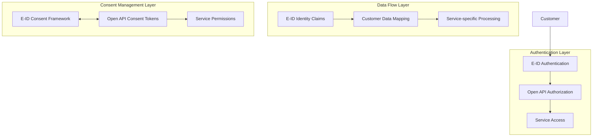
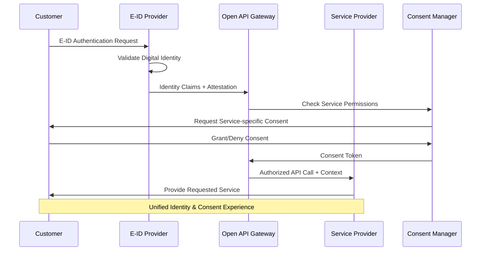

# Themenbereich 2: Anforderungen

## Inhalt

1. [Executive Summary](#executive-summary)
2. [Zielbild-Framework](#zielbild-framework)
3. [Use Case Analyse und Priorisierung](#use-case-analyse-und-priorisierung)
4. [Anforderungen im Kontext des Referenzprozesses](#anforderungen-im-kontext-des-referenzprozesses)
5. [Technische Anforderungen](#technische-anforderungen)
6. [Business Case und Monetarisierung](#business-case-und-monetarisierung)
7. [E-ID Integration und Abgrenzung](#e-id-integration-und-abgrenzung)
8. [Strategische Herangehensweise: "Vom Kleinen ins Grosse"](#strategische-herangehensweise-vom-kleinen-ins-grosse)
9. [Fazit und Roadmap](#fazit-und-roadmap)

## Executive Summary

Die Anforderungsanalyse definiert ein strukturiertes Framework für die Umsetzung der Open API Kundenbeziehung basierend auf fünf Zielbildern der digitalen Kundennähe. Der Fokus liegt auf kurzfristig umsetzbaren Lösungen (Zielbilder 1 & 2) mit strategischer Perspektive für erweiterte Szenarien. Use Case 1 "Kundenbeziehungseröffnung" wurde als prioritärer Implementierungskandidat identifiziert, wobei der Baustein "Identifikation" als MVP-Einstieg definiert wird.

**Zentrale Erkenntnisse:**
- Klare Priorisierung auf Zielbilder 1 & 2 für MVP-Phase
- 4 priorisierte Use Cases mit quantitativer Bewertung
- Modulare API-Architektur für skalierbare Implementierung
- Business Case-Herausforderungen identifiziert und adressiert

## Zielbild-Framework

### Methodologie der Zielbild-Entwicklung

Die Entwicklung der Zielbilder erfolgte durch einen strukturierten Workshop-basierten Ansatz mit allen relevanten Stakeholdern. Das Framework berücksichtigt sowohl technische Machbarkeit als auch strategische Marktpositionen.

**Bewertungskriterien:**
- Kurzfristige Umsetzbarkeit (6-12 Monate)
- Strategisches Potenzial (24+ Monate)
- Technische Komplexität
- Regulatorische Anforderungen
- Marktakzeptanz

### Die 5 Zielbilder der digitalen Kundennähe

#### **Zielbild 1: Direkt (Klassisch)**

**Konzeptionelle Struktur:** Direkte Kundenbeziehung zwischen Kunde und Finanzdienstleister ohne Intermediäre.

**Zentrale Charakteristika:**
- Direkte Kundenbeziehung ohne vermittelnde Instanzen
- Klassische Geschäftsmodelle mit API-Enhancement zur Effizienzsteigerung
- Niedrige technische Komplexität durch bewährte Strukturen
- Hohe Kontrolle über die gesamte Customer Journey

**Struktur:** Kunde ↔ Individualist

**Charakteristika:**
- Direkte Kundenbeziehung ohne Intermediäre
- Klassische Geschäftsmodelle mit API-Enhancement
- Niedrige technische Komplexität
- Hohe Kontrolle über Customer Journey

**Use Cases:**
- Eröffnung Bankkonto
- Abschluss Versicherung
- Direkte Kreditantragstellung

**Bewertung:**
- **Machbarkeit:** Sehr hoch (sofort umsetzbar)
- **Innovationspotenzial:** Mittel
- **Marktrelevanz:** Hoch (bestehende Prozesse optimieren)

#### **Zielbild 2: Indirekt**

**Konzeptionelle Struktur:** Vermittelte Kundenbeziehung über Service-Aggregatoren, die als Integratoren zwischen Kunden und Service-Produzenten fungieren.

**API-Integration:** Doppelte API-Struktur mit Customer API für Endkundeninteraktion und Provider API für Backend-Integration.

**Zentrale Charakteristika:**
- Intermediäre als Service-Aggregatoren ermöglichen erweiterte Serviceangebote
- API-basierte Integration schafft flexible, skalierbare Verbindungen
- Partner-Netzwerke erhöhen Reichweite und Servicespektrum
- Shared Customer Journey durch koordinierte Serviceerfahrung

**Struktur:** Kunde ↔ Integrator ↔ Produzent

**Charakteristika:**
- Intermediäre als Service-Aggregatoren
- API-basierte Service-Integration
- Erhöhte Reichweite durch Partner-Netzwerke
- Shared Customer Journey Management

**Use Cases:**
- Embedding von Finanzprodukten
- Account Information Services (AIS)
- Payment Initiation Services (PIS)
- Robo-Advisory mit Multi-Provider-Backend

**Bewertung:**
- **Machbarkeit:** Hoch (6-12 Monate)
- **Innovationspotenzial:** Hoch
- **Marktrelevanz:** Sehr hoch (PSD2-Compliance)

#### **Zielbild 3: Intermediär**

**Konzeptionelle Struktur:** Erweiterte Multi-Player-Konstellation mit spezialisierten Intermediären, die zwischen Integratoren und Produzenten vermitteln.

**Multi-API-Architektur:** Vier-schichtige API-Struktur mit Integration API, Production API, Specialist API und Cross-Service API für umfassende Service-Orchestrierung.

**Zentrale Charakteristika:**
- Multi-Player-Konstellationen ermöglichen komplexe Servicezusammenstellungen
- Spezialisierte Intermediäre bieten Fachexpertise für komplexe Anforderungen
- Erhöhte Koordinationsanforderungen durch mehrschichtige Architektur
- Innovationspotential durch neue Service-Kombinationen und Cross-Industry-Integration

**Struktur:** Kunde ↔ Integrator ↔ Produzent + Intermediär

**Charakteristika:**
- Multi-Player-Konstellationen
- Spezialisierte Intermediäre für komplexe Services
- Erhöhte Koordinationsanforderungen
- Potenzial für innovative Service-Kombinationen

**Use Cases:**
- Embedding von Finanzprodukten (erweitert)
- Multi Banking Platforms (SIX bLink Integration)
- Cross-industry Service Bundling
- Wealth Management Ecosystems

**Bewertung:**
- **Machbarkeit:** Mittel (12-18 Monate)
- **Innovationspotenzial:** Sehr hoch
- **Marktrelevanz:** Hoch (zukünftige Marktentwicklung)

#### **Zielbild 4: Plattform**

**Konzeptionelle Struktur:** Hub-basierte Plattformarchitektur mit zentraler Plattform als Service-Hub für alle angeschlossenen Anbieter.

**Central Platform Hub:** Integrierte Plattform mit Service Engine für Serviceverarbeitung, Analytics Layer für Datenanalyse und Governance Layer für Regelwerk und Compliance.

**Connected Providers:** Umfassendes Anbieter-Ecosystem mit Banken, FinTechs, Versicherungen, Investment- und Payment-Anbietern, alle zentral über den Hub verbunden.

**Platform APIs:** Vier spezialisierte API-Schichten - Consumer API für Endkunden, Provider API für Anbieterintegration, Marketplace API für Service-Discovery und Analytics API für Dateneinblicke.

**Zentrale Charakteristika:**
- Zentrale Plattform als Service-Hub ermöglicht einheitliche Customer Experience
- Netzwerkeffekte durch Ecosystem-Approach schaffen exponentiellen Mehrwert
- Hohe technische Komplexität durch umfassende Integration aller Services
- Potenzial für disruptive Geschäftsmodelle durch Plattform-Ökonomie

**Struktur:** Hub-basierte Architektur

**Charakteristika:**
- Zentrale Plattform als Service-Hub
- Netzwerkeffekte durch Ecosystem-Approach
- Hohe technische Komplexität
- Potenzial für disruptive Geschäftsmodelle

**Use Cases:**
- Marktplatz für Handel von VC & PE-Investments
- Comprehensive Financial Services Platform
- Cross-border Payment Hubs
- Digital Asset Trading Platforms

**Bewertung:**
- **Machbarkeit:** Niedrig-Mittel (18-24 Monate)
- **Innovationspotenzial:** Sehr hoch
- **Marktrelevanz:** Mittel-Hoch (strategische Zukunftsperspektive)

#### **Zielbild 5: Dezentral**
**Out of Scope:** Nicht relevant für die Umsetzung der Open API Kundenbeziehung

### Zielbild-Vergleich und Evolution

**Zielbilder Evolution und Bewertung:**

**Machbarkeits- und Innovationsbewertung:**
- **Zielbild 1 (Direkt):** Höchste Machbarkeit, moderate Innovation, minimale Komplexität
- **Zielbild 2 (Indirekt):** Hohe Machbarkeit, hohe Innovation, moderate Komplexität
- **Zielbild 3 (Intermediär):** Mittlere Machbarkeit, höchste Innovation, mittlere Komplexität
- **Zielbild 4 (Plattform):** Niedrige Machbarkeit, höchste Innovation, höchste Komplexität
- **Zielbild 5 (Dezentral):** Außer Scope - Blockchain-basierte Lösungen sind für den Schweizer Finanzmarkt nicht relevant

**Implementation Timeline:**
- **Phase 1 (0-6 Monate):** Fokus auf Zielbilder 1 & 2 für schnelle Markteinführung
- **Phase 2 (6-12 Monate):** Erweiterung zu Zielbild 2 & 3 mit erweiterten Services
- **Phase 3 (12-24 Monate):** Strategische Entwicklung zu Zielbildern 3 & 4

**Strategic Focus:**
- **Primärer Fokus:** Zielbilder 1 & 2 aufgrund hoher kurzfristiger Umsetzbarkeit
- **Sekundärer Fokus:** Zielbilder 3 & 4 als strategische Erweiterungsoptionen

### Zielbild-Bewertung und Fokussierung

**Quantitative Bewertungsmatrix:**

**Machbarkeit (Kurzfristige Umsetzbarkeit):**
- Zielbild 1: Höchste Machbarkeit - Sofort umsetzbar mit bestehender Infrastruktur
- Zielbild 2: Hohe Machbarkeit mit moderatem API-Entwicklungsaufwand
- Zielbild 3: Mittlere Machbarkeit, erfordert erweiterte Koordination
- Zielbild 4: Niedrige kurzfristige Machbarkeit aufgrund hoher Komplexität

**Innovationspotenzial (Strategischer Mehrwert):**
- Zielbild 1: Moderate Innovation durch Prozessoptimierung
- Zielbild 2: Hohe Innovation durch Service-Integration
- Zielbild 3: Höchste Innovation durch Multi-Player-Konstellationen
- Zielbild 4: Höchste Innovation durch Plattform-Ökonomie

**Marktrelevanz (Gegenwärtige Nachfrage):**
- Zielbild 1: Hohe Relevanz für bestehende Geschäftsmodelle
- Zielbild 2: Höchste Marktrelevanz durch PSD2-Compliance
- Zielbild 3: Hohe Zukunftsrelevanz für Marktentwicklung
- Zielbild 4: Mittlere aktuelle Relevanz, hohe strategische Bedeutung

**Implementierungs-Zeitrahmen:**
- Zielbild 1: 0-3 Monate - Sofortige Umsetzung möglich
- Zielbild 2: 6-12 Monate - Mittelfristige Entwicklung erforderlich
- Zielbild 3: 12-18 Monate - Langfristige strategische Entwicklung
- Zielbild 4: 18-24+ Monate - Langfristige Transformation erforderlich

**Aktuelle Marktperspektiven:**
- Markt fokussiert sich auf Zielbild 3 (bLink als technische Plattform)
- Internationale Tech-Konzerne verfolgen Zielbild 5 (dezentrale Ansätze), für Schweizer Markt eher ungeeignet
- Zielbilder 1 & 2 bieten höchste kurzfristige Erfolgswahrscheinlichkeit

**Projektfokussierung (nächste 3 Monate):**
- **Primär:** Zielbilder 1 & 2 (schnelle Umsetzbarkeit)
- **Sekundär:** Evaluation von Erweiterungen zu Zielbild 3 & 4

**Unterscheidung E-ID vs. Open API Kundenbeziehung:**
- E-ID: Identitätszentrierte Datenhaltungsansätze
- Open API Kundenbeziehung: Service-zentrierte Integration

## Use Case Analyse und Priorisierung

### Use Case Sammlung und Bewertungsmethodologie

**Sammlung:** 16+ Use Cases identifiziert (jedes Ecosystem aus dem Ecosystem Wheel vertreten)

**Bewertungsmethodik:**
- Workshop-basiertes Punkteranking-Verfahren
- Multi-Stakeholder-Bewertung (Bank, Fintech, Regulator, Consumer)
- Quantitative Kriterien (siehe Bewertungsmatrix)

**Bewertungskriterien:**

| Kategorie | Gewichtung | Beschreibung |
|-----------|------------|--------------|
| **Machbarkeit** | Gleichwertig | Kundennutzen, Mehrwert Bank, Mehrwert Kontributor, Mehrwert Provider, Marktvolumen |
| **Umsetzbarkeit** | Gleichwertig | Level of Assurance, API Abdeckungsgrad, Komplexität & Risiken, Integrationsaufwand, Finanzielle Tragbarkeit |
| **Strategische Relevanz** | Gleichwertig | Differenzierungspotenzial, Ecosystem-Impact, Skalierbarkeit |
| **Regulatorische Konformität** | Gleichwertig | Compliance-Anforderungen, Governance-Komplexität, Reputationsrisiken |

### Top 4 priorisierte Use Cases

**Quantitative Bewertungsmatrix:**

Die Use Cases wurden durch einen strukturierten Workshop-Prozess mit Multi-Stakeholder-Bewertung (Bank, FinTech, Regulator, Consumer) bewertet. Jeder Use Case erhielt Punkte basierend auf den definierten Bewertungskriterien.

| Use Case | Machbarkeit | Umsetzbarkeit | Strategische Relevanz | Regulatorische Konformität | **Gesamt** |
|----------|-------------|---------------|----------------------|----------------------------|------------|
| **UC1: Kundenbeziehungseröffnung** | 4/4 | 3/4 | 3/4 | 3/4 | **13 Punkte** |
| **UC2: Re-Identifikation** | 3/4 | 2/4 | 1/4 | 1/4 | **7 Punkte** |
| **UC3: Altersverifikation** | 2/4 | 1/4 | 1/4 | 0/4 | **4 Punkte** |
| **UC4: CLM von EVV-Endkunden** | 2/4 | 1/4 | 1/4 | 0/4 | **4 Punkte** |

#### **UC1: Kundenbeziehungseröffnung**

**Ausgangslage:**
- Eröffnung einer Bankbeziehung eines Kunden direkt bei einer Bank
- Datenpunkte basieren auf standardisierten Bausteinen
- Unterschiedliche Onboarding-Prozesse führen zu Ineffizienzen und Medienbrüchen
- Kunden müssen trotz vorheriger Verifikation persönliche Daten erneut vorlegen

**Umsetzung im Kontext "Open API Kundenbeziehung":**
- Harmonisierung von Onboarding-Strecken durch standardisierte Datenbausteine
- Wiederverwendung von Kundendaten zur Reduktion von Medienbrüchen
- Nahtlose Integration zwischen verschiedenen Banken beim Bankwechsel

**Pain Points (Kunde):**
- Hoher administrativer Aufwand durch wiederholte Dateneingabe
- Verlängerte Wartezeiten bis zur Kontoaktivierung

**Pain Points (Bank):**
- Hohe Kosten und Komplexität durch uneinheitliche Onboarding-Prozesse
- Geringe Wiederverwendbarkeit von Kundendaten führt zu doppelten Prüfprozessen

**Mehrwerte:**
- Reduktion redundanter Dateneingaben durch automatisierte Wiederverwendung
- Nahtlose Integration, hohe Sicherheitsstandards und Usability
- Schnellere und einfachere Kundenbeziehungseröffnung und Bankwechselprozesse
- Hebung von Effizienzen im Kundenbeziehungseröffnungsprozess für Banken
- Kosteneinsparungspotenzial durch schlankere Prozesse

**Rollen im Netzwerk:**
- Bankkunden (Dateninhaber)
- Bank (Service Provider)
- Optionale Provider (Verifikationsservices)

#### **UC2: Re-Identifikation**

**Ausgangslage:**
- Kunden müssen sich bei verschiedenen Finanzdienstleistern wiederholt identifizieren
- GwG-konforme Identifikationsprozesse sind zeitaufwändig und kostenintensiv
- Fragmentierte Identitätsdaten über verschiedene Provider

**Umsetzung:**
- Standardisierte Identifikationsdatenbausteine
- Cross-Provider Identitätsverifikation
- GwG-konforme Datenübertragung mit entsprechenden Level of Assurance

**Mehrwerte:**
- Reduzierte Identifikationskosten für Provider
- Verbesserte Customer Experience durch verkürzte Onboarding-Zeiten
- Erhöhte Sicherheit durch standardisierte Verifikationsprozesse

#### **UC3: Altersverifikation**

**Ausgangslage:**
- Rechtliche Anforderungen für Altersverifikation in verschiedenen Branchen
- Ineffiziente Einzellösungen ohne Wiederverwendbarkeit
- Datenschutzproblematik bei umfassender Identitätspreisgabe

**Umsetzung:**
- Attribut-basierte Verifikation (Alter ≥ 18) ohne vollständige Identitätspreisgabe
- Privacy-by-Design Implementierung
- Branchenübergreifende Verwendbarkeit

**Mehrwerte:**
- Datenschutzkonforme Altersverifikation
- Kostenreduktion durch Wiederverwendbarkeit
- Compliance-Sicherheit für verschiedene Branchen

#### **UC4: CLM von EVV-Endkunden**

**Ausgangslage:**
- Customer Lifecycle Management über verschiedene Touchpoints
- Fragmentierte Kundendaten bei verschiedenen Providern
- Ineffiziente Datenpflege und -synchronisation
- Komplexe Onboarding-Prozesse bei verschiedenen Depotbanken
- Redundante KYC-Prozesse für bereits verifizierte Kunden

**Umsetzung:**
- Integriertes Customer Lifecycle Management
- Standardisierte Datenpflege-Prozesse
- Cross-Provider Datenabgleich
- Wiederverwendung von Datenbausteinen für das Onboarding von Endkunden bei verschiedenen Depotbanken
- Effiziente Aktualisierung von KYC-Informationen

**Mehrwerte:**
- Verbesserte Datenqualität durch zentrale Datenpflege
- Effizienzsteigerung in der Kundenbetreuung
- Reduzierte Compliance-Risiken durch aktuellere Daten
- Vereinfachte EVV-Onboarding-Prozesse

### Zusätzliche Use Cases

**Ecosystem-Spezifische Use Cases:**

**Mobility Sector:**
- Fahrzeug-Leasing mit integrierter Versicherung
- Mobility-as-a-Service Subscriptions
- Cross-border Vehicle Registration

**Retail & E-Commerce:**
- Age-gated Product Sales (Alkohol, Tabak)
- Premium Account Verification
- Cross-platform Loyalty Programs

**Real Estate:**
- Mietprozess/Mietkautionskonto (hohe Anzahl Umzüge jährlich in der Schweiz)
  * Besonderheit: Für ein reines Mietkautionskonto ist keine vollständige Identifikation notwendig
  * Reduzierte regulatorische Hürden und technische Komplexität
  * Langfristiges Optimierungspotenzial für Mietprozesse
- Hypothekarvergleich und -vermittlung
- Property Investment Verification

**Government Services:**
- Behördenleistungen mit vorausgefüllten Formularen
- Cross-agency Data Sharing
- Digital Identity for Public Services

**Healthcare:**
- Insurance Verification for Medical Services
- Cross-provider Medical Record Access
- Telemedicine Identity Verification

## Anforderungen im Kontext des Referenzprozesses
[Konklusion Referenzprozess](./03%20Referenzprozess.md)

### Ecosystem-spezifische Anforderungen

#### **Finanzbereich**

**Banking:**
- KYC/AML-Compliance (Level of Assurance QEAA/EAA)
- PSD2-Kompatibilität für Payment Services
- Basel III/IV Regulatory Capital Requirements
- FATCA/CRS Reporting Obligations

**Insurance:**
- Insurance Distribution Directive (IDD) Compliance
- Risk Assessment Data Requirements
- Claims Processing Automation
- Cross-border Insurance Portability

**Investments:**
- MiFID II Suitability Assessment
- Qualified Investor Verification
- Portfolio Reporting Standards
- Alternative Investment Access

#### **Mobility**
- Vehicle Registration Data Standards
- Insurance Coverage Verification
- Cross-border Mobility Services
- Environmental Impact Reporting

#### **Retail**
- Consumer Protection Compliance
- Age and Identity Verification
- Payment Service Integration
- Cross-border E-commerce Support

#### **Government**
- Digital Identity Integration (E-ID Readiness)
- Interoperability with Public Services
- Data Protection and Privacy Compliance
- Audit Trail and Transparency Requirements

### Datenbausteine-Anforderungen
*TODO: Dieses Kapitel bitte verifizieren und ggf. anpassen!*

#### **Basisdaten (Basiskit)**

**Identitätsdaten:**
- Vollständiger Name (inkl. Aliases)
- Geburtsdatum und -ort
- Nationalität(en)
- Geschlecht
- Zivilstand

**Kontaktdaten:**
- Primäre und sekundäre E-Mail-Adressen
- Telefonnummern (Mobil/Festnetz)
- Bevorzugte Kommunikationskanäle
- Verfügbarkeitszeiten

**Adressdaten:**
- Wohnadresse (aktuell und vorherige)
- Meldeadresse (falls abweichend)
- Geschäftsadresse (für Geschäftskunden)
- Zustelladressen für Dokumente

#### **Erweiterte Daten (Full Dataset)**

**KYC/AML-Daten:**
- Beruf und Arbeitgeber
- Einkommens- und Vermögensverhältnisse
- Politisch exponierte Person (PEP) Status
- Wirtschaftlich berechtigte Personen
- Source of Funds Documentation

**Risk-Profiling:**
- Investitionserfahrung und -ziele
- Risikotoleranz und -kapazität
- Anlagehorizont
- ESG-Präferenzen
- Steuerliche Situation

**Compliance-Daten:**
- FATCA/CRS Classification
- Tax Residency Information
- Sanctions Screening Results
- Enhanced Due Diligence Findings
- Ongoing Monitoring Flags

#### **Metadaten**

**Consent-Management:**
- Purpose-specific Consent Status
- Consent Granularity (Datenfeld-Level)
- Consent Validity Period
- Withdrawal Mechanisms
- Audit Trail

**Datenqualität:**
- Source System Identifikation
- Last Update Timestamp
- Verification Status und Method
- Data Lineage Information
- Quality Scores

**Governance:**
- Data Classification (Public/Internal/Confidential/Restricted)
- Retention Policies
- Cross-border Transfer Restrictions
- Legal Basis for Processing

## Technische Anforderungen
[Marktanalyse: Beschreibung der existierenden Standards und Technologien](./01%20Marktanalyse.md)

### Modulare API-Architektur

#### **Design-Prinzipien**

**RESTful Design:**
- HTTP-Method-based Operations (GET, POST, PUT, DELETE)
- Resource-oriented URL Structures
- Stateless Communication
- Idempotent Operations where applicable

**JSON-Format als Standard:**
- UTF-8 Encoding für internationale Zeichen
- Consistent Naming Conventions (camelCase)
- Null-Value Handling
- Schema Validation mit JSON Schema

**API Versioning:**
- Semantic Versioning (MAJOR.MINOR.PATCH)
- URL-based Versioning (/v1/, /v2/)
- Backward Compatibility Guarantees
- Deprecation Policies und Timelines

#### **Sicherheitsanforderungen**

**Transport Security:**
- TLS 1.3 minimum requirement
- Certificate Pinning für Mobile Applications
- HTTP Strict Transport Security (HSTS)
- Certificate Transparency Monitoring

**API Security:**
- OAuth 2.0 / OpenID Connect Implementation
- Financial-grade API (FAPI) Compliance
- JWT Token-based Authentication
- Mutual TLS (mTLS) für kritische Services

**Data Protection:**
- Field-level Encryption für sensitive Daten
- Tokenization für PII Data
- Privacy-preserving Technologies (z.B. Differential Privacy)
- GDPR/DSG-konforme Datenverarbeitung

#### **Performance und Skalierung**

**Response Time Requirements:**
- Authentication: < 2 seconds (< 500ms optimiert)
- Data Retrieval: < 5 seconds (< 2000ms optimiert)
- Data Submission: < 3000ms
- Bulk Operations: < 30 seconds (< 10000ms optimiert)
- Real-time Notifications: < 1 second

**Throughput Requirements:**
- Minimum 1000 requests/second per API endpoint
- Burst Capacity bis 5000 requests/second
- Graceful Degradation bei Überlastung
- Circuit Breaker Pattern Implementation

**Availability Requirements:**
- Sehr hohe Uptime SLA mit minimaler jährlicher Downtime
- Maximum 5 Minuten ungeplante Ausfälle
- Planned Maintenance Windows ausserhalb Geschäftszeiten
- Multi-Region Deployment für Disaster Recovery

### Föderative Systemanforderungen
*TODO: Dieses Kapitel bitte verifizieren und ggf. anpassen!*

#### **Interoperabilität**

**Standards Compliance:**
- OpenAPI 3.0 Spezifikationen
- ISO 20022 für Financial Messaging
- W3C Standards für Web APIs
- FIDO Alliance Standards für Authentication

**Protocol Support:**
- HTTP/2 und HTTP/3 Support
- WebSocket für Real-time Communication
- gRPC für High-performance Service-to-Service Communication
- MQTT für IoT Integration

**Data Exchange Formats:**
- JSON als primäres Format
- XML Support für Legacy System Integration
- Protocol Buffers für effiziente Serialization
- CSV für Bulk Data Export

#### **Governance und Orchestration**

**Service Discovery:**
- Dynamic Service Registration
- Health Check Monitoring
- Load Balancing Configuration
- Service Dependency Management

**Configuration Management:**
- Centralized Configuration Store
- Environment-specific Settings
- Feature Flag Management
- A/B Testing Support

**Monitoring und Observability:**
- Distributed Tracing
- Comprehensive Logging
- Metrics Collection und Alerting
- Performance Analytics

### MVP Open API Kundenbeziehung

Das Minimum Viable Product der Open API Kundenbeziehung konzentriert sich auf die wesentlichen Funktionalitäten für die erfolgreiche Markteinführung. Die MVP-Definition erfolgt auf konzeptioneller Ebene, während detaillierte Datenstrukturen und technische Implementierungsaspekte in der [Referenzprozess-Conclusion](./03%20Referenzprozess.md) und den technischen Dokumenten [Implementation Alpha Version 1.0](../Umsetzung%20und%20Implementierung%20/Implementation%20Alpha%20Version%201.0.md) ausgearbeitet werden.

#### **MVP Scope Definition**
Das Minimum Viable Product der Open API Kundenbeziehung fokussiert auf die grundlegenden Funktionalitäten für den **Use Case 1: Kundenbeziehungseröffnung**.

**MVP Kernfunktionalitäten:**
1. Basisdaten-Transfer: Name, Adresse, Kontaktdaten
2. Identitätsdaten-Übertragung: Bereits verifizierte Identitätsinformationen
3. Consent Management: Kundeneinwilligung für Datenübertragung
4. Basic Security: FAPI 2.0 konforme Sicherheitsimplementierung

**MVP Ausschlüsse:**
- Erweiterte Daten: Vermögen, Einkommen, Beruf
- Payment Initiation: Zahlungsauslösung
- Cross-Industry: Andere Ecosystems außer Finance
- Advanced Analytics: KI-basierte Datenanalyse

#### **MVP-Datenmodell**
Das MVP-Datenmodell konzentriert sich auf die wesentlichen Datenstrukturen für die Implementierung des Bausteins "Identifikation". Die Strukturen sind vollständig kompatibel mit der finalen API-Spezifikation Version 2.0 aus der Workshop-Phase und definieren die Kernkomponenten für die Open API Kundenbeziehung.

**Konzeptionelle Datenstruktur**

Das MVP basiert auf drei Kernkomponenten für die Open API Kundenbeziehung:

**1. Identitätsdaten-Framework:**
Standardisierte Strukturen für Personendaten, Kontaktinformationen und Adressdaten mit integriertem Verifikationsstatus. Die Datenstrukturen ermöglichen providerübergreifende Wiederverwendung bei gleichzeitiger Wahrung von Datenschutz und Sicherheit.
**Customer Identity Structure:**
Konzeptionelle Datenstruktur umfasst customerId als interne Referenz, sharedCustomerHash für anonyme providerübergreifende Identifikation sowie drei Hauptkategorien:

- **Personal Information:** Grundlegende Identitätsdaten wie Vor-/Nachname, Geburtsdatum und -ort, Nationalität(en), Geschlecht und Zivilstand
- **Contact Information:** Primäre und sekundäre E-Mail-Adressen, Mobil- und Festnetznummern mit Verifikationsstatus, bevorzugte Kommunikationskanäle
- **Address Information:** Wohnadresse und abweichende Korrespondenzadresse mit Gültigkeitszeiträumen, strukturierte Adresskomponenten

Detaillierte Datenstrukturen sind in [Implementation Alpha Version 1.0](/documentation/Umsetzung%20und%20Implementierung/Implementation%20Alpha%20Version%201.0.md) spezifiziert.

**2. Consent Management System:**
Granulare Einwilligungsverwaltung mit zweckgebundener Datenverwendung, zeitlicher Begrenzung und vollständiger Nachverfolgbarkeit. Das System unterstützt feldspezifische Berechtigungen und unterschiedliche rechtliche Grundlagen für die Datenverarbeitung.

- **Consent Identification:** Eindeutige ConsentId und Kunden-Zuordnung
- **Purpose Definition:** Explizite Zweckangabe für Datenverwendung (z.B. Kontoeröffnung, KYC-Prüfung)
- **Data Categories:** Spezifikation der betroffenen Datenkategorien (Identity, Contact, Financial)
- **Temporal Management:** Erteilungs-, Ablauf- und Widerrufszeitpunkte
- **Granularity Control:** Feldspezifische Berechtigung mit Read/Write/Delete-Permissions
- **Legal Framework:** Rechtsgrundlage für Datenverarbeitung (Einwilligung, Vertrag, rechtliche Verpflichtung)
- **Audit Trail:** Vollständige Nachverfolgbarkeit aller Consent-Änderungen

**3. Verifikations- und Assurance-Level:**
Strukturierte Dokumentation von Verifikationsmethoden und -zeitpunkten mit entsprechenden Assurance-Leveln gemäß regulatorischen Standards. Dies ermöglicht vertrauensvolle Datenübertragung zwischen verschiedenen Providern.

- **Verification Identity:** Eindeutige VerificationId mit Kunden-Zuordnung
- **Data Field Specification:** Spezifikation des verifizierten Datenfeldes (z.B. Identität, Adresse)
- **Method Documentation:** Verifikationsmethode (VideoIdent, E-ID, Dokument-Upload)
- **Assurance Level:** Verifikationslevel gemäß regulatorischen Standards (QEAA, EAA, self-declared)
- **Temporal Tracking:** Verifikationszeitpunkt, durchführende Instanz, Gültigkeitsdauer
- **Document References:** Sichere Referenzen zu Verifikationsdokumenten ohne direkte Speicherung

**Privacy-preserving Identifikation:**
Implementation eines anonymen Customer-Hash-Systems zur providerübergreifenden Identifikation ohne Preisgabe persönlicher Daten, basierend auf standardisierten kryptographischen Verfahren.

#### **sharedCustomerHash-Konzept**

**Purpose:**
- Eindeutige, aber anonyme Identifikation von Kunden across providers
- Privacy-preserving Customer Matching
- Fraud Prevention durch Cross-Provider Analytics

**Implementation:**
- SHA-256 Hash von standardisierten Identitätsdaten
- Salt-based Hashing für zusätzliche Sicherheit
- Reversibility nur durch authorisierte Key-Holder
- GDPR-konform durch Pseudonymisierung

**Hash-Generierung:**
Konzeptionell wird der sharedCustomerHash durch Normalisierung und Verknüpfung standardisierter Identitätsdaten (Vorname, Nachname, Geburtsdatum, Geburtsort, Nationalität) mit einem Sicherheits-Salt generiert und über SHA-256 gehasht.

#### **Granularitäts-Level Definition**

**Level 1 - Basic Identity:**
- Name, Geburtsdatum, Nationalität
- Basis-Kontaktinformationen
- Primäre Adresse

**Level 2 - Enhanced Identity:**
- Level 1 + erweiterte Kontaktdaten
- Historische Adressen
- Zivilstand und Familienverhältnisse

**Level 3 - Financial Profile:**
- Level 2 + Beruf und Einkommen
- Vermögensverhältnisse
- Steuerliche Situation

**Level 4 - Comprehensive Profile:**
- Level 3 + Risk Profiling
- Investment Experience
- Compliance Status (PEP, Sanctions)

## Business Case und Monetarisierung

### Herausforderungen bei Open Finance Initiativen

**Typische Probleme:**
- Schwierige Formulierung tragfähiger Business Cases
- Motivation kommt primär aus regulatorischem Druck
- Kundenwünschbarkeit vs. wirtschaftliche Tragfähigkeit
- Network Effects erst bei kritischer Masse erreicht

### Monetarisierungsmodelle

#### **Direkte Monetarisierung**

**Transaction-based Fees:**
- Per-API-Call Pricing (Tiered Structure)
- Success-based Fees für completed Customer Onboardings
- Premium Features für erweiterte Datensets
- SLA-based Pricing für guaranteed Performance

**Subscription Models:**
- Basic/Premium/Enterprise Tiers
- Volume-based Pricing Tiers
- White-label Solutions für kleinere Provider
- Platform-as-a-Service Offerings

#### **Indirekte Monetarisierung**

**Datenmonetarisierung:**
- Anonymisierte Market Insights
- Benchmarking Services für Industry
- Aggregated Analytics Products
- Compliance Reporting Services

**Ecosystem-Vorteile:**
- Erhöhte Customer Acquisition durch bessere UX
- Reduzierte Customer Acquisition Costs
- Improved Customer Lifetime Value
- Cross-selling Opportunities
## E-ID Integration und Abgrenzung
*TODO: Dieses Kapitel bitte verifizieren und ggf. anpassen!*

### Konzeptionelle Unterschiede

#### **E-ID Paradigma**
- **Identitätszentriert:** Focus auf digitale Identitätsnachweise
- **Staatlich kontrolliert:** Regulatorische Frameworks und Standards
- **Verification-fokussiert:** Primär Identitätsverifikation
- **Centralized Trust:** Staatliche Certificate Authorities

#### **Open API Kundenbeziehung Paradigma**
- **Service-zentriert:** Focus auf Geschäftsprozess-Integration
- **Industrie-gesteuert:** Market-driven Standards und Innovation
- **Relationship-fokussiert:** Comprehensive Customer Lifecycle
- **Federated Trust:** Multi-stakeholder Governance

### Integration-Szenarien

#### **Komplementäre Integration**
- E-ID als Identity Provider für Strong Authentication
- Open API als Service Layer für Business Logic
- Shared Trust Framework für Cross-domain Services
- Unified User Experience über beide Paradigmen

#### **Technische Integration Points**

**Integration-Architektur:**

**Authentication Layer:** E-ID Authentication führt zu Open API Authorization und ermöglicht anschließend Service Access. Dies schafft eine durchgängige Authentifizierungskette mit höchsten Sicherheitsstandards.

**Data Flow:** E-ID Identity Claims werden auf Customer Data Mapping abgebildet und in Service-specific Processing überführt. Dies ermöglicht nahtlose Integration staatlicher Identitätsnachweise in kommerzielle Services.

**Consent Management:** Bidirektionale Integration zwischen E-ID Consent Framework und Open API Consent Tokens mit Service Permissions. Dies gewährleistet konsistente Einwilligungsverwaltung über beide Paradigmen hinweg.

**Detaillierter Integration Flow:**

### Abgrenzung und Scope Definition

#### **E-ID Scope (ausserhalb Open API Kundenbeziehung)**
- Digitale Identitätsnachweise
- Staatliche Verifikationsservices
- Cross-border Identity Recognition
- Public Sector Service Access

#### **Open API Kundenbeziehung Scope**
- Commercial Customer Onboarding
- Financial Services Integration
- Private Sector Data Sharing
- Business Process Automation

#### **Überschneidungsbereiche**
- Identity Verification für Commercial Services
- Consent Management Frameworks
- Privacy-preserving Technologies
- Cross-sector Interoperability

### E-ID Readiness Assessment

#### **Current Status (2025)**
- E-ID Legal Framework etabliert
- Technical Standards in Development
- Pilot Programs mit ausgewählten Partners
- Public Acceptance Building Phase

#### **Strategische Überlegungen zur E-ID Integration**

**Zusammenspiel zwischen E-ID und Open API**
Die Integration der Schweizer E-ID mit der Open API Kundenbeziehung stellt einen strategischen Vorteil dar. Während die Daten bei den Banken liegen, liegt die Datenhoheit beim Kunden, insbesondere beim Consent-Prozess.

**Hybrid-Lösung Ansatz:** 
- E-ID-Kompatibilität von Beginn an sicherstellen
- Parallele Lösung während E-ID-Einführungsphase
- Vermeidung "unnötiger Verifizierungen" durch modulare Identifikationsdaten-Wiederverwendung

#### **Herausforderungen und Lösungsansätze**
**Einführungshürden der E-ID:**
- Biometrische Ausweis-Voraussetzung könnte Adoption erschweren
- Bedarf an "Killer Use Cases" (z.B. digitales Wahlrecht)
- Regulatorische Unklarheiten bezüglich FINMA-Anforderungen
- Haftungs- und Sicherheitsfaktoren noch nicht definiert

**Strategische Antwort:** 
Eine Open API Kundenbeziehung als wirtschaftlich sinnvolle Zwischenlösung, die später nahtlos in die E-ID-Infrastruktur integriert werden kann.

#### **Mögliche Integration Timeline**
- **2025:** Open API Standard Development (unabhängig von E-ID)
- **2026:** E-ID Launch → Integration Planning
- **2027:** Productive E-ID Integration → Enhanced Services
- **2028+:** Mature Ecosystem mit beiden Paradigmen

#### **Technical Preparedness**
- APIs designed für E-ID Integration ohne Disruption
- Flexible Authentication Layer supports multiple Identity Providers
- Data Models compatible mit E-ID Attribute Schemas
- Consent Frameworks interoperable mit E-ID Frameworks

## Strategische Herangehensweise: "Vom Kleinen ins Grosse"
*TODO: Dieses Kapitel bitte verifizieren und ggf. anpassen!*

Die strategische Herangehensweise folgt dem bewährten Prinzip des schrittweisen Aufbaus, beginnend mit schnell realisierbaren Erfolgen und systematischer Expansion zu komplexeren Anwendungsfällen.

### Quick Wins Identifikation

#### **Phase 1: Identifikation und Basisdaten (Monate 1-6)**

**Fokus: Baustein "Identifikation"**
- **Rational:** Wiederverwendbarkeit über alle Use Cases hinweg
- **Technical Scope:** Basic Identity Verification APIs
- **Business Value:** Immediate ROI durch Prozessverbesserung
- **Risk Level:** Low (established Technologies und Processes)

**Konkrete Deliverables:**
- Identity Verification API (Level 1-2)
- Basic Consent Management
- Sandbox Environment mit 2-3 Partner Banks
- Developer Documentation und SDKs

**Success Metrics:**
- Reduktion der Verification Time
- Anzahl Partner Banks onboarded
- Anzahl erfolgreicher API Calls/Month
- Customer Satisfaction Score

#### **Ausgeschlossene Komplexe Bausteine**

**Baustein "Selbstdeklaration" → spätere Phase**
- **Begründung:** Hohe Varianz der Datenanforderungen je Bank
- **Komplexität:** Fehlende Standardisierung der Fragenkataloge
- **Integration:** Komplexe Integration in bestehende Bankprozesse
- **Timeline:** Phase 2-3 Implementierung (Monate 6-18)

### Ausbaustufen-Planung

#### **Phase 1: Foundation (Monate 1-6)**
**Motto: "Prove the Concept"**

**Technical Deliverables:**
- Core Identity APIs (GET /identity, POST /verification)
- Basic Consent Management APIs
- Reference Implementation mit Sandbox
- Initial Security Framework (OAuth 2.0 + FAPI Baseline)

**Business Deliverables:**
- 3-5 Pilot Partners (Banks + Fintechs)
- Use Case 1 (Kundenbeziehungseröffnung) - Limited Scope
- Basic Business Model Validation
- Governance Framework Establishment

**Success Criteria:**
- Technical POC demonstrated
- Partner Commitment für Phase 2
- Regulatory Approval secured
- Funding für Phase 2 confirmed

#### **Phase 2: Expansion (Monate 6-18)**
**Motto: "Scale the Solution"**

**Technical Deliverables:**
- Complete Customer Data APIs (Level 1-3)
- Advanced Consent Management
- Enhanced Security (FAPI Advanced)
- Multi-provider Federation Support

**Business Deliverables:**
- Production Partners
- All 4 prioritized Use Cases implemented
- Revenue Generation (Break-even approach)
- Cross-border Pilots (EU Integration)

**Success Criteria:**
- 10,000+ Transactions/Month
- Positive Unit Economics
- Customer Net Promoter Score > 50
- Regulatory Compliance demonstrated

#### **Phase 3: Innovation (Monate 18-36)**
**Motto: "Lead the Market"**

**Technical Deliverables:**
- AI-enhanced Risk Assessment APIs
- Blockchain Integration für Trust Network
- IoT Integration für Digital Services
- Advanced Analytics und Machine Learning

**Business Deliverables:**
- Akquirierung weiterer Ecosystem Partner 
- Cross-industry Expansion (Insurance, Mobility, Government)
- Platform-as-a-Service Offerings
- International Market Entry

**Success Criteria:**
- Market Leadership Position etabliert
- Jährliche Umsatzsteigerung 
- Network Effects durch Ecosystem
- International Recognition und Adoption

### Risk Mitigation Strategies

#### **Technical Risks**

**Legacy System Integration:**
- **Risk:** Complex Integration mit bestehenden Core Banking Systems
- **Mitigation:** API Facade Pattern, Incremental Migration, Extensive Testing
- **Contingency:** Alternative Integration Paths, External Service Providers

**Security Vulnerabilities:**
- **Risk:** Data Breaches, API Abuse, Authentication Failures
- **Mitigation:** Security-by-Design, Continuous Testing, Bug Bounty Programs
- **Contingency:** Incident Response Plans, Insurance Coverage, Legal Frameworks

**Performance Scalability:**
- **Risk:** System Overload bei rapid Adoption
- **Mitigation:** Cloud-native Architecture, Auto-scaling, Performance Testing
- **Contingency:** Load Balancing, Traffic Throttling, Partner Communication

#### **Business Risks**

**Market Adoption:**
- **Risk:** Slow Partner Onboarding, Customer Resistance
- **Mitigation:** Strong Value Proposition, Incentive Programs, Change Management
- **Contingency:** Pivot Strategy, Alternative Market Segments, Value Proposition Adjustment

**Regulatory Changes:**
- **Risk:** New Regulations impact Technical Requirements
- **Mitigation:** Regulatory Monitoring, Flexible Architecture, Stakeholder Engagement
- **Contingency:** Rapid Adaptation Capabilities, Legal Expertise, Compliance Reserve

**Competitive Pressure:**
- **Risk:** Alternative Solutions, Big Tech Entry, International Competition
- **Mitigation:** Continuous Innovation, Strong Partnerships, Customer Lock-in
- **Contingency:** Differentiation Strategy, Acquisition Opportunities, Market Consolidation

### Success Measurement Framework
*TODO: Dieses Kapitel bitte verifizieren und ggf. anpassen!*

Ein umfassendes Messystem für den Erfolg der Open API Kundenbeziehung umfasst sowohl technische als auch geschäftliche Kennzahlen, die kontinuierlich überwacht und optimiert werden.

#### **Technical KPIs**
Genaue Ziele und Metriken zur Überwachung der technischen Performance und Systemstabilität werden zu Beginn der Implementierung festgelegt und kontinuierlich angepasst.

**Performance Metrics:**
- API Response Time 
- System Uptime 
- Error Rate 
- Security Incidents 

**Adoption Metrics:**
- API Calls per Month 
- Active Partners 
- Customer Transactions 
- Developer Satisfaction 

#### **Business KPIs**

**Financial Metrics:**
- Revenue per Transaction 
- Customer Acquisition Cost 
- Partner Lifetime Value 
- Monthly Recurring Revenue 

**Market Metrics:**
- Market Share im Schweizer Markt 
- Customer Net Promoter Score 
- Partner Retention Rate 
- International Inquiries

## Fazit und Roadmap
*TODO: Dieses Kapitel bitte verifizieren und ggf. anpassen!*

Die umfassende Anforderungsanalyse zeigt eine klare Strategie für die erfolgreiche Implementierung der Open API Kundenbeziehung mit fokussiertem Ansatz auf schnell umsetzbare Lösungen und strategischer Perspektive für langfristige Marktführerschaft.

### Strategische Empfehlungen

#### **Kurzfristige Prioritäten (6-12 Monate)**
1. **MVP Development:** Focus auf Use Case 1 "Kundenbeziehungseröffnung" mit Baustein "Identifikation"
2. **Partnership Building:** Onboarding von 3-5 Pilot Partners
3. **Regulatory Alignment:** Compliance Framework etablieren
4. **Technology Foundation:** Secure, scalable API Platform entwickeln

#### **Mittelfristige Ziele (12-24 Monate)**
1. **Market Expansion:** Vollständige Use Case Implementation
2. **Business Model Validation:** Sustainable Revenue Generation
3. **Ecosystem Development:** 15+ aktive Partner
4. **International Preparation:** EU Market Entry Vorbereitung

#### **Langfristige Vision (24+ Monate)**
1. **Market Leadership:** Führende Position im Swiss Market
2. **Innovation Platform:** API-basierte Innovation Hub
3. **Cross-industry Expansion:** Beyond Financial Services
4. **International Expansion:** European und Global Markets

### Implementation Roadmap

Die detaillierte Implementierung folgt der konsolidierten Master-Timeline mit speziellem Fokus auf Business Requirements und Partner-Onboarding.

**Vollständige Implementierungs-Details:** → [Siehe Master ROADMAP.md](../ROADMAP.md)

#### **Business-spezifische Meilensteine:**
- **Immediate Phase (Monate 1-3):** Business Requirements Finalisierung, Partner Agreement Templates
- **Foundation Phase (Monate 1-6):** MVP für priorisierten Use Case 1 (Bankwechsel), initiales Partner-Onboarding
- **Scaling Phase (Monate 6-18):** Vollständige Use Case Implementation, Business Model Validation

### Critical Success Factors

1. **Technical Excellence:** Robust, secure, scalable Platform
2. **Strong Partnerships:** Committed, high-quality Partners
3. **Regulatory Compliance:** Proactive Regulatory Engagement
4. **Customer Value:** Clear, demonstrable Customer Benefits
5. **Financial Sustainability:** Viable Business Model from Day 1
6. **Market Timing:** Launch vor Competitive Threats
7. **Team Expertise:** Experienced Team mit Domain-Expertise
8. **Stakeholder Alignment:** Unified Vision across all Stakeholders

Die Anforderungsanalyse zeigt einen klaren Weg für die erfolgreiche Implementierung der Open API Kundenbeziehung mit fokussiertem Approach auf kurzfristig umsetzbare Lösungen und strategischer Perspektive für langfristige Marktführerschaft.

---

**Version:** 1.0  
**Datum:** August 2025  
**Status:** Final Draft für Review

---

[Quellen und Referenzen](./Quellen%20und%20Referenzen.md)