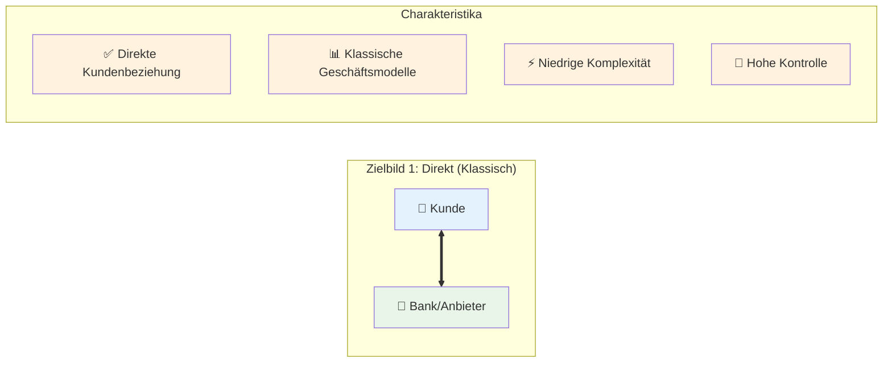
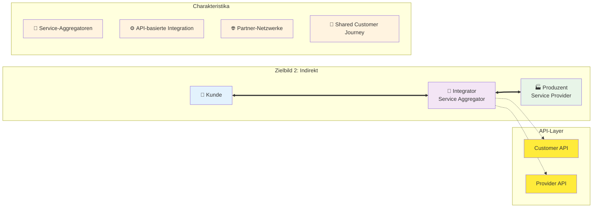
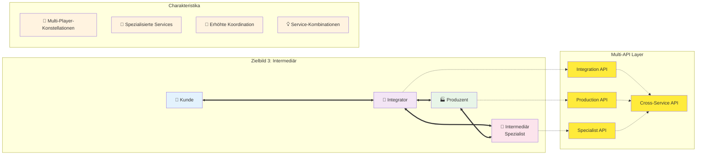
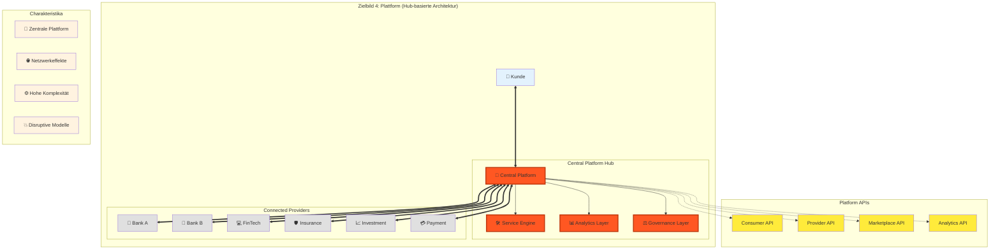
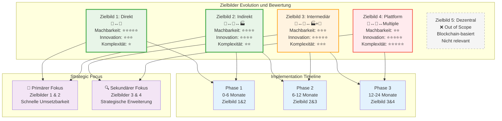
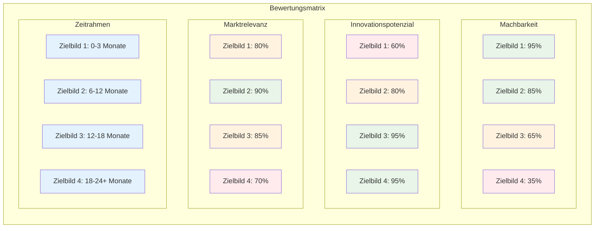

# Themenbereich 2: Anforderungen
**Fertigstellung bis 18.07.**

## Inhalt

1. [Executive Summary](#executive-summary)
2. [Zielbild-Framework](#zielbild-framework)
3. [Use Case Analyse und Priorisierung](#use-case-analyse-und-priorisierung)
4. [Anforderungsanalyse je Teilschritt](#anforderungsanalyse-je-teilschritt)
5. [Technische Anforderungen](#technische-anforderungen)
6. [Business Case und Monetarisierung](#business-case-und-monetarisierung)
7. [E-ID Integration und Abgrenzung](#e-id-integration-und-abgrenzung)
8. [Strategische Herangehensweise: "Vom Kleinen ins Grosse"](#strategische-herangehensweise-vom-kleinen-ins-grosse)
9. [Fazit und Roadmap](#fazit-und-roadmap)

## Executive Summary

Die Anforderungsanalyse definiert ein strukturiertes Framework für die Umsetzung der Open API Kundenbeziehung basierend auf fünf Zielbildern der digitalen Kundennähe. Der Fokus liegt auf kurzfristig umsetzbaren Lösungen (Zielbilder 1 & 2) mit strategischer Perspektive für erweiterte Szenarien. Use Case 1 "Bankwechsel/Kontoeröffnung" wurde als prioritärer Implementierungskandidat identifiziert, wobei der Baustein "Identifikation" als MVP-Einstieg definiert wird.

**Zentrale Erkenntnisse:**
- Klare Priorisierung auf Zielbilder 1 & 2 für MVP-Phase
- 4 priorisierte Use Cases mit quantitativer Bewertung
- Modulare API-Architektur für skalierbare Implementierung
- Business Case-Herausforderungen identifiziert und adressiert

## Zielbild-Framework

### Methodologie der Zielbild-Entwicklung

Die Entwicklung der Zielbilder erfolgte durch einen strukturierten Workshop-basierten Ansatz mit allen relevanten Stakeholdern. Das Framework berücksichtigt sowohl technische Machbarkeit als auch strategische Marktpositionen.

**Bewertungskriterien:**
- Kurzfristige Umsetzbarkeit (6-12 Monate)
- Strategisches Potenzial (24+ Monate)
- Technische Komplexität
- Regulatorische Anforderungen
- Marktakzeptanz

### Die 5 Zielbilder der digitalen Kundennähe

#### **Zielbild 1: Direkt (Klassisch)**



**Struktur:** Kunde ↔ Individualist

**Charakteristika:**
- Direkte Kundenbeziehung ohne Intermediäre
- Klassische Geschäftsmodelle mit API-Enhancement
- Niedrige technische Komplexität
- Hohe Kontrolle über Customer Journey

**Use Cases:**
- Eröffnung Bankkonto
- Abschluss Versicherung
- Direkte Kreditantragstellung

**Bewertung:**
- **Machbarkeit:** Sehr hoch (sofort umsetzbar)
- **Innovationspotenzial:** Mittel
- **Marktrelevanz:** Hoch (bestehende Prozesse optimieren)

#### **Zielbild 2: Indirekt**



**Struktur:** Kunde ↔ Integrator ↔ Produzent

**Charakteristika:**
- Intermediäre als Service-Aggregatoren
- API-basierte Service-Integration
- Erhöhte Reichweite durch Partner-Netzwerke
- Shared Customer Journey Management

**Use Cases:**
- Embedding von Finanzprodukten
- Account Information Services (AIS)
- Payment Initiation Services (PIS)
- Robo-Advisory mit Multi-Provider-Backend

**Bewertung:**
- **Machbarkeit:** Hoch (6-12 Monate)
- **Innovationspotenzial:** Hoch
- **Marktrelevanz:** Sehr hoch (PSD2-Compliance)

#### **Zielbild 3: Intermediär**



**Struktur:** Kunde ↔ Integrator ↔ Produzent + Intermediär

**Charakteristika:**
- Multi-Player-Konstellationen
- Spezialisierte Intermediäre für komplexe Services
- Erhöhte Koordinationsanforderungen
- Potenzial für innovative Service-Kombinationen

**Use Cases:**
- Embedding von Finanzprodukten (erweitert)
- Multi Banking Platforms (SIX bLink Integration)
- Cross-industry Service Bundling
- Wealth Management Ecosystems

**Bewertung:**
- **Machbarkeit:** Mittel (12-18 Monate)
- **Innovationspotenzial:** Sehr hoch
- **Marktrelevanz:** Hoch (zukünftige Marktentwicklung)

#### **Zielbild 4: Plattform**



**Struktur:** Hub-basierte Architektur

**Charakteristika:**
- Zentrale Plattform als Service-Hub
- Netzwerkeffekte durch Ecosystem-Approach
- Hohe technische Komplexität
- Potenzial für disruptive Geschäftsmodelle

**Use Cases:**
- Marktplatz für Handel von VC & PE-Investments
- Comprehensive Financial Services Platform
- Cross-border Payment Hubs
- Digital Asset Trading Platforms

**Bewertung:**
- **Machbarkeit:** Niedrig-Mittel (18-24 Monate)
- **Innovationspotenzial:** Sehr hoch
- **Marktrelevanz:** Mittel-Hoch (strategische Zukunftsperspektive)

#### **Zielbild 5: Dezentral**
**Out of Scope:** Nicht relevant für die Umsetzung der Open API Kundenbeziehung

### Zielbild-Vergleich und Evolution



### Zielbild-Bewertung und Fokussierung



**Aktuelle Marktperspektiven:**
- Markt fokussiert sich auf Zielbild 3 (bLink als technische Plattform)
- Internationale Tech-Konzerne verfolgen Zielbild 5 (dezentrale Ansätze), für Schweizer Markt eher ungeeignet
- Zielbilder 1 & 2 bieten höchste kurzfristige Erfolgswahrscheinlichkeit

**Projektfokussierung (nächste 3 Monate):**
- **Primär:** Zielbilder 1 & 2 (schnelle Umsetzbarkeit)
- **Sekundär:** Evaluation von Erweiterungen zu Zielbild 3 & 4

**Unterscheidung E-ID vs. Open API Kundenbeziehung:**
- E-ID: Identitätszentrierte Datenhaltungsansätze
- Open API Kundenbeziehung: Service-zentrierte Integration

## Use Case Analyse und Priorisierung

### Use Case Sammlung und Bewertungsmethodologie

**Sammlung:** 16+ Use Cases identifiziert (jedes Ecosystem aus dem Ecosystem Wheel vertreten)

**Bewertungsmethodik:**
- Workshop-basiertes Punkteranking-Verfahren
- Multi-Stakeholder-Bewertung (Bank, Fintech, Regulator, Consumer)
- Quantitative Kriterien (siehe Bewertungsmatrix)

**Bewertungskriterien:**

| Kategorie | Gewichtung | Beschreibung |
|-----------|------------|--------------|
| **Machbarkeit** | 25% | Kundennutzen, Mehrwert Bank, Mehrwert Kontributor, Mehrwert Provider, Marktvolumen |
| **Umsetzbarkeit** | 25% | Level of Assurance, API Abdeckungsgrad, Komplexität & Risiken, Integrationsaufwand, Finanzielle Tragbarkeit |
| **Strategische Relevanz** | 25% | Differenzierungspotenzial, Ecosystem-Impact, Skalierbarkeit |
| **Regulatorische Konformität** | 25% | Compliance-Anforderungen, Governance-Komplexität, Reputationsrisiken |

### Top 4 priorisierte Use Cases
TODO: analog zu content in 01 marktanalyse anpassen (Bewertungen, Punkte, etc.)

#### **UC1: Bankwechsel/Kontoeröffnung (13 Punkte)**

**Ausgangslage:**
- Eröffnung einer Bankbeziehung eines Kunden direkt bei einer Bank
- Datenpunkte basieren auf standardisierten Bausteinen
- Unterschiedliche Onboarding-Prozesse führen zu Ineffizienzen und Medienbrüchen
- Kunden müssen trotz vorheriger Verifikation persönliche Daten erneut vorlegen

**Umsetzung im Kontext "Open API Kundenbeziehung":**
- Harmonisierung von Onboarding-Strecken durch standardisierte Datenbausteine
- Wiederverwendung von Kundendaten zur Reduktion von Medienbrüchen
- Nahtlose Integration zwischen verschiedenen Banken beim Bankwechsel

**Pain Points (Kunde):**
- Hoher administrativer Aufwand durch wiederholte Dateneingabe
- Verlängerte Wartezeiten bis zur Kontoaktivierung

**Pain Points (Bank):**
- Hohe Kosten und Komplexität durch uneinheitliche Onboarding-Prozesse
- Geringe Wiederverwendbarkeit von Kundendaten führt zu doppelten Prüfprozessen

**Mehrwerte:**
- Reduktion redundanter Dateneingaben durch automatisierte Wiederverwendung
- Nahtlose Integration, hohe Sicherheitsstandards und Usability
- Schnellere und einfachere Kontoeröffnung und Bankwechselprozesse
- Hebung von Effizienzen im Kontoeröffnungsprozess für Banken
- Kosteneinsparungspotenzial durch schlankere Prozesse

**Rollen im Netzwerk:**
- Bankkunden (Dateninhaber)
- Bank (Service Provider)
- Optionale Provider (Verifikationsservices)

#### **UC2: Re-Identifikation (7 Punkte)**

**Ausgangslage:**
- Kunden müssen sich bei verschiedenen Finanzdienstleistern wiederholt identifizieren
- GwG-konforme Identifikationsprozesse sind zeitaufwändig und kostenintensiv
- Fragmentierte Identitätsdaten über verschiedene Provider

**Umsetzung:**
- Standardisierte Identifikationsdatenbausteine
- Cross-Provider Identitätsverifikation
- GwG-konforme Datenübertragung mit entsprechenden Level of Assurance

**Mehrwerte:**
- Reduzierte Identifikationskosten für Provider
- Verbesserte Customer Experience durch verkürzte Onboarding-Zeiten
- Erhöhte Sicherheit durch standardisierte Verifikationsprozesse

#### **UC3: Altersverifikation (4 Punkte)**

**Ausgangslage:**
- Rechtliche Anforderungen für Altersverifikation in verschiedenen Branchen
- Ineffiziente Einzellösungen ohne Wiederverwendbarkeit
- Datenschutzproblematik bei umfassender Identitätspreisgabe

**Umsetzung:**
- Attribut-basierte Verifikation (Alter ≥ 18) ohne vollständige Identitätspreisgabe
- Privacy-by-Design Implementierung
- Branchenübergreifende Verwendbarkeit

**Mehrwerte:**
- Datenschutzkonforme Altersverifikation
- Kostenreduktion durch Wiederverwendbarkeit
- Compliance-Sicherheit für verschiedene Branchen

#### **UC4: CLM von EVV-Endkunden (4 Punkte)**

**Ausgangslage:**
- Customer Lifecycle Management über verschiedene Touchpoints
- Fragmentierte Kundendaten bei verschiedenen Providern
- Ineffiziente Datenpflege und -synchronisation
- Komplexe Onboarding-Prozesse bei verschiedenen Depotbanken
- Redundante KYC-Prozesse für bereits verifizierte Kunden

**Umsetzung:**
- Integriertes Customer Lifecycle Management
- Standardisierte Datenpflege-Prozesse
- Cross-Provider Datenabgleich
- Wiederverwendung von Datenbausteinen für das Onboarding von Endkunden bei verschiedenen Depotbanken
- Effiziente Aktualisierung von KYC-Informationen

**Mehrwerte:**
- Verbesserte Datenqualität durch zentrale Datenpflege
- Effizienzsteigerung in der Kundenbetreuung
- Reduzierte Compliance-Risiken durch aktuellere Daten
- Vereinfachte EVV-Onboarding-Prozesse

### Zusätzliche Use Cases

**Ecosystem-Spezifische Use Cases:**

**Mobility Sector:**
- Fahrzeug-Leasing mit integrierter Versicherung
- Mobility-as-a-Service Subscriptions
- Cross-border Vehicle Registration

**Retail & E-Commerce:**
- Age-gated Product Sales (Alkohol, Tabak)
- Premium Account Verification
- Cross-platform Loyalty Programs

**Real Estate:**
- Mietprozess/Mietkautionskonto (700.000 Umzüge/Jahr CH)
  * Besonderheit: Für ein reines Mietkautionskonto ist keine vollständige Identifikation notwendig
  * Reduzierte regulatorische Hürden und technische Komplexität
  * Langfristiges Optimierungspotenzial für Mietprozesse
- Hypothekarvergleich und -vermittlung
- Property Investment Verification

**Government Services:**
- Behördenleistungen mit vorausgefüllten Formularen
- Cross-agency Data Sharing
- Digital Identity for Public Services

**Healthcare:**
- Insurance Verification for Medical Services
- Cross-provider Medical Record Access
- Telemedicine Identity Verification

## Anforderungen im Kontext des Referenzprozesses
[Konklusion Referenzprozess](./03%20Referenzprozess.md)

### Ecosystem-spezifische Anforderungen

#### **Finanzbereich**

**Banking:**
- KYC/AML-Compliance (Level of Assurance QEAA/EAA)
- PSD2-Kompatibilität für Payment Services
- Basel III/IV Regulatory Capital Requirements
- FATCA/CRS Reporting Obligations

**Insurance:**
- Insurance Distribution Directive (IDD) Compliance
- Risk Assessment Data Requirements
- Claims Processing Automation
- Cross-border Insurance Portability

**Investments:**
- MiFID II Suitability Assessment
- Qualified Investor Verification
- Portfolio Reporting Standards
- Alternative Investment Access

#### **Mobility**
- Vehicle Registration Data Standards
- Insurance Coverage Verification
- Cross-border Mobility Services
- Environmental Impact Reporting

#### **Retail**
- Consumer Protection Compliance
- Age and Identity Verification
- Payment Service Integration
- Cross-border E-commerce Support

#### **Government**
- Digital Identity Integration (E-ID Readiness)
- Interoperability with Public Services
- Data Protection and Privacy Compliance
- Audit Trail and Transparency Requirements

### Datenbausteine-Anforderungen
*TODO: Dieses Kapitel bitte verifizieren und ggf. anpassen!*

#### **Basisdaten (Basiskit)**

**Identitätsdaten:**
- Vollständiger Name (inkl. Aliases)
- Geburtsdatum und -ort
- Nationalität(en)
- Geschlecht
- Zivilstand

**Kontaktdaten:**
- Primäre und sekundäre E-Mail-Adressen
- Telefonnummern (Mobil/Festnetz)
- Bevorzugte Kommunikationskanäle
- Verfügbarkeitszeiten

**Adressdaten:**
- Wohnadresse (aktuell und vorherige)
- Meldeadresse (falls abweichend)
- Geschäftsadresse (für Geschäftskunden)
- Zustelladressen für Dokumente

#### **Erweiterte Daten (Full Dataset)**

**KYC/AML-Daten:**
- Beruf und Arbeitgeber
- Einkommens- und Vermögensverhältnisse
- Politisch exponierte Person (PEP) Status
- Wirtschaftlich berechtigte Personen
- Source of Funds Documentation

**Risk-Profiling:**
- Investitionserfahrung und -ziele
- Risikotoleranz und -kapazität
- Anlagehorizont
- ESG-Präferenzen
- Steuerliche Situation

**Compliance-Daten:**
- FATCA/CRS Classification
- Tax Residency Information
- Sanctions Screening Results
- Enhanced Due Diligence Findings
- Ongoing Monitoring Flags

#### **Metadaten**

**Consent-Management:**
- Purpose-specific Consent Status
- Consent Granularity (Datenfeld-Level)
- Consent Validity Period
- Withdrawal Mechanisms
- Audit Trail

**Datenqualität:**
- Source System Identifikation
- Last Update Timestamp
- Verification Status und Method
- Data Lineage Information
- Quality Scores

**Governance:**
- Data Classification (Public/Internal/Confidential/Restricted)
- Retention Policies
- Cross-border Transfer Restrictions
- Legal Basis for Processing

## Technische Anforderungen
[Marktanalyse: Beschreibung der existierenden Standards und Technologien](./01%20Marktanalyse.md)

### Modulare API-Architektur

#### **Design-Prinzipien**

**RESTful Design:**
- HTTP-Method-based Operations (GET, POST, PUT, DELETE)
- Resource-oriented URL Structures
- Stateless Communication
- Idempotent Operations where applicable

**JSON-Format als Standard:**
- UTF-8 Encoding für internationale Zeichen
- Consistent Naming Conventions (camelCase)
- Null-Value Handling
- Schema Validation mit JSON Schema

**API Versioning:**
- Semantic Versioning (MAJOR.MINOR.PATCH)
- URL-based Versioning (/v1/, /v2/)
- Backward Compatibility Guarantees
- Deprecation Policies und Timelines

#### **Sicherheitsanforderungen**

**Transport Security:**
- TLS 1.3 minimum requirement
- Certificate Pinning für Mobile Applications
- HTTP Strict Transport Security (HSTS)
- Certificate Transparency Monitoring

**API Security:**
- OAuth 2.0 / OpenID Connect Implementation
- Financial-grade API (FAPI) Compliance
- JWT Token-based Authentication
- Mutual TLS (mTLS) für kritische Services

**Data Protection:**
- Field-level Encryption für sensitive Daten
- Tokenization für PII Data
- Privacy-preserving Technologies (z.B. Differential Privacy)
- GDPR/DSG-konforme Datenverarbeitung

#### **Performance und Skalierung**

**Response Time Requirements:**
- Authentication: < 2 seconds (< 500ms optimiert)
- Data Retrieval: < 5 seconds (< 2000ms optimiert)
- Data Submission: < 3000ms
- Bulk Operations: < 30 seconds (< 10000ms optimiert)
- Real-time Notifications: < 1 second

**Throughput Requirements:**
- Minimum 1000 requests/second per API endpoint
- Burst Capacity bis 5000 requests/second
- Graceful Degradation bei Überlastung
- Circuit Breaker Pattern Implementation

**Availability Requirements:**
- 99.9% Uptime SLA (8.76 Stunden Downtime/Jahr)
- Maximum 5 Minuten ungeplante Ausfälle
- Planned Maintenance Windows ausserhalb Geschäftszeiten
- Multi-Region Deployment für Disaster Recovery

### Föderative Systemanforderungen
*TODO: Dieses Kapitel bitte verifizieren und ggf. anpassen!*

#### **Interoperabilität**

**Standards Compliance:**
- OpenAPI 3.0 Spezifikationen
- ISO 20022 für Financial Messaging
- W3C Standards für Web APIs
- FIDO Alliance Standards für Authentication

**Protocol Support:**
- HTTP/2 und HTTP/3 Support
- WebSocket für Real-time Communication
- gRPC für High-performance Service-to-Service Communication
- MQTT für IoT Integration

**Data Exchange Formats:**
- JSON als primäres Format
- XML Support für Legacy System Integration
- Protocol Buffers für effiziente Serialization
- CSV für Bulk Data Export

#### **Governance und Orchestration**

**Service Discovery:**
- Dynamic Service Registration
- Health Check Monitoring
- Load Balancing Configuration
- Service Dependency Management

**Configuration Management:**
- Centralized Configuration Store
- Environment-specific Settings
- Feature Flag Management
- A/B Testing Support

**Monitoring und Observability:**
- Distributed Tracing
- Comprehensive Logging
- Metrics Collection und Alerting
- Performance Analytics

### MVP-Datenmodell
TODO: MVP-Datenmodell sollte in 03 Referenzprozess beschrieben werden, hier nur konzeptionelle Beschreibung "MVP Definition" 

Das MVP-Datenmodell konzentriert sich auf die wesentlichen Datenstrukturen für die Implementierung des Bausteins "Identifikation". Die Strukturen sind vollständig kompatibel mit der finalen API-Spezifikation Version 2.0 aus der Workshop-Phase und definieren die Kernkomponenten für die Open API Kundenbeziehung.

Die konzeptionelle Beschreibung in diesem Kapitel definiert die Kernkomponenten, während detaillierte Implementierungsdetails in den technischen Dokumenten [Implementation Alpha Version 1.0](/documentation/Umsetzung%20und%20Implementierung/Implementation%20Alpha%20Version%201.0.md) ausgearbeitet werden.

#### **MVP Scope Definition**
Das Minimum Viable Product der Open API Kundenbeziehung fokussiert auf die grundlegenden Funktionalitäten für den **Use Case 1: Kontoeröffnung resp. Bankwechsel**.

**MVP Kernfunktionalitäten:**
1. Basisdaten-Transfer: Name, Adresse, Kontaktdaten
2. Identitätsdaten-Übertragung: Bereits verifizierte Identitätsinformationen
3. Consent Management: Kundeneinwilligung für Datenübertragung
4. Basic Security: FAPI 2.0 konforme Sicherheitsimplementierung

**MVP Ausschlüsse:**
- Erweiterte Daten: Vermögen, Einkommen, Beruf
- Payment Initiation: Zahlungsauslösung
- Cross-Industry: Andere Ecosystems außer Finance
- Advanced Analytics: KI-basierte Datenanalyse

#### **Core Data Structures**

**Customer Identity:**
```json
{
  "customerId": "string",
  "sharedCustomerHash": "string",
  "personalInfo": {
    "firstName": "string",
    "lastName": "string",
    "dateOfBirth": "date",
    "placeOfBirth": "string",
    "nationality": ["string"],
    "gender": "string",
    "civilStatus": "string"
  },
  "contactInfo": {
    "email": {
      "primary": "string",
      "secondary": "string",
      "verified": "boolean"
    },
    "phone": {
      "mobile": "string",
      "landline": "string",
      "verified": "boolean"
    },
    "preferredCommunicationChannel": "string"
  },
  "addressInfo": {
    "residential": {
      "street": "string",
      "city": "string",
      "postalCode": "string",
      "country": "string",
      "validFrom": "date",
      "validTo": "date"
    },
    "mailing": {
      "same_as_residential": "boolean",
      "address": "AddressObject"
    }
  }
}
```

**Consent Management:**
```json
{
  "consentId": "string",
  "customerId": "string",
  "purpose": "string",
  "dataCategories": ["string"],
  "grantedAt": "timestamp",
  "expiresAt": "timestamp",
  "granularity": {
    "dataFields": ["string"],
    "permissions": ["read", "write", "delete"]
  },
  "legalBasis": "string",
  "withdrawnAt": "timestamp",
  "auditTrail": ["ConsentEvent"]
}
```

**Verification Status:**
```json
{
  "verificationId": "string",
  "customerId": "string",
  "dataField": "string",
  "verificationMethod": "string",
  "verificationLevel": "string",
  "verifiedAt": "timestamp",
  "verifiedBy": "string",
  "validUntil": "timestamp",
  "documents": ["DocumentReference"]
}
```

#### **sharedCustomerHash-Konzept**

**Purpose:**
- Eindeutige, aber anonyme Identifikation von Kunden across providers
- Privacy-preserving Customer Matching
- Fraud Prevention durch Cross-Provider Analytics

**Implementation:**
- SHA-256 Hash von standardisierten Identitätsdaten
- Salt-based Hashing für zusätzliche Sicherheit
- Reversibility nur durch authorisierte Key-Holder
- GDPR-konform durch Pseudonymisierung

**Data Sources für Hash:**
```
hash_input = normalize(
  firstName + lastName + dateOfBirth + 
  placeOfBirth + nationality + salt
)
sharedCustomerHash = SHA256(hash_input)
```

#### **Granularitäts-Level Definition**

**Level 1 - Basic Identity:**
- Name, Geburtsdatum, Nationalität
- Basis-Kontaktinformationen
- Primäre Adresse

**Level 2 - Enhanced Identity:**
- Level 1 + erweiterte Kontaktdaten
- Historische Adressen
- Zivilstand und Familienverhältnisse

**Level 3 - Financial Profile:**
- Level 2 + Beruf und Einkommen
- Vermögensverhältnisse
- Steuerliche Situation

**Level 4 - Comprehensive Profile:**
- Level 3 + Risk Profiling
- Investment Experience
- Compliance Status (PEP, Sanctions)

## Business Case und Monetarisierung

### Herausforderungen bei Open Finance Initiativen

**Typische Probleme:**
- Schwierige Formulierung tragfähiger Business Cases
- Motivation kommt primär aus regulatorischem Druck
- Kundenwünschbarkeit vs. wirtschaftliche Tragfähigkeit
- Network Effects erst bei kritischer Masse erreicht

### Monetarisierungsmodelle

#### **Direkte Monetarisierung**

**Transaction-based Fees:**
- Per-API-Call Pricing (Tiered Structure)
- Success-based Fees für completed Customer Onboardings
- Premium Features für erweiterte Datensets
- SLA-based Pricing für guaranteed Performance

**Subscription Models:**
- Basic/Premium/Enterprise Tiers
- Volume-based Pricing Tiers
- White-label Solutions für kleinere Provider
- Platform-as-a-Service Offerings

#### **Indirekte Monetarisierung**

**Datenmonetarisierung:**
- Anonymisierte Market Insights
- Benchmarking Services für Industry
- Aggregated Analytics Products
- Compliance Reporting Services

**Ecosystem-Vorteile:**
- Erhöhte Customer Acquisition durch bessere UX
- Reduzierte Customer Acquisition Costs
- Improved Customer Lifetime Value
- Cross-selling Opportunities

#### **Quantitativer Business Case**
**Conversion Rate Improvements:**
- Videoidentifikation Success Rate: 80%
- MVP Identifikation Success Rate: 90%
- Gewinnsteigerung durch Open API: 10-15%

**Financial Impact (pro Bank/Jahr):**
- Beispiel HBL: CHF 891,000 zusätzlicher Gewinn
- Beispiel PostFinance: CHF 1,094,500 zusätzlicher Gewinn
- 20 größte Banken: CHF 9,900,000 Gesamtpotenzial

## E-ID Integration und Abgrenzung
*TODO: Dieses Kapitel bitte verifizieren und ggf. anpassen!*

### Konzeptionelle Unterschiede

#### **E-ID Paradigma**
- **Identitätszentriert:** Focus auf digitale Identitätsnachweise
- **Staatlich kontrolliert:** Regulatorische Frameworks und Standards
- **Verification-fokussiert:** Primär Identitätsverifikation
- **Centralized Trust:** Staatliche Certificate Authorities

#### **Open API Kundenbeziehung Paradigma**
- **Service-zentriert:** Focus auf Geschäftsprozess-Integration
- **Industrie-gesteuert:** Market-driven Standards und Innovation
- **Relationship-fokussiert:** Comprehensive Customer Lifecycle
- **Federated Trust:** Multi-stakeholder Governance

### Integration-Szenarien

#### **Komplementäre Integration**
- E-ID als Identity Provider für Strong Authentication
- Open API als Service Layer für Business Logic
- Shared Trust Framework für Cross-domain Services
- Unified User Experience über beide Paradigmen

#### **Technische Integration Points**
TODO: mermaid diagramme

**Authentication Layer:**
```
E-ID Authentication → Open API Authorization → Service Access
```

**Data Flow:**
```
E-ID Identity Claims → Customer Data Mapping → Service-specific Processing
```

**Consent Management:**
```
E-ID Consent Framework ← → Open API Consent Tokens ← → Service Permissions
```

### Abgrenzung und Scope Definition

#### **E-ID Scope (ausserhalb Open API Kundenbeziehung)**
- Digitale Identitätsnachweise
- Staatliche Verifikationsservices
- Cross-border Identity Recognition
- Public Sector Service Access

#### **Open API Kundenbeziehung Scope**
- Commercial Customer Onboarding
- Financial Services Integration
- Private Sector Data Sharing
- Business Process Automation

#### **Überschneidungsbereiche**
- Identity Verification für Commercial Services
- Consent Management Frameworks
- Privacy-preserving Technologies
- Cross-sector Interoperability

### E-ID Readiness Assessment

#### **Current Status (2025)**
- E-ID Legal Framework etabliert
- Technical Standards in Development
- Pilot Programs mit ausgewählten Partners
- Public Acceptance Building Phase

#### **Mögliche Integration Timeline**
- **2025:** Open API Standard Development (unabhängig von E-ID)
- **2026:** E-ID Launch → Integration Planning
- **2027:** Productive E-ID Integration → Enhanced Services
- **2028+:** Mature Ecosystem mit beiden Paradigmen

#### **Technical Preparedness**
- APIs designed für E-ID Integration ohne Disruption
- Flexible Authentication Layer supports multiple Identity Providers
- Data Models compatible mit E-ID Attribute Schemas
- Consent Frameworks interoperable mit E-ID Frameworks

## Strategische Herangehensweise: "Vom Kleinen ins Grosse"
*TODO: Dieses Kapitel bitte verifizieren und ggf. anpassen!*

Die strategische Herangehensweise folgt dem bewährten Prinzip des schrittweisen Aufbaus, beginnend mit schnell realisierbaren Erfolgen und systematischer Expansion zu komplexeren Anwendungsfällen.

### Quick Wins Identifikation

#### **Phase 1: Identifikation und Basisdaten (Monate 1-6)**

**Fokus: Baustein "Identifikation"**
- **Rational:** Wiederverwendbarkeit über alle Use Cases hinweg
- **Technical Scope:** Basic Identity Verification APIs
- **Business Value:** Immediate ROI durch Prozessverbesserung
- **Risk Level:** Low (established Technologies und Processes)

**Konkrete Deliverables:**
- Identity Verification API (Level 1-2)
- Basic Consent Management
- Sandbox Environment mit 2-3 Partner Banks
- Developer Documentation und SDKs

**Success Metrics:**
- 50% Reduktion in Verification Time
- 3+ Partner Banks onboarded
- 1000+ successful API Calls/Month
- 90%+ Customer Satisfaction Score

#### **Ausgeschlossene Komplexe Bausteine**

**Baustein "Selbstdeklaration" → spätere Phase**
- **Begründung:** Hohe Varianz der Datenanforderungen je Bank
- **Komplexität:** Fehlende Standardisierung der Fragenkataloge
- **Integration:** Komplexe Integration in bestehende Bankprozesse
- **Timeline:** Phase 2-3 Implementierung (Monate 6-18)

### Ausbaustufen-Planung

#### **Phase 1: Foundation (Monate 1-6)**
**Motto: "Prove the Concept"**

**Technical Deliverables:**
- Core Identity APIs (GET /identity, POST /verification)
- Basic Consent Management APIs
- Reference Implementation mit Sandbox
- Initial Security Framework (OAuth 2.0 + FAPI Baseline)

**Business Deliverables:**
- 3-5 Pilot Partners (Banks + Fintechs)
- Use Case 1 (Kontoeröffnung) - Limited Scope
- Basic Business Model Validation
- Governance Framework Establishment

**Success Criteria:**
- Technical POC demonstrated
- Partner Commitment für Phase 2
- Regulatory Approval secured
- Funding für Phase 2 confirmed

#### **Phase 2: Expansion (Monate 6-18)**
**Motto: "Scale the Solution"**

**Technical Deliverables:**
- Complete Customer Data APIs (Level 1-3)
- Advanced Consent Management
- Enhanced Security (FAPI Advanced)
- Multi-provider Federation Support

**Business Deliverables:**
- 10-15 Production Partners
- All 4 prioritized Use Cases implemented
- Revenue Generation (Break-even approach)
- Cross-border Pilots (EU Integration)

**Success Criteria:**
- 10,000+ Transactions/Month
- Positive Unit Economics
- Customer Net Promoter Score > 50
- Regulatory Compliance demonstrated

#### **Phase 3: Innovation (Monate 18-36)**
**Motto: "Lead the Market"**

**Technical Deliverables:**
- AI-enhanced Risk Assessment APIs
- Blockchain Integration für Trust Network
- IoT Integration für Digital Services
- Advanced Analytics und Machine Learning

**Business Deliverables:**
- 50+ Ecosystem Partners
- Cross-industry Expansion (Insurance, Mobility, Government)
- Platform-as-a-Service Offerings
- International Market Entry

**Success Criteria:**
- Market Leadership Position etabliert
- CHF 20+ Million Annual Revenue
- Network Effects durch Ecosystem
- International Recognition und Adoption

### Risk Mitigation Strategies

#### **Technical Risks**

**Legacy System Integration:**
- **Risk:** Complex Integration mit bestehenden Core Banking Systems
- **Mitigation:** API Facade Pattern, Incremental Migration, Extensive Testing
- **Contingency:** Alternative Integration Paths, External Service Providers

**Security Vulnerabilities:**
- **Risk:** Data Breaches, API Abuse, Authentication Failures
- **Mitigation:** Security-by-Design, Continuous Testing, Bug Bounty Programs
- **Contingency:** Incident Response Plans, Insurance Coverage, Legal Frameworks

**Performance Scalability:**
- **Risk:** System Overload bei rapid Adoption
- **Mitigation:** Cloud-native Architecture, Auto-scaling, Performance Testing
- **Contingency:** Load Balancing, Traffic Throttling, Partner Communication

#### **Business Risks**

**Market Adoption:**
- **Risk:** Slow Partner Onboarding, Customer Resistance
- **Mitigation:** Strong Value Proposition, Incentive Programs, Change Management
- **Contingency:** Pivot Strategy, Alternative Market Segments, Value Proposition Adjustment

**Regulatory Changes:**
- **Risk:** New Regulations impact Technical Requirements
- **Mitigation:** Regulatory Monitoring, Flexible Architecture, Stakeholder Engagement
- **Contingency:** Rapid Adaptation Capabilities, Legal Expertise, Compliance Reserve

**Competitive Pressure:**
- **Risk:** Alternative Solutions, Big Tech Entry, International Competition
- **Mitigation:** Continuous Innovation, Strong Partnerships, Customer Lock-in
- **Contingency:** Differentiation Strategy, Acquisition Opportunities, Market Consolidation

### Success Measurement Framework
*TODO: Dieses Kapitel bitte verifizieren und ggf. anpassen!*

Ein umfassendes Messystem für den Erfolg der Open API Kundenbeziehung umfasst sowohl technische als auch geschäftliche Kennzahlen, die kontinuierlich überwacht und optimiert werden.


#### **Technical KPIs**

**Performance Metrics:**
- API Response Time (Target: < 2000ms)
- System Uptime (Target: 99.9%)
- Error Rate (Target: < 0.1%)
- Security Incidents (Target: 0 critical)

**Adoption Metrics:**
- API Calls per Month (Target: 50,000+ by Month 12)
- Active Partners (Target: 15+ by Month 18)
- Customer Transactions (Target: 100,000+ by Month 24)
- Developer Satisfaction (Target: 4.5/5.0)

#### **Business KPIs**

**Financial Metrics:**
- Revenue per Transaction (Target: CHF 3-5)
- Customer Acquisition Cost (Target: < CHF 100)
- Partner Lifetime Value (Target: > CHF 50,000)
- Monthly Recurring Revenue (Target: CHF 500,000+ by Month 24)

**Market Metrics:**
- Market Share in Swiss Market (Target: 30%+ by Month 36)
- Customer Net Promoter Score (Target: > 50)
- Partner Retention Rate (Target: > 90%)
- International Inquiries (Target: 100+ by Month 18)

## Fazit und Roadmap
*TODO: Dieses Kapitel bitte verifizieren und ggf. anpassen!*

Die umfassende Anforderungsanalyse zeigt eine klare Strategie für die erfolgreiche Implementierung der Open API Kundenbeziehung mit fokussiertem Ansatz auf schnell umsetzbare Lösungen und strategischer Perspektive für langfristige Marktführerschaft.


### Strategische Empfehlungen

#### **Kurzfristige Prioritäten (6-12 Monate)**
1. **MVP Development:** Focus auf Use Case 1 mit Baustein "Identifikation"
2. **Partnership Building:** Onboarding von 3-5 Pilot Partners
3. **Regulatory Alignment:** Compliance Framework etablieren
4. **Technology Foundation:** Secure, scalable API Platform entwickeln

#### **Mittelfristige Ziele (12-24 Monate)**
1. **Market Expansion:** Vollständige Use Case Implementation
2. **Business Model Validation:** Sustainable Revenue Generation
3. **Ecosystem Development:** 15+ aktive Partner
4. **International Preparation:** EU Market Entry Vorbereitung

#### **Langfristige Vision (24+ Monate)**
1. **Market Leadership:** Führende Position im Swiss Market
2. **Innovation Platform:** API-basierte Innovation Hub
3. **Cross-industry Expansion:** Beyond Financial Services
4. **International Expansion:** European und Global Markets

### Implementation Roadmap

#### **Immediate Next Steps (Month 1-3)**
- [ ] Technical Architecture Finalization
- [ ] Partner Agreement Templates entwickeln
- [ ] Regulatory Consultation initiation
- [ ] Development Team Aufbau
- [ ] Initial Funding secured

#### **Development Phase (Month 3-6)**
- [ ] MVP API Development
- [ ] Security Framework Implementation
- [ ] Sandbox Environment Setup
- [ ] Partner Pilot Program Launch
- [ ] Legal Framework etablieren

#### **Launch Phase (Month 6-9)**
- [ ] Production Environment Deployment
- [ ] Partner Onboarding at Scale
- [ ] Customer-facing Services Launch
- [ ] Marketing und Communication Strategy
- [ ] Continuous Monitoring und Optimization

### Critical Success Factors

1. **Technical Excellence:** Robust, secure, scalable Platform
2. **Strong Partnerships:** Committed, high-quality Partners
3. **Regulatory Compliance:** Proactive Regulatory Engagement
4. **Customer Value:** Clear, demonstrable Customer Benefits
5. **Financial Sustainability:** Viable Business Model from Day 1
6. **Market Timing:** Launch vor competitive Threats
7. **Team Expertise:** Experienced Team mit Domain Knowledge
8. **Stakeholder Alignment:** Unified Vision across all Stakeholders

Die Anforderungsanalyse zeigt einen klaren Weg für die erfolgreiche Implementierung der Open API Kundenbeziehung mit fokussiertem Approach auf kurzfristig umsetzbare Lösungen und strategischer Perspektive für langfristige Marktführerschaft.


---

**Version:** 1.0  
**Datum:** August 2025  
**Status:** Final Draft für Review

---

[Quellen und Referenzen](./Quellen%20und%20Referenzen.md)