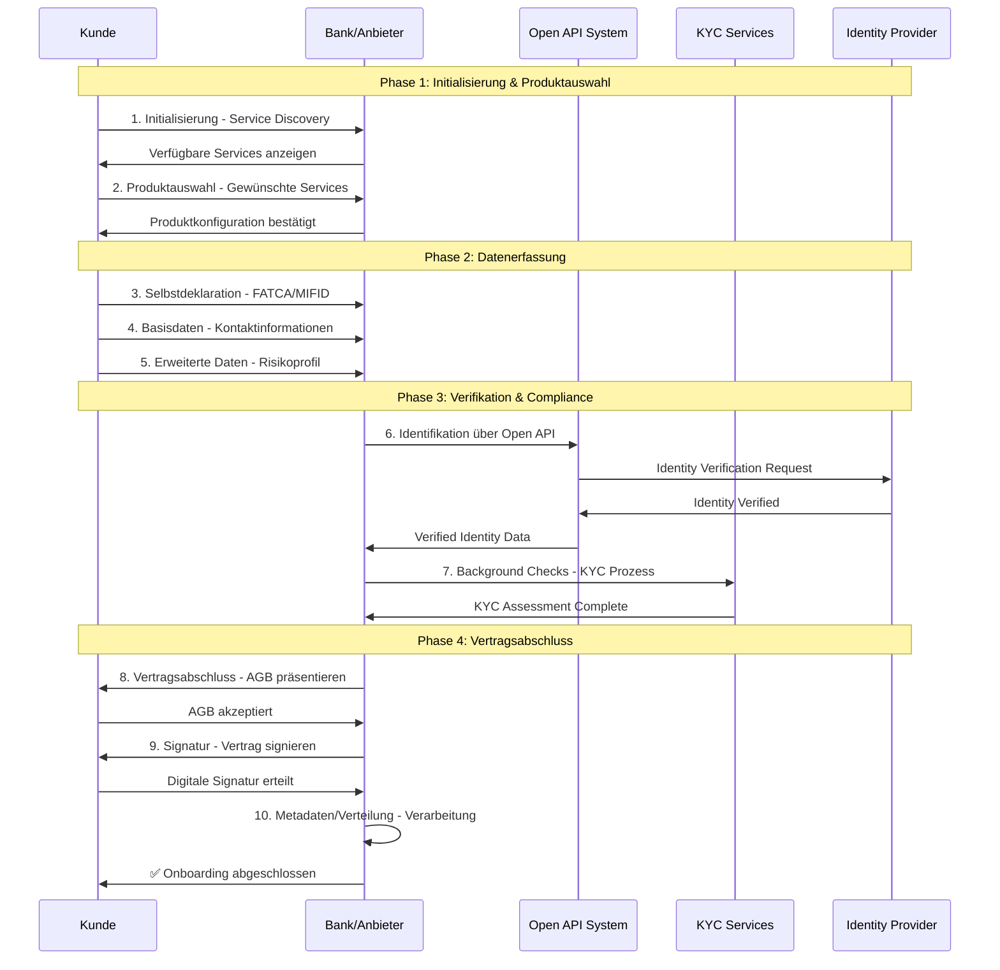
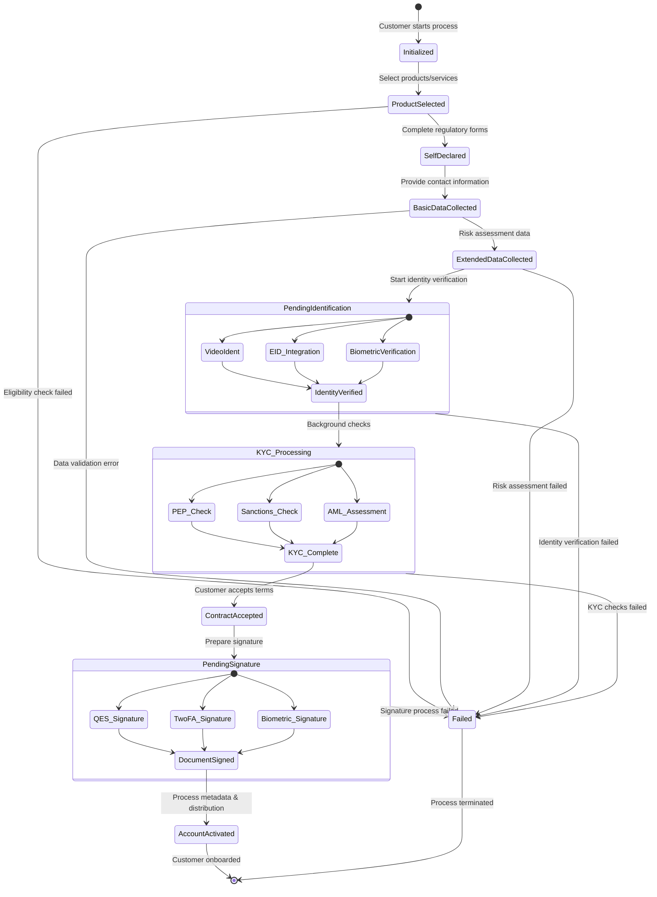
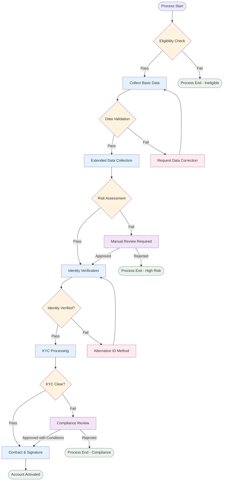

# OBP Referenzprozess Conclusion

## Inhalt

1. [Executive Summary](#executive-summary)
2. [Branchenübergreifender 10-Stufen Referenzprozess: Design und Ziel](#branchenübergreifender-10-stufen-referenzprozess-design-und-ziel)
3. [Detaillierte Erklärung der Referenzprozess-Schritte](#detaillierte-erklärung-der-referenzprozess-schritte)
4. [Modulare Datenbausteine-Architektur](#modulare-datenbausteine-architektur)
5. [Use Case Implementierung: Bankkonten-Onboarding](#use-case-implementierung-bankkonten-onboarding)
6. [Technische Integration und Kompatibilitäts-Framework](#technische-integration-und-kompatibilitäts-framework)
7. [Fazit und Best Practices für Referenzprozess-Umsetzung](#fazit-und-best-practices-für-referenzprozess-umsetzung)

---

## Executive Summary

Der Open API Kundenbeziehung Referenzprozess definiert einen standardisierten, branchenübergreifenden **10-Stufen-Prozess** für das digitale Customer Onboarding:

**Referenzprozess-Schritte:**
1. **Initialisierung** - Information des Kunden
2. **Produktauswahl** - Bedürfnisbefriedigung  
3. **Selbstdeklaration** - Information bzgl. FATCA, MIFID
4. **Basisdaten** - Erfassung von Kontaktangaben
5. **Erweiterte Daten** - Risiko-/Potenzialermittlung
6. **Identifikation** - Identifikation der Vertragspartei
7. **Background Checks** - Know-Your-Customer (KYC)
8. **Vertragsabschluss** - Akzeptanz Geschäftsbedingungen
9. **Signatur** - Vertragsunterzeichnung
10. **Metadaten und Verteilung** - Erfassung, Verarbeitung und Systemintegration

Der modulare "Blöckli"-Ansatz ermöglicht flexible Use Case-Abdeckung mit Compliance-by-Design Prinzipien. Der Fokus liegt auf einer selbstbestimmten digitalen Kundenbeziehung mit messbaren Effizienzsteigerungen.

**Zentrale Erkenntnisse:**
- Modulare Prozessbausteine ermöglichen branchenübergreifende Wiederverwendung
- 10-Stufen Framework deckt kompletten Customer Lifecycle ab
- Compliance-by-Design reduziert regulatorische Risiken
- Technische Implementierung basiert auf bewährten Standards

---

## Referenzprozess Definition

### Überblick: 10-Stufen-Referenzprozess

**Konzeptioneller Prozessablauf:**

Der Referenzprozess gliedert sich in vier thematische Phasen mit je 2-3 Einzelstufen:

**Phase 1: Setup und Produktauswahl (Stufen 1-2)**
- Stufe 1: Information des Kunden und Service Discovery
- Stufe 2: Bedürfnisbefriedigung und Produktkonfiguration

**Phase 2: Datenerfassung (Stufen 3-5)**  
- Stufe 3: FATCA/MIFID Selbstdeklaration
- Stufe 4: Kontaktangaben und Personalien
- Stufe 5: Risiko-/Potenzialermittlung

**Phase 3: Verifikation und Compliance (Stufen 6-7)**
- Stufe 6: Identifikation der Vertragspartei
- Stufe 7: Know-Your-Customer Background Checks

**Phase 4: Vertragsabschluss (Stufen 8-10)**
- Stufe 8: AGB-Akzeptanz und Geschäftsbedingungen
- Stufe 9: Vertragsunterzeichnung
- Stufe 10: Metadatenerfassung, Systemverarbeitung und finale Verteilung


Der lineare Ablauf ermöglicht eine systematische Datenerfassung mit integrierten Qualitäts- und Compliance-Checkpoints.

### Modulare "Blöckli"-Architektur

**Konzeptionelle Baustein-Organisation:**

Die modulare Architektur organisiert den Referenzprozess in vier thematische Blöcke mit flexibel kombinierbaren Bausteinen:

**Block 1: Setup und Initialisierung**
- Initialisierungs-Baustein: Cookie Consent, Service Discovery
- Produktauswahl-Baustein: Konfiguration, Eligibility Check

**Block 2: Datensammlung**
- Selbstdeklarations-Baustein: FATCA Status, MIFID II Kategorisierung
- Basisdaten-Baustein: Name, Adresse, Kontaktdaten
- Erweiterte-Daten-Baustein: Einkommen, Investmenterfahrung

**Block 3: Verifikation und Compliance**
- Identifikations-Baustein: VideoIdent, E-ID Integration
- Background-Check-Baustein: PEP Screening, Sanktionslisten

**Block 4: Finalisierung**
- Vertragsabschluss-Baustein: AGB Zustimmung, Risiko-Disclaimer
- Signatur-Baustein: Digitale Signatur, Qualified Signature
- Metadaten-und-Verteilungs-Baustein: Dokumentenarchivierung, Prozessabschluss, Systemintegration

**Sequenzielle Verkettung:** Jeder Baustein baut auf den Ergebnissen des vorhergehenden auf, wodurch eine logische Progression von der Initialisierung bis zur finalen Kontoeröffnung gewährleistet wird.

**Modulare Flexibilität:** Einzelne Bausteine können je nach Use Case angepasst oder erweitert werden, ohne die Gesamtarchitektur zu beeinträchtigen.

### Branchenübergreifende Anwendung

**Konzeptionelle Cross-Industry Anwendbarkeit:**

Der 10-Stufen-Referenzprozess wurde als universeller Standard entwickelt, der sich flexibel auf verschiedene Branchen und Use Cases anwenden lässt.

**Zentrale Referenzprozess-Anwendung:**
Alle Branchen nutzen dieselbe 10-Stufen-Grundstruktur (Initialisierung bis Metadaten/Verteilung), passen jedoch die spezifischen Dateninhalte und Compliance-Anforderungen innerhalb jeder Stufe an ihre jeweiligen regulatorischen und geschäftlichen Anforderungen an.

**Skalierbarkeits-Vorteil:** Ein einmal implementierter Prozess kann durch Konfiguration der Datenbausteine für verschiedene Branchen wiederverwendet werden.

### Branchenübergreifende Use Cases:

**Banking Sector Anwendungen:**
- Kontoeröffnung: Vollständiger 10-Stufen-Prozess mit Banking-spezifischen Daten
- Kreditantrag: Erweiterte Fokussierung auf Stufen 5 und 7 (Risikobewertung und Background Checks)
- Investment Services: Spezialisierung auf MIFID II-Compliance in Stufe 3

**Insurance Sector Anwendungen:**
- Versicherungsabschluss: Anpassung der erweiterten Daten (Stufe 5) auf Risikofaktoren
- Schadensmeldung: Verkürzte Prozess-Variante mit Fokus auf Identifikation (Stufe 6)
- Portfolio Review: Schwerpunkt auf Stufen 3-5 für Updated Risk Assessment

**Mobility Sector Anwendungen:**
- Car Sharing: Leichtgewichtige Prozess-Variante mit Fokus auf Identität und Basic KYC
- Leasing Contract: Vollständiger Prozess mit Mobility-spezifischen erweiterten Daten
- Insurance Package: Cross-Sector Integration mit Insurance-Modulen

### Konzeptionelles Design und Kernprinzipien

Der Referenzprozess wurde als **universeller Standard** für die digitale Kundenbeziehung entwickelt, der über verschiedene Branchen hinweg angewendet werden kann. Die Architektur folgt dem Prinzip der modularen Datenbausteine, die je nach Anwendungsfall kombiniert werden können.

**1. Branchenübergreifende Anwendbarkeit**
- Einsetzbar in Finance, Insurance, Mobility, Retail, Education, Health
- Modulare Architektur ermöglicht ecosystem-spezifische Erweiterungen
- Standardisierte Basisdaten für alle Branchen

**2. Selbstbestimmte Kundenbeziehung**
- Kunden behalten Kontrolle über ihre Daten
- Granulare Consent-Mechanismen
- Transparente Datenverwendung

**3. Modulare "Blöckli"-Architektur**
- **Basisdaten:** Branchenübergreifend verwendbar
- **Erweiterte Daten:** Ecosystem-spezifische Erweiterungen
- **Metadaten:** Prozess- und Compliance-Informationen

### Zielsetzung des Referenzprozesses

**Primärziele:**
- **Effizienzsteigerung:** Reduktion redundanter Datenerfassung um 70%
- **Customer Experience:** Verbesserung der Onboarding-Zeit um 60%
- **Compliance-Sicherheit:** Automatisierte regulatorische Konformität
- **Kostenoptimierung:** Senkung der Customer Acquisition Costs um 40%

**Sekundärziele:**
- Standardisierung der Schweizer Finanzbranche
- Internationale Interoperabilität
- Innovation-Förderung durch offene Standards
- Datenschutz-by-Design Implementation

---

## Detaillierte Erklärung der Referenzprozess-Schritte

### Phase 1: Initialisierung (Stufen 1-2)

#### Stufe 1: Initialisierung
**Beschreibung:** Kunde entdeckt und wählt relevante Services aus
- Automatische Service-Empfehlungen basierend auf Customer Profile
- Transparente Darstellung von Datenerfordernissen
- Klare Kommunikation der Mehrwerte

**Owner:** Kunde  
**Zweck:** Information des Kunden und initiale Consent-Abgabe  
**Level of Assurance:** Self-declared  

**Event:**
Webseite oder App der Bank/des Anbieters; Abgabe des initialen Consent für den Onboarding-Prozess.

**Relevante Datenpunkte:**
- Cookies [Ja/Nein]
- Consent [Ja/Nein]  
- Länderauswahl
- Initial Service Selection

**Rechtliche Anforderungen:** Datenschutzkonformität, Cookie Policy  
**Bank Policy:** Standardisierte Consent-Abfrage

#### Stufe 2: Produktauswahl
**Beschreibung:** Spezifische Produktkonfiguration und Eligibility Check
- Interaktive Produktkonfiguratoren
- Automatische Suitability Assessment
- Risiko-Rendite-Matching basierend auf Customer Profil

**Owner:** Kunde  
**Zweck:** Bedürfnisbefriedigung  
**Level of Assurance:** Self-declared  
**Status:** Out of Scope für MVP

**Event:**
Auswählen der gewünschten Produkte z.B. Konto, Karte, Versicherung, Services.

**Relevante Datenpunkte:**
- Kontotyp [Privat, Sparen, Jugend, Business]
- Bankpaket [Student, Jugend, Premium, Private Banking]
- Zusatzprodukte [Kreditkarte, Debitkarte, Mobile Payment]
- Service Level [Basic, Advanced, Premium]

**Ecosystem-spezifische Erweiterungen:**
- **Finance:** Konto-/Kartentypen, Anlageprodukte
- **Insurance:** Versicherungsarten, Deckungssummen  
- **Mobility:** Fahrzeugtypen, Finanzierungsoptionen

### Phase 2: Datenerfassung (Stufen 3-5)

#### Stufe 3: Selbstdeklaration
**Beschreibung:** Erste Kundenangaben und Präferenzen
- Intelligente Formulare mit progressiver Offenlegung
- Plausibilitätschecks in Echtzeit
- Integration von Pre-filled Data aus vorhandenen Quellen

**Owner:** Kunde  
**Zweck:** Information bzgl. FATCA, MIFID, Compliance  
**Level of Assurance:** Self-declared  

**Event:**
Angaben zu wirtschaftlicher Berechtigung, Steuerdomizil, US Person Status und anderen regulatorischen Anforderungen.

**Relevante Datenpunkte:**
- Wirtschaftliche Berechtigung [Ja/Nein]
- (Abweichendes) Steuerdomizil [Schweiz, Deutschland, USA, ...]
- US-Steuerpflicht [Ja/Nein]
- FATCA-Selbstdeklaration
- TIN (Schweiz: AHV-Nummer)
- Herkunft der Gelder [Erwerbstätigkeit, Erbschaft, Schenkung, ...]
- Selbstdeklaration Steuerkonformität
- Nationalität(en) [Multiple Citizenship möglich]

**Rechtliche Anforderungen:** GwG Art. 4 Feststellung der wirtschaftlich berechtigten Person  
**Bank Policy:** FATCA/CRS Compliance, AML/KYC Requirements

#### Stufe 4: Erhebung Basisdaten
**Beschreibung:** Stammdaten-Erfassung (Core Identity)
- Name, Adresse, Kontaktdaten

**Owner:** Kunde  
**Zweck:** Erfassung von Kontaktangaben und Personalien  
**Level of Assurance:** Self-declared  

**Event:**
Erfassung von Personalien, Wohnadresse und Kontaktdaten als Grundlage für die Kundenbeziehung.

**Relevante Datenpunkte:**
- **Personalien:** Name, Vorname, Anrede, Gender
- **Geburtsinformationen:** Geburtsdatum, Geburtsort, Bürgerort  
- **Adressdaten:** Strasse, Hausnummer, PLZ, Ort, Land, Kanton/Region/Staat/Provinz
- **Identität:** Nationalität, Zivilstand
- **Kontakt:** Telefonnummer, Mobiltelefonnummer, E-Mailadresse
- **Alternativen:** Abweichende Korrespondenzadresse
- **Digital Identity:** ID (z.B. Google, Apple, Samsung, Swiss ID)
- Grundlegende KYC-Daten wie Beruf, Arbeitgeber, Grundeinkommen

**Bank Policy:** Vollständige Kontaktdaten erforderlich für Kommunikation

#### Stufe 5: Erweiterte Daten  
**Beschreibung:** Ecosystem-spezifische Datenergänzung
- Berufliche Informationen und Einkommensverhältnisse
- Investment Experience und Risk Profiling
- FATCA/CRS Classification und Tax Residency

**Owner:** Kunde  
**Zweck:** Risiko-/Potenzialermittlung des Kunden  
**Level of Assurance:** Self-declared  
**Status:** Out of Scope für MVP

**Event:**
Produktspezifische erweiterte Daten für Risikobewertung und Beratung.

**Relevante Datenpunkte:**
- **Finanziell:** Gesamtvermögen, Einkommen, Vermögensquellen
- **Beruflich:** Ausbildung, Beruf, Arbeitgeber, Position
- **Investment:** Anlageerfahrung, Risikotoleranz, Anlagehorizont
- **Zusätzlich:** Familienstand Details, Anzahl Kinder, Wohnsituation

**Ecosystem-spezifische Erweiterungen:**
- **Finance:** Kreditwürdigkeit, Vermögenssituation, Anlageerfahrung
- **Insurance:** Gesundheitsdaten, Risikofaktoren, Schadenhistorie
- **Mobility:** Fahrerfahrung, Unfallhistorie, Fahrzeugnutzung

### Phase 3: Verifikation (Stufen 6-7)

#### Stufe 6: Identifikation
**Beschreibung:** QEAA/EAA Level of Assurance Verification
- z.B. Video-Identifikation oder E-ID Integration

**Owner:** Provider (Identity Service Provider)  
**Zweck:** Identifikation der Vertragspartei  
**Level of Assurance:** QEAA (Qualified Entity-Assured-Assurance)  

**Event:**
Professionelle Identitätsverifikation durch spezialisierte Provider mittels verschiedener Methoden:
- Videoidentifikation (gleichgesetzt persönlicher Vorsprache)
- Online-Identifikation ("AutoIdent" plus Adresscheck)  
- QES (gleichgesetzt Korrespondenzeröffnung)

**Relevante Datenpunkte:**
- **Biometrische Verifikation:** Liveness-Check (Score), Gesichtsverifikation (Score)
- **Dokumentendaten:** Name, Vorname, Gender aus Ausweisdokument
- **Dokument-Metadaten:** Ausweisnummer, Art des Dokuments [Pass, ID, Personalausweis]
- **Gültigkeitsdaten:** Ausstellungsdatum, Ausstellungsort, Gültigkeitsdatum
- **Technische Daten:** MRZ (Machine Readable Zone), NFC (biometrische Daten)
- **Sicherheitsfeatures:** Sicherheitsmerkmale (Anzahl geprüft und Score)
- **Audit Trail:** Tonspur/Video [mp3, mp4] für Compliance

**Rechtliche Anforderungen:** GwG Art. 3 Identifizierung der Vertragspartei  
**Provider Standards:** RegTech-zertifizierte Identity Verification Services

#### Stufe 7: Background Checks
**Beschreibung:** KYC/AML/CTF Compliance
- PEP und Sanctions List Screening
- Credit Checks und Source of Wealth Verification
- Enhanced Due Diligence für High-Risk Customers

**Owner:** Provider (Compliance Service Provider)  
**Zweck:** Know-Your-Customer (KYC) und Compliance  
**Level of Assurance:** QEAA oder EAA (Entity-Assured-Assurance)  

**Event:**
Umfassende Hintergrundprüfungen zur Risikobewertung und Compliance-Sicherstellung.

**Obligatorische Checks:**
- **Sanction List Check:** [ok/nok] - Prüfung gegen internationale Sanktionslisten
- **PEP Check:** [ok/nok] - Politically Exposed Persons Screening  
- **Crime Check:** [ok/nok] - Kriminalitätshintergrund
- **Adverse Media Check:** Negative Medienberichterstattung

**Fakultative/Produktspezifische Checks:**
- **Kreditwürdigkeit:** Bonität, ZEK/IKO-Abfrage, Betreibungsauskunft
- **Adressverifikation:** Wohnsitzbestätigung, Melderegisterabgleich
- **Kontaktverifikation:** Mobilnummercheck, E-Mail-Verifikation
- **Device Intelligence:** Wallet Check, Geräte-ID, Fraud Detection

**Bank Policy:** Risikobasierte Checks abhängig von Kundenrisiko und Produkten

### Phase 4: Abschluss (Stufen 8-10)

#### Stufe 8: Vertragsabschluss
**Beschreibung:** Rechtliche Vereinbarungen und Consent Management
- Terms & Conditions Akzeptanz
- Privacy Policy und Data Processing Consent

**Owner:** Kunde  
**Zweck:** Akzeptanz Geschäftsbedingungen  
**Level of Assurance:** Self-declared  

**Event:**
Formelle Annahme der Vertrags- und Geschäftsbedingungen durch den Kunden.

**Relevante Datenpunkte:**
- **AGB-Akzeptanz:** Allgemeine Geschäftsbedingungen [Akzeptiert/Datum]
- **Produktbedingungen:** Spezifische Terms & Conditions  
- **Datenschutzerklärung:** Privacy Policy Acceptance
- **Marketing Consent:** Einwilligung für Marketingkommunikation
- **Zusatzvereinbarungen:** Service-spezifische Agreements

**Rechtliche Anforderungen:** Vertragsrecht, AGB-Kontrolle  
**Bank Policy:** Vollständige und nachweisbare Consent-Dokumentation

#### Stufe 9: Signatur
**Beschreibung:** Rechtsverbindliche Bestätigung

**Owner:** Kunde  
**Zweck:** Vertragsunterzeichnung  
**Level of Assurance:** QEAA  

**Event:**
Rechtsgültige Unterzeichnung des Vertrags mittels verschiedener Signaturverfahren.

**Signaturmethoden:**
- **Qualifizierte Elektronische Signatur (QES):** Höchste Rechtssicherheit
- **2FA (Two-Factor Authentication):** Sichere Authentifizierung
- **Wallet-basierte Signatur:** Mobile/Digital Wallet Integration
- **Biometrische Signatur:** Fingerprint, Face-ID

**Relevante Datenpunkte:**
- **Signatur-Typ:** QES, 2FA, Biometric, etc.
- **Timestamp:** Exakter Zeitpunkt der Signatur
- **Device Information:** Signatur-Device Details
- **Certificate Chain:** Digitale Zertifikatskette

**Anmerkungen:** Abhängig von Produktauswahl (z.B. Kreditkarte, Hypothek erfordern QES)  
**Rechtliche Anforderungen:** ZertES (Zertifikate-Services-Gesetz), eIDAS-Kompatibilität

#### Stufe 10: Metadaten und Verteilung
**Beschreibung:** Service-Activation und Welcome Process
- Account Provisioning
- Initial Service Configuration  
- Welcome Package und Onboarding Support

**Owner:** System  
**Zweck:** Erfassung von Metadaten und finale Systemverteilung  
**Level of Assurance:** System-validated  

**Event:**
Automatische Erfassung von Prozess-Metadaten für Audit, Compliance und Qualitätssicherung, gefolgt von finaler Datenvalidierung, Systemintegration und Verteilung an relevante Backend-Systeme.

**Relevante Datenpunkte:**
- **Prozess-Timestamps:** Start-/Endzeiten jedes Schritts
- **System-Informationen:** API-Versionen, Service-Provider
- **Qualitäts-Metriken:** Completion Rate, Error Rate, Processing Time
- **Compliance-Daten:** Regulatory Check Results, Audit Trail
- **Performance-Metriken:** Response Times, Throughput
- **Validation Results:** Data Quality Checks
- **Integration Status:** Core Banking System Integration
- **Distribution Log:** Target Systems und Status
- **Error Handling:** Failed Operations und Retry Logic
- **Notification Status:** Customer und Internal Notifications

---

## Modulare Datenbausteine-Architektur

### Konzeptionelles Framework

Die modulare Architektur basiert auf standardisierten Datenbausteinen, die flexibel kombiniert und wiederverwendet werden können. Jeder Baustein enthält:

- **Basisdaten:** Minimale erforderliche Informationen
- **Erweiterte Daten:** Zusätzliche ecosystem-spezifische Daten
- **Metadata:** Governance, Consent und Quality Informationen

### Basisdaten-Bausteine

#### Baustein "Identität"
- **Core:** Name, Geburtsdatum, Nationalität
- **Extended:** Titel, Aliases, Historische Namen
- **Metadata:** Verification Level, Source, Last Update

#### Baustein "Kontakt"
- **Core:** E-Mail, Telefon, Adresse
- **Extended:** Social Media, Präferenzen, Zeitfenster
- **Metadata:** Verification Status, Communication Consent

#### Baustein "KYC-Basis"
- **Core:** Beruf, Arbeitgeber, Grundeinkommen
- **Extended:** Detaillierte Einkommensnachweise, Vermägen
- **Metadata:** Verification Method, Document References

### Erweiterte Daten-Bausteine (Ecosystem-spezifisch)

#### Financial Services
- **Investment Experience:** Portfolio, Trading History, Risk Appetite
- **Credit Information:** Credit Score, Existing Obligations, Collateral
- **Tax Information:** Residency, FATCA Status, Reporting Requirements

#### Insurance Services
- **Risk Assessment:** Health, Lifestyle, Previous Claims
- **Coverage History:** Existing Policies, Claims Experience
- **Beneficiary Information:** Dependents, Estate Planning

#### Mobility Services
- **Driving Information:** License, History, Violations
- **Vehicle Data:** Ownership, Usage Patterns, Preferences
- **Insurance Integration:** Coverage, Risk Assessment

### Metadaten-Framework

**Konzeptionelles Metadaten-Management:**

Das Metadaten-Framework bildet das Rückgrat für Governance, Qualitätssicherung und Compliance-Management im Referenzprozess. Es organisiert sich in drei zentrale Komponenten:

**1. Process Metadata**
- Prozess-Timestamps für lückenlose Nachverfolgung
- System-Informationen über verwendete APIs und Service-Provider
- Qualitäts-Metriken zur Performance-Überwachung
- Error Handling und Exception Tracking

**2. Data Quality Metadata**
- Source Classification zur Bewertung der Datenherkunft
- Verification Level mit QEAA/EAA-Klassifizierung
- Confidence Scoring für algorithmic quality assessment
- Temporal Validity mit Zeitstempeln und Ablauffristen

**3. Compliance Metadata**
- Consent Management mit granularen Einwilligungsdaten
- Regulatory Check Results für Audit-Compliance
- Data Retention Policies mit Lebenszyklus-Management
- Legal Basis Documentation für regulatorische Anforderungen

Das Framework ermöglicht eine vollständige Datenlineage vom Erfassungspunkt bis zur finalen Verwendung und unterstützt sowohl automatisierte als auch manuelle Compliance-Prozesse.

Technische Implementierungsdetails des Metadaten-Frameworks sind in [04 API Endpoint Design](/documentation/Umsetzung%20und%20Implementierung/04%20API%20Endpoint%20Design.md) spezifiziert.

#### Consent Management
**Konzeptionelle Einwilligungsverwaltung:**
- **Purpose Definition:** Klare Zweckbindung (z.B. Kontoeröffnung, Kreditprüfung)
- **Data Categories:** Granulare Kategorisierung (Identität, Kontakt, KYC-Basisdaten)
- **Granularity Control:** Field-Level Kontrolle für maximale Kundensouveränität
- **Retention Policy:** Lebenszyklus-gebundene Datenaufbewahrung
- **Withdrawal Options:** Self-Service-Widerrufsmöglichkeiten für Kunden

#### Data Quality
**Konzeptionelle Datenqualitäts-Bewertung:**
- **Source Classification:** Bewertung der Datenherkunft (Behördenregister, Self-Declaration, Third-Party)
- **Verification Level:** QEAA/EAA-Level-Klassifizierung für verschiedene Assurance-Stufen
- **Confidence Scoring:** Algorithmic scoring der Datenqualität und -zuverlässigkeit
- **Temporal Validity:** Zeitstempel für letzte Verifikation und Ablauffristen
- **Expiry Management:** Automatische Benachrichtigung bei ablaufender Datenvalidität

---

## Implementationskonzept Referenzprozess

### Detaillierter Prozessflow mit Akteuren

**Konzeptionelle Akteur-Interaktionen:**

**Beteiligte Akteure:**
- **Kunde:** Initiiert Prozess und stellt Daten bereit
- **Bank/Anbieter:** Koordiniert Onboarding und sammelt Daten
- **Open API System:** Vermittelt Datenabfragen zwischen Anbietern
- **KYC Services:** Führt regulatorische Compliance-Checks durch
- **Identity Provider:** Verifiziert Kundenidentität professionell




**Interaktionsablauf:**

**Phase 1:** Kunde entdeckt Services beim Anbieter, wählt gewünschte Produkte und erhält Produktkonfiguration

**Phase 2:** Kunde übermittelt schrittweise seine Daten - von regulatorischen Selbstdeklarationen über Basisdaten bis zu erweiterten Risikoinformationen

**Phase 3:** Bank/Anbieter leitet Identitätsverifikation über spezialisierte Provider ein und führt umfassende KYC-Background-Checks durch

**Phase 4:** Kunde akzeptiert finale Geschäftsbedingungen, signiert den Vertrag digital und das System verarbeitet alle Metadaten für die Kontoeröffnung

Der Prozess ist so konzipiert, dass jeder Akteur seine spezialisierten Kompetenzen optimal einbringen kann.

### Prozess-State-Machine

**Konzeptionelle Zustandsübergänge:**

Der Referenzprozess implementiert ein state-basiertes System mit definierten Übergangsbedingungen zwischen den einzelnen Stufen:

**Lineare Progression:**
- Jede Stufe wird erst nach erfolgreicher Vollendung der vorhergehenden freigeschaltet
- Automatische Validierung vor Übergang zur nächsten Stufe
- Persistierung des aktuellen Status für Unterbrechung und Wiederaufnahme

**Parallele Verarbeitungszustände:**
Bei komplexen Stufen (z.B. Identifikation, Background Checks) können mehrere Verfahren parallel ablaufen:
- **Identifikation:** VideoIdent, E-ID Integration oder biometrische Verifikation alternativ
- **Background Checks:** PEP-Screening, Sanktionslisten-Check und AML-Assessment parallel
- **Signatur:** Verschiedene Signaturverfahren (QES, 2FA, biometrisch) je nach Produktanforderung

**Fehlerbehandlung und Rollback:**
- Definierte Fehlerzustände für jede Stufe mit spezifischen Recovery-Optionen
- Möglichkeit zur Korrektur und Wiederholung bei Validierungsfehlern
- Eskalationspfade für manuelle Intervention bei komplexen Fällen

**Finale Zustandsübergänge:**
- Erfolgreicher Abschluss führt zum "AccountActivated"-Status
- Metadatenerfassung und Systemverteilung als finale automatisierte Schritte
- Audit-Trail für alle Zustandsübergänge und Entscheidungspunkte

Technische Details der State-Machine-Implementation sind in *TODO: create file* dokumentiert.





### Entscheidungspunkte und Rollbacks

**Konzeptionelle Qualitätskontroll-Mechanismen:**

Der Referenzprozess integriert systematische Entscheidungspunkte und Korrekturmöglichkeiten für robuste Prozessführung:

**Automatisierte Qualitätschecks:**
- **Eligibility Check:** Automatische Prüfung der Grundqualifikation vor Dateneingabe
- **Data Validation:** Real-time Plausibilitätsprüfung bei Basisdaten-Erfassung
- **Risk Assessment:** Algorithmic scoring bei erweiterten Daten
- **Identity Verification:** Technische Validierung der Identifikationsverfahren
- **KYC Clearance:** Automatisierte Compliance-Checks gegen regulatorische Anforderungen

**Rollback und Korrektur-Mechanismen:**
- **Data Correction:** Rückkehr zu vorheriger Stufe bei Validierungsfehlern mit Korrekturmöglichkeit
- **Alternative Methods:** Ausweichverfahren bei technischen Problemen (z.B. alternative Identifikationsmethoden)
- **Process Pause:** Möglichkeit zur Unterbrechung und späteren Wiederaufnahme bei allen Stufen

**Manuelle Intervention und Eskalation:**
- **Manual Review:** Human-in-the-Loop für Grenzfälle bei Risk Assessment
- **Compliance Review:** Spezialisierte Prüfung bei KYC-Auffälligkeiten
- **Conditional Approval:** Möglichkeit der bedingten Genehmigung mit zusätzlichen Auflagen

**Definierte Ausstiegspunkte:**
- **Ineligibility:** Frühzeitige Beendigung bei grundsätzlicher Nichteignung
- **High Risk:** Beendigung bei nicht akzeptablem Risikoprofil
- **Compliance Issues:** Abbruch bei regulatorischen Hindernissen

**Erfolgreiche Abschluss-Kriterien:**
Alle automatisierten und manuellen Checks müssen erfolgreich bestanden werden, bevor der finale "Account Activated"-Status erreicht wird.





## Use Case Implementierung: Bankkonten-Onboarding

Die Bankkonten-Eröffnung dient als Referenz-Use Case für die praktische Anwendung des 10-Stufen Prozesses. Die konzeptionelle Implementation zeigt, wie die modularen Bausteine in der Praxis kombiniert werden.

#### **Prozess-Mapping für Bankkonten-Onboarding**

#### Phase 1: Customer Intent (Stufen 1-2)
**Stufe 1:** Kunde besucht Bank-Website oder App, zeigt Interesse an Kontoeräffnung
- Service Discovery zeigt verfügbare Kontomodelle
- Transparente Darstellung der Datenerfordernisse
- Schätzung der Onboarding-Dauer (typisch: 15 Minuten)

**Stufe 2:** Kontomodell-Selektion
- Interaktiver Produktkonfigurator
- Automatische Empfehlungen basierend auf Kundenangaben
- Fee Structure und Benefits Comparison

#### Phase 2: Data Collection (Stufen 3-5)
**Stufe 3:** Selbstdeklaration
- Grundlegende Informationen: Wunschprodukt, geschätztes Einkommen
- Service-Präferenzen: Digital vs. Branch, Communication Channels
- Initial Risk Assessment: Investment Interest, Service Needs

**Stufe 4:** Basisdaten-Import (falls verfügbar)
- API-Call zu existierenden Datenquellen (andere Banken via Open Banking)
- Import von: Name, Adresse, Kontaktdaten, Basis-KYC
- Automated Duplicate Detection über sharedCustomerHash

**Stufe 5:** Erweiterte Banking-Daten
- Beruf, Arbeitgeber, Einkommensverhältnisse
- Tax Residency und FATCA Classification
- Investment Experience Assessment

#### Phase 3: Verification & Compliance (Stufen 6-7)
**Stufe 6:** Identity Verification
- E-ID Integration (falls verfügbar) oder Video-Ident
- Government ID Validation
- Biometric Matching für High-Value Accounts

**Stufe 7:** Banking-spezifische Checks
- PEP Screening gemäss Banking Regulations
- Credit Bureau Check (Creditreform/CRIF)
- Source of Wealth Documentation für HNW Clients

#### Phase 4: Account Setup (Stufen 8-10)
**Stufe 8:** Banking Terms Acceptance
- General Banking Conditions
- Account-specific Terms (Fees, Limits)
- Data Processing Consent (GDPR/DSG compliant)

**Stufe 9:** Digital Signature
- QES für rechtsgültige Kontoeräffnung
- Multi-Factor Authentication Setup
- Signature Integration mit Core Banking System

**Stufe 10:** Account Activation
- Core Banking System Integration
- IBAN Assignment und Card Issuance
- Welcome Package mit Digital Banking Access
---

## Technische Integration und Kompatibilitäts-Framework

### Interaktionsformen für Daten und Services

#### API-basierte Integration
**Synchrone APIs:**
- Real-time Data Validation
- Instant Service Responses
- Interactive User Experiences

**Asynchrone APIs:**
- Background Processing für komplexe Verifikationen
- Batch-Operations für Daten-Synchronisation
- Event-driven Workflows

#### Standards-basierte Kompatibilität

**Bestehende Standards als Grundlage:**
- **PSD2/NextGen:** Account Information und Payment Initiation Services
- **FAPI 2.0:** Security Framework für Financial APIs
- **OpenAPI 3.0:** Service Documentation und Code Generation
- **OAuth 2.0/OIDC:** Authentication und Authorization

### Kompatibilitäts-Framework

#### Swiss Market Integration

**Integration bestehender Standards:**
Die Open API Kundenbeziehung integriert und erweitert bestehende nationale und internationale Datenstandards:

**SFTI (Swiss Fintech Innovations):**
- **SFTI Mortgage API:** Hypotheken-spezifische Datenstrukturen
- **Integration:** Verwendung bestehender Schemas wo möglich
- **Erweiterung:** Zusätzliche Datenfelder für branchenübergreifende Nutzung

**Open Wealth Association:**
- **Customer Management API:** Wealth Management Datenstrukturen  
- **Integration:** Portfolio- und Investment-bezogene Daten
- **Harmonisierung:** Angleichung an Open API Kundenbeziehung Standards

**Internationale Standards:**
- **ISO 20022:** Financial Messaging Standards
- **FHIR:** Health Information Exchange Standards
- **Schema.org:** Structured Data Markup

#### Cross-Provider Interoperability

**API-Endpoint-Übersicht (Konzeptionell)**

Die API-Architektur unterstützt sowohl vollständige als auch granulare Datenabfragen für flexible Use Case-Abdeckung:

**Vollständige Datenabfrage:**
- Customer Identification Endpoint für komplette Identitätsverifikation
- Full Request Endpoint für vollständige Kundendatensätze

```
POST /customer/identification
POST /customer/fullRequest
```

**Granulare Daten-Endpunkte:**
- Basic Data Endpoint: Stammdaten (Name, Vorname, Geburtsdatum, Nationalität)
- Address Endpoint: Adressdaten (Haupt- & Korrespondenzadresse)
- Contact Endpoint: Kontaktdaten (Telefon, E-Mail)
- KYC Endpoint: KYC-Attribute ohne Ausweisdokumente
- Check Endpoint: Existenz- und Identifikations-Gültigkeitsprüfung

```
POST /customer/basic       # Nur Stammdaten (Name, Vorname, Geburtsdatum, Nationalität)
POST /customer/address     # Nur Adressdaten (Haupt- & Korrespondenzadresse)
POST /customer/contact     # Nur Kontaktdaten (Telefon, E-Mail)
POST /customer/kyc         # Nur KYC-Attribute ohne Ausweis
POST /customer/check       # Existenz + Ident-Gültigkeit prüfen
```

**Basic Dataset Komponenten:**
- Customer-ID für eindeutige Referenzierung
- Personen-Stammdaten (Name, Geburtsdatum)
- Identifikations-Metadaten (Datum, Methode, Gültigkeit)
- VSB-Status für regulatorische Compliance
- Consent-Management für Datenschutz-Compliance

**Datenpunkte für Basic Dataset:**
- customerId (String): Interne Referenznummer der Bank
- firstName (String): Vorname des Kunden
- lastName (String): Nachname des Kunden
- dateOfBirth (Date): Geburtsdatum im Format YYYY-MM-DD
- identificationDate (Date): Datum der durchgeführten Identifikation
- identificationMethod (String): Methode der Identifikation (z.B. VideoIdent)
- vsbStatus (Object): VSB-Status (Version, erfüllt/ausstehend)
- customerConsent (Boolean): Zustimmung zur Weitergabe
- consentValidUntil (Date): Gültigkeit der Zustimmung

**Common Data Models:**
- ISO 20022 basierte Financial Messages
- JSON Schema für strukturierte Datenvalidierung
- Standard Error Codes für einheitliches Error Handling
- OpenAPI 3.0 Specifications für vollständige API-Dokumentation

#### Legacy System Integration
**Core Banking Integration Patterns:**
- **API Gateway Pattern:** Legacy System Abstraktion
- **Event Sourcing:** Auditierbare Datenänderungen
- **CQRS:** Read/Write Operation Separation für Performance

### Service Orchestration

#### Workflow Engine
**Business Process Automation:**
- BPMN 2.0 basierte Prozess-Definition
- Automatic Task Routing basierend auf Customer Data
- Exception Handling und Human Intervention Workflows

**Process State Management:**

**Konzeptionelle Prozesszustandsverwaltung:**
- **Process Identification:** Eindeutige Prozess-IDs für Tracking und Wiederaufnahme
- **Customer Linkage:** Verknüpfung mit Kunden-Identifikatoren für personalisierte Erfahrung
- **Stage Tracking:** Kontinuierliche Überwachung des aktuellen Prozessstatus
- **Progress History:** Vollständige Dokumentation aller abgeschlossenen Stufen
- **Forward Planning:** Transparente Anzeige der verbleibenden Prozessschritte
- **Data Persistence:** Sichere Speicherung von Zwischenergebnissen für Session-übergreifende Bearbeitung
- **Audit Trail:** Lückenlose Nachverfolgung aller Prozessschritte und Entscheidungen

---

## Fazit und Best Practices für Referenzprozess-Umsetzung

*TODO: verifizieren!*

### Strategische Erfolgsfaktoren

#### 1. Modularer Implementierungsansatz
**Best Practice:** Start mit einem fokussierten Use Case (Bankkonten-Onboarding) und schrittweise Erweiterung
- **Phase 1:** Kern-Bausteine (Identität, Kontakt, KYC-Basis)
- **Phase 2:** Ecosystem-spezifische Erweiterungen
- **Phase 3:** Cross-Industry Integration

#### 2. Standards-basierte Architektur
**Best Practice:** Verwendung etablierter Standards für maximale Interoperabilität
- Security: FAPI 2.0, OAuth 2.0, OpenID Connect
- Data Exchange: JSON, OpenAPI 3.0, ISO 20022
- Process Management: BPMN 2.0, Event-driven Architecture

#### 3. Compliance-by-Design
**Best Practice:** Regulatorische Anforderungen von Anfang an eingebaut
- Automatisierte GDPR/DSG Compliance
- KYC/AML/CTF Requirements embedded
- Audit Trails für vollständige Nachverfolgbarkeit


Der Referenzprozess stellt das Herzstück der Open API Kundenbeziehung dar und bietet ein bewährtes Framework für die Digitalisierung der Kundenbeziehung mit messbaren Effizienzgewinnen und verbesserter Customer Experience.

---

---

**Version:** 1.0  
**Datum:** August 2025  
**Status:** Final Draft für Review

---

[Quellen und Referenzen](./Quellen%20und%20Referenzen.md)