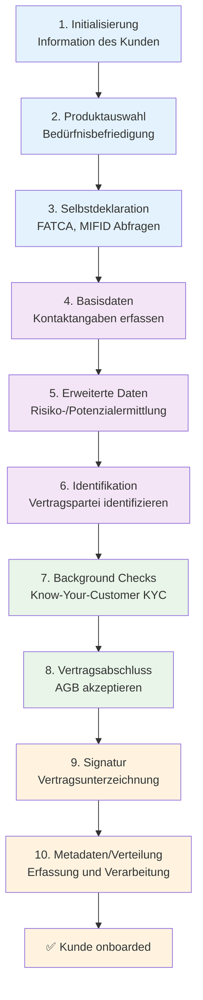
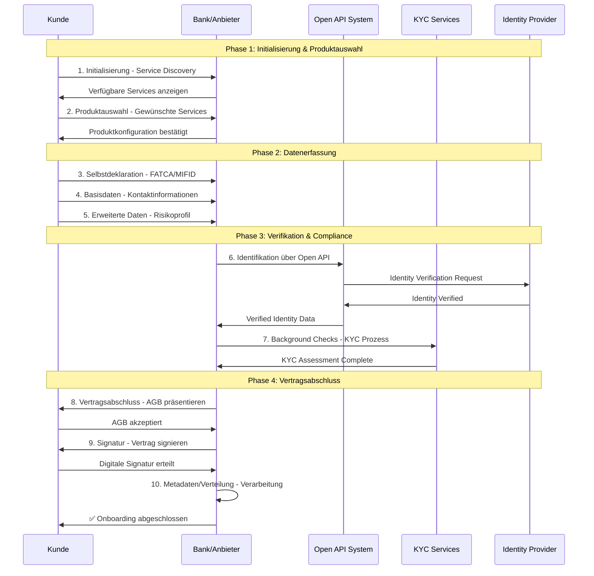
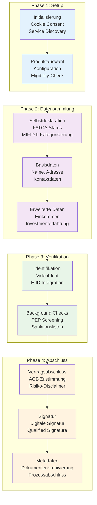
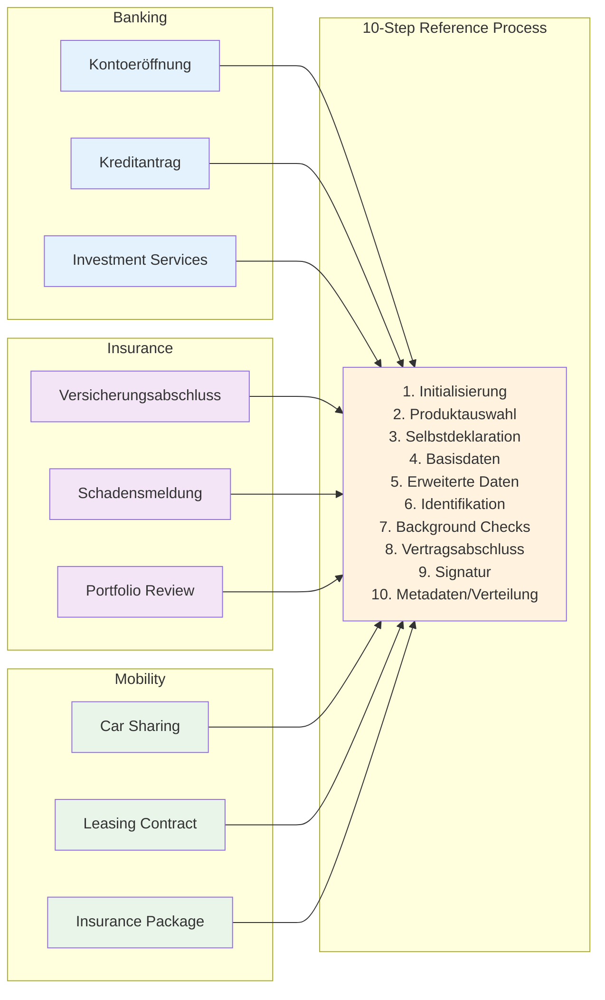
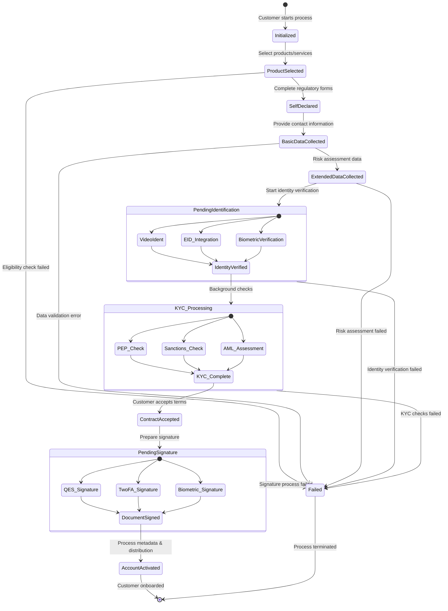

# OBP Referenzprozess Conclusion

## Inhalt

1. [Executive Summary](#executive-summary)
2. [Branchenübergreifender 10-Stufen Referenzprozess: Design und Ziel](#branchenübergreifender-10-stufen-referenzprozess-design-und-ziel)
3. [Detaillierte Erklärung der Referenzprozess-Schritte](#detaillierte-erklärung-der-referenzprozess-schritte)
4. [Modulare Datenbausteine-Architektur](#modulare-datenbausteine-architektur)
5. [Use Case Implementierung: Bankkonten-Onboarding](#use-case-implementierung-bankkonten-onboarding)
6. [Technische Integration und Kompatibilitäts-Framework](#technische-integration-und-kompatibilitäts-framework)
7. [Fazit und Best Practices für Referenzprozess-Umsetzung](#fazit-und-best-practices-für-referenzprozess-umsetzung)

---

## Executive Summary

Der Open API Kundenbeziehung Referenzprozess definiert einen standardisierten, branchenübergreifenden **10-Stufen-Prozess** für das digitale Customer Onboarding:

**Referenzprozess-Schritte:**
1. **Initialisierung** - Information des Kunden
2. **Produktauswahl** - Bedürfnisbefriedigung  
3. **Selbstdeklaration** - Information bzgl. FATCA, MIFID
4. **Basisdaten** - Erfassung von Kontaktangaben
5. **Erweiterte Daten** - Risiko-/Potenzialermittlung
6. **Identifikation** - Identifikation der Vertragspartei
7. **Background Checks** - Know-Your-Customer (KYC)
8. **Vertragsabschluss** - Akzeptanz Geschäftsbedingungen
9. **Signatur** - Vertragsunterzeichnung
10. **Metadaten/Verteilung** - Erfassung und Verarbeitung

Der modulare "Blöckli"-Ansatz ermöglicht flexible Use Case-Abdeckung mit Compliance-by-Design Prinzipien. Der Fokus liegt auf einer selbstbestimmten digitalen Kundenbeziehung mit messbaren Effizienzsteigerungen.

**Zentrale Erkenntnisse:**
- Modulare Prozessbausteine ermöglichen branchenübergreifende Wiederverwendung
- 10-Stufen Framework deckt kompletten Customer Lifecycle ab
- Compliance-by-Design reduziert regulatorische Risiken
- Technische Implementierung basiert auf bewährten Standards

---

## Referenzprozess Flow-Diagramme

### Überblick: 10-Stufen-Referenzprozess



### Detaillierter Prozessflow mit Akteuren



### Modulare "Blöckli"-Architektur



### Branchenübergreifende Anwendung



---

## Branchenübergreifender 10-Stufen Referenzprozess: Design und Ziel

### Konzeptionelles Design

Der Referenzprozess wurde als **universeller Standard** für die digitale Kundenbeziehung entwickelt, der über verschiedene Branchen hinweg angewendet werden kann. Die Architektur folgt dem Prinzip der modularen Datenbausteine, die je nach Anwendungsfall kombiniert werden können.

#### Kernprinzipien

**1. Branchenübergreifende Anwendbarkeit**
- Einsetzbar in Finance, Insurance, Mobility, Retail, Education, Health
- Modulare Architektur ermöglicht ecosystem-spezifische Erweiterungen
- Standardisierte Basisdaten für alle Branchen

**2. Selbstbestimmte Kundenbeziehung**
- Kunden behalten Kontrolle über ihre Daten
- Granulare Consent-Mechanismen
- Transparente Datenverwendung

**3. Modulare "Bläckli"-Architektur**
- **Basisdaten:** Branchenübergreifend verwendbar
- **Erweiterte Daten:** Ecosystem-spezifische Erweiterungen
- **Metadaten:** Prozess- und Compliance-Informationen

### Zielsetzung des Referenzprozesses

**Primärziele:**
- **Effizienzsteigerung:** Reduktion redundanter Datenerfassung um 70%
- **Customer Experience:** Verbesserung der Onboarding-Zeit um 60%
- **Compliance-Sicherheit:** Automatisierte regulatorische Konformität
- **Kostenoptimierung:** Senkung der Customer Acquisition Costs um 40%

**Sekundärziele:**
- Standardisierung der Schweizer Finanzbranche
- Internationale Interoperabilität
- Innovation-Färderung durch offene Standards
- Datenschutz-by-Design Implementation

---

## Detaillierte Erklärung der Referenzprozess-Schritte

### Phase 1: Initialisierung (Stufen 1-2)

#### Stufe 1: Initialisierung
**Beschreibung:** Kunde entdeckt und wählt relevante Services aus
- Automatische Service-Empfehlungen basierend auf Customer Profile
- Transparente Darstellung von Datenerfordernissen
- Klare Kommunikation der Mehrwerte

**Owner:** Kunde  
**Zweck:** Information des Kunden und initiale Consent-Abgabe  
**Level of Assurance:** Self-declared  

**Event:**
Webseite oder App der Bank/des Anbieters; Abgabe des initialen Consent für den Onboarding-Prozess.

**Relevante Datenpunkte:**
- Cookies [Ja/Nein]
- Consent [Ja/Nein]  
- Länderauswahl
- Initial Service Selection

**Rechtliche Anforderungen:** Datenschutzkonformität, Cookie Policy  
**Bank Policy:** Standardisierte Consent-Abfrage

#### Stufe 2: Produktauswahl
**Beschreibung:** Spezifische Produktkonfiguration und Eligibility Check
- Interaktive Produktkonfiguratoren
- Automatische Suitability Assessment
- Risiko-Rendite-Matching basierend auf Customer Profil

**Owner:** Kunde  
**Zweck:** Bedürfnisbefriedigung  
**Level of Assurance:** Self-declared  
**Status:** Out of Scope für MVP

**Event:**
Auswählen der gewünschten Produkte z.B. Konto, Karte, Versicherung, Services.

**Relevante Datenpunkte:**
- Kontotyp [Privat, Sparen, Jugend, Business]
- Bankpaket [Student, Jugend, Premium, Private Banking]
- Zusatzprodukte [Kreditkarte, Debitkarte, Mobile Payment]
- Service Level [Basic, Advanced, Premium]

**Ecosystem-spezifische Erweiterungen:**
- **Finance:** Konto-/Kartentypen, Anlageprodukte
- **Insurance:** Versicherungsarten, Deckungssummen  
- **Mobility:** Fahrzeugtypen, Finanzierungsoptionen

### Phase 2: Datenerfassung (Stufen 3-5)

#### Stufe 3: Selbstdeklaration
**Beschreibung:** Erste Kundenangaben und Präferenzen
- Intelligente Formulare mit progressiver Offenlegung
- Plausibilitätschecks in Echtzeit
- Integration von Pre-filled Data aus vorhandenen Quellen

**Owner:** Kunde  
**Zweck:** Information bzgl. FATCA, MIFID, Compliance  
**Level of Assurance:** Self-declared  

**Event:**
Angaben zu wirtschaftlicher Berechtigung, Steuerdomizil, US Person Status und anderen regulatorischen Anforderungen.

**Relevante Datenpunkte:**
- Wirtschaftliche Berechtigung [Ja/Nein]
- (Abweichendes) Steuerdomizil [Schweiz, Deutschland, USA, ...]
- US-Steuerpflicht [Ja/Nein]
- FATCA-Selbstdeklaration
- TIN (Schweiz: AHV-Nummer)
- Herkunft der Gelder [Erwerbstätigkeit, Erbschaft, Schenkung, ...]
- Selbstdeklaration Steuerkonformität
- Nationalität(en) [Multiple Citizenship möglich]

**Rechtliche Anforderungen:** GwG Art. 4 Feststellung der wirtschaftlich berechtigten Person  
**Bank Policy:** FATCA/CRS Compliance, AML/KYC Requirements

#### Stufe 4: Erhebung Basisdaten
**Beschreibung:** Stammdaten-Erfassung (Core Identity)
- Name, Adresse, Kontaktdaten

**Owner:** Kunde  
**Zweck:** Erfassung von Kontaktangaben und Personalien  
**Level of Assurance:** Self-declared  

**Event:**
Erfassung von Personalien, Wohnadresse und Kontaktdaten als Grundlage für die Kundenbeziehung.

**Relevante Datenpunkte:**
- **Personalien:** Name, Vorname, Anrede, Gender
- **Geburtsinformationen:** Geburtsdatum, Geburtsort, Bürgerort  
- **Adressdaten:** Strasse, Hausnummer, PLZ, Ort, Land, Kanton/Region/Staat/Provinz
- **Identität:** Nationalität, Zivilstand
- **Kontakt:** Telefonnummer, Mobiltelefonnummer, E-Mailadresse
- **Alternativen:** Abweichende Korrespondenzadresse
- **Digital Identity:** ID (z.B. Google, Apple, Samsung, Swiss ID)
- Grundlegende KYC-Daten wie Beruf, Arbeitgeber, Grundeinkommen

**Bank Policy:** Vollständige Kontaktdaten erforderlich für Kommunikation

#### Stufe 5: Erweiterte Daten  
**Beschreibung:** Ecosystem-spezifische Datenergänzung
- Berufliche Informationen und Einkommensverhältnisse
- Investment Experience und Risk Profiling
- FATCA/CRS Classification und Tax Residency

**Owner:** Kunde  
**Zweck:** Risiko-/Potenzialermittlung des Kunden  
**Level of Assurance:** Self-declared  
**Status:** Out of Scope für MVP

**Event:**
Produktspezifische erweiterte Daten für Risikobewertung und Beratung.

**Relevante Datenpunkte:**
- **Finanziell:** Gesamtvermögen, Einkommen, Vermögensquellen
- **Beruflich:** Ausbildung, Beruf, Arbeitgeber, Position
- **Investment:** Anlageerfahrung, Risikotoleranz, Anlagehorizont
- **Zusätzlich:** Familienstand Details, Anzahl Kinder, Wohnsituation

**Ecosystem-spezifische Erweiterungen:**
- **Finance:** Kreditwürdigkeit, Vermögenssituation, Anlageerfahrung
- **Insurance:** Gesundheitsdaten, Risikofaktoren, Schadenhistorie
- **Mobility:** Fahrerfahrung, Unfallhistorie, Fahrzeugnutzung

### Phase 3: Verifikation (Stufen 6-7)

#### Stufe 6: Identifikation
**Beschreibung:** QEAA/EAA Level of Assurance Verification
- z.B. Video-Identifikation oder E-ID Integration

**Owner:** Provider (Identity Service Provider)  
**Zweck:** Identifikation der Vertragspartei  
**Level of Assurance:** QEAA (Qualified Entity-Assured-Assurance)  

**Event:**
Professionelle Identitätsverifikation durch spezialisierte Provider mittels verschiedener Methoden:
- Videoidentifikation (gleichgesetzt persönlicher Vorsprache)
- Online-Identifikation ("AutoIdent" plus Adresscheck)  
- QES (gleichgesetzt Korrespondenzeröffnung)

**Relevante Datenpunkte:**
- **Biometrische Verifikation:** Liveness-Check (Score), Gesichtsverifikation (Score)
- **Dokumentendaten:** Name, Vorname, Gender aus Ausweisdokument
- **Dokument-Metadaten:** Ausweisnummer, Art des Dokuments [Pass, ID, Personalausweis]
- **Gültigkeitsdaten:** Ausstellungsdatum, Ausstellungsort, Gültigkeitsdatum
- **Technische Daten:** MRZ (Machine Readable Zone), NFC (biometrische Daten)
- **Sicherheitsfeatures:** Sicherheitsmerkmale (Anzahl geprüft und Score)
- **Audit Trail:** Tonspur/Video [mp3, mp4] für Compliance

**Rechtliche Anforderungen:** GwG Art. 3 Identifizierung der Vertragspartei  
**Provider Standards:** RegTech-zertifizierte Identity Verification Services

#### Stufe 7: Background Checks
**Beschreibung:** KYC/AML/CTF Compliance
- PEP und Sanctions List Screening
- Credit Checks und Source of Wealth Verification
- Enhanced Due Diligence für High-Risk Customers

**Owner:** Provider (Compliance Service Provider)  
**Zweck:** Know-Your-Customer (KYC) und Compliance  
**Level of Assurance:** QEAA oder EAA (Entity-Assured-Assurance)  

**Event:**
Umfassende Hintergrundprüfungen zur Risikobewertung und Compliance-Sicherstellung.

**Obligatorische Checks:**
- **Sanction List Check:** [ok/nok] - Prüfung gegen internationale Sanktionslisten
- **PEP Check:** [ok/nok] - Politically Exposed Persons Screening  
- **Crime Check:** [ok/nok] - Kriminalitätshintergrund
- **Adverse Media Check:** Negative Medienberichterstattung

**Fakultative/Produktspezifische Checks:**
- **Kreditwürdigkeit:** Bonität, ZEK/IKO-Abfrage, Betreibungsauskunft
- **Adressverifikation:** Wohnsitzbetätigung, Melderegisterabgleich
- **Kontaktverifikation:** Mobilnummercheck, E-Mail-Verifikation
- **Device Intelligence:** Wallet Check, Geräte-ID, Fraud Detection

**Bank Policy:** Risikobasierte Checks abhängig von Kundenrisiko und Produkten

### Phase 4: Abschluss (Stufen 8-10)

#### Stufe 8: Vertragsabschluss
**Beschreibung:** Rechtliche Vereinbarungen und Consent Management
- Terms & Conditions Akzeptanz
- Privacy Policy und Data Processing Consent

**Owner:** Kunde  
**Zweck:** Akzeptanz Geschäftsbedingungen  
**Level of Assurance:** Self-declared  

**Event:**
Formelle Annahme der Vertrags- und Geschäftsbedingungen durch den Kunden.

**Relevante Datenpunkte:**
- **AGB-Akzeptanz:** Allgemeine Geschäftsbedingungen [Akzeptiert/Datum]
- **Produktbedingungen:** Spezifische Terms & Conditions  
- **Datenschutzerklärung:** Privacy Policy Acceptance
- **Marketing Consent:** Einwilligung für Marketingkommunikation
- **Zusatzvereinbarungen:** Service-spezifische Agreements

**Rechtliche Anforderungen:** Vertragsrecht, AGB-Kontrolle  
**Bank Policy:** Vollständige und nachweisbare Consent-Dokumentation

#### Stufe 9: Signatur
**Beschreibung:** Rechtsverbindliche Bestätigung

**Owner:** Kunde  
**Zweck:** Vertragsunterzeichnung  
**Level of Assurance:** QEAA  

**Event:**
Rechtsgültige Unterzeichnung des Vertrags mittels verschiedener Signaturverfahren.

**Signaturmethoden:**
- **Qualifizierte Elektronische Signatur (QES):** Höchste Rechtssicherheit
- **2FA (Two-Factor Authentication):** Sichere Authentifizierung
- **Wallet-basierte Signatur:** Mobile/Digital Wallet Integration
- **Biometrische Signatur:** Fingerprint, Face-ID

**Relevante Datenpunkte:**
- **Signatur-Typ:** QES, 2FA, Biometric, etc.
- **Timestamp:** Exakter Zeitpunkt der Signatur
- **Device Information:** Signatur-Device Details
- **Certificate Chain:** Digitale Zertifikatskette

**Anmerkungen:** Abhängig von Produktauswahl (z.B. Kreditkarte, Hypothek erfordern QES)  
**Rechtliche Anforderungen:** ZertES (Zertifikate-Services-Gesetz), eIDAS-Kompatibilität

#### Stufe 10: Metadaten/Verteilung
**Beschreibung:** Service-Activation und Welcome Process
- Account Provisioning
- Initial Service Configuration
- Welcome Package und Onboarding Support

**Owner:** System  
**Zweck:** Erfassung von Metadaten und Verarbeitung  
**Level of Assurance:** Self-declared  

**Event:**
Automatische Erfassung von Prozess-Metadaten für Audit, Compliance und Qualitätssicherung, gefolgt von finaler Systemintegration.

**Relevante Datenpunkte:**
- **Prozess-Timestamps:** Start-/Endzeiten jedes Schritts, Zeitstempel, Originator
- **System-Informationen:** API-Versionen, Service-Provider
- **Qualitäts-Metriken:** Completion Rate, Error Rate, Processing Time
- **Compliance-Daten:** Regulatory Check Results, Audit Trail
- **Verteilung:** Verarbeitung der Eröffnung durch die Bank
- **Integration Status:** Core Banking System Integration
- **Notification Status:** Customer und Internal Notifications

---

## Regulatorische und rechtliche Fragestellungen
Spezifisch im Kontext zum Referenzprozess, detaillierte Betrachtung der regulatorischen und rechtlichen Herausforderungen sind hier beschrieben: [Konklusion Rechtliche Rahmenbedingungen](documentation/Fachliche%20Conclusions%20Open%20API%20Kundenbeziehung/07 Rechtliche Rahmenbedingungen.md)

### Identifikation offener Herausforderungen

Die Implementation des Referenzprozesses wirft verschiedene regulatorische und rechtliche Fragen auf, die für eine erfolgreiche Umsetzung geklärt werden müssen.

#### Regulatorische Fragestellungen

**Prinzipielle Regelungen:**
- Wird das Prinzip einer "Identifikation auf Vorrat" grundsätzlich erlaubt? (das bedeutet, ein neues Onboarding mit allenfalls nicht mehr gültigen Dokumenten wäre erlaubt - z.B. bei Ausweis gestohlen, Namensänderung bei Heirat etc.)

**Arten der Identifikation:**
- Welche Arten der Identifikation sollen weitergegeben werden können (z.B. nur Online / Video Ident?)

**Zeitliche Beschränkungen:**
- Definition Dauer, wie lange eine Identifikation wiederverwendet werden kann

**Ausweisdokumentation:**
- Details zu Ausweisen:
  - Gültigkeit für Wiederverwendung relevant?
  - Zugelassene Ausweisarten
  - Umgang mit Ausländern / Ausländerausweis nötig?

**Scope-Definitionen:**
- Festlegung von "out of Scope" Kundengruppen (z.B. Workout/Recovery Positionen, Kunden mit MROS Meldungen, etc.) vor Datenweitergabe, oder danach durch neue Bank?

#### Rechtliche Fragestellungen

**Delegation und Haftung:**
- Regelung der Delegation (Beispiel: HBL gibt ein Onboarding der Intrum an eine Drittbank weiter. Wem kommt welche Rolle und Haftbarkeit zu?)
- Haftung bei Online Ident. im Zusammenhang mit Ersteinzahlungen: Wer haftet wofür (da Identifikation aus Bestandteilen von Drittanbieter und Bank besteht)

**Wiederverwendung und Outsourcing:**
- Wie müssen wiederverwendete Identifikationen im Zusammenhang mit der Beurteilung von Outsourcing behandelt werden?

**Legal Einschätzung:**
- Ersteinschätzung Legal: Weitergabe nur mit Disclaimer/ohne Haftbarkeit

#### Zentrale Herausforderungen

**Datenaktualität und Haftung:**
- Aktualität der Daten kann nicht garantiert werden:
  1. Darf man diese dann verwenden, oder nur mit Bestätigung Korrektheit durch Kunde?
  2. Möchte man diese als neue Bank überhaupt für ein neues Onboarding verwenden? (insbesondere Use Case Bank zu Bank)
- Haftung, wenn nicht durch den Kunden direkt bestätigt? (für Korrektheit, Aktualität, Falscherfassungen, etc.)

**Praktische Überlegung:** Automatisches Ausfüllen aber Daten müssen vom Kunden noch bestätigt werden

### KYC-Standardisierung als zentrale Fragestellung

Eine zentrale Fragestellung am Bankenplatz betrifft die mögliche Vereinheitlichung von KYC-Prozessen. Angesichts der bestehenden Vielfalt an bankindividuellen Standards und regulatorischen Auslegungen stellt sich die Frage, wie sich dies auf die Konzeption der Open API Kundenbeziehung auswirkt.

**Empfehlung:** Sinnvollerweise sollte ein Minimalstandard definiert werden, welcher individuell erweitert werden kann.

**Historische Herausforderungen:**
- Im Bankenmarkt bestehen historisch gewachsene Unterschiede in den Onboarding-Standards, insbesondere hinsichtlich der erhobenen Datenpunkte und Prozessausgestaltung
- Diese Heterogenität ist auch auf sich wandelnde regulatorische Anforderungen zurückzuführen – so galten beispielsweise im Jahr 2015 andere KYC-Vorgaben als heute im Jahr 2024

---

## Modulare Datenbausteine-Architektur

### Konzeptionelles Framework

Die modulare Architektur basiert auf standardisierten Datenbausteinen, die flexibel kombiniert und wiederverwendet werden können. Jeder Baustein enthält:

- **Core Data:** Minimale erforderliche Informationen
- **Extended Data:** Zusätzliche ecosystem-spezifische Daten
- **Metadata:** Governance, Consent und Quality Informationen

### Prozess-State-Machine



### Entscheidungspunkte und Rollbacks


### Basisdaten-Bausteine

#### Baustein "Identität"
- **Core:** Name, Geburtsdatum, Nationalität
- **Extended:** Titel, Aliases, Historische Namen
- **Metadata:** Verification Level, Source, Last Update

#### Baustein "Kontakt"
- **Core:** E-Mail, Telefon, Adresse
- **Extended:** Social Media, Präferenzen, Zeitfenster
- **Metadata:** Verification Status, Communication Consent

#### Baustein "KYC-Basis"
- **Core:** Beruf, Arbeitgeber, Grundeinkommen
- **Extended:** Detaillierte Einkommensnachweise, Vermägen
- **Metadata:** Verification Method, Document References

### Erweiterte Daten-Bausteine (Ecosystem-spezifisch)

#### Financial Services
- **Investment Experience:** Portfolio, Trading History, Risk Appetite
- **Credit Information:** Credit Score, Existing Obligations, Collateral
- **Tax Information:** Residency, FATCA Status, Reporting Requirements

#### Insurance Services
- **Risk Assessment:** Health, Lifestyle, Previous Claims
- **Coverage History:** Existing Policies, Claims Experience
- **Beneficiary Information:** Dependents, Estate Planning

#### Mobility Services
- **Driving Information:** License, History, Violations
- **Vehicle Data:** Ownership, Usage Patterns, Preferences
- **Insurance Integration:** Coverage, Risk Assessment

### Metadaten-Framework
TODO: conceptual definition of metadata framework here, details in 04 API Endpoint Design

#### Consent Management
```json
{
  "purpose": "account_opening",
  "dataCategories": ["identity", "contact", "kyc_basic"],
  "granularity": "field_level",
  "retention": "customer_lifetime",
  "withdrawal_method": "self_service"
}
```

#### Data Quality
```json
{
  "source": "government_registry",
  "verification_level": "QEAA",
  "confidence_score": 0.98,
  "last_verified": "2025-08-18T10:00:00Z",
  "expiry": "2026-08-18T10:00:00Z"
}
```

---

## Use Case Implementierung: Bankkonten-Onboarding

### Referenz-Implementation Konzept

Die Bankkonten-Eröffnung dient als Referenz-Use Case für die praktische Anwendung des 10-Stufen Prozesses. Die konzeptionelle Implementation zeigt, wie die modularen Bausteine in der Praxis kombiniert werden.

### Prozess-Mapping für Bankkonten-Onboarding

#### Phase 1: Customer Intent (Stufen 1-2)
**Stufe 1:** Kunde besucht Bank-Website oder App, zeigt Interesse an Kontoeräffnung
- Service Discovery zeigt verfügbare Kontomodelle
- Transparente Darstellung der Datenerfordernisse
- Schätzung der Onboarding-Dauer (typisch: 15 Minuten)

**Stufe 2:** Kontomodell-Selektion
- Interaktiver Produktkonfigurator
- Automatische Empfehlungen basierend auf Kundenangaben
- Fee Structure und Benefits Comparison

#### Phase 2: Data Collection (Stufen 3-5)
**Stufe 3:** Selbstdeklaration
- Grundlegende Informationen: Wunschprodukt, geschätztes Einkommen
- Service-Präferenzen: Digital vs. Branch, Communication Channels
- Initial Risk Assessment: Investment Interest, Service Needs

**Stufe 4:** Basisdaten-Import (falls verfügbar)
- API-Call zu existierenden Datenquellen (andere Banken via Open Banking)
- Import von: Name, Adresse, Kontaktdaten, Basis-KYC
- Automated Duplicate Detection über sharedCustomerHash

**Stufe 5:** Erweiterte Banking-Daten
- Beruf, Arbeitgeber, Einkommensverhältnisse
- Tax Residency und FATCA Classification
- Investment Experience Assessment

#### Phase 3: Verification & Compliance (Stufen 6-7)
**Stufe 6:** Identity Verification
- E-ID Integration (falls verfügbar) oder Video-Ident
- Government ID Validation
- Biometric Matching für High-Value Accounts

**Stufe 7:** Banking-spezifische Checks
- PEP Screening gemäss Banking Regulations
- Credit Bureau Check (Creditreform/CRIF)
- Source of Wealth Documentation für HNW Clients

#### Phase 4: Account Setup (Stufen 8-10)
**Stufe 8:** Banking Terms Acceptance
- General Banking Conditions
- Account-specific Terms (Fees, Limits)
- Data Processing Consent (GDPR/DSG compliant)

**Stufe 9:** Digital Signature
- QES für rechtsgültige Kontoeräffnung
- Multi-Factor Authentication Setup
- Signature Integration mit Core Banking System

**Stufe 10:** Account Activation
- Core Banking System Integration
- IBAN Assignment und Card Issuance
- Welcome Package mit Digital Banking Access
---

## Technische Integration und Kompatibilitäts-Framework

### Interaktionsformen für Daten und Services

#### API-basierte Integration
**Synchrone APIs:**
- Real-time Data Validation
- Instant Service Responses
- Interactive User Experiences

**Asynchrone APIs:**
- Background Processing für komplexe Verifikationen
- Batch-Operations für Daten-Synchronisation
- Event-driven Workflows

#### Standards-basierte Kompatibilität

**Bestehende Standards als Grundlage:**
- **PSD2/NextGen:** Account Information und Payment Initiation Services
- **FAPI 2.0:** Security Framework für Financial APIs
- **OpenAPI 3.0:** Service Documentation und Code Generation
- **OAuth 2.0/OIDC:** Authentication und Authorization

### Kompatibilitäts-Framework

#### Swiss Market Integration

**Integration bestehender Standards:**
Die Open API Kundenbeziehung integriert und erweitert bestehende nationale und internationale Datenstandards:

**SFTI (Swiss Fintech Innovations):**
- **SFTI Mortgage API:** Hypotheken-spezifische Datenstrukturen
- **Integration:** Verwendung bestehender Schemas wo möglich
- **Erweiterung:** Zusätzliche Datenfelder für branchenübergreifende Nutzung

**Open Wealth Association:**
- **Customer Management API:** Wealth Management Datenstrukturen  
- **Integration:** Portfolio- und Investment-bezogene Daten
- **Harmonisierung:** Angleichung an Open API Kundenbeziehung Standards

**Internationale Standards:**
- **ISO 20022:** Financial Messaging Standards
- **FHIR:** Health Information Exchange Standards
- **Schema.org:** Structured Data Markup

#### Cross-Provider Interoperability

**API-Endpoint-Übersicht (Version 2.0)**
TODO: detailed API endpoint design in 04 API Endpoint Design coherent with content here!

**Vollständige Datenabfrage:**
```
POST /customer/identification
POST /customer/fullRequest
```

**Granulare Daten-Endpunkte (nur Teilmengen):**
```
POST /customer/basic       # Nur Stammdaten (Name, Vorname, Geburtsdatum, Nationalität)
POST /customer/address     # Nur Adressdaten (Haupt- & Korrespondenzadresse)
POST /customer/contact     # Nur Kontaktdaten (Telefon, E-Mail)
POST /customer/kyc         # Nur KYC-Attribute ohne Ausweis
POST /customer/check       # Existenz + Ident-Gültigkeit prüfen
```

**Datenpunkte – Basic Dataset (Version 1.0):**
- customerId (String): Interne Referenznummer der Bank
- firstName (String): Vorname des Kunden
- lastName (String): Nachname des Kunden
- dateOfBirth (Date): Geburtsdatum im Format YYYY-MM-DD
- identificationDate (Date): Datum der durchgeführten Identifikation
- identificationMethod (String): Methode der Identifikation (z.B. VideoIdent)
- vsbStatus (Object): VSB-Status (Version, erfüllt/ausstehend)
- customerConsent (Boolean): Zustimmung zur Weitergabe
- consentValidUntil (Date): Gültigkeit der Zustimmung

**Common Data Models:**
- ISO 20022 basierte Financial Messages
- JSON Schema für strukturierte Datenvalidierung
- Standard Error Codes für einheitliches Error Handling
- OpenAPI 3.0 Specifications für vollständige API-Dokumentation

#### Legacy System Integration
**Core Banking Integration Patterns:**
- **API Gateway Pattern:** Legacy System Abstraktion
- **Event Sourcing:** Auditierbare Datenänderungen
- **CQRS:** Read/Write Operation Separation für Performance

### Service Orchestration

#### Workflow Engine
**Business Process Automation:**
- BPMN 2.0 basierte Prozess-Definition
- Automatic Task Routing basierend auf Customer Data
- Exception Handling und Human Intervention Workflows

**Process State Management:**
TODO: only conceptual definition of process state management here, details in 04 API Endpoint Design

```json
{
  "processId": "onboarding_2025081801",
  "customerId": "customer_123",
  "currentStage": "identity_verification",
  "completedStages": ["service_discovery", "product_selection", "data_collection"],
  "nextStages": ["background_checks", "contract_signing"],
  "processData": {...},
  "auditTrail": [...]
}
```

---

## Fazit und Best Practices für Referenzprozess-Umsetzung
*TODO: bitte verifizieren: soll ich diesen Teil (oder zumindest teilweise) zu den Anforderungen packen? passt evtl besser...*

### Strategische Erfolgsfaktoren

#### 1. Modularer Implementierungsansatz
**Best Practice:** Start mit einem fokussierten Use Case (Bankkonten-Onboarding) und schrittweise Erweiterung
- **Phase 1:** Kern-Bausteine (Identität, Kontakt, KYC-Basis)
- **Phase 2:** Ecosystem-spezifische Erweiterungen
- **Phase 3:** Cross-Industry Integration

#### 2. Standards-basierte Architektur
**Best Practice:** Verwendung etablierter Standards für maximale Interoperabilität
- Security: FAPI 2.0, OAuth 2.0, OpenID Connect
- Data Exchange: JSON, OpenAPI 3.0, ISO 20022
- Process Management: BPMN 2.0, Event-driven Architecture

#### 3. Compliance-by-Design
**Best Practice:** Regulatorische Anforderungen von Anfang an eingebaut
- Automatisierte GDPR/DSG Compliance
- KYC/AML/CTF Requirements embedded
- Audit Trails für vollständige Nachverfolgbarkeit

### Implementierungs-Roadmap

#### Sofortige Massnahmen (0-3 Monate)
- [ ] Stakeholder Alignment über Referenzprozess-Definition
- [ ] Technical Architecture Review mit bestehenden Core Banking Systems
- [ ] Pilot Partner Selection für MVP Implementation
- [ ] Legal Framework Review und Compliance Assessment

#### Kurze Frist (3-9 Monate)
- [ ] MVP Development: Bankkonten-Onboarding Use Case
- [ ] API Development und Testing Environment Setup
- [ ] Integration mit 2-3 Pilot Partners
- [ ] Security Assessment und Penetration Testing

#### Mittlere Frist (9-18 Monate)
- [ ] Production Release mit limitiertem Partner-Kreis
- [ ] Performance Monitoring und Optimization
- [ ] Expansion zu weiteren Use Cases
- [ ] Cross-border Integration (EU Markets)

#### Längere Frist (18+ Monate)
- [ ] Full Market Rollout mit allen relevanten Partnern
- [ ] Cross-Industry Expansion (Insurance, Mobility)
- [ ] AI/ML Enhancement für Personalized Experiences
- [ ] International Standards Contribution und Leadership

### Risiko-Mitigation

#### Technische Risiken
**Legacy Integration Complexity:**
- **Mitigation:** Comprehensive API Gateway Architecture
- **Contingency:** Phased Migration mit Parallel Operation

**Data Quality und Consistency:**
- **Mitigation:** Automated Validation und Cross-Reference Checks
- **Contingency:** Human-in-the-Loop Processes für Edge Cases

#### Business Risiken
**Partner Adoption Resistance:**
- **Mitigation:** Clear Value Proposition und Incentive Programs
- **Contingency:** Alternative Partnership Models

**Regulatory Changes:**
- **Mitigation:** Flexible Architecture mit Configuration-based Compliance
- **Contingency:** Rapid Response Team für Regulatory Adaptations

### Messbarkeit und KPIs

#### Quantitative Erfolgs-Metriken
- **Effizienz:** Erhebliche Reduktion redundanter Datenerfassung
- **Customer Experience:** Signifikante Verbesserung der Onboarding-Zeit
- **Qualität:** Reduzierte Fehlerrate bei automatisierten Prozessen
- **Conversion Rate:** Verbesserte Erfolgsraten im Onboarding-Prozess

#### Qualitative Bewertungen
- Customer Satisfaction Score: Zielwert >4.5/5.0
- Partner NPS: Zielwert >50
- Developer Experience Rating: Zielwert >4.0/5.0
- Compliance Audit Results: 100% Pass Rate

#### Zentrale Vorteile des föderierten Systems
- **Das Kundenerlebnis** wird einfacher, sicherer und schneller, während die Onboarding-Kosten pro Neukunde sinken
- **Die regulatorische Konformität** im Kontext des revidierten Datenschutzgesetzes (Datenportabilität) wird hergestellt
- **Ein nationaler Standard** zur Weitergabe von digitalen Kundendaten kann mitgestaltet werden
- **Erschließung von neuen Ertragsmöglichkeiten** im Kontext der Datennutzung im Netzwerk
- **Steigerung der Integrations- und Abwicklungseffizienz** zwischen den involvierten Parteien
- **Banken können ihre Kompetenzen branchenübergreifend platzieren** und sich als Vertrauensanker gegenüber ihren Kunden positionieren

Der Referenzprozess stellt das Herzstück der Open API Kundenbeziehung dar und bietet ein bewährtes Framework für die Digitalisierung der Kundenbeziehung mit messbaren Effizienzgewinnen und verbesserter Customer Experience.

---

---

**Version:** 1.0  
**Datum:** August 2025  
**Status:** Final Draft für Review

---

[Quellen und Referenzen](./Quellen%20und%20Referenzen.md)