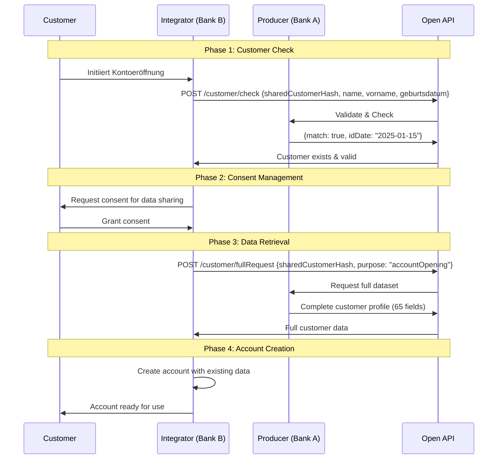
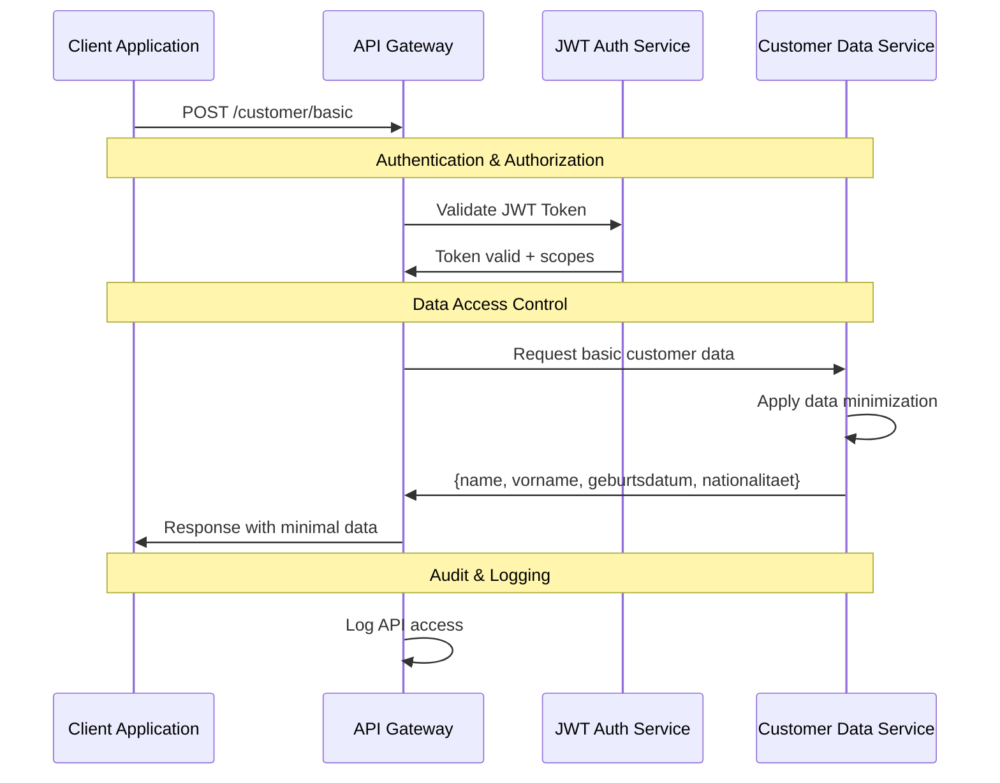
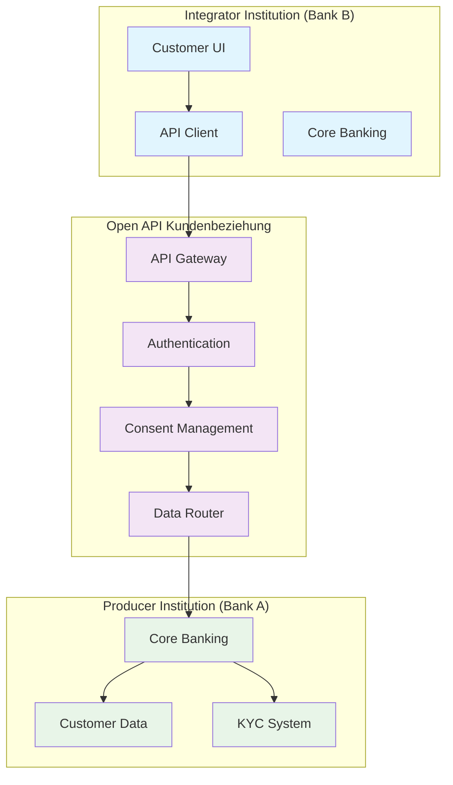
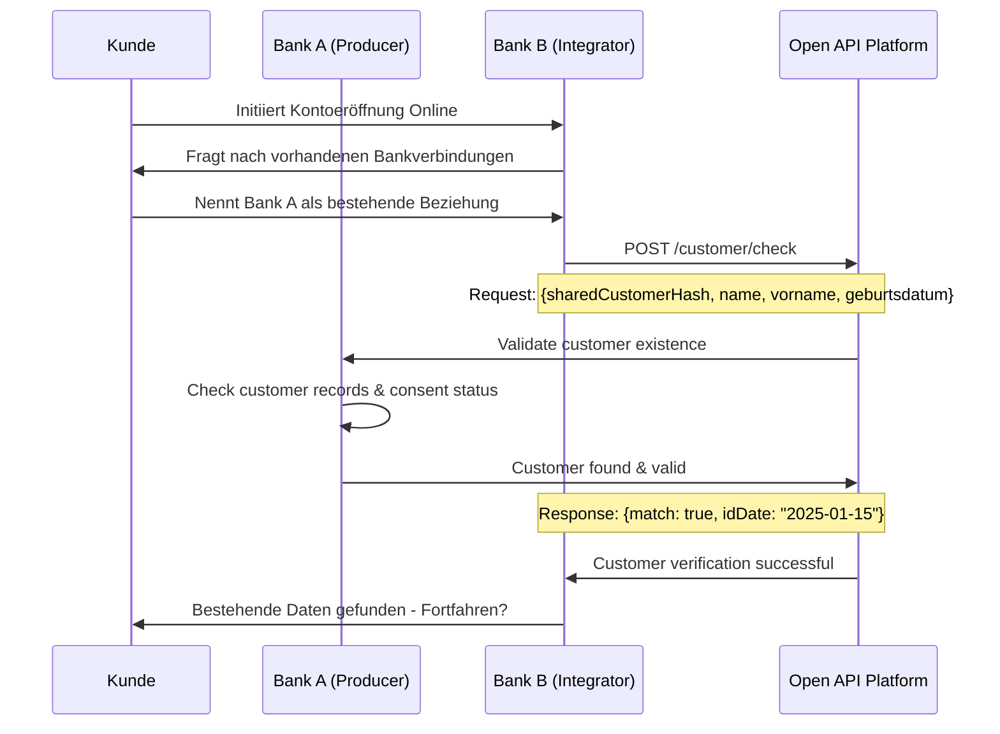
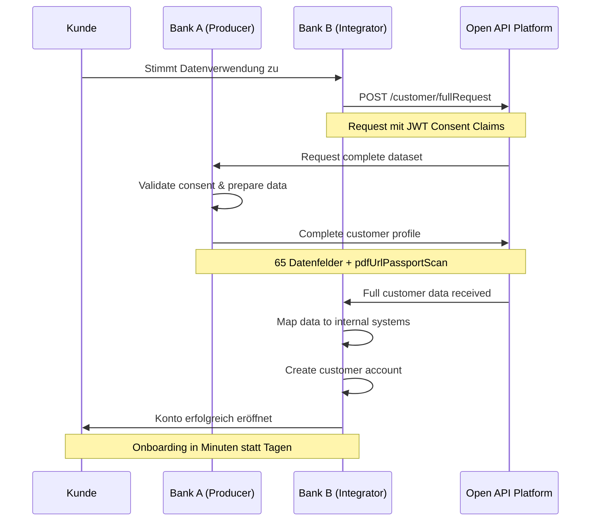

# OBP API Endpoint Design Conclusion

## Inhalt

1. [Executive Summary](#executive-summary)
2. [API-Architektur Übersicht](#api-architektur-übersicht)
3. [Hauptendpunkte](#hauptendpunkte)
4. [Granulare Daten-Endpunkte](#granulare-daten-endpunkte)
5. [Request/Response Strukturen](#requestresponse-strukturen)
6. [Implementierungsrichtlinien](#implementierungsrichtlinien)

---

## Executive Summary

Das API Endpoint Design für die Open API Kundenbeziehung folgt den OpenAPI 3.0 Standards und etabliert eine klare, RESTful Architektur für den sicheren Austausch von Kundendaten. Die API-Spezifikation konzentriert sich auf konzeptionelle Strukturen, während detaillierte technische Implementierungen in der separaten [API Codebase Dokumentation](/documentation/Umsetzung%20und%20Implementierung/) behandelt werden.

**Zentrale Designprinzipien:**
- OpenAPI 3.0 konforme Spezifikation für automatische Code-Generierung
- RESTful Design mit resource-orientierten URL-Strukturen  
- FAPI 2.0 Security Integration für Finanzdienstleistungen → [Siehe Conclusion Consent und Security Flow](./06%20Consent%20und%20Security%20Flow.md)
- Modulare Endpunkt-Architektur für flexible Use Case-Abdeckung

---

## API-Architektur übersicht

### Technische Grundlagen

**API-Standard:** RESTful Design nach OpenAPI 3.0 Specification
- JSON als primäres Datenformat für Interoperabilität
- HTTPS/TLS 1.3 mandatory für Transport Security
- HTTP/2 Support für Performance-Optimierung
- Semantic Versioning für API Evolution

**Design-Prinzipien:**
- **Resource-orientierte URLs:** Logische Datenstruktur-Mapping
- **HTTP-Verben:** Standard CRUD Operations (GET, POST, PUT, DELETE)
- **Statelessness:** Session-unabhängige Request/Response Cycles
- **Idempotenz:** Sichere Wiederholbarkeit für kritische Operations

### Sicherheitsarchitektur

**Authentication & Authorization:** → [Detaillierte Security-Implementierung siehe Conclusion Consent und Security Flow](./06%20Consent%20und%20Security%20Flow.md)
- FAPI 2.0 Security Profile für Financial APIs
- OAuth 2.0/OpenID Connect für standardisierte Authentifizierung
- JWT-basierte Access Tokens mit granularen Scopes
- Mutual TLS (mTLS) für kritische Partner-Integrationen

**API Gateway Integration:**
- Rate Limiting mit adaptiver Throttling-Logik
- Request Validation durch JSON Schema
- Response Caching mit ETags für Effizienz
- Comprehensive Monitoring und Audit Trails

---

## Hauptendpunkte

Basierend auf der finalen API-Spezifikation Version 2.0 aus der Workshop-Phase bietet die Open API Kundenbeziehung folgende Kernendpunkte:

### Customer Check API

#### `POST /customer/check`
**Zweck:** Existenz- und Identifikationsgültigkeitsprüfung
**HTTP Method:** POST
**Authentication:** JWT Header with Consent Claims

**Request (Hin):**
```json
{
  "sharedCustomerHash": "sha256_hash_value",
  "name": "Mustermann",
  "vorname": "Max", 
  "geburtsdatum": "1990-01-01"
}
```

**Response (Her):**
```json
{
  "match": true,
  "idDate": "2025-01-15"
}
```

### Full Customer Dataset API

#### `POST /customer/fullRequest`
**Zweck:** Vollständiger Kundendatensatz (≈ 65 Felder inkl. PDF-Dokumente)
**HTTP Method:** POST
**Authentication:** Header JWT (Consent-Claim)

**Request (Hin):**
```json
{
  "sharedCustomerHash": "sha256_hash_value",
  "purpose": "accountOpening"
}
```

**Response (Her):** Vollständiges Kundendatenset inkl. `pdfUrlPassportScan` und sämtliche KYC-Attribute

### Customer Identification API

#### `POST /customer/identification`
**Zweck:** Nur Identifikationsdaten abrufen
**HTTP Method:** POST
**Authentication:** JWT Header

**Request (Hin):**
```json
{
  "sharedCustomerHash": "sha256_hash_value"
}
```

**Response (Her):**
```json
{
  "identArt": "VideoIdent",
  "referenznummer": "VI_2025_001234",
  "ausstellungsdatum": "2025-01-15",
  "gueltigBis": "2035-01-15",
  "ausgestelltIn": "Schweiz",
  "pdfUrlPassportScan": "https://secure-storage.example.ch/docs/passport_scan_123.pdf"
}
```

---

## Granulare Daten-Endpunkte

Die API bietet granulare Endpunkte für spezifische Datensubsets, um minimale Datenübertragung und präzise Consent-Kontrolle zu ermöglichen:

### Basic Customer Data API

#### `POST /customer/basic`
**Zweck:** Nur Stammdaten (Name, Vorname, Geburtsdatum, Nationalität)
**HTTP Method:** POST

**Request (Hin):**
```json
{
  "sharedCustomerHash": "sha256_hash_value"
}
```

**Response (Her):**
```json
{
  "name": "Mustermann",
  "vorname": "Max",
  "geburtsdatum": "1990-01-01",
  "nationalitaet": "CH"
}
```

### Address Data API

#### `POST /customer/address`
**Zweck:** Nur Adressdaten (Haupt- & Korrespondenzadresse)
**HTTP Method:** POST

**Request (Hin):**
```json
{
  "sharedCustomerHash": "sha256_hash_value"
}
```

**Response (Her):**
```json
{
  "adresse": {
    "strasse": "Musterstrasse",
    "hausnummer": "123",
    "plz": "8001",
    "ort": "Zürich",
    "landcode": "CH"
  },
  "korrespondenz": {
    "strasse": "Postfach",
    "hausnummer": "456", 
    "plz": "8002",
    "ort": "Zürich",
    "landcode": "CH"
  }
}
```

### Contact Data API

#### `POST /customer/contact`
**Zweck:** Nur Kontaktdaten (Telefon, E-Mail)
**HTTP Method:** POST

**Request (Hin):**
```json
{
  "sharedCustomerHash": "sha256_hash_value"
}
```

**Response (Her):**
```json
{
  "telefonNum": "+41791234567",
  "email": "max.mustermann@example.ch"
}
```

### KYC Attributes API

#### `POST /customer/kyc`
**Zweck:** Nur KYC-Attribute ohne Ausweisdokumente
**HTTP Method:** POST

**Request (Hin):**
```json
{
  "sharedCustomerHash": "sha256_hash_value"
}
```

**Response (Her):**
```json
{
  "amlRisikoklasse": "niedrig",
  "pepTyp": "nein",
  "wirtschaftlich_berechtigt": "ja",
  "fatcaStatus": "nicht_us_person",
  "tin": "756.1234.5678.97"
}  
```

---

## Request/Response Strukturen

### Technische Spezifikationen

**API Version:** 2.0
**Standard:** OpenAPI 3.0 konforme Spezifikation
**Architektur:** RESTful API
**Datenformat:** JSON
**Sicherheit:** JWT-Token mit Consent-Claims
**Authentifizierung:** Header-basierte JWT-Übertragung

### Datenpunkte – Basic Dataset (Version 2.0)

Die Open API Kundenbeziehung Version 2.0 definiert folgende Kernstrukturen:

```json
{
  "customerId": "string - Interne Referenznummer der Bank",
  "sharedCustomerHash": "string - Anonymer Kundenidentifikator",
  "firstName": "string - Vorname des Kunden",
  "lastName": "string - Nachname des Kunden", 
  "dateOfBirth": "date - Geburtsdatum (YYYY-MM-DD)",
  "identificationDate": "date - Datum der Identifikation",
  "identificationMethod": "string - Methode (VideoIdent, E-ID, etc.)",
  "vsbStatus": "object - VSB-Status (Version, erfüllt/ausstehend)",
  "customerConsent": "boolean - Zustimmung zur Weitergabe",
  "consentValidUntil": "date - Gültigkeit der Zustimmung"
}
```

### sharedCustomerHash-Konzept

**Zweck:** Eindeutige, aber anonyme Identifikation von Kunden über Provider hinweg
**Implementation:** SHA-256 Hash von standardisierten Identitätsdaten
**Sicherheit:** Salt-based Hashing für zusätzliche Sicherheit
**Privacy:** GDPR-konform durch Pseudonymisierung

**Hash-Eingabedaten:**
```
hash_input = normalize(
  firstName + lastName + dateOfBirth + 
  placeOfBirth + nationality + salt
)
sharedCustomerHash = SHA256(hash_input)
```

---

## API Flow Diagramme

### Customer Onboarding Flow



### Granular Data Access Flow



### Trust Network Integration Flow



---

## Use Case: Onboarding Bank Implementation

### Szenario: Bankwechsel mit Open API Integration

**Ausgangslage:** Ein Kunde möchte von Bank A (Producer) zu Bank B (Integrator) wechseln und seine bestehenden, bereits verifizierten Kundendaten wiederverwenden.

**Akteure:**
- **Kunde:** Bankkunde mit bestehender Beziehung zu Bank A
- **Bank A (Producer):** Datenbereitstellende Bank mit vollständigem KYC
- **Bank B (Integrator):** Neue Bank, die Onboarding vereinfachen möchte
- **Open API:** Vermittlungssystem für sicheren Datenaustausch

### Detaillierte Implementierung

#### Phase 1: Customer Discovery & Verification



#### Phase 2: Consent Management & Data Request



### Technische Implementation Details

#### API Call Sequence für Bank Onboarding

**1. Customer Check:**
```json
POST /customer/check
{
  "sharedCustomerHash": "a1b2c3d4e5f6...",
  "name": "Müller", 
  "vorname": "Anna",
  "geburtsdatum": "1985-03-15"
}

Response:
{
  "match": true,
  "idDate": "2025-02-01"
}
```

**2. Full Data Request:**
```json
POST /customer/fullRequest
Header: JWT with consent claims
{
  "sharedCustomerHash": "a1b2c3d4e5f6...",
  "purpose": "accountOpening"
}

Response: 
{
  // 65+ Datenfelder aus gesamtunterlage Workshop-Spezifikation
  "personalData": {...},
  "addressData": {...},
  "identificationData": {...},
  "kycData": {...},
  "complianceData": {...}
}
```

### Business Impact Metriken

**Effizienzgewinn für Integrator Bank:**
- **Onboarding-Zeit:** Reduktion von 5-10 Tagen auf wenige Minuten
- **Dokumentensammlung:** 90% Reduktion des manuellen Aufwands
- **Compliance-Prüfungen:** Wiederverwendung bestehender KYC-Verfahren
- **Conversion Rate:** Erwartete Steigerung um 40-60%

**Kundenvorteile:**
- **Nahtloser Bankwechsel:** Keine erneute Dokumentenvorlage
- **Sofortige Kontoaktivierung:** Online-Abschluss möglich
- **Datenschutzkonforme Wiederverwendung:** Granulare Consent-Kontrolle

---

## Implementierungsrichtlinien

### Standard Request Headers
```http
Authorization: Bearer {jwt_access_token}
Content-Type: application/json
X-Request-ID: {unique_request_identifier}
X-Correlation-ID: {transaction_correlation_id}
Accept: application/json
```

### Standard Response Format
```json
{
  "status": "success",
  "timestamp": "2025-08-18T10:00:00Z",
  "requestId": "req_12345",
  "data": {
    // Response payload
  },
  "metadata": {
    "version": "1.0",
    "processingTime": "150ms",
    "dataSource": "primary_db"
  }
}
```

### Error Response Structure
```json
{
  "status": "error",
  "timestamp": "2025-08-18T10:00:00Z",
  "requestId": "req_12345",
  "error": {
    "code": "CUSTOMER_NOT_FOUND",
    "message": "Customer with provided hash not found",
    "details": "The sharedCustomerHash does not exist in our network",
    "retryable": false
  },
  "supportInfo": {
    "reference": "ERR_20250818_001",
    "documentation": "https://api-docs.obp.ch/errors/CUSTOMER_NOT_FOUND"
  }
}
```

### Pagination Structure
```json
{
  "data": [...],
  "pagination": {
    "page": 1,
    "pageSize": 50,
    "totalItems": 150,
    "totalPages": 3,
    "hasNext": true,
    "hasPrevious": false,
    "nextPage": "/v1/customers?page=2&pageSize=50",
    "previousPage": null
  }
}
```

---

## Implementierungsrichtlinien

### OpenAPI 3.0 Specification

**Dokumentationsstandards:**
- Vollständige API-Spezifikation in OpenAPI 3.0 YAML Format
- Automatische Code-Generierung für Client SDKs
- Interactive API Documentation mit Swagger UI
- Schema Validation für alle Request/Response Payloads

**Beispiel OpenAPI Definition:**
```yaml
openapi: 3.0.3
info:
  title: Open API Kundenbeziehung
  version: 1.0.0
  description: Standardized customer data exchange APIs
  contact:
    name: API Support Team
    url: https://support.obp.ch
    email: api-support@obp.ch

servers:
  - url: https://api.obp.ch/v1
    description: Production API Server
  - url: https://sandbox-api.obp.ch/v1
    description: Sandbox Environment

paths:
  /customer/check:
    get:
      summary: Check customer existence and validity
      operationId: checkCustomer
      security:
        - bearerAuth: []
      parameters:
        - name: sharedCustomerHash
          in: query
          required: true
          schema:
            type: string
            format: sha256
      responses:
        '200':
          description: Customer check successful
          content:
            application/json:
              schema:
                $ref: '#/components/schemas/CustomerCheckResponse'
```

### Sicherheits-Implementation

**FAPI 2.0 Compliance Checklist:**
- [ ] JWT Access Tokens mit Proof-of-Possession
- [ ] Certificate-bound Tokens für High-Value Transactions
- [ ] Request Object Encryption für Sensitive Data
- [ ] MTLS Authentication für Partner APIs
- [ ] PKCE für Public Client Applications

### Performance Guidelines

**Response Time Targets:**
- Authentication Endpoints: < 500ms
- Data Retrieval Endpoints: < 2000ms
- Data Modification Endpoints: < 3000ms
- Bulk Operations: < 10000ms

**Caching Strategy:**
- Static Data: 24 hours TTL
- Customer Profile Data: 1 hour TTL  
- Verification Status: 15 minutes TTL
- Real-time Data: No caching

### Development Best Practices

**API Versioning Strategy:**
- Semantic Versioning für API Evolution
- Backward Compatibility für mindestens 2 Major Versions
- Deprecation Notice Period: 6 Monate minimum
- Feature Flags für schrittweise Rollouts

**Testing Requirements:**
- Unit Tests für alle API Endpoints (>90% Coverage)
- Integration Tests mit Mock External Systems
- Contract Testing zwischen Producer/Consumer
- Load Testing für Performance Validation
- Security Testing mit OWASP API Security Guidelines → [Siehe Conclusion Testing und Verifikation](./08%20Testing%20und%20Verifikation.md)

Diese konzeptionelle API-Spezifikation bietet die Grundlage für die technische Implementation und wird kontinuierlich mit der separaten technischen Dokumentation synchronisiert, um eine konsistente und wartbare API-Architektur zu gewährleisten.

TODO: TZE bitte verifizieren!!

---

---

**Version:** 1.0  
**Datum:** August 2025  
**Status:** Konzeptionelle Spezifikation für technische Implementation

---

[Quellen und Referenzen](./Quellen%20und%20Referenzen.md)