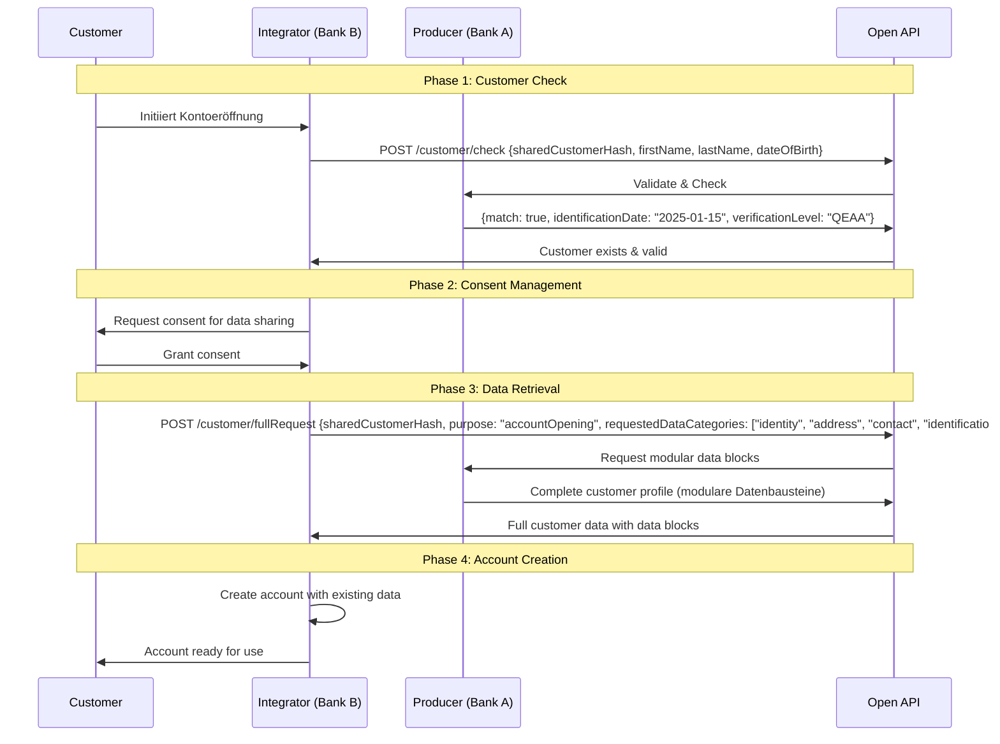
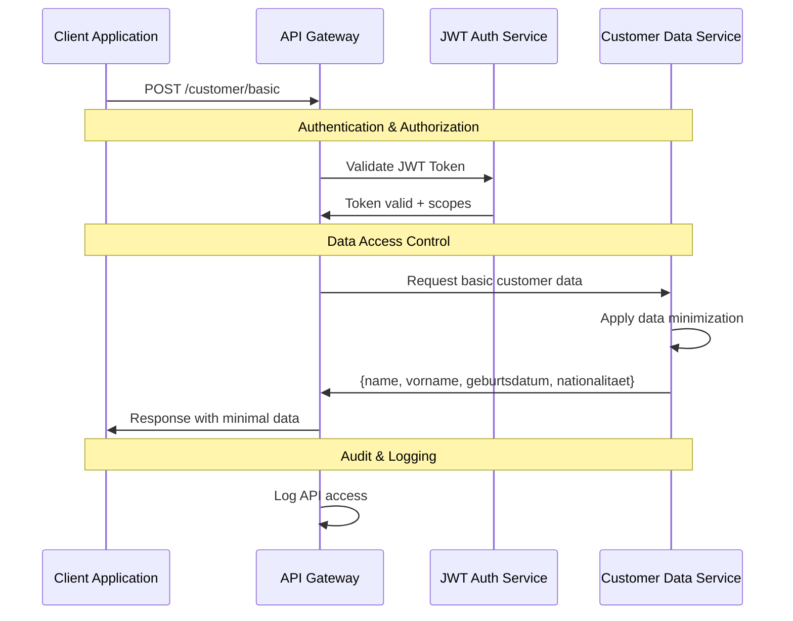
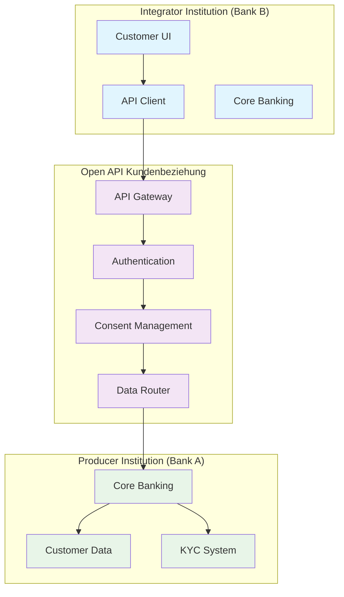

# OBP API Endpoint Design Conclusion

## Inhalt

1. [Executive Summary](#executive-summary)
2. [API-Architektur Übersicht](#api-architektur-übersicht)
3. [Hauptendpunkte](#hauptendpunkte)
4. [Granulare Daten-Endpunkte](#granulare-daten-endpunkte)
5. [Request/Response Strukturen](#requestresponse-strukturen)
6. [Implementierungsrichtlinien](#implementierungsrichtlinien)

---

## Executive Summary

Das API Endpoint Design für die Open API Kundenbeziehung folgt den OpenAPI 3.0 Standards und etabliert eine klare, RESTful Architektur für den sicheren Austausch von Kundendaten. Die API-Spezifikation konzentriert sich auf konzeptionelle Strukturen, während detaillierte technische Implementierungen in der separaten [API Codebase Dokumentation](/documentation/Umsetzung%20und%20Implementierung/) behandelt werden.

**Zentrale Designprinzipien:**
- OpenAPI 3.0 konforme Spezifikation für automatische Code-Generierung
- RESTful Design mit resource-orientierten URL-Strukturen  
- FAPI 2.0 Security Integration für Finanzdienstleistungen → [Siehe Conclusion Consent und Security Flow](./06%20Consent%20und%20Security%20Flow.md)
- Modulare Endpunkt-Architektur für flexible Use Case-Abdeckung

---

## API-Architektur übersicht

### Technische Grundlagen

**API-Standard:** RESTful Design nach OpenAPI 3.0 Specification
- JSON als primäres Datenformat für Interoperabilität
- HTTPS/TLS 1.3 mandatory für Transport Security
- HTTP/2 Support für Performance-Optimierung
- Semantic Versioning für API Evolution

**Design-Prinzipien:**
- **Resource-orientierte URLs:** Logische Datenstruktur-Mapping
- **HTTP-Verben:** Standard CRUD Operations (GET, POST, PUT, DELETE)
- **Statelessness:** Session-unabhängige Request/Response Cycles
- **Idempotenz:** Sichere Wiederholbarkeit für kritische Operations

### Sicherheitsarchitektur

**Authentication & Authorization:** → [Detaillierte Security-Implementierung siehe Conclusion Consent und Security Flow](./06%20Consent%20und%20Security%20Flow.md)
- FAPI 2.0 Security Profile für Financial APIs
- OAuth 2.0/OpenID Connect für standardisierte Authentifizierung
- JWT-basierte Access Tokens mit granularen Scopes
- Mutual TLS (mTLS) für kritische Partner-Integrationen

**API Gateway Integration:**
- Rate Limiting mit adaptiver Throttling-Logik
- Request Validation durch JSON Schema
- Response Caching mit ETags für Effizienz
- Comprehensive Monitoring und Audit Trails

---

## Hauptendpunkte

Basierend auf der finalen API-Spezifikation Version 2.0 aus der Workshop-Phase bietet die Open API Kundenbeziehung folgende Kernendpunkte:

### Customer Check API

#### `POST /customer/check`
**Zweck:** Existenz- und Identifikationsgültigkeitsprüfung
**HTTP Method:** POST
**Authentication:** JWT Header with Consent Claims

**Request (Hin):**
```json
{
  "sharedCustomerHash": "sha256_hash_value",
  "lastName": "Mustermann",
  "firstName": "Max", 
  "dateOfBirth": "1990-01-01"
}
```

**Response (Her):**
```json
{
  "match": true,
  "identificationDate": "2025-01-15",
  "verificationLevel": "QEAA",
  "lastUpdate": "2025-01-15T10:00:00Z"
}
```

### Full Customer Dataset API

#### `POST /customer/fullRequest`
**Zweck:** Vollständiger Kundendatensatz (≈ 65 Felder inkl. PDF-Dokumente)
**HTTP Method:** POST
**Authentication:** Header JWT (Consent-Claim)

**Request (Hin):**
```json
{
  "sharedCustomerHash": "sha256_hash_value",
  "purpose": "accountOpening",
  "requestedDataCategories": ["identity", "address", "contact", "identification", "kyc"]
}
```

**Response (Her):** Vollständiges Kundendatenset basierend auf den definierten Datenbausteinen des Referenzprozesses:
```json
{
  "personalData": {
    "title": "Herr",
    "firstName": "Max",
    "lastName": "Mustermann",
    "gender": "male",
    "dateOfBirth": "1990-01-01",
    "placeOfBirth": "Zürich",
    "nationality": ["CH"],
    "maritalStatus": "single"
  },
  "addressData": {
    "street": "Musterstrasse",
    "houseNumber": "123",
    "postalCode": "8001",
    "city": "Zürich",
    "country": "CH",
    "canton": "ZH"
  },
  "contactData": {
    "phoneNumber": "+41791234567",
    "emailAddress": "max.mustermann@example.ch",
    "preferredCommunication": "email"
  },
  "identificationData": {
    "identificationMethod": "VideoIdent",
    "documentType": "passport",
    "documentNumber": "123456789",
    "issuingAuthority": "Schweiz",
    "expiryDate": "2035-01-15",
    "verificationLevel": "QEAA",
    "verificationDate": "2025-01-15T10:00:00Z"
  },
  "kycData": {
    "economicBeneficiary": true,
    "taxDomicile": "CH",
    "usTaxLiability": false,
    "fatcaStatus": "non_us_person",
    "tin": "756.1234.5678.97",
    "amlRiskClass": "low",
    "pepStatus": "no"
  }
}
```

### Customer Identification API

#### `POST /customer/identification`
**Zweck:** Nur Identifikationsdaten abrufen
**HTTP Method:** POST
**Authentication:** JWT Header

**Request (Hin):**
```json
{
  "sharedCustomerHash": "sha256_hash_value"
}
```

**Response (Her):**
```json
{
  "identificationMethod": "VideoIdent",
  "referenceNumber": "VI_2025_001234",
  "verificationDate": "2025-01-15T10:00:00Z",
  "documentType": "passport",
  "documentNumber": "123456789",
  "issuingAuthority": "Schweiz",
  "expiryDate": "2035-01-15",
  "verificationLevel": "QEAA",
  "biometricVerification": {
    "livenessScore": 0.98,
    "faceMatchScore": 0.95,
    "documentAuthenticityScore": 0.97
  },
  "auditTrail": {
    "videoReference": "secure-storage.example.ch/audit/video_123.mp4",
    "documentScanReference": "secure-storage.example.ch/docs/passport_scan_123.pdf"
  }
}
```

### Process Flow APIs

**Basierend auf dem 10-stufigen Referenzprozess** → [Vollständige Prozessdetails und Business Logic in Conclusion 03 Referenzprozess](./03%20Referenzprozess.md)

Die folgenden API-Endpunkte implementieren die technischen Schnittstellen für den strukturierten Onboarding-Flow:

#### `POST /process/initialize`
**Zweck:** Schritt 1 - Initialisierung des Onboarding-Prozesses
**HTTP Method:** POST

**Request (Hin):**
```json
{
  "cookieConsent": true,
  "dataProcessingConsent": true,
  "selectedCountry": "CH",
  "serviceType": "bankAccount"
}
```

**Response (Her):**
```json
{
  "processId": "proc_12345",
  "status": "initialized",
  "nextStep": "selfDeclaration"
}
```

#### `POST /process/self-declaration`
**Zweck:** Schritt 3 - Selbstdeklaration für Compliance
**HTTP Method:** POST

**Request (Hin):**
```json
{
  "processId": "proc_12345",
  "economicBeneficiary": true,
  "taxDomicile": "CH",
  "usTaxLiability": false,
  "fatcaDeclaration": {
    "status": "non_us_person",
    "confirmed": true
  },
  "tin": "756.1234.5678.97",
  "sourceOfFunds": "employment",
  "nationalities": ["CH"]
}
```

#### `POST /process/background-checks`
**Zweck:** Schritt 7 - Background Checks und KYC-Prüfungen
**HTTP Method:** POST

**Request (Hin):**
```json
{
  "processId": "proc_12345",
  "checksRequested": ["sanction", "pep", "crime", "credit"],
  "riskLevel": "standard"
}
```

**Response (Her):**
```json
{
  "checksCompleted": {
    "sanctionCheck": "passed",
    "pepCheck": "passed",
    "crimeCheck": "passed",
    "creditCheck": "passed"
  },
  "riskAssessment": {
    "overallRisk": "low",
    "riskScore": 2,
    "factors": []
  },
  "complianceStatus": "approved"
}
```

#### `POST /process/contract-signature`
**Zweck:** Schritt 9 - Digitale Vertragsunterzeichnung
**HTTP Method:** POST

**Request (Hin):**
```json
{
  "processId": "proc_12345",
  "signatureType": "QES",
  "documentsToSign": ["terms_conditions", "privacy_policy", "product_agreement"],
  "signatureData": {
    "certificate": "-----BEGIN CERTIFICATE-----...",
    "timestamp": "2025-01-15T10:00:00Z",
    "deviceInfo": "browser_info"
  }
}
```

---

## Granulare Daten-Endpunkte

Die API bietet granulare Endpunkte für spezifische Datensubsets, um minimale Datenübertragung und präzise Consent-Kontrolle zu ermöglichen:

**Consent-basierte Datenzugriffskontrolle:** → [Detailed consent flow architectures and granular permission management in Conclusion 06 Consent und Security Flow](./06%20Consent%20und%20Security%20Flow.md)

### Basic Customer Data API

#### `POST /customer/basic`
**Zweck:** Nur Stammdaten (Name, Vorname, Geburtsdatum, Nationalität)
**HTTP Method:** POST

**Request (Hin):**
```json
{
  "sharedCustomerHash": "sha256_hash_value"
}
```

**Response (Her):**
```json
{
  "lastName": "Mustermann",
  "firstName": "Max",
  "dateOfBirth": "1990-01-01",
  "nationality": ["CH"],
  "gender": "male",
  "title": "Herr"
}
```

### Address Data API

#### `POST /customer/address`
**Zweck:** Nur Adressdaten (Haupt- & Korrespondenzadresse)
**HTTP Method:** POST

**Request (Hin):**
```json
{
  "sharedCustomerHash": "sha256_hash_value"
}
```

**Response (Her):**
```json
{
  "residentialAddress": {
    "addressType": "residential",
    "street": "Musterstrasse",
    "houseNumber": "123",
    "postalCode": "8001",
    "city": "Zürich",
    "country": "CH",
    "canton": "ZH",
    "validFrom": "2020-01-01"
  },
  "correspondenceAddress": {
    "addressType": "correspondence",
    "street": "Postfach",
    "houseNumber": "456", 
    "postalCode": "8002",
    "city": "Zürich",
    "country": "CH",
    "canton": "ZH",
    "validFrom": "2024-01-01"
  }
}
```

### Contact Data API

#### `POST /customer/contact`
**Zweck:** Nur Kontaktdaten (Telefon, E-Mail)
**HTTP Method:** POST

**Request (Hin):**
```json
{
  "sharedCustomerHash": "sha256_hash_value"
}
```

**Response (Her):**
```json
{
  "phoneNumber": "+41791234567",
  "mobileNumber": "+41791234567",
  "emailAddress": "max.mustermann@example.ch",
  "preferredChannel": "email",
  "verificationStatus": {
    "phoneVerified": true,
    "emailVerified": true,
    "lastVerification": "2025-01-15T10:00:00Z"
  }
}
```

### KYC Attributes API

#### `POST /customer/kyc`
**Zweck:** Nur KYC-Attribute ohne Ausweisdokumente
**HTTP Method:** POST

**Request (Hin):**
```json
{
  "sharedCustomerHash": "sha256_hash_value"
}
```

**Response (Her):**
```json
{
  "amlRiskClass": "low",
  "pepStatus": "no",
  "pepCategory": null,
  "economicBeneficiary": true,
  "fatcaStatus": "non_us_person",
  "tin": "756.1234.5678.97",
  "taxDomicile": "CH",
  "usTaxLiability": false,
  "sourceOfFunds": "employment",
  "riskAssessment": {
    "riskScore": 2,
    "riskFactors": [],
    "lastAssessment": "2025-01-15T10:00:00Z"
  }
}
```

---

## Request/Response Strukturen

### Technische Spezifikationen

**API Version:** 2.0
**Standard:** OpenAPI 3.0 konforme Spezifikation
**Architektur:** RESTful API
**Datenformat:** JSON
**Sicherheit:** JWT-Token mit Consent-Claims → [Complete JWT token architecture and consent claims structure in Conclusion 06](./06%20Consent%20und%20Security%20Flow.md#jwt-token-architektur-und-consent-claims)
**Authentifizierung:** Header-basierte JWT-Übertragung

### Datenpunkte – Modulare Datenbausteine (Version 2.0)

Die Open API Kundenbeziehung Version 2.0 definiert modulare Datenbausteine entsprechend dem Referenzprozess → [Siehe Conclusion Referenzprozess](./03%20Referenzprozess.md):

#### Baustein: Identität
```json
{
  "identity": {
    "personalData": {
      "title": "string - Anrede (Herr, Frau, etc.)",
      "firstName": "string - Vorname",
      "lastName": "string - Nachname",
      "gender": "string - Geschlecht",
      "dateOfBirth": "date - Geburtsdatum (YYYY-MM-DD)",
      "placeOfBirth": "string - Geburtsort",
      "nationality": "array - Staatsangehörigkeit(en)",
      "maritalStatus": "string - Zivilstand"
    },
    "verificationLevel": "string - QEAA|EAA|self-declared",
    "verificationDate": "datetime - Verifikationszeitpunkt",
    "verificationProvider": "string - Identity Service Provider"
  }
}
```

#### Baustein: Adresse
```json
{
  "address": {
    "addressType": "string - residential|correspondence|business",
    "street": "string - Strasse",
    "houseNumber": "string - Hausnummer",
    "postalCode": "string - Postleitzahl",
    "city": "string - Ort",
    "country": "string - Land (ISO Code)",
    "canton": "string - Kanton/Region",
    "validFrom": "date - Gültig ab",
    "validTo": "date - Gültig bis"
  }
}
```

#### Baustein: Kontakt
```json
{
  "contact": {
    "phoneNumber": "string - Telefonnummer",
    "mobileNumber": "string - Mobilnummer",
    "emailAddress": "string - E-Mail-Adresse",
    "preferredChannel": "string - email|sms|phone|app",
    "verificationStatus": "string - verified|pending|unverified"
  }
}
```

#### Baustein: Consent
**Consent Management Strukturen:** → [Complete consent data structures, JWT claims, and lifecycle management in Conclusion 06 Consent und Security Flow](./06%20Consent%20und%20Security%20Flow.md)

Basic consent reference structure:
```json
{
  "consentId": "uuid - Eindeutige Consent-ID", 
  "dataCategories": "array - Requested data categories",
  "purposes": "array - Data usage purposes",
  "status": "active|revoked|expired"
}
```

#### Baustein: KYC/Compliance
```json
{
  "kycData": {
    "economicBeneficiary": "boolean - Wirtschaftliche Berechtigung",
    "taxDomicile": "string - Steuerdomizil",
    "usTaxLiability": "boolean - US-Steuerpflicht",
    "fatcaStatus": "string - FATCA-Status",
    "tin": "string - Steuernummer (AHV-Nummer)",
    "amlRiskClass": "string - AML-Risikoklasse",
    "pepStatus": "string - PEP-Status",
    "sourceOfFunds": "string - Herkunft der Gelder",
    "riskAssessment": {
      "riskScore": "number - Risikoscore",
      "riskFactors": "array - Risikofaktoren",
      "lastAssessment": "datetime - Letzte Bewertung"
    }
  }
}
```

**Integration:** Diese Datenbausteine können einzeln oder kombiniert über die entsprechenden API-Endpunkte abgerufen werden, wodurch eine granulare und datenschutzkonforme Datenübertragung gewährleistet wird.

### sharedCustomerHash-Konzept

**Zweck:** Eindeutige, aber anonyme Identifikation von Kunden über Provider hinweg
**Implementation:** SHA-256 Hash von standardisierten Identitätsdaten
**Sicherheit:** Salt-based Hashing für zusätzliche Sicherheit
**Privacy:** GDPR-konform durch Pseudonymisierung

**Hash-Eingabedaten:**
```
hash_input = normalize(
  firstName + lastName + dateOfBirth + 
  placeOfBirth + nationality + salt
)
sharedCustomerHash = SHA256(hash_input)
```

---

## API Flow Diagramme

### Customer Onboarding Flow



### Granular Data Access Flow



### Trust Network Integration Flow



---

## Use Case Implementation

**Detailed implementation examples and technical integration patterns:** → [Complete use case implementations in Umsetzung und Implementierung](../Umsetzung%20und%20Implementierung/Use%20Case%20Implementation%20Examples.md)

The implementation guide covers:
- **Bank Onboarding:** Complete API call sequences and integration patterns
- **Customer Discovery & Verification:** Step-by-step technical implementation  
- **Consent Management & Data Request:** JWT-based consent flows
- **Business Impact Metrics:** Efficiency gains and customer benefits

---

## Implementierungsrichtlinien

### Standard Request Headers
```http
Authorization: Bearer {jwt_access_token}
Content-Type: application/json
X-Request-ID: {unique_request_identifier}
X-Correlation-ID: {transaction_correlation_id}
Accept: application/json
```

### Standard Response Format
```json
{
  "status": "success",
  "timestamp": "2025-08-18T10:00:00Z",
  "requestId": "req_12345",
  "data": {
    // Response payload
  },
  "metadata": {
    "version": "1.0",
    "processingTime": "sehr kurz",
    "dataSource": "primary_db"
  }
}
```

### Error Response Structure
```json
{
  "status": "error",
  "timestamp": "2025-08-18T10:00:00Z",
  "requestId": "req_12345",
  "error": {
    "code": "CUSTOMER_NOT_FOUND",
    "message": "Customer with provided hash not found",
    "details": "The sharedCustomerHash does not exist in our network",
    "retryable": false
  },
  "supportInfo": {
    "reference": "ERR_20250818_001",
    "documentation": "https://api-docs.obp.ch/errors/CUSTOMER_NOT_FOUND"
  }
}
```

### Pagination Structure
```json
{
  "data": [...],
  "pagination": {
    "page": 1,
    "pageSize": 50,
    "totalItems": 150,
    "totalPages": 3,
    "hasNext": true,
    "hasPrevious": false,
    "nextPage": "/v1/customers?page=2&pageSize=50",
    "previousPage": null
  }
}
```

---

### OpenAPI 3.0 Specification

**Dokumentationsstandards:**
- Vollständige API-Spezifikation in OpenAPI 3.0 YAML Format
- Automatische Code-Generierung für Client SDKs
- Interactive API Documentation mit Swagger UI
- Schema Validation für alle Request/Response Payloads

**Beispiel OpenAPI Definition:**
```yaml
openapi: 3.0.3
info:
  title: Open API Kundenbeziehung
  version: 1.0.0
  description: Standardized customer data exchange APIs
  contact:
    name: API Support Team
    url: https://support.obp.ch
    email: api-support@obp.ch

servers:
  - url: https://api.obp.ch/v1
    description: Production API Server
  - url: https://sandbox-api.obp.ch/v1
    description: Sandbox Environment

paths:
  /customer/check:
    get:
      summary: Check customer existence and validity
      operationId: checkCustomer
      security:
        - bearerAuth: []
      parameters:
        - name: sharedCustomerHash
          in: query
          required: true
          schema:
            type: string
            format: sha256
      responses:
        '200':
          description: Customer check successful
          content:
            application/json:
              schema:
                $ref: '#/components/schemas/CustomerCheckResponse'
```

### Sicherheits-Implementation

**FAPI 2.0 Implementation:** → [Complete FAPI 2.0 compliance specifications and security requirements in Conclusion 06 Consent und Security Flow](./06%20Consent%20und%20Security%20Flow.md)

### Performance Guidelines

**Response Time Targets:**
- Authentication Endpoints: Optimierte Antwortzeiten für Security Operations
- Data Retrieval Endpoints: Optimierte Antwortzeiten entsprechend Endpoint-Typ
- Data Modification Endpoints: Antwortzeiten für Transaktions-Operationen
- Bulk Operations: Antwortzeiten für komplexe Operationen

**Caching Strategy:**
- Static Data: Erweiterte Cache-Dauer
- Customer Profile Data: Moderate Cache-Dauer  
- Verification Status: Kurze Cache-Dauer
- Real-time Data: No caching

### Development Best Practices

**API Versioning Strategy:**
- Semantic Versioning für API Evolution
- Backward Compatibility für mindestens 2 Major Versions
- Deprecation Notice Period: 6 Monate minimum
- Feature Flags für schrittweise Rollouts

**Testing Requirements:**
- Unit Tests für alle API Endpoints mit hoher Testabdeckung
- Integration Tests mit Mock External Systems
- Contract Testing zwischen Producer/Consumer
- Load Testing für Performance Validation
- Security Testing mit OWASP API Security Guidelines → [Siehe Conclusion Testing und Verifikation](./08%20Testing%20und%20Verifikation.md)

Diese konzeptionelle API-Spezifikation bietet die Grundlage für die technische Implementation und wird kontinuierlich mit der separaten technischen Dokumentation synchronisiert, um eine konsistente und wartbare API-Architektur zu gewährleisten.


---

---

**Version:** 1.0  
**Datum:** August 2025  
**Status:** Konzeptionelle Spezifikation für technische Implementation

---

[Quellen und Referenzen](./Quellen%20und%20Referenzen.md)