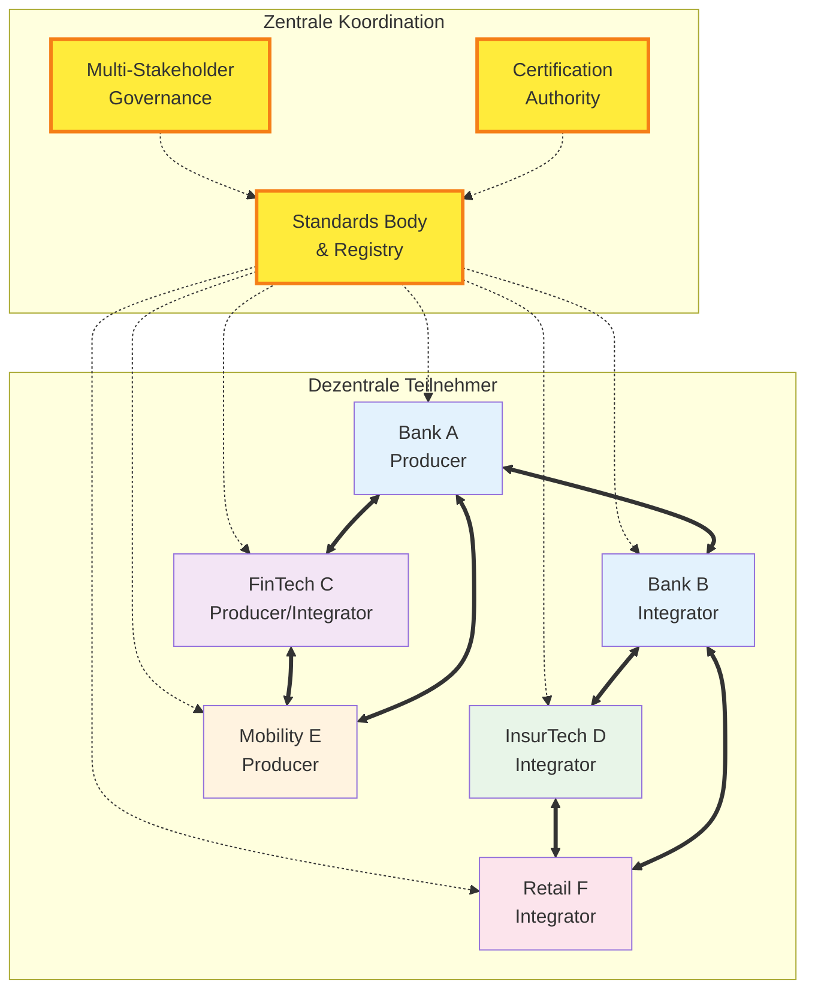
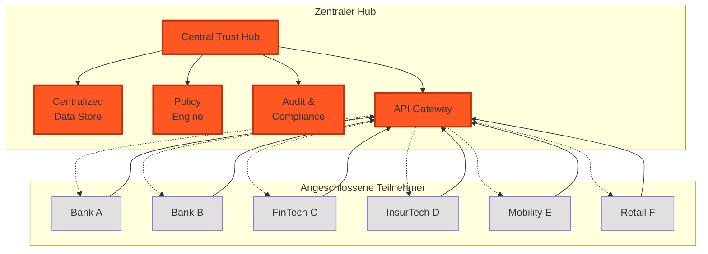
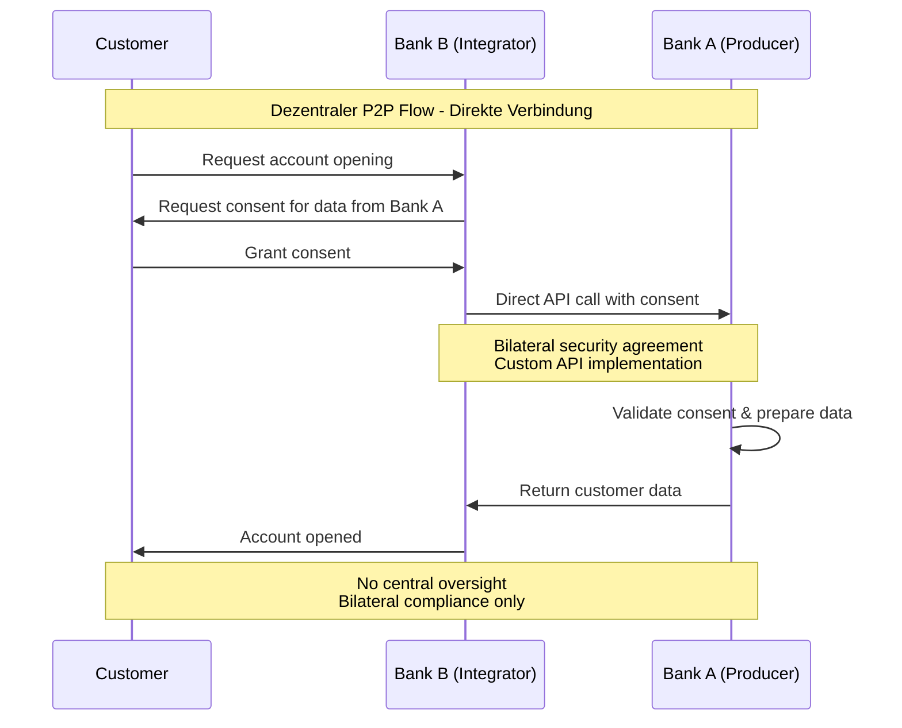
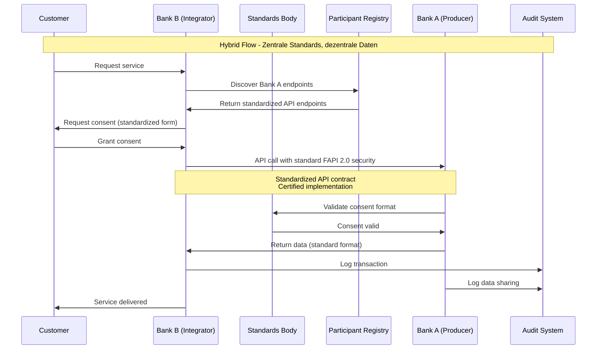
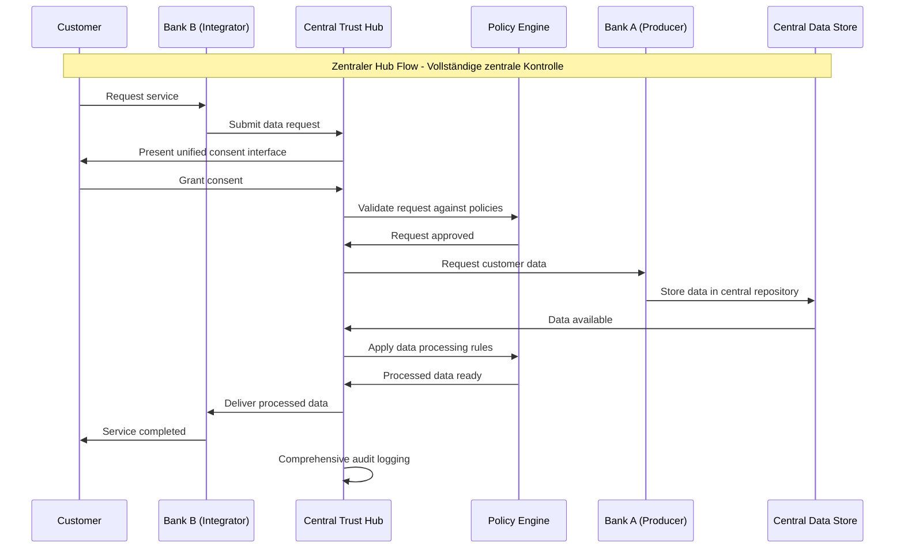
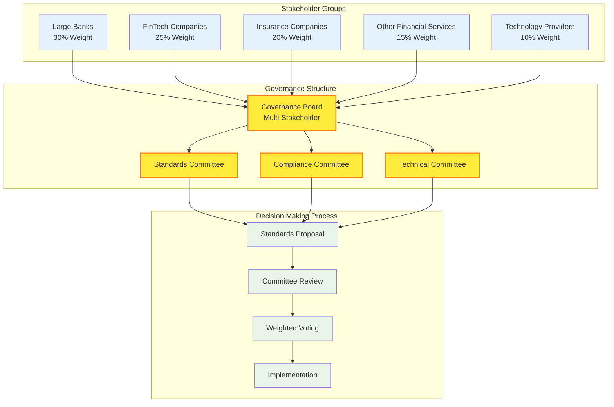

# OBP Vertrauensnetzwerk (Föderiertes System) Conclusion

## Inhalt

1. [Executive Summary](#executive-summary)
2. [Konzeptionelle Ausarbeitung - Definition und Scope](#konzeptionelle-ausarbeitung---definition-und-scope)
3. [Detaillierte übersicht der 3 Architektur-Modelle](#detaillierte-übersicht-der-3-architektur-modelle)
4. [Technische Rollen Definition und Matrix](#technische-rollen-definition-und-matrix)
5. [Governance-Infrastruktur](#governance-infrastruktur)
6. [Existierende Beispiele und Best Practices](#existierende-beispiele-und-best-practices)
7. [Fazit und Implikationen für die Schweiz](#fazit-und-implikationen-für-die-schweiz)

---

## Executive Summary

Das Vertrauensnetzwerk für die Open API Kundenbeziehung definiert eine föderierte Systemarchitektur (ein verteiltes System mit gemeinsamen Standards), die verschiedene Architekturmodelle unterstützt und schrittweise Evolution ermöglicht. Das **Hybrid-Modell** wird als präferierte Lösung für den Schweizer Kontext identifiziert, da es die optimale Balance zwischen dezentraler Autonomie und zentraler Koordination bietet.

**Zentrale Erkenntnisse:**
- Hybrid-Architektur kombiniert Vorteile von dezentraler und zentraler Organisation
- Skalierbare Evolution: Start dezentral ä Entwicklung zu hybrid ä optional zentral
- Multi-Stakeholder Governance-Framework ermöglicht koordinierte Marktentwicklung
- Technische Rollen-Matrix unterstützt flexible Teilnehmer-Integration

---

## Architektur-Modelle Übersicht

### Modell 1: Dezentrale Architektur (Peer-to-Peer)

```mermaid
graph TB
    subgraph "Dezentrale P2P Architektur"
        A[Bank A<br/>Producer]
        B[Bank B<br/>Integrator] 
        C[FinTech C<br/>Producer/Integrator]
        D[InsurTech D<br/>Integrator]
        E[Mobility E<br/>Producer]
        F[Retail F<br/>Integrator]
    end
    
    A <==> B
    A <==> C
    A <==> D
    A <==> E
    B <==> C
    B <==> D
    B <==> F
    C <==> D
    C <==> E
    C <==> F
    D <==> E
    D <==> F
    E <==> F
    
    classDef bank fill:#e3f2fd
    classDef fintech fill:#f3e5f5
    classDef insurance fill:#e8f5e8
    classDef mobility fill:#fff3e0
    classDef retail fill:#fce4ec
    
    class A,B bank
    class C fintech
    class D insurance  
    class E mobility
    class F retail
```

**Charakteristika:**
- ✅ Maximale Autonomie für jeden Teilnehmer
- ✅ Keine Single Points of Failure
- ❌ Exponentiell steigende Integrationskosten (n²)
- ❌ Fragmentierte Standards ohne Koordination

### Modell 2: Hybrid-Architektur (Präferierte Lösung)



**Charakteristika:**
- ✅ Zentrale Standards mit dezentraler Ausführung
- ✅ Multi-Stakeholder Governance  
- ✅ Skalierbare Koordination
- ✅ Balance zwischen Autonomie und Standards

### Modell 3: Zentrale Hub-Architektur



**Charakteristika:**
- ✅ Maximale Standardisierung und Kontrolle
- ✅ Zentrale Compliance und Audit
- ❌ Single Point of Failure Risiko
- ❌ Abhängigkeit von zentraler Organisation

### Evolution Path: Skalierbare Architektur-Entwicklung

```mermaid
flowchart LR
    Start([Start]) --> P2P[Dezentrale P2P<br/>Pilotprojekte<br/>Schneller Go-Live]
    
    P2P --> Decision1{Standards<br/>harmonisieren?}
    Decision1 -->|Ja| Hybrid[Hybrid-Architektur<br/>Zentrale Standards<br/>Dezentrale Daten]
    Decision1 -->|Nein| P2P
    
    Hybrid --> Decision2{Vollständige<br/>Zentralisierung?}
    Decision2 -->|Ja| Central[Zentrale Hub<br/>Maximum Control<br/>Single Authority]
    Decision2 -->|Nein| Hybrid
    
    Central --> End([Mature Ecosystem])
    Hybrid --> End
    
    classDef start fill:#e8f5e8
    classDef arch fill:#e3f2fd
    classDef decision fill:#fff3e0
    classDef end fill:#f3e5f5
    
    class Start,End start
    class P2P,Hybrid,Central arch
    class Decision1,Decision2 decision
```

---

## Konzeptionelle Ausarbeitung - Definition und Scope

### Vertrauensnetzwerk Definition

**Scope:** Föderierte Systemarchitektur für standardisierten, sicheren Datenaustausch zwischen verschiedenen Finanzdienstleistern und verwandten Branchen.

**Kernprinzipien:**
- **Interoperabilität:** Standardisierte Schnittstellen ermöglichen nahtlose Integration
- **Dezentrale Datenhoheit:** Daten verbleiben bei den urspränglichen Inhabern
- **Zentrale Standards:** Gemeinsame Protokolle und Governance-Regeln
- **Vertrauensbasierte Kooperation:** Kryptographische und rechtliche Sicherheitsmechanismen

### Abgrenzung verschiedener Systemansätze

#### Vertrauensnetzwerk vs. Zentrale Plattform
**Vertrauensnetzwerk (Föderiert):**
- Daten bleiben bei originären Anbietern
- Gemeinsame Standards, dezentrale Ausführung
- Multi-Provider Governance-Modell

**Zentrale Plattform:**
- Daten werden zentral gesammelt und gespeichert
- Single Provider kontrolliert Zugang und Regeln
- Erhöhte Abhängigkeitsrisiken

#### Vertrauensnetzwerk vs. Bilaterale Lösungen
**Vertrauensnetzwerk:**
- Standardisierte APIs für n:n Konnektivität
- Gemeinsame Governance und Compliance-Frameworks
- Skaleneffekte durch Netzwerkeffekte

**Bilaterale Lösungen:**
- Individual-Integrationen zwischen jeweils 2 Partnern
- Fragmentierte Standards und Governance
- Exponentieller Integrationsaufwand

### Swiss Context Anpassungen

**Schweizer Besonderheiten:**
- Starke Tradition in Datenschutz und Bankgeheimnis
- Kleinstrukturierter Bankensektor mit vielen regionalen Instituten
- Hohe Qualitäts- und Sicherheitsanspräche
- Regulatorisches Umfeld mit FINMA-Oversight

**Anpassungsanforderungen:**
- Swiss Banking Standards Integration
- E-ID Readiness und komplementäre Nutzung
- Mehrsprachigkeit (DE/FR/IT/EN)
- Compliance mit Schweizer Datenschutzgesetz (DSG)

---

## Detaillierte übersicht der 3 Architektur-Modelle

### Modell 1: Dezentrale Architektur (Peer-to-Peer)

#### Architektur-Charakteristika
**Struktur:** Direkte bilaterale Verbindungen zwischen allen Teilnehmern
```
Bank A ää Bank B
Bank A ää FinTech C
Bank B ää FinTech C
FinTech C ää InsurTech D
```

**Governance:** Keine zentrale Koordinationsinstanz, vollständig autonome Entscheidungen

**Vorteile:**
- Maximale Autonomie und Kontrolle für jeden Teilnehmer
- Keine Single Points of Failure
- Schnellster Go-Live ohne zentrale Koordination
- Geringste Abhängigkeiten von externen Organisationen

**Nachteile:**
- Exponentiell steigende Integrationskosten (n*(n-1)/2 Verbindungen)
- Fragmentierte Standards ohne Koordination
- Erschwerte Compliance und Audit-Prozesse
- Begrenzte Skalierbarkeit bei wachsender Teilnehmerzahl

**Use Cases:** Geeignet für kleine, geschlossene Gruppen mit ähnlichen Anforderungen

### Modell 2: Hybrid-Architektur (Präferierte Lösung)

#### Architektur-Charakteristika
**Struktur:** Zentrale Standards-Organisation mit dezentraler Datenhoheit
```
Standards-Body & Registry
        ä (Standards)
Bank A ää Bank B ää FinTech C ää InsurTech D
```

**Governance:** Multi-Stakeholder Governance mit zentraler Koordination für Standards

**Vorteile:**
- Optimale Balance zwischen Autonomie und Koordination
- Standardisierte APIs reduzieren Integrationsaufwand erheblich
- Skalierbare Erweiterung um neue Teilnehmer
- Zentrale Compliance-Frameworks mit dezentraler Umsetzung
- Flexible Evolution: kann zu zentralerer oder dezentralerer Struktur entwickelt werden

**Nachteile:**
- Moderate Komplexität bei Governance-Strukturen
- Notwendigkeit für Multi-Stakeholder-Koordination
- Initial Setup benötigt Zeit für Standards-Entwicklung

**Use Cases:** Ideal für Schweizer Finanzplatz mit verschiedenen Institutionstypen

#### Technical Implementation Details
**Standards-Organisation Aufgaben:**
- API-Spezifikation und -Versionierung
- Security Standards und Zertifizierung
- Teilnehmer-Registry und Discovery Services
- Compliance-Framework und Audit-Richtlinien
- Dispute Resolution Mechanismen

### Modell 3: Zentrale Architektur (Hub & Spoke)

#### Architektur-Charakteristika
**Struktur:** Alle Datenflässe über zentrale Plattform
```
     Central Hub Platform
    /    |    |    \
Bank A Bank B FinTech C InsurTech D
```

**Governance:** Zentrale Plattform-Organisation kontrolliert alle Aspekte

**Vorteile:**
- Einfachste Integration für Teilnehmer (nur 1:1 Verbindung)
- Zentrale Compliance und Monitoring
- Umfassende Analytics und Reporting-Möglichkeiten
- Einheitliche User Experience über alle Services

**Nachteile:**
- Single Point of Failure mit hohen Verfügbarkeitsrisiken
- Vendor Lock-in und hohe Abhängigkeit von zentraler Organisation
- Datenschutz- und Souveränitäts-Bedenken
- Hohe Markteintrittsbarrieren für neue Anbieter
- Regulatorische Konzentrations-Risiken

**Use Cases:** Geeignet für stark regulierte Umgebungen mit dominantem Marktakteur

### Präferierte Lösung: Hybrid-Modell Begründung

**Strategische Vorteile für Schweizer Kontext:**
1. **Kompatibilität mit Schweizer Bankentradition:** Dezentrale Datenhoheit respektiert etablierte Geschäftsmodelle
2. **Skalierbarkeit:** Standards ermöglichen efficient onboarding neuer Teilnehmer
3. **Innovation-Färderung:** Offene Standards schaffen level playing field für FinTechs
4. **Regulatory Alignment:** Multi-Stakeholder Governance entspricht FINMA-Präferenzen
5. **International Compatibility:** Hybrid-Modelle sind international bewährt (siehe UK, EU)

---

## Technische Rollen Definition und Matrix

### Kern-Rollen im Vertrauensnetzwerk

#### Data Producer (Dateninhaber)
**Definition:** Organisation, die originäre Kundendaten hält und über APIs bereitstellt

**Typische Akteure:** Banken, Versicherungen, Fintech-Unternehmen mit Kundenstamm

**Hauptfunktionen:**
- Sichere API-Endpunkte für Datenabfrage bereitstellen
- Consent Management und Customer Authorization
- Data Quality und Aktualität gewährleisten
- Compliance mit Datenschutz- und Sicherheitsstandards

**Technische Anforderungen:**
- FAPI 2.0 konforme API-Implementation
- OAuth 2.0/OIDC Integration für Authorization
- Real-time Consent Management Capabilities
- Audit Trail und Monitoring Integration

#### Data Consumer (Datennutzer)
**Definition:** Organisation, die Kundendaten für eigene Services konsumiert

**Typische Akteure:** Banken, FinTechs, InsurTechs, Service Provider

**Hauptfunktionen:**
- Sichere API-Integration für Datenabfrage
- Purpose-specific Data Processing mit Customer Consent
- Data Protection und Privacy-compliant Usage
- Integration in eigene Customer Journey

**Technische Anforderungen:**
- FAPI 2.0 Client Implementation
- Secure Token Management und Refresh Logic
- Data Minimization und Purpose Limitation
- Customer Communication über Data Usage

#### Trust Anchor (Vertrauensanker)
**Definition:** Zentrale Instanz für Standards, Zertifizierung und Registry-Services

**Typische Akteure:** Branchenorganisation, Standards-Body, Regulated Entity

**Hauptfunktionen:**
- API Standards Development und Maintenance
- Teilnehmer-Zertifizierung und -Registry
- Security Standards und Compliance Oversight
- Dispute Resolution und Governance Support

**Technische Anforderungen:**
- PKI Infrastructure für Certificate Management
- Registry Services für Participant Discovery
- Compliance Monitoring und Reporting Tools
- Standards Documentation und Developer Support

#### Technical Service Provider
**Definition:** Anbieter technischer Infrastruktur-Services für Netzwerk-Teilnehmer

**Typische Akteure:** Cloud Provider, API Gateway Anbieter, Security Specialists

**Hauptfunktionen:**
- API Gateway und Management Services
- Security-as-a-Service (Monitoring, Threat Detection)
- Compliance-as-a-Service (Audit, Reporting)
- Integration Support und Developer Tools

### Rollen-Matrix für verschiedene Architektur-Modelle

| Rolle | Dezentral | Hybrid | Zentral |
|-------|-----------|--------|---------|
| **Data Producer** | Direkte P2P APIs | Standard APIs via Registry | APIs zu Central Hub |
| **Data Consumer** | Direkte P2P Integration | Standard APIs via Registry | APIs zu Central Hub |
| **Trust Anchor** | Nicht vorhanden | Multi-Stakeholder Body | Central Platform Operator |
| **Technical Provider** | Bilateral Services | Standards-compliant Services | Hub-integrierte Services |

### Datenfluss-Diagramme für alle Architektur-Modelle

#### Dezentrale P2P Datenflüsse



#### Hybrid-Architektur Datenflüsse



#### Zentrale Hub Datenflüsse



### Governance-Flow Diagramme

#### Multi-Stakeholder Governance (Hybrid Model)



### Onboarding-Prozesse

#### Hybrid-Modell Onboarding (Präferiertes Szenario)

**Phase 1: Registration (1-2 Wochen)**
1. Antrag bei Trust Anchor mit Firmendetails und beabsichtigten Use Cases
2. Legal und Compliance Review (Regulatory Status, Financial Stability)
3. Technical Capability Assessment (API Readiness, Security Standards)
4. Participant Agreement Signature

**Phase 2: Technical Integration (2-4 Wochen)**
1. Sandbox Environment Access und API Documentation
2. Test API Implementation und Security Testing
3. Compliance Testing (FAPI 2.0, Data Protection, Consent Management)
4. Integration Testing mit ausgewählten Partnern

**Phase 3: Production Launch (1-2 Wochen)**
1. Production Environment Provisioning
2. Go-Live mit limitiertem Partner-Set
3. Monitoring und Performance Validation
4. Full Network Integration

**Gesamtdauer:** 4-8 Wochen (abhängig von Technical Readiness)

---

## Governance-Infrastruktur

### Zentrale Governance-Komponenten

#### Standards Development Organization (SDO)
**Zusammensetzung:** Multi-Stakeholder Gremium mit Vertretern von:
- Banken (Grossbanken, Kantonal-/Regionalbanken)
- FinTech Community Representatives
- InsurTech und andere Branchen-Vertreter
- Regulatory Observer (FINMA)
- Technical Experts und Akademische Vertreter

**Hauptaufgaben:**
- API Standards Definition und Evolution
- Security Requirements und Best Practices
- Compliance Framework Development
- Conflict Resolution zwischen Stakeholdern

#### Technical Standards Committee
**Fokus:** Detaillierte technische Spezifikationen und Implementation Guidelines

**Arbeitsgruppen:**
- API Design und Versioning
- Security und Authentication
- Data Models und Schema Design
- Integration Patterns und Performance

#### Compliance und Audit Board
**Fokus:** Regulatory Alignment und Risk Management

**Verantwortlichkeiten:**
- Compliance Framework Design
- Audit Standards und Procedures
- Risk Assessment und Mitigation
- Regulatory Liaison und Reporting

### Fäderative Anforderungen

#### Multi-Stakeholder Decision Making
**Voting Structure:** Weighted Voting basierend auf:
- Market Share (30%): Beräcksichtigung der Systemrelevanz
- Stakeholder Category (40%): Equal representation verschiedener Kategorien
- Technical Contribution (30%): Beräcksichtigung der technischen Beiträge

**Consensus Building:**
- 2/3 Majority für Standards Changes
- Simple Majority für Operational Decisions
- Unanimity für fundamental Governance Changes

#### Dezentrale Umsetzung bei zentralen Standards
**Principle:** "Specify Centrally, Implement Locally"

**Standards Centralization:**
- API Specifications (OpenAPI 3.0)
- Security Requirements (FAPI 2.0)
- Data Models (JSON Schemas)
- Compliance Frameworks

**Implementation Autonomy:**
- Technology Stack Choice
- Integration Approach
- Service Level Agreements
- Pricing Models

#### Network Effects und Incentive Alignment
**Positive Network Effects:**
- Increasing Value mit growing Participant Base
- Reduced Integration Costs durch Standards
- Enhanced Customer Choice und Service Quality

**Incentive Mechanisms:**
- Fee Structure basierend auf Network Usage
- Innovation Rewards für Technical Contributions
- Market Access Benefits für Compliance Excellence

---

## Existierende Beispiele und Best Practices

### Internationale Referenz-Implementationen

#### UK Open Banking Implementation Entity (OBIE)
**Architektur-Modell:** Hybrid (Standards + Dezentrale Implementation)

**Governance Structure:**
- Implementation Entity als Standards-Organisation
- Industry Stakeholder Groups für verschiedene Kategorien
- Regulatory Oversight durch Competition and Markets Authority (CMA)

**Lessons Learned:**
- Starke regulatorische Unterstätzung essential für Adoption
- Comprehensive Testing und Sandbox kritisch für Success
- Industry Engagement benötigt kontinuierliche Facilitation

**übertragbarkeit auf Schweiz:**
- Multi-Stakeholder Governance-Modell adaptierbar
- Standards-first Approach bewährt
- Regulatory Support durch FINMA erforderlich

#### Berlin Group NextGenPSD2
**Architektur-Modell:** Dezentral mit Industry Coordination

**Governance Structure:**
- Industry-led Working Groups
- Consensus-based Standards Development
- Voluntary Adoption mit Market-driven Implementation

**Lessons Learned:**
- Industry-led Standards können hohe Quality erreichen
- Voluntary Adoption führt zu fragmentierter Implementation
- Clear Governance Rules essential für productive Collaboration

**übertragbarkeit auf Schweiz:**
- Technical Standards-Entwicklung adaptierbar
- Governance-Mechanismen für Consensus Building relevant
- Hybrid-Approach mit mehr Coordination würde Fragmentation reduzieren

#### Australia Consumer Data Right (CDR)
**Architektur-Modell:** Zentral mit Regulatory Enforcement

**Governance Structure:**
- Australian Competition and Consumer Commission (ACCC) als Central Authority
- Data Standards Body für Technical Specifications
- Mandatory Participation für Major Players

**Lessons Learned:**
- Zentrale Coordination ermöglicht rapid Rollout
- Mandatory Approach sichert comprehensive Coverage
- High Compliance Costs für Participants
- Limited Innovation aufgrund rigid Standards

**übertragbarkeit auf Schweiz:**
- Zentrale Technical Standards-Entwicklung adaptierbar
- Mandatory Approach weniger suitable für Schweizer Kontext
- Regulatory Clarity von ACCC als Vorbild für FINMA

### Schweizer Vorreiter-Initiativen

#### bLink (SIX)
**Current State:** Multi-Banking Platform mit API-Integration

**Governance:** Zentrale Plattform unter SIX Betrieb

**Lessons Learned:**
- Etablierte Infrastruktur schafft Vertrauen
- Zentrale Plattform ermöglicht schnelle Integration
- Vendor Lock-in limitiert Flexibilität
- Innovation Cycle abhängig von Platform Roadmap

**Synergien mit OBP:**
- Complementary Services rather than Competitive
- bLink für Transaction Processing, OBP für Customer Data
- Potential Integration über standardisierte APIs

#### Swiss Fintech Innovation (SFTI) Initiativen
**Current State:** Verschiedene API Standards für spezifische Use Cases

**Governance:** Industry-led Working Groups

**Lessons Learned:**
- Domain-specific Standards können high Value schaffen
- Industry Coordination essentiell für Adoption
- Limited Scope begrenzt Network Effects
- Integration verschiedener Standards challenging

**Synergien mit OBP:**
- SFTI Standards als Input für OBP API Design
- Cross-referencing zwischen verschiedenen Standards
- Joint Governance-Strukturen zur Koordination

---

## Fazit und Implikationen für die Schweiz

### Strategische Empfehlungen

#### Hybrid-Modell als Optimal Path Forward
**Begründung:**
- Balance zwischen Innovation und Stability
- Respektiert Schweizer Tradition der dezentralen Banking-Struktur
- Ermöglicht internationale Interoperabilität
- Skalierbar für verschiedene Branchen-Segmente

**Implementation Roadmap:**
1. **Phase 1 (6 Monate):** Standards Development Organisation etablieren
2. **Phase 2 (12 Monate):** Core Standards finalisieren und Testing beginnen
3. **Phase 3 (18 Monate):** Pilot Implementation mit 5-8 Participants
4. **Phase 4 (24+ Monate):** Market Rollout und kontinuierliche Evolution

#### Governance-Struktur für Schweizer Kontext

**Multi-Stakeholder Board Zusammensetzung:**
- 40% Banking Sector (inkl. Grossbanken, Kantonalbanken, Regionalbanken)
- 25% FinTech/InsurTech Community
- 15% Technology Providers
- 10% Consumer Representatives
- 10% Academic/Research Institutions

**FINMA Integration:**
- Observer Status in Governance Board
- Regular Briefings über Standards Development
- Regulatory Guidance für Compliance Framework
- Support für International Standards Alignment

### Wettbewerbsvorteile durch Vertrauensnetzwerk

#### Market Differentiation
- **First-Mover Advantage:** Schweiz kann international leading Position etablieren
- **Quality Brand:** "Swiss Standards" für Financial Data Exchange
- **Innovation Hub:** Attraktion internationaler FinTech Investment

#### Operational Benefits
- **Reduced Integration Costs:** Standardisierte APIs eliminieren custom Integrations
- **Faster Time-to-Market:** Neue Services können rapid auf established Network aufbauen
- **Enhanced Security:** Shared Security Standards erhähen overall Network Security

### Risiko-Mitigation Strategien

#### Technical Risks
**Network Failure Scenarios:**
- **Mitigation:** Distributed Architecture ohne Single Points of Failure
- **Contingency:** Fallback zu bilateralen Agreements für kritische Services

**Standards Evolution Challenges:**
- **Mitigation:** Versioning Strategy mit Backward Compatibility
- **Contingency:** Migration Support und Extended Deprecation Periods

#### Business Risks
**Low Adoption Rates:**
- **Mitigation:** Strong Value Proposition und Incentive Programs
- **Contingency:** Regulatory Support für accelerated Adoption

**Regulatory Changes:**
- **Mitigation:** Close FINMA Liaison und proactive Compliance
- **Contingency:** Flexible Architecture für rapid Regulatory Adaptation

### Internationale Positionierung

#### European Integration
- **EU Standards Alignment:** Compatibility mit PSD2/PSD3 Frameworks
- **Cross-border Services:** Seamless Integration für EU Market Access
- **Regulatory Equivalence:** FINMA Coordination mit European Supervisors

#### Global Standards Contribution
- **ISO/IEC Participation:** Swiss Input in international Standards Development
- **FIDO Alliance Engagement:** Authentication Standards Leadership
- **OpenID Foundation:** Identity Management Standards Contribution

Das Hybrid-Vertrauensnetzwerk positioniert die Schweiz optimal für die digitale Transformation des Finanzsektors bei gleichzeitiger Wahrung der etablierten Werte von Sicherheit, Qualität und Kundenorientierung.

TODO: TZE bitte verifizieren!!

---

---

**Version:** 1.0  
**Datum:** August 2025  
**Status:** Final Draft für Stakeholder Review

---

[Quellen und Referenzen](./Quellen%20und%20Referenzen.md)