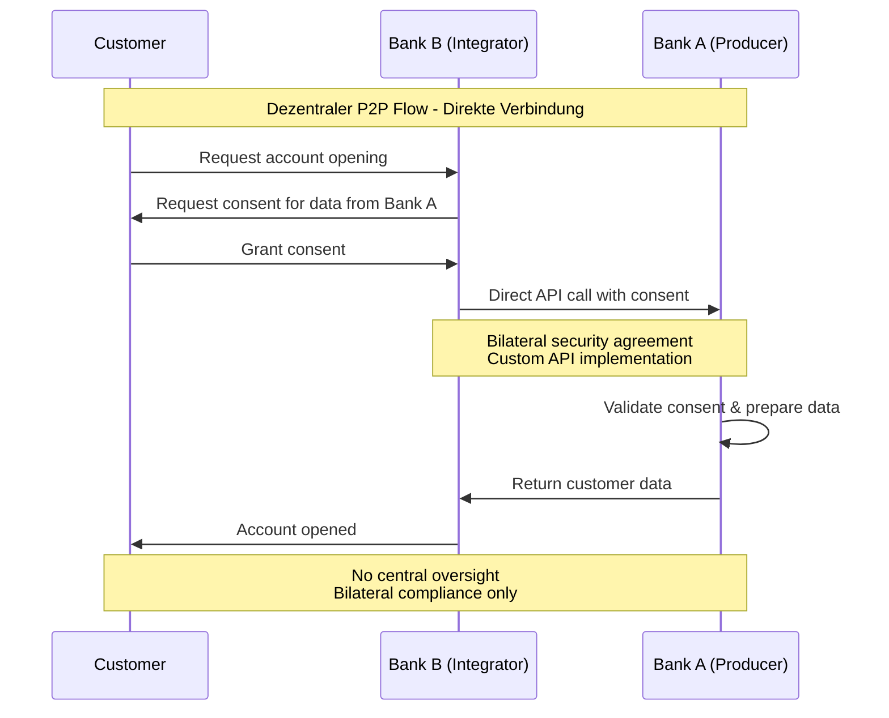
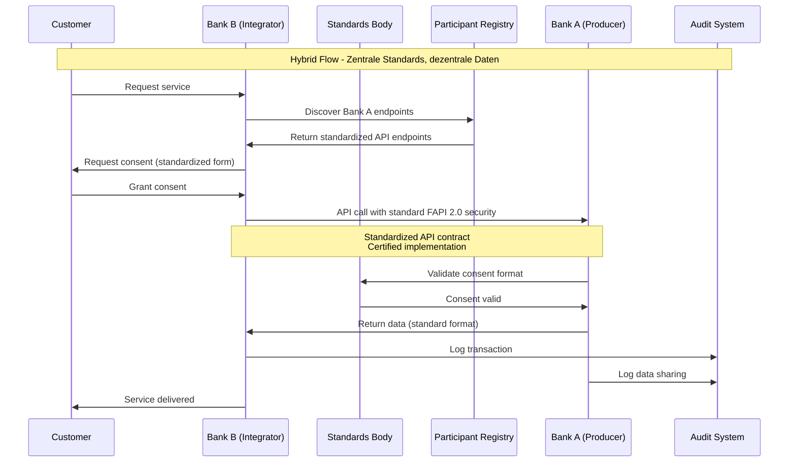

# OBP Vertrauensnetzwerk (Föderiertes System) Conclusion

## Inhalt

1. [Executive Summary](#executive-summary)
2. [Konzeptionelle Ausarbeitung - Definition und Scope](#konzeptionelle-ausarbeitung---definition-und-scope)
3. [Detaillierte Übersicht der 3 Architektur-Modelle](#detaillierte-übersicht-der-3-architektur-modelle)
4. [Technische Rollen Definition und Matrix](#technische-rollen-definition-und-matrix)
5. [Governance-Infrastruktur](#governance-infrastruktur)
6. [Existierende Beispiele und Best Practices](#existierende-beispiele-und-best-practices)
7. [Fazit und Implikationen für die Schweiz](#fazit-und-implikationen-für-die-schweiz)

---

## Executive Summary

Das Vertrauensnetzwerk für die Open API Kundenbeziehung definiert eine föderierte Systemarchitektur (ein verteiltes System mit gemeinsamen Standards), die verschiedene Architekturmodelle unterstützt und schrittweise Evolution ermöglicht. Das **Hybrid-Modell** wird als präferierte Lösung für den Schweizer Kontext identifiziert, da es die optimale Balance zwischen dezentraler Autonomie und zentraler Koordination bietet.

**Zentrale Erkenntnisse:**
- Hybrid-Architektur kombiniert Vorteile von dezentraler und zentraler Organisation
- Skalierbare Evolution: Start dezentral → Entwicklung zu hybrid → optional zentral
- Multi-Stakeholder Governance-Framework ermöglicht koordinierte Marktentwicklung
- Technische Rollen-Matrix unterstützt flexible Teilnehmer-Integration

---

## Vertrauensnetzwerk Definition

**Scope unseres Projektes:** Föderierte Systemarchitektur für standardisierten, sicheren Datenaustausch zwischen verschiedenen Finanzdienstleistern und verwandten Branchen.

### Abgrenzung verschiedener Systemansätze

| **Aspekt** | **Vertrauensnetzwerk (Föderiert)** | **Zentrale Plattform** | **Bilaterale Lösungen** |
|------------|-----------------------------------|------------------------|-------------------------|
| **Datenhaltung** | Bei originären Anbietern | Zentral gesammelt und gespeichert | Bei jedem Anbieter separat |
| **Standards** | Gemeinsame Standards, dezentrale Ausführung | Single Provider kontrolliert Standards | Fragmentierte Standards |
| **Governance** | Multi-Provider Governance-Modell | Single Provider kontrolliert Zugang und Regeln | Fragmentierte Governance |
| **Konnektivität** | Standardisierte APIs für n:n Konnektivität | Zentral vermittelte Konnektivität | Individual-Integrationen zwischen jeweils 2 Partnern |
| **Risiken** | Verteiltes Risiko durch Dezentralität | Erhöhte Abhängigkeitsrisiken | Exponentieller Integrationsaufwand |
| **Skalierung** | Skaleneffekte durch Netzwerkeffekte | Zentrale Skalierung mit Single Point of Failure | Quadratisches Wachstum der Integrationen |

### Swiss Context Anpassungen

**Schweizer Besonderheiten:**
- Starke Tradition in Datenschutz und Bankgeheimnis
- Kleinstrukturierter Bankensektor mit vielen regionalen Instituten
- Hohe Qualitäts- und Sicherheitsanspräche
- Regulatorisches Umfeld mit FINMA-Oversight

**Anpassungsanforderungen:**
- Swiss Banking Standards Integration
- E-ID Readiness und komplementäre Nutzung
- Mehrsprachigkeit (DE/FR/IT/EN)
- Compliance mit Schweizer Datenschutzgesetz (DSG)

---

## Architektur-Modelle Übersicht

**Grafische Darstellung:** Die vollständigen Architektur-Diagramme für alle drei Modelle sind verfügbar in der Dokumentation "Grafische Darstellung Open API Prozess" → [Siehe Resources/original sources/grafische_darstellung_open_api_prozess.md]

### Modell 1: Dezentrale Architektur (Peer-to-Peer)

**Konzeptionelle Architektur-Darstellung:**

Die dezentrale P2P-Architektur organisiert sich als vollständig vernetztes System ohne zentrale Koordinationsinstanz. Alle Teilnehmer sind gleichberechtigt und kommunizieren direkt miteinander:

- **Banken** (A, B): Agieren sowohl als Datenproducer als auch Integrator
- **FinTech** (C): Hybride Rolle als Producer und Integrator  
- **InsurTech** (D): Primär Integrator-Funktion
- **Mobility Provider** (E): Fokus auf Datenproduction
- **Retail Provider** (F): Primär Integrator-Funktion

**Verbindungsstruktur:** Jeder Teilnehmer unterhält direkte bilaterale Verbindungen zu allen anderen Teilnehmern, was zu einem vollständig vermaschten Netzwerk mit n*(n-1)/2 Verbindungen führt.

**Charakteristika:**

| **Vorteile** | **Nachteile** |
|---------------|----------------|
| **Hohe Autonomie**: Maximale Autonomie für jeden Teilnehmer | **Komplexe Integration**: Exponentiell steigende Integrationskosten (n²) |
| **Robustheit**: Keine Single Points of Failure | **Koordinationsprobleme**: Fragmentierte Standards ohne Koordination |

### Modell 2: Hybrid-Architektur (Präferierte Lösung)

**Konzeptionelle Architektur-Darstellung:**

Die Hybrid-Architektur kombiniert zentrale Koordination mit dezentraler Ausführung in einem zweischichtigen Modell:

**Zentrale Koordinationsebene:**
- **Standards Body & Registry**: Entwickelt und verwaltet API-Standards sowie Teilnehmer-Registry
- **Multi-Stakeholder Governance**: Koordiniert Entscheidungsfindung zwischen verschiedenen Interessensgruppen
- **Certification Authority**: Stellt Zertifizierungsservices und Compliance-Überwachung bereit

**Dezentrale Teilnehmerebene:**
Die gleichen Akteure wie im P2P-Modell (Banken, FinTech, InsurTech, Mobility, Retail) operieren autonom, jedoch nach einheitlichen Standards.

**Interaktionsmodell:**
- Zentrale Instanzen liefern Standards und Richtlinien an alle Teilnehmer
- Teilnehmer kommunizieren direkt miteinander, aber nach standardisierten Protokollen
- Weniger Verbindungen als P2P erforderlich, da Standards die Integration vereinfachen

**Charakteristika:**

| **Vorteile** | **Herausforderungen** |
|---------------|----------------------|
| **Standards-Koordination**: Zentrale Standards mit dezentraler Ausführung | **Governance-Komplexität**: Multi-Stakeholder Entscheidungsfindung erfordert Koordination |
| **Skalierbare Architektur**: Effiziente Koordination bei wachsender Teilnehmerzahl | **Implementierungs-Vielfalt**: Balance zwischen Standards und individueller Umsetzung |

### Modell 3: Zentrale Hub-Architektur

**Konzeptionelle Architektur-Darstellung:**

Die zentrale Hub-Architektur organisiert sich als Stern-Topologie mit einem zentralen Knotenpunkt, der alle Funktionalitäten und Datenflüsse koordiniert:

**Zentraler Hub-Komplex:**
- **Central Trust Hub**: Kernsystem für alle Netzwerkoperationen
- **Centralized Data Store**: Zentrale Datenhaltung aller Teilnehmerinformationen
- **Policy Engine**: Regelwerk-Management und Compliance-Enforcement
- **Audit & Compliance**: Zentrale Überwachung und Berichterstattung
- **API Gateway**: Einheitlicher Zugangspoint für alle externen Verbindungen

**Angeschlossene Teilnehmer:**
Alle Akteure (Banken A-B, FinTech C, InsurTech D, Mobility E, Retail F) sind ausschliesslich über den zentralen Hub verbunden.

**Kommunikationsmodell:**
- Alle Teilnehmer kommunizieren ausschliesslich über das API Gateway
- Keine direkten Peer-to-Peer-Verbindungen zwischen Teilnehmern
- Hub verarbeitet, validiert und leitet alle Datenanfragen weiter
- Zentrale Kontrolle und Überwachung aller Transaktionen

**Charakteristika:**

| **Vorteile** | **Nachteile** |
|---------------|----------------|
| **Umfassende Kontrolle**: Maximale Standardisierung und zentrale Steuerung | **Systemrisiko**: Single Point of Failure gefährdet gesamtes Netzwerk |
| **Einheitliche Compliance**: Zentrale Überwachung und Audit-Funktionen | **Abhängigkeitsrisiko**: Hohe Dependenz von zentraler Organisation |

---

## Technische Rollen Definition und Matrix

### Kern-Rollen im Vertrauensnetzwerk

#### Data Producer (Dateninhaber)
**Definition:** Organisation, die originäre Kundendaten hält und über APIs bereitstellt

**Typische Akteure:** Banken, Versicherungen, Fintech-Unternehmen mit Kundenstamm

**Hauptfunktionen:**
- Sichere API-Endpunkte für Datenabfrage bereitstellen
- Consent Management und Customer Authorization
- Data Quality und Aktualität gewährleisten
- Compliance mit Datenschutz- und Sicherheitsstandards

**Technische Anforderungen:**
- FAPI 2.0 konforme API-Implementation
- OAuth 2.0/OIDC Integration für Authorization
- Real-time Consent Management Capabilities
- Audit Trail und Monitoring Integration

#### Data Consumer (Datennutzer)
**Definition:** Organisation, die Kundendaten für eigene Services konsumiert

**Typische Akteure:** Banken, FinTechs, InsurTechs, Service Provider

**Hauptfunktionen:**
- Sichere API-Integration für Datenabfrage
- Purpose-specific Data Processing mit Customer Consent
- Data Protection und Privacy-compliant Usage
- Integration in eigene Customer Journey

**Technische Anforderungen:**
- FAPI 2.0 Client Implementation
- Secure Token Management und Refresh Logic
- Data Minimization und Purpose Limitation
- Customer Communication über Data Usage

#### Trust Anchor (Vertrauensanker)
**Definition:** Zentrale Instanz für Standards, Zertifizierung und Registry-Services

**Typische Akteure:** Branchenorganisation, Standards-Body, Regulated Entity

**Hauptfunktionen:**
- API Standards Development und Maintenance
- Teilnehmer-Zertifizierung und -Registry
- Security Standards und Compliance Oversight
- Dispute Resolution und Governance Support

**Technische Anforderungen:**
- PKI Infrastructure für Certificate Management
- Registry Services für Participant Discovery
- Compliance Monitoring und Reporting Tools
- Standards Documentation und Developer Support

#### Technical Service Provider
**Definition:** Anbieter technischer Infrastruktur-Services für Netzwerk-Teilnehmer

**Typische Akteure:** Cloud Provider, API Gateway Anbieter, Security Specialists

**Hauptfunktionen:**
- API Gateway und Management Services
- Security-as-a-Service (Monitoring, Threat Detection)
- Compliance-as-a-Service (Audit, Reporting)
- Integration Support und Developer Tools

### Rollen-Matrix für verschiedene Architektur-Modelle

| Rolle | Dezentral | Hybrid | Zentral |
|-------|-----------|--------|---------|
| **Data Producer** | Direkte P2P APIs | Standard APIs via Registry | APIs zu Central Hub |
| **Data Consumer** | Direkte P2P Integration | Standard APIs via Registry | APIs zu Central Hub |
| **Trust Anchor** | Nicht vorhanden | Multi-Stakeholder Body | Central Platform Operator |
| **Technical Provider** | Bilateral Services | Standards-compliant Services | Hub-integrierte Services |

### Datenfluss-Diagramme für Architektur-Modelle 1 & 2

#### Dezentrale P2P Datenflüsse

**Konzeptioneller Datenfluss:**

**Phase 1: Kundenanfrage**
Der Kunde stellt bei Bank B eine Kontoeröffnungsanfrage. Bank B benötigt zusätzliche Daten von Bank A und fordert entsprechende Kundeneinwilligung an.

**Phase 2: Direkte API-Kommunikation**
Bank B kommuniziert direkt mit Bank A über bilaterale Sicherheitsvereinbarungen und custom API-Implementierungen. Keine zentrale Überwachung oder standardisierte Protokolle.

**Phase 3: Datenverarbeitung**
Bank A validiert die Kundeneinwilligung eigenständig, bereitet die Daten auf und übermittelt sie direkt an Bank B.

**Phase 4: Serviceerbringung**
Bank B vervollständigt die Kontoeröffnung mit den erhaltenen Daten.

**Charakteristikum:** Vollständig bilaterale Compliance ohne zentrale Oversight-Instanz.

#### Hybrid-Architektur Datenflüsse

**Konzeptioneller Datenfluss:**

**Phase 1: Service Discovery**
Der Kunde stellt eine Serviceanfrage bei Bank B. Bank B nutzt die zentrale Participant Registry zur Ermittlung der standardisierten API-Endpoints von Bank A.

**Phase 2: Standardisierte Einwilligungsverfahren**
Bank B präsentiert dem Kunden standardisierte Einwilligungsformulare gemäss zentralen Vorgaben des Standards Body.

**Phase 3: Zertifizierte API-Kommunikation**
Bank B kommuniziert mit Bank A über standardisierte FAPI 2.0-Protokolle. Beide Implementierungen sind zertifiziert und folgen einheitlichen API-Verträgen.

**Phase 4: Zentrale Validierung**
Bank A validiert die Einwilligungsformate über das zentrale Standards Body und erhält Bestätigung der Gültigkeit.

**Phase 5: Koordinierte Datenübertragung**
Datenübertragung in standardisierten Formaten mit automatischem Logging in zentrale Audit-Systeme durch beide Parteien.

**Phase 6: Serviceerbringung**
Bank B erbringt den Service unter Verwendung der standardisiert übertragenen Daten.

**Charakteristikum:** Zentrale Standards mit dezentraler Datenhoheit und koordinierter Compliance-Überwachung.

## Governance-Infrastruktur

### Zentrale Governance-Komponenten

#### Standards Development Organization (SDO)
**Zusammensetzung:** Multi-Stakeholder Gremium mit Vertretern von:
- Banken (Grossbanken, Kantonal-/Regionalbanken)
- FinTech Community Representatives
- InsurTech und andere Branchen-Vertreter
- Regulatory Observer (FINMA)
- Technical Experts und Akademische Vertreter

**Hauptaufgaben:**
- API Standards Definition und Evolution
- Security Requirements und Best Practices
- Compliance Framework Development
- Conflict Resolution zwischen Stakeholdern

#### Technical Standards Committee
**Fokus:** Detaillierte technische Spezifikationen und Implementation Guidelines

**Arbeitsgruppen:**
- API Design und Versioning
- Security und Authentication
- Data Models und Schema Design
- Integration Patterns und Performance

#### Compliance und Audit Board
**Fokus:** Regulatory Alignment und Risk Management

**Verantwortlichkeiten:**
- Compliance Framework Design
- Audit Standards und Procedures
- Risk Assessment und Mitigation
- Regulatory Liaison und Reporting

### Föderative Anforderungen

#### Multi-Stakeholder Decision Making
**Voting Structure:** Weighted Voting basierend auf:
- Market Share: Berücksichtigung der Systemrelevanz
- Stakeholder Category: Equal representation verschiedener Kategorien
- Technical Contribution: Berücksichtigung der technischen Beiträge

**Consensus Building:**
- 2/3 Majority für Standards Changes
- Simple Majority für Operational Decisions
- Unanimity für fundamental Governance Changes

#### Dezentrale Umsetzung bei zentralen Standards
**Principle:** "Specify Centrally, Implement Locally"

**Standards Centralization:**
- API Specifications (OpenAPI 3.0)
- Security Requirements (FAPI 2.0)
- Data Models (JSON Schemas)
- Compliance Frameworks

**Implementation Autonomy:**
- Technology Stack Choice
- Integration Approach
- Service Level Agreements
- Pricing Models

#### Network Effects und Incentive Alignment
**Positive Network Effects:**
- Increasing Value mit growing Participant Base
- Reduced Integration Costs durch Standards
- Enhanced Customer Choice und Service Quality

**Incentive Mechanisms:**
- Fee Structure basierend auf Network Usage
- Innovation Rewards für Technical Contributions
- Market Access Benefits für Compliance Excellence

---

## Existierende Beispiele und Best Practices

Die detaillierte Analyse existierender Standards ist in der umfassenden internationalen Marktanalyse enthalten → [Siehe Conclusion Marktanalyse](./01%20Marktanalyse.md). 

**Referenz-Implementierungen für föderierte Systeme:**
- **UK Open Banking:** Hybrid-Modell mit zentralen Standards und dezentraler Ausführung
- **European PSD2/Berlin Group:** Industry-getriebenes föderiertes System
- **Singapore Financial Data Exchange:** Public-Private Partnership Ansatz

## Konzeptionelle Ausarbeitung - Definition und Scope

### Präferierte Lösung: Hybrid-Modell Begründung

**Kernprinzipien:**
- **Interoperabilität:** Standardisierte Schnittstellen ermöglichen nahtlose Integration
- **Dezentrale Datenhoheit:** Daten verbleiben bei den urspränglichen Inhabern
- **Zentrale Standards:** Gemeinsame Protokolle und Governance-Regeln
- **Vertrauensbasierte Kooperation:** Kryptographische und rechtliche Sicherheitsmechanismen

**Strategische Vorteile für Schweizer Kontext:**
1. **Kompatibilität mit Schweizer Bankentradition:** Dezentrale Datenhoheit respektiert etablierte Geschäftsmodelle
2. **Skalierbarkeit:** Standards ermöglichen efficient onboarding neuer Teilnehmer
3. **Innovation-Förderung:** Offene Standards schaffen level playing field für FinTechs
4. **Regulatory Alignment:** Multi-Stakeholder Governance entspricht FINMA-Präferenzen
5. **International Compatibility:** Hybrid-Modelle sind international bewährt (siehe UK, EU)

### Evolution Path: Skalierbare Architektur-Entwicklung

**Konzeptioneller Entwicklungspfad:**

Die Architektur-Evolution folgt einem systematischen Pfad mit definierten Entscheidungspunkten:

**Phase 1: Dezentrale P2P-Pilotprojekte**
- Ausgangspunkt für schnellen Go-Live
- Bilaterale Vereinbarungen zwischen wenigen Teilnehmern
- Minimale Koordinationsanforderungen

**Milestone: Standards harmonisieren**
- Evolution zur Hybrid-Architektur mit zentralen Standards aber dezentraler Datenhoheit

**Phase 2: Hybrid-Architektur**
- Zentrale Standards-Entwicklung bei dezentraler Ausführung
- Multi-Stakeholder-Governance etablieren
- Skalierbare Teilnehmer-Integration

**Ziel: Ausgereiftes Ecosystem mit Hybrid-Architektur**

---

## Fazit und Implikationen für die Schweiz

### Strategische Empfehlungen

#### Hybrid-Modell als Optimal Path Forward
**Begründung:**
- Balance zwischen Innovation und Stability
- Respektiert Schweizer Tradition der dezentralen Banking-Struktur
- Ermöglicht internationale Interoperabilität
- Skalierbar für verschiedene Branchen-Segmente

**Implementation Roadmap:** → [Siehe Master ROADMAP.md](../ROADMAP.md)

**Governance-spezifische Phasen:**
- **Phase 1:** Standards Development Organisation etablieren, Governance Framework
- **Phase 2:** Core Standards finalisieren, Pilot Implementation  
- **Phase 3:** Market Rollout mit kontinuierlicher Governance Evolution

#### Governance-Struktur für Schweizer Kontext

**Multi-Stakeholder Board Zusammensetzung:**
- Banking Sector (inkl. Grossbanken, Kantonalbanken, Regionalbanken)
- FinTech/InsurTech Community
- Technology Providers
- Consumer Representatives
- Academic/Research Institutions

**FINMA Integration:**
- Observer Status in Governance Board
- Regular Briefings über Standards Development
- Regulatory Guidance für Compliance Framework
- Support für International Standards Alignment

### Wettbewerbsvorteile durch Vertrauensnetzwerk

#### Market Differentiation
- **First-Mover Advantage:** Schweiz kann international leading Position etablieren
- **Quality Brand:** "Swiss Standards" für Financial Data Exchange
- **Innovation Hub:** Attraktion internationaler FinTech Investment

#### Operational Benefits
- **Reduced Integration Costs:** Standardisierte APIs eliminieren individuelle Integrationen
- **Faster Time-to-Market:** Neue Services können schnell auf etabliertes Netzwerk aufbauen
- **Enhanced Security:** Geteilte Sicherheitsstandards erhöhen die gesamte Netzwerksicherheit

### Risiko-Mitigation Strategien

#### Technical Risks
**Network Failure Scenarios:**
- **Mitigation:** Distributed Architecture ohne Single Points of Failure
- **Contingency:** Fallback zu bilateralen Agreements für kritische Services

**Standards Evolution Challenges:**
- **Mitigation:** Versioning Strategy mit Backward Compatibility
- **Contingency:** Migration Support und Extended Deprecation Periods

#### Business Risks
**Low Adoption Rates:**
- **Mitigation:** Strong Value Proposition und Incentive Programs
- **Contingency:** Regulatory Support für accelerated Adoption

**Regulatory Changes:**
- **Mitigation:** Close FINMA Liaison und proactive Compliance
- **Contingency:** Flexible Architecture für rapid Regulatory Adaptation

### Internationale Positionierung

#### European Integration
- **EU Standards Alignment:** Compatibility mit PSD2/PSD3 Frameworks
- **Cross-border Services:** Seamless Integration für EU Market Access
- **Regulatory Equivalence:** FINMA Coordination mit European Supervisors

#### Global Standards Contribution
- **ISO/IEC Participation:** Swiss Input in international Standards Development
- **FIDO Alliance Engagement:** Authentication Standards Leadership
- **OpenID Foundation:** Identity Management Standards Contribution

Das Hybrid-Vertrauensnetzwerk positioniert die Schweiz optimal für die digitale Transformation des Finanzsektors bei gleichzeitiger Wahrung der etablierten Werte von Sicherheit, Qualität und Kundenorientierung.

---

**Version:** 1.0  
**Datum:** August 2025  
**Status:** Final Draft für Review

---

[Quellen und Referenzen](./Quellen%20und%20Referenzen.md)
