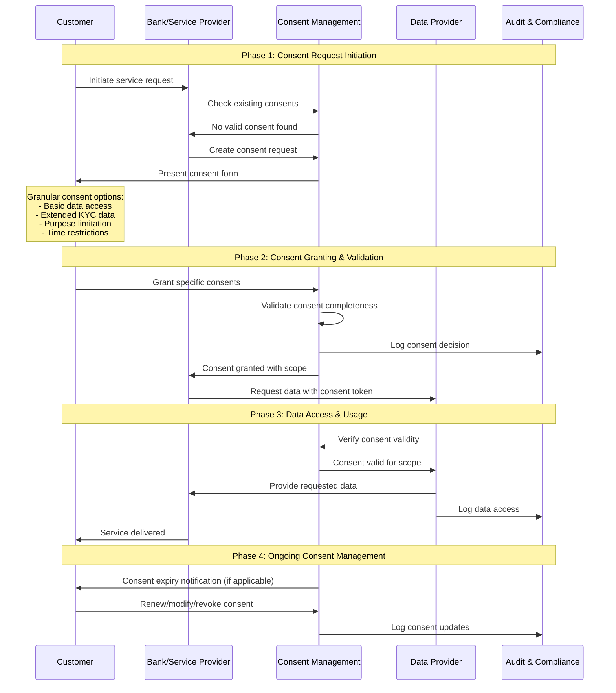
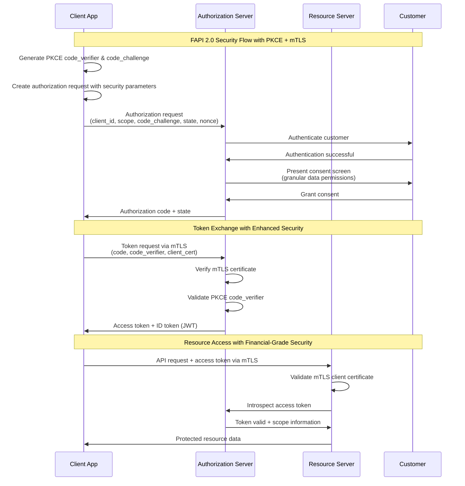
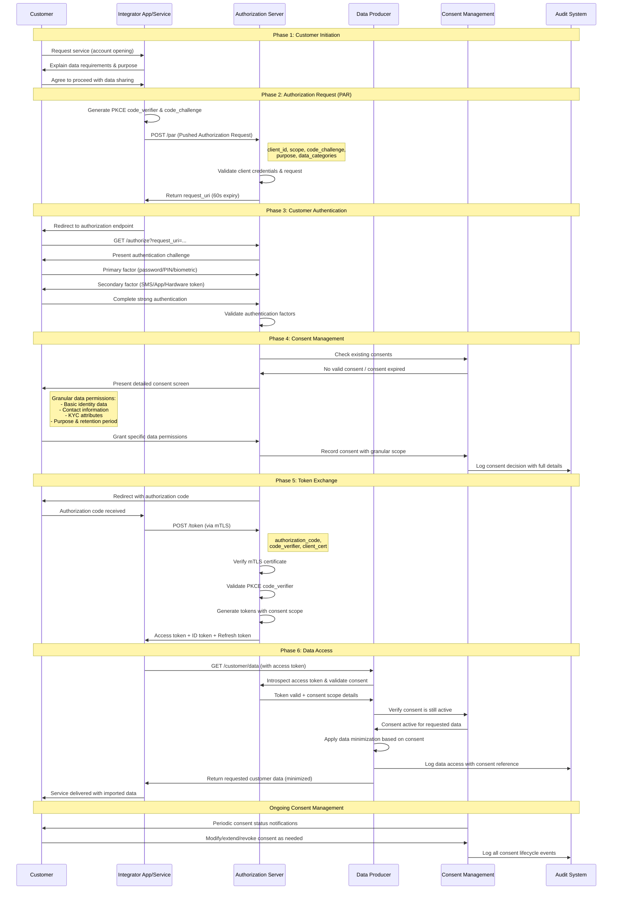
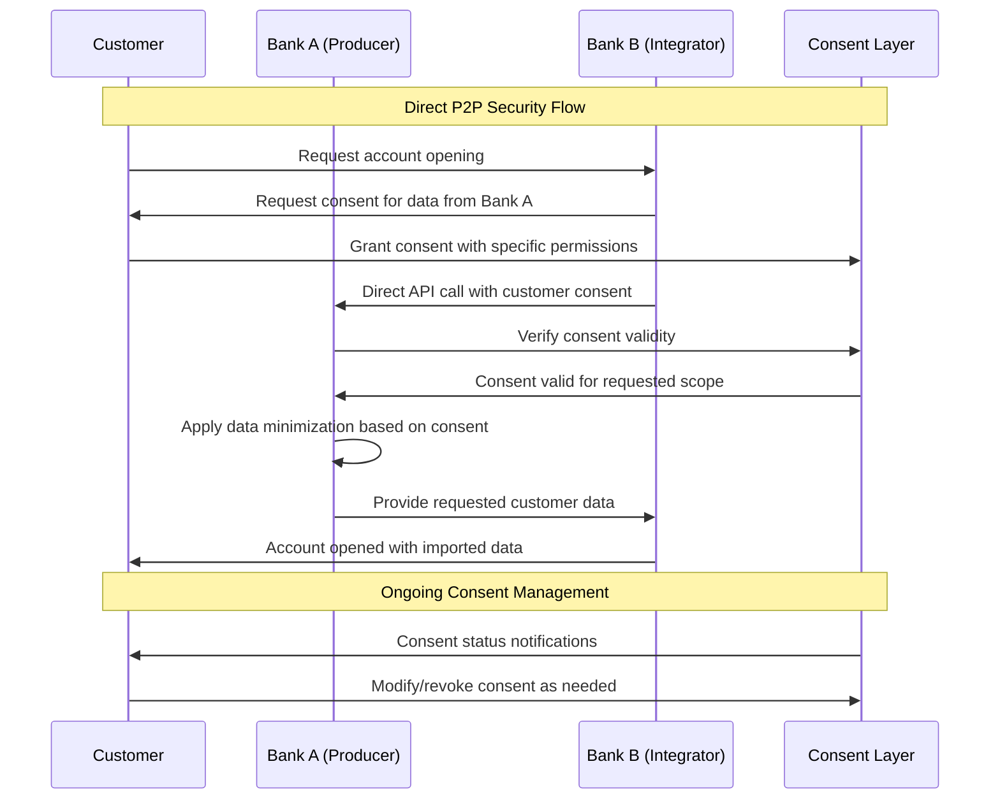
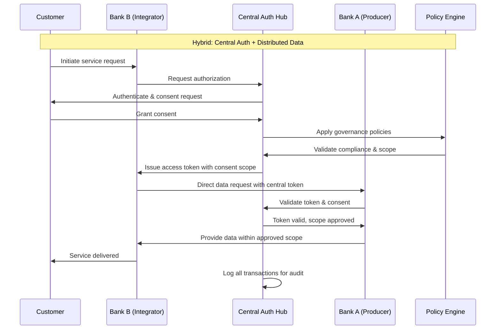
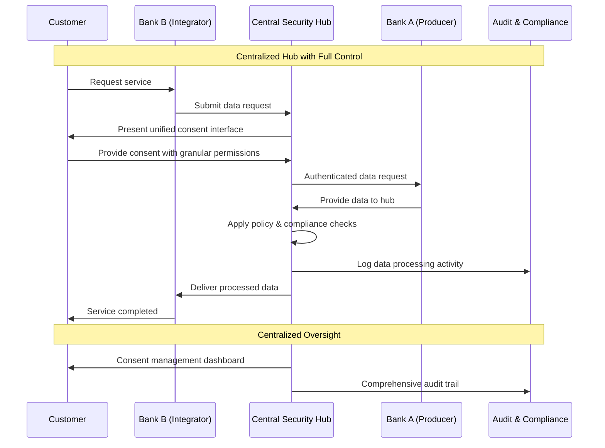
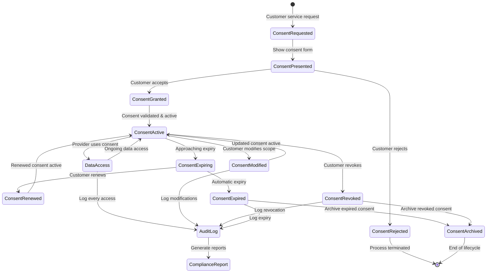
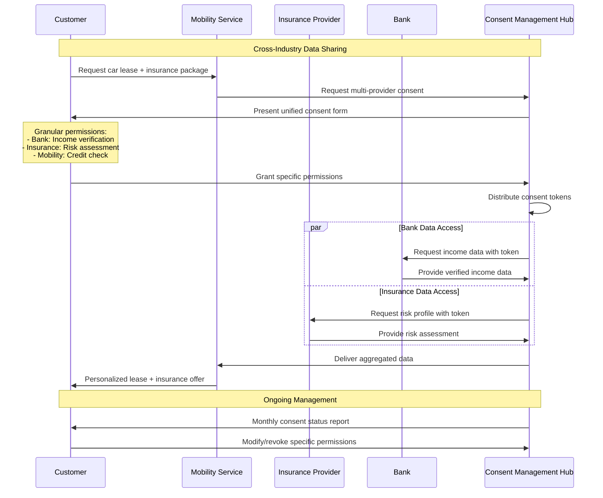
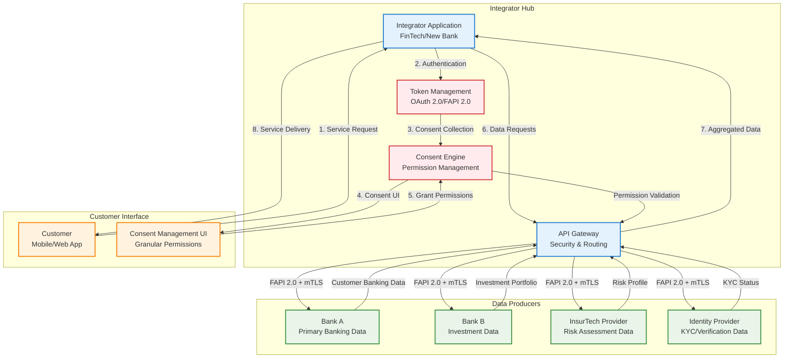

# OBP Consent und Security Flow Conclusion

## Inhalt

1. [Executive Summary](#executive-summary)
2. [Grundlagen und Scope des Security-Frameworks](#grundlagen-und-scope-des-security-frameworks)
3. [Security Standards Evaluation](#security-standards-evaluation)
4. [Consent-Flow-Architekturen](#consent-flow-architekturen)
5. [JWT-Token Architektur und Consent Claims](#jwt-token-architektur-und-consent-claims)
6. [Begründete Standard-Auswahl: FAPI 2.0, OAuth2, OIDC](#begründete-standard-auswahl-fapi-20-oauth2-oidc)
7. [Consent und Security Flow Implementation](#consent-und-security-flow-implementation)
8. [Integration Patterns](#integration-patterns)
9. [Compliance und Regulatory Alignment](#compliance-und-regulatory-alignment)
10. [Fazit und Roadmap](#fazit-und-roadmap)

---

## Executive Summary

Das Consent und Security Flow Framework etabliert eine FAPI 2.0-konforme Security-Architektur für Open API Kundenbeziehung, die generisch und unabhängig vom gewählten Vertrauensnetzwerk-Modell funktioniert. Das Framework basiert auf bewährten Standards (FAPI 2.0, OAuth 2.0, OpenID Connect) und bietet robuste Sicherheitsmechanismen mit granularer Consent-Verwaltung.

**Zentrale Designprinzipien:**
- Network-agnostisches Security Framework für alle Architektur-Modelle
- FAPI 2.0 compliance für Financial-grade API Security
- Granulare Consent-Management mit Customer Control
- Sequence Diagram-basierte Implementation für Business Stakeholder Verständnis

---

## Consent und Security Flow Diagramme

### Generic Consent Management Flow



### FAPI 2.0 Security Implementation



### JWT Token Architecture & Claims

```mermaid
graph TB
    subgraph "JWT Token Structure"
        Header[Header<br/>alg: RS256<br/>typ: JWT<br/>kid: key-id]
        Payload[Payload<br/>Standard Claims<br/>Custom Claims<br/>Consent Claims]
        Signature[Signature<br/>RSA256<br/>Private Key Signed]
    end
    
    subgraph "Standard Claims"
        ISS[iss: issuer]
        SUB[sub: subject]  
        AUD[aud: audience]
        EXP[exp: expiration]
        IAT[iat: issued at]
        JTI[jti: JWT ID]
    end
    
    subgraph "Consent Claims"
        PURPOSE[purpose: account_opening]
        SCOPE[scope: basic_data kyc_data]
        CUSTOMER[customer_hash: sha256_hash]
        CONSENT_ID[consent_id: unique_id]
        CONSENT_EXP[consent_expires: timestamp]
    end
    
    subgraph "Custom Claims"
        INSTITUTION[requesting_institution: bank_id]
        USE_CASE[use_case: customer_onboarding]
        DATA_RETENTION[data_retention_period: duration]
        PROCESSING_PURPOSE[processing_purpose: specific_purpose]
    end
    
    Header --> Payload
    Payload --> Signature
    
    Payload --> ISS
    Payload --> SUB
    Payload --> AUD
    Payload --> EXP
    Payload --> IAT
    Payload --> JTI
    
    Payload --> PURPOSE
    Payload --> SCOPE
    Payload --> CUSTOMER
    Payload --> CONSENT_ID
    Payload --> CONSENT_EXP
    
    Payload --> INSTITUTION
    Payload --> USE_CASE
    Payload --> DATA_RETENTION
    Payload --> PROCESSING_PURPOSE
    
    classDef header fill:#e3f2fd
    classDef standard fill:#f3e5f5
    classDef consent fill:#e8f5e8  
    classDef custom fill:#fff3e0
    
    class Header,Signature header
    class ISS,SUB,AUD,EXP,IAT,JTI standard
    class PURPOSE,SCOPE,CUSTOMER,CONSENT_ID,CONSENT_EXP consent
    class INSTITUTION,USE_CASE,DATA_RETENTION,PROCESSING_PURPOSE custom
```



---

## Grundlagen und Scope des Security-Frameworks

### Generisches Security-Framework

**Network Agnostic Design:** Das Security Framework funktioniert unabhängig von der gewählten Vertrauensnetzwerk-Architektur:
- **Dezentral:** Direkte P2P Security zwischen Partnern
- **Hybrid:** Zentrale Standards mit dezentraler Security-Implementation  
- **Zentral:** Hub-basierte Security mit zentraler Policy Enforcement

**Universal Application Scope:** Einheitliche Security für alle Use Cases:
- Bankkonten-Onboarding mit KYC-Level Security
- Re-Identifikation mit minimaler Data Exposure
- Altersverifikation mit Attribute-based Consent
- Cross-Industry Services mit Purpose-based Access Control

### Bezug auf Vertrauensnetzwerk-Rollen

**Integration mit Vertrauensnetzwerk-Rollen aus [05 Vertrauensnetzwerk](/documentation/Fachliche%20Conclusions%20Open%20API%20Kundenbeziehung/05%20Vertrauensnetzwerk.md):**

#### Data Producer Security Role
- **Authentifizierung:** Customer-facing Authentication Services
- **Autorisierung:** Granular Data Access Control basierend auf Consent
- **Compliance:** Audit Trail und Data Protection Enforcement

#### Data Consumer Security Role  
- **Client Authentication:** Mutual TLS und Client Credentials Management
- **Token Management:** Secure Access Token und Refresh Token Handling
- **Data Protection:** Purpose-based Data Processing mit Privacy Controls

#### Trust Anchor Security Role
- **PKI Management:** Certificate Authority Services für Mutual TLS
- **Policy Enforcement:** Central Security Policies mit Federation Support
- **Compliance Monitoring:** Security Audit und Incident Response

### Security Component Architecture

**Konzeptionelle Sicherheitsarchitektur:**

Die Security-Komponenten sind in einer hierarchischen Schicht-Architektur organisiert:

**Customer Authentication Layer**
↓
**Authorization Server (FAPI 2.0)**
↓
**Consent Management Engine**
↓
**API Gateway & Security Enforcement**
↓
**Data Producer APIs**

**Architektur-Fluss:** Jede Schicht baut auf der vorhergehenden auf und bietet spezialisierte Sicherheitsfunktionalitäten. Der Datenfluss erfolgt top-down von der Kundenauthentifizierung bis zu den produktiven APIs, wobei jede Ebene zusätzliche Sicherheits- und Compliance-Kontrollen implementiert.

**Component Responsibilities:**
- **Customer Authentication:** Multi-Factor Authentication mit Swiss E-ID Integration
- **Authorization Server:** OAuth 2.0/OIDC mit FAPI 2.0 Extensions
- **Consent Engine:** Granular Consent mit Purpose Limitation und Revocation
- **API Gateway:** Rate Limiting, Threat Detection, Audit Logging
- **Producer APIs:** Resource Server mit Token Validation und Data Minimization

---

## Security Standards Evaluation

### Standards aus Marktanalyse Review

**Basierend auf [01 Marktanalyse](/documentation/Fachliche%20Conclusions%20Open%20API%20Kundenbeziehung/01%20Marktanalyse.md) identifizierte Standards:**

#### FAPI (Financial-grade API) Evaluation

**FAPI 1.0 Baseline:**
- **Adoption:** UK Open Banking, Singapore SGFINEX (teilweise)
- **Security Level:** Medium - suitable für Low-Risk Account Information
- **Pros:** Etabliert, broad Tool Support, einfachere Implementation  
- **Cons:** Begrenzte Security für High-Value Transactions

**FAPI 1.0 Advanced:**
- **Adoption:** Brasil Open Finance, Australia CDR (mandatory)
- **Security Level:** High - suitable für Payment Initiation und Sensitive Data
- **Pros:** Bewährt in Production, comprehensive Security Controls
- **Cons:** Complex Implementation, höhere Development Costs

**FAPI 2.0 (Current Recommendation):**
- **Adoption:** Emerging Standard, Expert-recommended für neue Implementations
- **Security Level:** Very High - Next Generation Financial API Security
- **Pros:** Modernste Security, vereinfachte Developer Experience, Future-proof
- **Cons:** Newer Standard, begrenzte Tool-Unterstätzung currently

#### OAuth 2.0/2.1 und OpenID Connect Evaluation

**OAuth 2.0:**
- **Universal Adoption:** Alle analysierten Standards verwenden OAuth 2.0
- **Maturity:** Etablierter Standard mit umfassendem Ecosystem
- **Swiss Context:** FAPI 2.0 baut auf OAuth 2.1 auf (Enhanced Security)

**OpenID Connect:**
- **Identity Layer:** Standardisierte Identity Claims für Customer Information
- **Integration:** Seamless Integration mit E-ID durch OIDC Claims
- **Multi-Factor:** Native Support für MFA und Step-up Authentication

### Detailed Security Standards Comparison

| Standard | Security Level | Implementation Complexity | Tool Support | Future-Proof |
|----------|----------------|---------------------------|---------------|--------------|
| **OAuth 2.0 Basic** | Medium | Low | Excellent | Limited |
| **FAPI 1.0 Baseline** | High | Medium | Good | Moderate |
| **FAPI 1.0 Advanced** | Very High | High | Moderate | Good |
| **FAPI 2.0** | Maximum | Medium-High | Limited | Excellent |

**Recommendation:** FAPI 2.0 für neue Implementation mit Fallback zu FAPI 1.0 Advanced für Legacy Integration

---

## Consent-Flow-Architekturen

### übersicht existierender Consent-Flow-Modelle

#### App-to-App Redirect Flow (UK Standard)
**Konzeptionelle Architektur:**

Der App-to-App Flow ermöglicht native Mobile Experience ohne Browser-Umleitung:

**Customer App** → **Bank App** → **Customer App (with consent)**

**Flow-Charakteristika:**
- **Phase 1:** Customer startet Service in Integrator App
- **Phase 2:** Automatische Weiterleitung zur Bank App
- **Phase 3:** Authentifizierung und Consent in nativer Bank App
- **Phase 4:** Rückleitung zur Integrator App mit Authorization Code

**Vorteile:**
- Native Mobile Experience mit optimaler UX
- Keine Browser-Umleitung erforderlich
- Starke Customer Authentication durch Bank App

**Nachteile:**
- Erfordert installierte Bank Apps
- Platform-spezifische Implementation (iOS/Android)
- Begrenzte Cross-Platform Kompatibilität

**Use Cases:** Ideal für Mobile-First Customer Journeys mit hoher App-Adoption

#### Browser Redirect Flow (PSD2 Standard)
**Konzeptionelle Architektur:**

Der Browser Redirect Flow nutzt Standard-Web-Mechanismen für universelle Kompatibilität:

**Customer Browser** → **Authorization Server** → **Customer Browser (with code)**

**Flow-Charakteristika:**
- **Phase 1:** Customer startet Service im Browser
- **Phase 2:** Redirect zum Authorization Server
- **Phase 3:** Authentifizierung und Consent im Authorization Server
- **Phase 4:** Redirect zurück mit Authorization Code

**Vorteile:**
- Universal Browser-Kompatibilität
- Keine App-Installation erforderlich
- Einfachste Implementation für Web Services

**Nachteile:**
- Potentielle UX-Brüche durch Redirects
- Browser Security Limitations
- Mobile Experience oft suboptimal

**Use Cases:** Web-basierte Services, Legacy System Integration

#### Decoupled Flow (Brasil Model)
**Konzeptionelle Architektur:**

Der Decoupled Flow ermöglicht Multi-Device Authentication für höchste Sicherheit:

**Customer Device 1** → **Authorization** + **Customer Device 2** → **Consent Completion**

**Flow-Charakteristika:**
- **Phase 1:** Customer startet Service auf Device 1
- **Phase 2:** Push Notification oder QR Code für Device 2
- **Phase 3:** Authentifizierung und Consent auf Device 2
- **Phase 4:** Completion Notification an Device 1

**Vorteile:**
- Flexible Multi-Device Authentication
- Enhanced Security durch Device Separation
- Support für verschiedene Customer Contexts

**Nachteile:**
- Höhere Komplexität für Customers
- Zusätzliche Infrastructure Requirements
- Complex Error Handling

**Use Cases:** High-Security Scenarios, Multi-Device Customer Environments

### Consent Granularity Models

#### Field-Level Granular Consent
**Definition:** Customer kann spezifische Datenfelder individual freigeben
```json
{
  "consent": {
    "identity.name": true,
    "identity.dateOfBirth": false,
    "contact.email": true,
    "kyc.income": false
  }
}
```

**Pros:** Maximum Customer Control, Privacy-by-Design
**Cons:** Complex UX, Potentially overwhelming für Customers

#### Category-Based Consent  
**Definition:** Consent auf Datenkategorie-Ebene (Identity, Contact, Financial)
```json
{
  "consent": {
    "identity": "full",
    "contact": "basic", 
    "financial": "denied"
  }
}
```

**Pros:** Balanced UX und Privacy, Manageable Complexity
**Cons:** Weniger granular als Field-Level Control

#### Purpose-Based Consent
**Definition:** Consent basierend auf Nutzungszweck
```json
{
  "consent": {
    "purpose": "account_opening",
    "scope": "identity+contact+kyc_basic",
    "duration": "account_lifetime"
  }
}
```

**Pros:** Customer-verständlicher Ansatz, Legal Compliance
**Cons:** Weniger Flexibilität bei Data Access Patterns

### Recommended Hybrid Consent Approach

**Multi-Layer Consent Strategy:**
1. **Primary Layer:** Purpose-Based Consent für Customer Understanding
2. **Secondary Layer:** Category-Based Granularity für Privacy Control  
3. **Advanced Layer:** Field-Level Control für Power Users (optional)

**Benefits:**
- Accommodates verschiedene Customer Sophistication Levels
- Legal Compliance durch Purpose Limitation
- Skalierbar für verschiedene Use Cases

---

## JWT-Token Architektur und Consent Claims

### JWT Access Token Structure

**Standard JWT Claims für Open API Kundenbeziehung:**
```json
{
  "iss": "https://auth.obp.ch",
  "sub": "customer_hash_sha256",
  "aud": ["https://api.bank-a.ch", "https://api.bank-b.ch"],
  "exp": 1724000000,
  "iat": 1723996400,
  "jti": "unique_token_id_12345",
  "scope": "identity:read contact:read kyc:basic",
  "client_id": "fintech_app_123"
}
```

### Custom Consent Claims Definition

**OBP-Specific Claims für Enhanced Consent Management:**
```json
{
  "consent": {
    "id": "consent_abc123",
    "purpose": "account_opening", 
    "granted_at": 1723996400,
    "expires_at": 1756532400,
    "data_categories": ["identity", "contact", "kyc_basic"],
    "granular_permissions": {
      "identity.name": "read",
      "identity.dateOfBirth": "read",
      "contact.email": "read_write",
      "kyc.income_range": "read"
    }
  },
  "data_retention": {
    "policy": "customer_lifetime",
    "deletion_request": false,
    "last_activity": 1723996400
  },
  "audit": {
    "consent_method": "explicit_opt_in",
    "consent_interface": "mobile_app_v2.1",
    "customer_ip": "192.168.1.100",  
    "legal_basis": "consent_art6_1a_gdpr"
  }
}
```

**API Data Structures Integration:** These consent claims integrate with the modular data structures → [See complete API data schemas and structures in Conclusion 04 API Endpoint Design](./04%20API%20Endpoint%20Design.md#datenpunkte--modulare-datenbausteine-version-20)

### Refresh Token und Long-Lived Consent

**Refresh Token Strategy:**
```json
{
  "refresh_token": {
    "id": "refresh_xyz789",
    "consent_id": "consent_abc123",
    "expires_at": 1756532400,
    "revocation_endpoint": "/consent/revoke",
    "customer_controls": "/consent/manage"
  }
}
```

**Long-Lived Consent Management:**
- **Initial Consent:** Definierte Gültigkeitsdauer
- **Renewal Mechanism:** Automatic mit Customer Notification
- **Revocation Rights:** 24/7 Customer Self-Service
- **Activity Monitoring:** Automatic Expiry bei längeren Inaktivitätsperioden

---

## Begründete Standard-Auswahl: FAPI 2.0, OAuth2, OIDC

### Auswahl basierend auf Marktanalyse

**Marktanalyse Erkenntnisse aus [01 Marktanalyse](/documentation/Fachliche%20Conclusions%20Open%20API%20Kundenbeziehung/01%20Marktanalyse.md):**
- 7 von 8 Standards nutzen OAuth 2.0 als Basis
- FAPI wird zunehmend mandatory in regulierten Märkten
- OIDC ermöglicht nahtlose E-ID Integration

### Experten-Verifikation Results

**Security Expert Consensus:**
- **FAPI 2.0:** Recommended für neue Financial API Implementations
- **OAuth 2.1:** Solid Foundation mit Enhanced Security über OAuth 2.0
- **OIDC:** Essential für Identity Federation und E-ID Integration

**Technical Expert Input:**
- FAPI 2.0 vereinfacht Implementation vs. FAPI 1.0 Advanced
- Community Support für FAPI 2.0 steigt kontinuierlich

### Swiss Context Specific Rationale

**Regulatory Alignment:**
- **FINMA Compatibility:** FAPI 2.0 exceeds FINMA Security Expectations
- **EU Equivalence:** Compatible mit PSD2/PSD3 Security Requirements
- **E-ID Integration:** OIDC Claims mapping für Swiss E-ID Attributes

**Technical Advantages:**
- **Developer Experience:** Simplified Integration vs. proprietary Approaches
- **International Compatibility:** Seamless Integration mit EU/UK Systems
- **Future-Proof:** Anticipated Standard für next-generation Financial APIs

**Risk Mitigation:**
- **Security-by-Design:** FAPI 2.0 beinhaltet lessons learned from FAPI 1.0
- **Compliance-Ready:** Built-in Support für GDPR, PSD2, DSG Requirements
- **Audit-Friendly:** Comprehensive Logging und Monitoring Integration

---

## Consent und Security Flow Implementation

### Authentication/Authorization Sequence

**Complete Authentication Flow für Business Stakeholders:**

#### Phase 1: Customer Initiation
```
1. Customer accesses Integrator Service
2. Integrator explains data requirements transparently  
3. Customer consents to data sharing purpose
4. System generates secure session (PKCE)
```

#### Phase 2: Authorization Request (PAR)
```
5. Integrator submits Pushed Authorization Request
   - Client credentials validation
   - Purpose and scope specification  
   - PKCE challenge transmission
6. Authorization Server validates request
7. Authorization Server returns request_uri (60 sec expiry)
```

#### Phase 3: Customer Authentication
```  
8. Customer redirected to Authorization Server
9. Strong Customer Authentication (SCA) required:
   - Primary factor: Password/PIN/Biometric
   - Secondary factor: SMS/App/Hardware Token
10. Optional: E-ID integration für enhanced verification
```

#### Phase 4: Consent Management
```
11. Authorization Server presents consent screen:
    - Clear explanation of data access purpose
    - Granular data category selection
    - Duration and retention policy info
12. Customer grants/denies specific permissions
13. Consent recorded with audit trail
```

#### Phase 5: Token Exchange
```
14. Authorization code issued (kurze Gültigkeitsdauer)
15. Customer redirected back to Integrator
16. Integrator exchanges code for tokens:
    - Access Token (kurze Gültigkeitsdauer)
    - Refresh Token (lange Gültigkeitsdauer) 
    - ID Token with customer claims
```

#### Phase 6: Data Access
```
17. Integrator requests data from Producer API
18. Producer validates token and consent scope
19. Producer returns requested data (minimized)
20. Audit event logged at all systems
```

**Detailed Authentication/Authorization Sequence Diagram:**



### Security Flow aus der Perspektive der Finanzindustrie

**Konzeptionelle Customer Journey:**

Der Sicherheits- und Consent-Flow folgt einer strukturierten Customer-Journey-Perspektive:

**[Customer] starts onboarding process**
↓
**[Customer] clearly informed about data sharing**
↓
**[Customer] authenticates with strong security**
↓
**[Customer] grants granular consent for data access**
↓
**[Customer] receives immediate service benefit**
↓
**[Customer] retains full control over data sharing**

**Journey-Charakteristika:** Der Flow ist so konzipiert, dass der Kunde in jeder Phase vollständige Transparenz und Kontrolle behält, während gleichzeitig die höchsten Sicherheitsstandards (FAPI 2.0) eingehalten werden.

**Technical Implementation Perspective:**
- Detaillierte Sequence Diagrams für Implementation sind in [Technische Implementierung](/documentation/Umsetzung%20und%20Implementierung/) dokumentiert
- Business Stakeholders fokussieren auf Customer Experience und Control
- Technical Teams nutzen vollständige FAPI 2.0 Spezifikation für Implementation

### Security Controls Implementation

**Transport Security:**
- TLS 1.3 mandatory für alle Client-Server Connections
- Certificate Pinning für Mobile Applications
- HSTS Headers für Web Applications

**API Security:**  
- Mutual TLS (mTLS) für Server-to-Server Communication
- DPoP (Demonstration of Proof-of-Possession) für Token Binding
- PAR (Pushed Authorization Request) für Request Integrity

**Data Protection:**
- Field-level Encryption für PII in Transit und at Rest
- Tokenization für Sensitive Data Storage
- Data Minimization basierend auf Consent Scope

---

## Integration Patterns

### Trust Network Architecture Flows

#### Dezentrales (P2P) Security Model



#### Hybrid Security Model



#### Zentrales Hub Security Model



### Consent Lifecycle Management



### Cross-Industry Consent Flow



### Multi-Provider Integration Pattern

**Hub-and-Spoke Integration:**


**Integration-Architektur:** Das Hub-and-Spoke Modell zentralisiert Security, Consent Management und API-Routing im Integrator Hub. Alle Data Producers werden über standardisierte FAPI 2.0 APIs mit mTLS angebunden, wodurch einheitliche Sicherheits- und Datenstandards gewährleistet werden.

**Benefits:**
- Consistent Security Model across all Producers
- Simplified Integrator Development (single pattern)
- Standardized Error Handling und Monitoring

### Federation Integration Pattern

**Cross-Domain Authentication:**
**Konzeptioneller Authentifizierungs-Flow:**
**Customer** → **Home Domain Auth** → **Cross-Domain Token** → **Resource Access**

**Federation-Mechanismus:** Der Kunde authentifiziert sich einmal in seiner Heimat-Domäne und erhält einen Cross-Domain-Token, der grenzüberschreitenden Zugriff auf Ressourcen ermöglicht.

**Use Cases:**
- Swiss Customer accessing EU Services
- Cross-border Banking Relationships
- Multi-jurisdictional Use Cases

### Legacy System Integration Pattern

**API Gateway Bridge:**
**Konzeptionelle Legacy-Integration:**
**Modern FAPI 2.0 Client** → **API Gateway** → **Legacy System Adapter** → **Core Banking**

**Transformation-Pattern:** Das API Gateway fungiert als Protokoll-Übersetzer zwischen modernen FAPI 2.0-Standards und proprietären Legacy-Systemen.

**Implementation Strategy:**
- Legacy Systems bleiben unverändert
- API Gateway transformiert modern protocols zu legacy protocols
- Gradual Migration Path über mehrere Jahre

### Mobile App Integration Pattern

**Native Mobile Integration:**
**Konzeptionelle Mobile Integration:**
**Mobile App** → **System Browser (ASWebAuthenticationSession)** → **Auth Server** → **Mobile App**

**Native Integration:** Die App nutzt das System-Browser-Framework für sichere Authentifizierung ohne Verlassen der App-Umgebung.

**Security Features:**
- App-to-App Redirect wo verfügbar
- System Browser für enhanced Security
- Biometric Authentication Integration
- Certificate Pinning für API Calls

---

## Compliance und Regulatory Alignment

### FINMA Alignment

**Regulatory Requirements Mapping:**
- **FINMA-RS 2018/3 (Outsourcing):** API-basierte Services als Outsourcing Category
- **Data Protection:** Swiss DSG compliance durch Privacy-by-Design
- **AML/KYC:** Integration mit bestehenden Compliance Processes

**Technical Controls für FINMA Compliance:**
- Comprehensive Audit Trails für alle API Calls
- Data Residency Controls für Swiss Banking Data
- Incident Response Integration mit FINMA Reporting

### GDPR/DSG Compliance

**Privacy by Design Implementation:**
- **Purpose Limitation:** Consent directly tied zu specific Use Cases
- **Data Minimization:** API returns only consented data fields
- **Consent Management:** Granular consent mit easy withdrawal
- **Right to Portability:** Standardized Data Export APIs

**Technical Implementation:**
```json
{
  "gdpr_compliance": {
    "lawful_basis": "consent_art6_1a",
    "consent_withdrawal": "https://api.obp.ch/consent/revoke/{consent_id}",
    "data_portability": "https://api.obp.ch/customer/{id}/export",
    "retention_policy": "customer_lifecycle_tied",
    "controller": "original_data_holder",
    "processor": "api_consumer_with_consent"
  }
}
```

### PSD2 Equivalence

**Strong Customer Authentication (SCA):**
- Multi-Factor Authentication mandatory für alle sensitive Operations
- Dynamic Linking für Payment-related Use Cases
- Transaction Risk Analysis für adaptive Authentication

**Technical SCA Implementation:**
- Something you know: PIN/Password
- Something you have: Mobile App/Hardware Token  
- Something you are: Biometric Authentication

### Cross-Border Compliance

**International Data Transfers:**
- **EU Adequacy:** Switzerland als adequate Country für GDPR Transfers
- **UK Data Bridge:** Post-Brexit adequacy für UK Open Banking Integration
- **US Data Transfers:** Standard Contractual Clauses für US FinTech Integration

---

## Fazit und Roadmap
*TODO: verifizieren!*

### Strategic Security Architecture Benefits

**Competitive Advantages:**
- **Future-Proof Security:** FAPI 2.0 als next-generation Standard
- **International Compatibility:** Seamless Integration mit globalen Standards
- **Customer Trust:** Transparent und granular Consent Management
- **Regulatory Compliance:** Built-in Compliance für multiple Jurisdictions

### Implementation Roadmap

Die Security- und Consent-Implementation ist integraler Bestandteil aller Projektphasen mit spezifischem Fokus auf FAPI 2.0 Compliance und granulares Consent Management.

**Vollständige Timeline:** → [Siehe Master ROADMAP.md](../ROADMAP.md)

#### **Security-spezifische Meilensteine:**
**Phase 1 (Monate 1-6):** FAPI 2.0 Authorization Server, PKI Infrastructure, Consent Management Engine
**Phase 2 (Monate 6-18):** Producer/Consumer Integration, Consent UX Optimization, Multi-Provider Testing
**Phase 3 (Monate 18-36):** 24/7 Security Monitoring, Self-Service Consent, International Expansion

### Risk Mitigation Strategies

#### Security Risks
**Attack Vector Mitigation:**
- **API Abuse:** Rate Limiting und Anomaly Detection
- **Token Theft:** Short-lived Tokens mit DPoP binding
- **Man-in-the-Middle:** Certificate Pinning und HSTS
- **Social Engineering:** Customer Education und Multi-Factor Authentication

#### Compliance Risks
**Regulatory Changes:**
- **Flexible Architecture:** Configuration-driven Compliance Controls
- **Standards Evolution:** FAPI 2.0 future-proof Design
- **Cross-Jurisdiction:** Modular Compliance Framework
- **Audit Readiness:** Comprehensive Logging und Reporting

#### Technical Risks
**Performance und Scalability:**
- **High Availability:** Multi-Region Deployment Strategy
- **Scalability:** Cloud-native Architecture mit Auto-scaling
- **Integration Complexity:** Standardized Integration Patterns
- **Legacy Compatibility:** Gradual Migration Support

Das Consent und Security Flow Framework positioniert die Open API Kundenbeziehung mit modernsten Security Standards und etabliert Vertrauen bei Kunden, Partnern und Regulatoren durch transparente, sichere und konforme Datenverarbeitung.

---

**Version:** 1.0  
**Datum:** August 2025  
**Status:** Final Draft für Review  

---

[Quellen und Referenzen](./Quellen%20und%20Referenzen.md)