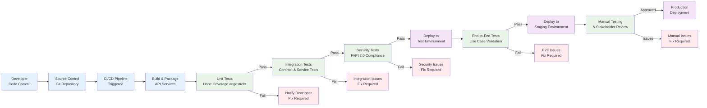
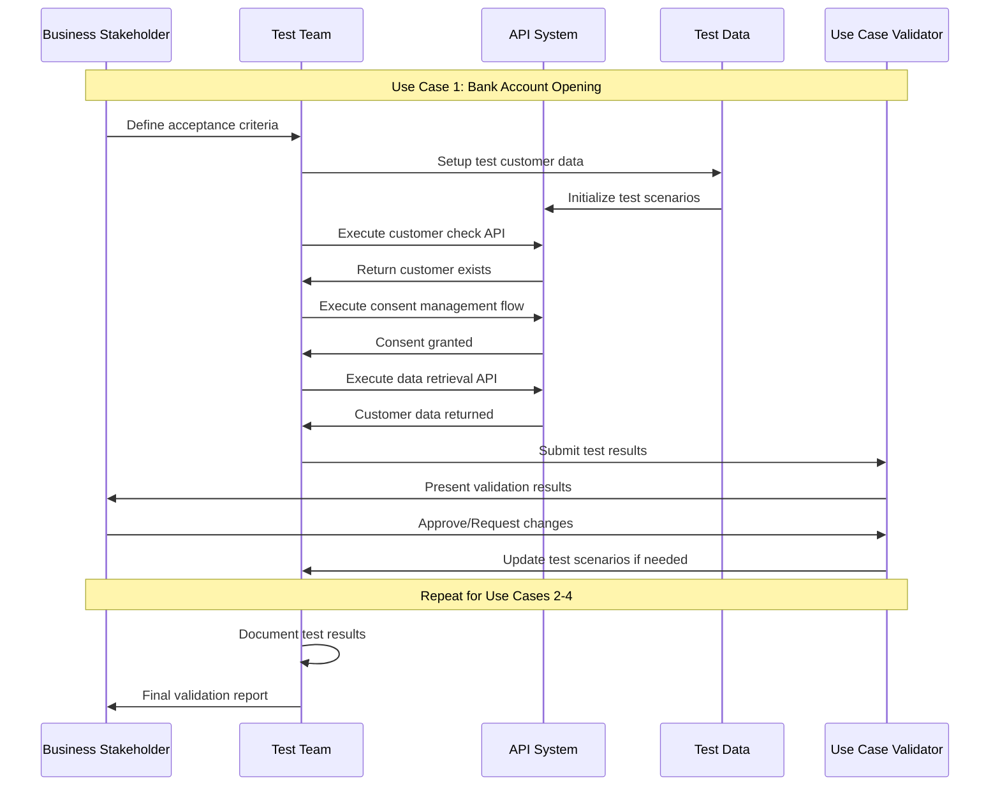
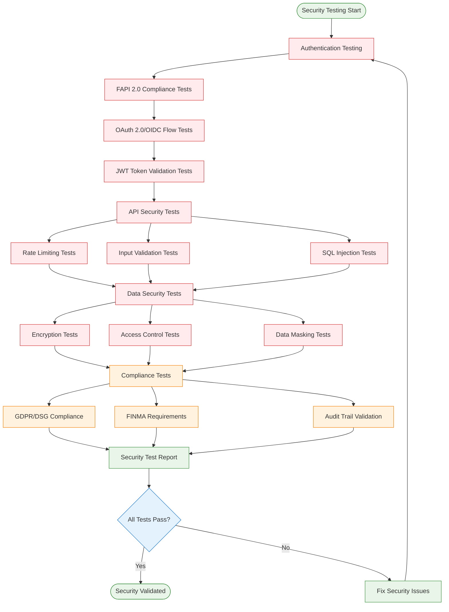
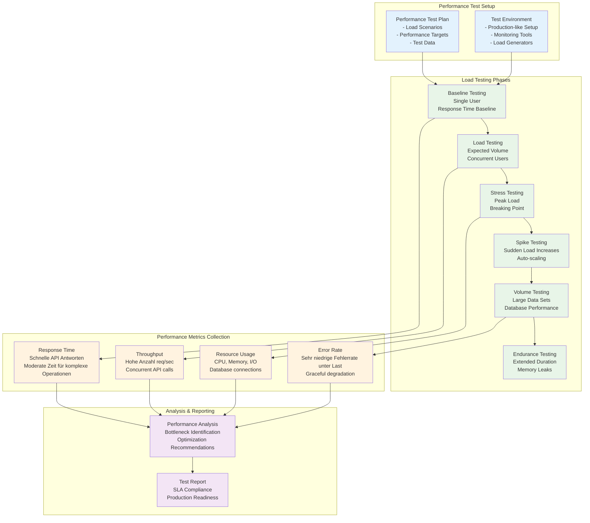
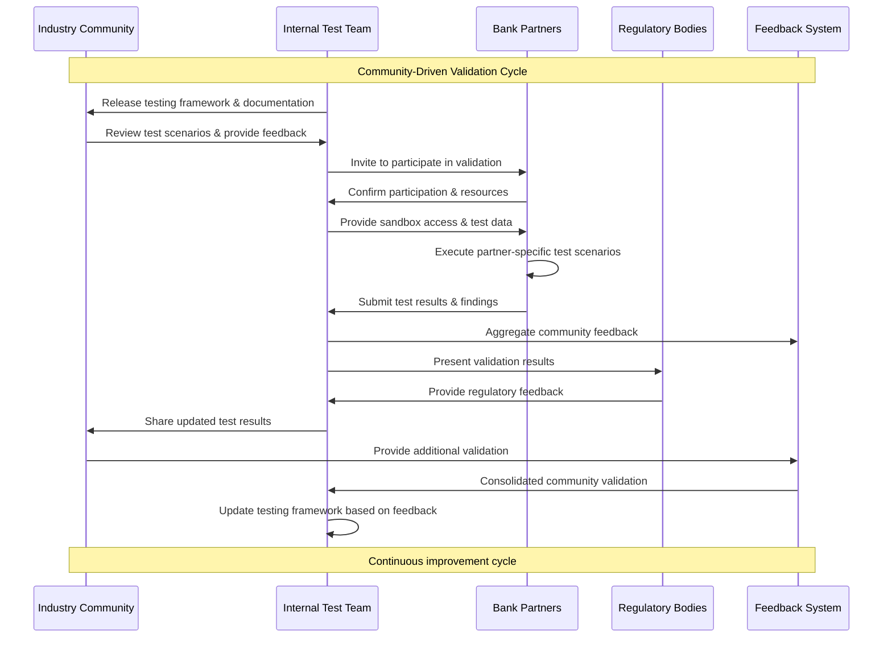
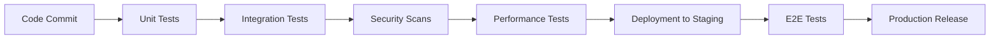

# OBP Testing und Verifikation Conclusion

## Inhalt

1. [Executive Summary](#executive-summary)
2. [Vorgehen und Ziele zu Testing und Verifikation](#vorgehen-und-ziele-zu-testing-und-verifikation)
3. [Vollständiges Testing-Konzept nach Developer Industry Standards](#vollständiges-testing-konzept-nach-developer-industry-standards)
4. [Use Case basierte Verifikation](#use-case-basierte-verifikation)
5. [Interaktive Demos und Visualisierung](#interaktive-demos-und-visualisierung)
6. [Community-basierte Verifikation und externe Validierung](#community-basierte-verifikation-und-externe-validierung)
7. [Fazit und Roadmap](#fazit-und-roadmap)

---

## Executive Summary

Das Testing und Verifikations-Framework für die Open API Kundenbeziehung etabliert comprehensive Qualitätssicherung auf allen Ebenen - von technischen Unit Tests bis hin zu community-basierten Use Case-Validierungen. Das Framework folgt Industry-Best-Practices und ermöglicht kontinuierliche Verifikation durch Stakeholder und Partner.

**Zentrale Ansätze:**
- Multi-Layer Testing Strategy von Unit Tests bis End-to-End Integration
- Use Case-basierte Verifikation mit den 4 priorisierten Anwendungsfällen
- Community-driven Validation durch Partner und Industry Experts
- Interactive Demos zur Stakeholder-Kommunikation und Feedback-Sammlung

**Ziele:**
- Sehr hohe Test Coverage für alle kritischen API-Funktionalitäten
- Automated Testing Pipeline für Continuous Integration/Deployment
- Stakeholder-validierte Use Case Implementation
- Production-ready Quality durch comprehensive Testing

---

## Testing und Verifikations-Diagramme

### Multi-Layer Testing Strategy

**Konzeptionelles Testing-Framework:**

Das Testing-Framework organisiert sich in vier aufeinander aufbauenden Schichten:

**Layer 1: Unit Testing**
- API Endpoint Tests für einzelne Funktionsmodule
- Business Logic Tests für Geschäftsregeln
- Data Model Tests für Datenstrukturen
- Security Function Tests für Sicherheitsfunktionen

**Layer 2: Integration Testing**
- API Contract Testing zwischen Systemkomponenten
- Database Integration für Datenpersistierung
- External Service Integration für Drittanbieter-Services
- Security Integration Tests für Ende-zu-Ende-Sicherheit

**Layer 3: System Testing**
- End-to-End API Flows für komplette Geschäftsprozesse
- Performance Testing für Skalierbarkeit und Response-Zeiten
- Security Testing für Penetration und Vulnerability Assessment
- Compliance Testing für regulatorische Anforderungen

**Layer 4: Acceptance Testing**
- Use Case Validation mit realen Anwendungsfällen
- Stakeholder Acceptance durch Fachbereiche
- Business Process Validation für Geschäftsabläufe
- User Experience Testing für Anwenderfreundlichkeit

**Hierarchischer Aufbau:** Jede Schicht baut auf den Ergebnissen der vorhergehenden auf, wodurch eine systematische Qualitätssicherung vom kleinsten Funktionsmodul bis zum vollständigen Geschäftsprozess gewährleistet wird.

### Automated Testing Pipeline



### Use Case Verification Process



### Security Testing Flow



### Performance and Load Testing Flow



### Community Validation Process



---

## Vorgehen und Ziele zu Testing und Verifikation

### Testing Framework Konzept

**Duale Testing-Philosophie:**
1. **Technical Testing:** Automated Testing für Code Quality, Performance und Security
2. **Business Validation:** Use Case-basierte Verifikation mit realen Stakeholdern

### Übergeordnete Ziele

#### Qualitätssicherung
- **Functional Correctness:** Alle API-Funktionalitäten arbeiten gemäß Spezifikation
- **Non-Functional Requirements:** Performance, Sicherheit, Skalierbarkeit erfüllt
- **Regulatory Compliance:** FAPI 2.0, GDPR/DSG, FINMA-Anforderungen eingehalten
- **User Experience:** Intuitive und frictionless Customer Journeys

#### Stakeholder Confidence
- **Developer Confidence:** Robust APIs mit comprehensive Documentation
- **Business Stakeholder Buy-in:** Validierte Business Value durch Use Case Testing
- **Regulatory Acceptance:** Compliance-nachgewiesene Implementation
- **Market Readiness:** Production-ready System mit nachgewiesener Stability

### Verifikations-Methodologie

#### Kontinuierliche Verifikation
**Iterative Validation Cycles:**
- **Sprint-basierte Testing:** Testing in 2-Wochen-Zyklen mit Stakeholder Feedback
- **Milestone-basierte Validation:** Major Use Case Testing bei Projektmeilensteinen
- **Community Reviews:** Regelmäßige Partner und Expert Reviews
- **Public Demos:** Quarterly Public Demonstrations für Feedback

#### Multi-Stakeholder Approach
**Verschiedene Validation-Perspektiven:**
- **Technical Validation:** Developer und Architect Reviews
- **Business Validation:** Product Manager und Business Analyst Testing
- **User Validation:** Customer Journey Testing mit End Users
- **Regulatory Validation:** Compliance und Legal Expert Reviews

---

## Vollständiges Testing-Konzept nach Developer Industry Standards

### Multi-Layer Testing Strategy

#### Layer 1: Unit Testing
**Scope:** Individual Functions und API Endpoints
```
Target Coverage: Abdeckung für alle Business Logic
Testing Framework: Jest/Vitest für JavaScript, pytest für Python
Execution: Automated bei jedem Code Commit
```

**Key Test Categories:**
- **Data Validation Tests:** Input/Output Schema Validation
- **Business Logic Tests:** Core Algorithm und Calculation Testing
- **Error Handling Tests:** Exception Handling und Error Response Testing
- **Edge Case Tests:** Boundary Conditions und Negative Scenarios

#### Layer 2: Integration Testing
**Scope:** API-to-API Communication und External Service Integration
```
Target Coverage: Abdeckung für alle Integration Points
Testing Framework: Postman/Newman für API Testing
Execution: Automated bei Integration-relevanten Changes
```

**Key Test Categories:**
- **API Contract Tests:** OpenAPI 3.0 Schema Compliance
- **Authentication Tests:** OAuth 2.0/OIDC Flow Validation
- **Data Flow Tests:** End-to-End Data Consistency
- **Third-Party Integration Tests:** External Service Mocking und Testing

#### Layer 3: End-to-End Testing
**Scope:** Complete User Journeys und Business Workflows
```
Target Coverage: Abdeckung für alle priorisierte Use Cases
Testing Framework: Playwright/Cypress für Browser Automation
Execution: Automated vor Production Releases
```

**Key Test Categories:**
- **User Journey Tests:** Complete Customer Onboarding Flows
- **Cross-Browser Tests:** Compatibility across Browser Platforms
- **Mobile App Tests:** Native und Web App Testing
- **Performance Tests:** Load Time und Responsiveness

### Testing Framework Implementation

#### Automated Testing Pipeline

**Continuous Integration Flow:**


**Testing Stages:**
1. **Pre-commit Hooks:** Linting, Basic Unit Tests
2. **CI Pipeline:** Full Test Suite Execution
3. **Staging Environment:** Integration und E2E Testing
4. **Production Monitoring:** Continuous Quality Monitoring

#### Test Metriken und KPIs
Genaue Metriken zur Messung der Code Quality, Performance und Security Compliance werden zu Beginn der Implementierung definiert und kontinuierlich überwacht.


### Security und Compliance Testing

#### FAPI 2.0 Conformance Testing
**Automated FAPI Compliance Validation:**
- **Certification Suite:** Official FAPI 2.0 Conformance Tests
- **Security Profile Testing:** Bearer Token und mTLS Validation
- **Dynamic Client Registration:** Client Authentication Tests
- **Request Object Testing:** JAR (JWT Secured Authorization Request) Validation

#### Penetration Testing Programme
**Quarterly Security Assessments:**
- **External Penetration Tests:** Third-party Security Audits
- **Vulnerability Assessments:** Automated Security Scanning
- **Social Engineering Tests:** Human Factor Security Testing
- **Red Team Exercises:** Comprehensive Attack Simulation

---

## Use Case basierte Verifikation

### Verifikation der 4 priorisierten Use Cases

#### UC1: Bankkonten-Onboarding

**Business Validation Criteria:**
- **Efficiency Gain:** Reduktion der Onboarding-Zeit nachgewiesen
- **Data Accuracy:** Übertragung zwischen Systemen
- **User Experience:** Customer Satisfaction
- **Compliance:** GwG/KYC-konforme Identifikationsprozesse


**Partner Validation:**
- **Source Banks:** Bank A, Bank B validation of data export functionality
- **Target Banks:** Successful account creation with imported data
- **Regulators:** FINMA-approved KYC process validation

#### UC2: Re-Identifikation

**Business Validation Criteria:**
- **Speed:** Zeit für komplette Re-Identifikation
- **Accuracy:** Genauigkeit bei Identity Matching
- **Privacy:** Zero unauthorized data exposure incidents
- **Usability:** Single-click re-identification for returning customers

#### UC3: Altersverifikation

**Business Validation Criteria:**
- **Compliance:** Age-gated service compliance
- **Privacy:** Attribute-only disclosure (age ≥18) without full identity
- **Speed:** Zeit für Age Verification Prozess
- **Scalability:** Cross-industry usage validation


#### UC4: EVV Use Case

**Business Validation Criteria:**
- **Data Completeness:** Vollständigkeit bei Portfolio Data Transfer
- **Regulatory Compliance:** MiFID II suitability assessment compliance
- **Performance:** Zeit für Portfolio Data Synchronization
- **Accuracy:** Financial Data Accuracy

### Use Case Validation Methodology

#### Stakeholder-driven Validation
**Multi-Phase Validation Process:**
1. **Internal Validation:** Development Team testing mit synthetischen Daten
2. **Partner Validation:** Real-world testing mit Partner Instituten
3. **Expert Review:** Industry Expert und Regulatory Review
4. **Pilot Validation:** Limited Production Pilot mit echten Customers

#### Success Criteria Framework
**Quantitative Criteria:**
- Performance Benchmarks erreicht
- Error Rates unter definierten Schwellenwerten
- Security und Compliance Tests bestanden
- User Satisfaction Scores erreicht

**Qualitative Criteria:**
- Stakeholder Feedback positiv
- Expert Review Recommendations implementiert
- Regulatory Concerns addressed
- Community Acceptance demonstrated

---

## Interaktive Demos und Visualisierung

### 4 visuell ansprechende Demos für Website
*TODO: Website verlinken*

#### Demo 1: Referenzprozess (Generisch)
**Interactive Process Visualization:**
- **Format:** Web-basierte Interactive Timeline
- **Content:** 10-Stufen Referenzprozess mit Hover-Details
- **Features:** 
  - Click-through Process Steps
  - Real-time Data Flow Visualization
  - Responsive Design für Mobile/Desktop
  - Multi-language Support (DE/EN)

#### Demo 2: Consent Flow (Generisch)
**Interactive Consent Management Demonstration:**
- **Format:** Step-by-step Consent Journey Simulation
- **Content:** FAPI 2.0-compliant Consent Flow mit granularen Options
- **Features:**
  - Real-time Consent Status Updates
  - Data Category Selection Interface
  - Consent Withdrawal Simulation
  - Audit Trail Visualization

**User Journey Simulation:**
```
1. Service Discovery → 2. Data Requirements Explanation → 
3. Granular Consent Selection → 4. Secure Authentication → 
5. Data Access Granting → 6. Ongoing Consent Management
```

#### Demo 3: Use Case-spezifische Umsetzung (4 priorisierte)
**Four Interactive Use Case Demonstrations:**

**UC1 Demo: Bankkonten-Onboarding**
- Split-screen view: Traditional vs. API-based Onboarding
- Time Comparison: Real-time efficiency demonstration
- Data Flow: Visual representation of data reuse

**UC2 Demo: Re-Identifikation**
- Quick Access Simulation: Returning customer experience
- Privacy Protection: Visualization of data minimization
- Speed Benchmark: Performance comparison

**UC3 Demo: Altersverifikation**
- Attribute-only Disclosure: Privacy-by-design demonstration
- Cross-industry Application: Multiple sector examples
- Compliance Checker: Regulatory requirement validation

**UC4 Demo: EVV Use Case**
- Portfolio Visualization: Investment data synchronization
- Risk Assessment: MiFID II compliance demonstration
- Real-time Updates: Live portfolio synchronization

#### Demo 4: Verifikationsprozess
**Testing und Validation Process Demonstration:**
- **Format:** Interactive Testing Dashboard
- **Content:** Real-time Testing Results und Metrics
- **Features:**
  - Live Test Execution Monitoring
  - Quality Metrics Visualization
  - Compliance Status Dashboard
  - Community Feedback Integration


---

## Community-basierte Verifikation und externe Validierung

### Partner-basierte Validation

#### Banking Partner Program
**Structured Partner Validation:**
- **Tier 1 Partners:** Major Swiss Banks (3-5 institutions)
- **Tier 2 Partners:** Regional/Cantonal Banks (5-8 institutions)
- **Tier 3 Partners:** FinTechs und Service Providers (10+ companies)

**Validation Activities:**
- **Technical Integration Testing:** Real-world API integration
- **Business Process Validation:** Use Case feasibility assessment
- **Security Review:** Independent security assessment
- **User Experience Testing:** Customer journey validation

#### Industry Expert Reviews

**Expert Panel Composition:**
- **Technical Experts:** API Architecture und Security Specialists
- **Business Experts:** Banking und FinTech Industry Leaders
- **Regulatory Experts:** Compliance und Legal Specialists
- **Academic Experts:** Research Institution Representatives

**Review Methodology:**
- **Quarterly Expert Sessions:** Structured review meetings
- **Continuous Feedback Loop:** Ongoing expert input integration
- **Public Expert Endorsements:** Community credibility building
- **Best Practice Documentation:** Expert-validated implementation guides

### Community Engagement Framework

#### Open Source Contributions
**Community Development:**
- **GitHub Repository:** Open source reference implementation
- **Developer Documentation:** Comprehensive API documentation
- **Code Examples:** Real-world integration examples
- **Community Forums:** Developer support und discussion

#### Industry Standardization
**Standards Body Engagement:**
- **Swiss FinTech Association:** Industry standard development
- **European Standards Bodies:** International alignment
- **OpenID Foundation:** Identity standard contributions
- **FIDO Alliance:** Authentication standard participation

### External Validation Processes

#### Third-Party Audits
**Independent Quality Assurance:**
- **Security Audits:** External penetration testing und security reviews
- **Compliance Audits:** Independent regulatory compliance assessment
- **Performance Audits:** Third-party performance benchmarking
- **Code Quality Reviews:** Independent code quality assessment

#### Academic Validation
**Research Collaboration:**
- **University Partnerships:** Academic research collaboration
- **Research Publications:** Peer-reviewed validation studies
- **Conference Presentations:** Industry conference validation
- **Academic Advisory Board:** Ongoing academic input

### Feedback Integration Methodology

#### Continuous Improvement Cycle
**Structured Feedback Processing:**
1. **Collection:** Multi-channel feedback gathering
2. **Analysis:** Systematic feedback categorization und prioritization
3. **Integration:** Rapid iteration based on validated feedback
4. **Communication:** Transparent communication of changes
5. **Validation:** Follow-up validation of implemented changes

#### Community-Driven Roadmap
**Collaborative Development:**
- **Public Roadmap:** Transparent development planning
- **Community Voting:** Feature prioritization durch community input
- **Open Issues Tracking:** Public issue tracking und resolution
- **Regular Community Updates:** Transparent progress communication

---

## Fazit und Roadmap

*TODO: Verifikation TZE*

### Strategische Bedeutung für Open API Kundenbeziehung

**Testing als Vertrauensbildende Maßnahme:**
- Community Confidence durch transparente Quality Demonstration
- Regulatory Acceptance durch comprehensive Compliance Testing
- Market Readiness durch extensive Partner Validation
- Technical Excellence durch industry-leading Testing Standards

**Nachhaltiger Qualitätsansatz:**
- Continuous Improvement durch ongoing Community Feedback
- Adaptive Testing Framework für emerging Requirements
- Scalable Testing Infrastructure für Market Growth
- Innovation-fördernd durch Open Source Collaboration

Das Testing und Verifikations-Framework positioniert die Open API Kundenbeziehung als qualitativ führende Lösung im Schweizer Fintech-Markt und schafft das notwendige Vertrauen für breite Marktakzeptanz.

### Roadmap für Testing und Verifikation

#### Phase 1: Foundation Testing (Monate 1-6)
**Core Testing Infrastructure:**
- [ ] **Automated Testing Pipeline:** CI/CD pipeline mit full test automation
- [ ] **Security Testing Framework:** FAPI 2.0 conformance testing
- [ ] **Performance Benchmarking:** Comprehensive performance baseline
- [ ] **Initial Use Case Validation:** UC1 (Bankkonten-Onboarding) complete validation

**Community Engagement:**
- [ ] **Partner Testing Program Launch:** First 3-5 partners onboarded
- [ ] **Expert Advisory Board Establishment:** Technical und business experts
- [ ] **Public Demo Environment:** Interactive demos available
- [ ] **Developer Community Setup:** GitHub repository und documentation

#### Phase 2: Scale-up Testing (Monate 6-12)
**Extended Testing Coverage:**
- [ ] **Complete Use Case Testing:** All 4 prioritized use cases validated
- [ ] **Cross-Browser/Platform Testing:** Comprehensive compatibility testing
- [ ] **Load Testing:** Production-level performance validation
- [ ] **Integration Testing:** Multi-partner integration scenarios

**Community Expansion:**
- [ ] **Extended Partner Program:** 10-15 active partners
- [ ] **Industry Expert Reviews:** Quarterly expert review cycles
- [ ] **Academic Collaboration:** Research partnerships established
- [ ] **Conference Presentations:** Industry validation demonstrations

#### Phase 3: Production Excellence (Monate 12-18)
**Production-Ready Quality:**
- [ ] **24/7 Monitoring:** Continuous production quality monitoring
- [ ] **Automated Incident Response:** Intelligent error detection und response
- [ ] **Performance Optimization:** Sub-second response time achievement
- [ ] **Compliance Certification:** Official FAPI 2.0 certification

**Market Validation:**
- [ ] **Production Partners:** 15+ partners in production
- [ ] **Community Recognition:** Industry awards und recognition
- [ ] **International Validation:** Cross-border integration testing
- [ ] **Standards Contribution:** Contribution to international standards


---

---

**Version:** 1.0  
**Datum:** August 2025  
**Status:** Final Draft für Review

---

[Quellen und Referenzen](./Quellen%20und%20Referenzen.md)