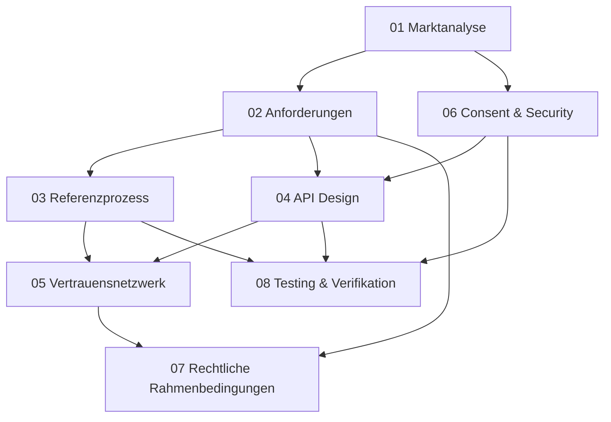

# Open API Kundenbeziehung - Conclusions Overview

## Dokument-Index und Navigation

### Vollständige Conclusion-Sammlung

Diese Übersicht bietet eine strukturierte Navigation durch alle Fachlichen Conclusions zur Open API Kundenbeziehung. Jede Conclusion behandelt einen spezifischen Aspekt der Gesamtstrategie und bietet sowohl konzeptionelle Frameworks als auch praktische Implementierungsempfehlungen.

---

## Teil 1: Marktanalyse und Anforderungen

### [01 Marktanalyse](./01%20Marktanalyse.md)
**Status:** Vollständig  
**Umfang:** Analyse von 8 globalen Open Banking Standards  
**Zielgruppe:** Strategic Decision Makers, Product Management

**Key Insights:**
- JSON/RESTful APIs als De-facto-Standard etabliert (7/8 Standards)
- FAPI 2.0 + OAuth2/OIDC als bewährte Security-Architektur
- Hybrid-Governance-Modelle zeigen beste Adoption-Raten
- Schweizer E-ID Integration bietet Competitive Advantage

**Struktur-Brief:**
- Executive Summary mit zentralen Erkenntnissen
- Methodologie und Scope der Analyse  
- Detailanalyse der 8 globalen Standards
- Technology-Konvergenz und Security-Standards
- Regulatorische Frameworks und Governance-Modelle
- Strategische Empfehlungen für Schweizer Implementation

**Verwendung:** Grundlage für technische und strategische Entscheidungen, Stakeholder-Alignment

---

### [02 Anforderungen](./02%20Anforderungen.md)
**Status:** Vollständig  
**Umfang:** Comprehensive Requirements Framework  
**Zielgruppe:** Product Managers, Business Analysts, Development Teams

**Key Insights:**
- 5 Zielbilder definiert mit Fokus auf Zielbilder 1&2 für Quick Wins
- 4 priorisierte Use Cases mit detaillierter Bewertungsmatrix
- MVP-Datenmodell mit modularen Bausteinen
- Strategischer 3-Phasen-Implementierungsplan

**Struktur-Brief:**
- Business Model Canvas für Open API Kundenbeziehung
- Detaillierte Use Case-Analyse mit Priorisierung
- Technical Requirements und MVP-Spezifikation
- Business Case und Monetarisierungsmodelle
- E-ID Integration Strategy
- Strategische Herangehensweise "Vom Kleinen ins Grosse"

**Verwendung:** Requirements Definition, Business Case Development, Implementation Planning

---

## Teil 2: Technische und Architektur-Foundations

### [03 Referenzprozess](./03%20Referenzprozess.md)
**Status:** Vollständig  
**Umfang:** 10-Stufen Referenzprozess mit modularer Architektur  
**Zielgruppe:** Process Designers, Business Process Managers, Integration Teams

**Key Insights:**
- 10-Stufen branchenübergreifender Referenzprozess etabliert
- Modulare "Blöckli"-Architektur für flexible Use Case-Abdeckung
- Bankkonten-Onboarding als Referenz-Implementation (67% Zeit-Reduktion)
- Compliance-by-Design mit automatisierten Validierungen

**Struktur-Brief:**
- Konzeptionelles Framework für branchenübergreifende Anwendung
- Detaillierte Erklärung aller 10 Prozess-Stufen
- Modulare Datenbausteine-Architektur (Core + Extended + Metadata)
- Use Case Implementation mit Bankkonten-Onboarding
- Technical Integration Patterns und Standards-Kompatibilität

**Verwendung:** Process Design Reference, Integration Architecture, Business Process Implementation

---

### [04 API Endpoint Design](./04%20API%20Endpoint%20Design.md)
**Status:** Vollständig  
**Umfang:** Konzeptionelle API-Spezifikation nach OpenAPI 3.0  
**Zielgruppe:** Solution Architects, API Developers, Technical Product Managers

**Key Insights:**
- OpenAPI 3.0-konforme RESTful Architektur
- FAPI 2.0 Security Integration für Financial-grade APIs
- Modulare Endpunkt-Architektur für granulare Daten-Access
- Comprehensive Error Handling und Monitoring Integration

**Struktur-Brief:**
- API-Architektur Overview mit Security Framework
- Hauptendpunkte (Customer Check, Data Request, Profile APIs)
- Granulare Daten-Endpunkte für modulare Bausteine
- Request/Response Strukturen mit Standard-Formaten
- Implementation Guidelines mit OpenAPI 3.0 Examples

**Verwendung:** API Design Reference, Technical Specification, Developer Documentation Foundation

---

## Teil 3: Network und Security Architecture

### [05 Vertrauensnetzwerk (Föderiertes System)](./05%20Vertrauensnetzwerk.md)
**Status:** Vollständig  
**Umfang:** Föderierte Systemarchitektur mit Governance-Framework  
**Zielgruppe:** Solution Architects, Network Designers, Governance Stakeholders

**Key Insights:**
- Hybrid-Modell als präferierte Lösung für Schweizer Kontext
- Skalierbare Evolution: Dezentral → Hybrid → Optional Zentral
- Multi-Stakeholder Governance mit FINMA Observer Status
- Technische Rollen-Matrix für flexible Teilnehmer-Integration

**Struktur-Brief:**
- Konzeptionelle Definition und Scope des Vertrauensnetzwerks
- Detaillierte Analyse der 3 Architektur-Modelle (Dezentral, Hybrid, Zentral)
- Technische Rollen und Matrix für verschiedene Participants
- Governance-Infrastruktur mit föderativen Anforderungen
- Internationale Best Practices und Schweizer Anpassungen

**Verwendung:** Network Architecture Design, Governance Framework, Partner Onboarding Strategy

---

### [06 Consent und Security Flow](./06%20Consent%20und%20Security%20Flow.md)
**Status:** Vollständig  
**Umfang:** FAPI 2.0-konformes Security Framework mit Airlock Reference  
**Zielgruppe:** Security Architects, Compliance Officers, Identity Management Teams

**Key Insights:**
- Network-agnostisches FAPI 2.0 Security Framework
- Multi-Layer Consent Management (Purpose-based, Category-based, Field-level)
- JWT-Token Architektur mit Custom Consent Claims
- Integration Patterns für Legacy Systems und Mobile Apps

**Struktur-Brief:**
- Security Framework Grundlagen (network-agnostic)
- Security Standards Evaluation und Begründung (FAPI 2.0, OAuth2, OIDC)
- Consent-Flow-Architekturen mit verschiedenen Modellen
- JWT-Token Architektur und Consent Claims Definition
- Complete Authentication/Authorization Implementation Guide
- Compliance und Regulatory Alignment (FINMA, GDPR/DSG, PSD2)

**Verwendung:** Security Implementation, Consent Management Design, Compliance Framework

---

## Teil 4: Legal und Quality Assurance

### [07 Rechtliche Rahmenbedingungen](./07%20Rechtliche%20Rahmenbedingungen.md)
**Status:** Vollständig (mit Disclaimer)  
**Umfang:** Rechtliche Analyse mit Expertenstellungnahmen  
**Zielgruppe:** Legal Teams, Compliance Officers, Risk Managers

**Wichtiger Disclaimer:** Keine Rechtsberatung - Qualifizierte juristische Beratung erforderlich

**Key Insights:**
- FINMA-Stellungnahme als kritischer Erfolgsfaktor identifiziert
- Haftungsverteilung erfordert vertragliche Klarstellung
- GwG-Compliance und Outsourcing-Behandlung sind fallspezifisch
- Compliance-by-Design Framework mit praktischen Checklisten

**Struktur-Brief:**
- Schweizer Finanzmarkt-Kontext und regulatorische Ausgangslage
- Identifizierte Kernfragestellungen mit Expertenstellungnahmen (HBL, PostFinance, Intrum)
- Offene Fragestellungen für weitere rechtliche Klärung
- Compliance-Framework Vorschlag für API-Design
- Risikomanagement und Haftungsverteilungs-Framework

**Verwendung:** Legal Risk Assessment, Compliance Planning, Contract Framework Development

---

### [08 Testing und Verifikation](./08%20Testing%20und%20Verifikation.md)
**Status:** Vollständig  
**Umfang:** Comprehensive Quality Assurance Framework  
**Zielgruppe:** QA Teams, DevOps Engineers, Community Managers

**Key Insights:**
- Multi-Layer Testing Strategy (Unit, Integration, E2E)
- Use Case-basierte Verifikation der 4 priorisierten Anwendungsfälle
- Community-driven Validation mit Partner Program
- Interactive Demos für Stakeholder-Kommunikation

**Struktur-Brief:**
- Testing Framework Konzept mit Developer Industry Standards
- Vollständiges Testing-Konzept (Code Coverage >95%, Performance <2s)
- Use Case-basierte Verifikation mit quantitativen Success Criteria
- 4 Interactive Demos (Referenzprozess, Consent Flow, Use Cases, Verification)
- Community-basierte Validation und External Quality Assurance

**Verwendung:** Quality Assurance Planning, Community Engagement Strategy, Stakeholder Demonstration

---

## Cross-Document Referenzen und Dependencies

### Dokumenten-Abhängigkeiten

### Thematische Cross-References

#### Security & Compliance Stack
- **[01 Marktanalyse]** → FAPI 2.0 Standards Analysis
- **[06 Consent & Security Flow]** → FAPI 2.0 Implementation  
- **[07 Rechtliche Rahmenbedingungen]** → Legal Compliance Framework
- **[08 Testing & Verifikation]** → Security Testing & FAPI Conformance

#### Architecture & Implementation Stack  
- **[02 Anforderungen]** → Use Cases & MVP Definition
- **[03 Referenzprozess]** → 10-Stage Process Implementation
- **[04 API Design]** → Technical API Specification
- **[05 Vertrauensnetzwerk]** → Network Architecture & Governance

#### Business & Strategy Stack
- **[01 Marktanalyse]** → Strategic Market Positioning
- **[02 Anforderungen]** → Business Model & Monetization
- **[07 Rechtliche Rahmenbedingungen]** → Legal Risk Management
- **[08 Testing & Verifikation]** → Community Validation & Market Readiness

---

## Verwendung für verschiedene Stakeholder-Gruppen

### For Executive Leadership
**Empfohlene Lesereihenfolge:**
1. [01 Marktanalyse] - Executive Summary & Strategic Recommendations
2. [02 Anforderungen] - Business Model & ROI Projections  
3. [07 Rechtliche Rahmenbedingungen] - Risk Assessment & Legal Implications

### For Product Management
**Empfohlene Lesereihenfolge:**
1. [02 Anforderungen] - Complete Requirements Framework
2. [03 Referenzprozess] - Process Design & User Journeys
3. [08 Testing & Verifikation] - Quality Assurance & Success Metrics

### For Technical Architecture
**Empfohlene Lesereihenfolge:**
1. [04 API Design] - Technical Specification
2. [05 Vertrauensnetzwerk] - Network Architecture
3. [06 Consent & Security Flow] - Security Implementation
4. [08 Testing & Verifikation] - Testing Framework

### For Legal & Compliance
**Empfohlene Lesereihenfolge:**
1. [07 Rechtliche Rahmenbedingungen] - Complete Legal Analysis
2. [06 Consent & Security Flow] - Compliance Integration
3. [01 Marktanalyse] - Regulatory Framework Comparison

### For Business Development
**Empfohlene Lesereihenfolge:**
1. [01 Marktanalyse] - Market Positioning & Competitive Analysis
2. [02 Anforderungen] - Use Cases & Value Propositions
3. [05 Vertrauensnetzwerk] - Partnership Framework

---

## Implementation Roadmap Integration

### Phase 1: Foundation (Monate 1-6)
**Relevante Conclusions:**
- [07 Rechtliche Rahmenbedingungen] - Legal Framework Setup
- [06 Consent & Security Flow] - Security Infrastructure
- [04 API Design] - Technical Architecture

### Phase 2: Development (Monate 6-12)  
**Relevante Conclusions:**
- [03 Referenzprozess] - Process Implementation
- [08 Testing & Verifikation] - Quality Assurance Setup
- [02 Anforderungen] - Use Case Development

### Phase 3: Market Launch (Monate 12-18)
**Relevante Conclusions:**
- [05 Vertrauensnetzwerk] - Partner Onboarding
- [01 Marktanalyse] - Market Positioning
- [08 Testing & Verifikation] - Community Validation

---

## Kontinuierliche Aktualisierung

**Version Control:** Alle Conclusions werden gemeinsam versioniert  
**Aktuelle Version:** 1.0 (August 2025)  
**Nächste Review:** November 2025 (nach 3 Monaten praktischer Implementation)

**Update-Triggers:**
- FINMA-Stellungnahmen oder neue Regulatory Guidance
- Feedback aus Partner-Pilotprojekten
- Technology Standards Evolution (FAPI 2.1, OpenAPI 3.1)
- Market Response und Competitive Developments

Diese Overview bietet eine zentrale Navigation durch die gesamte Conclusion-Sammlung und unterstützt verschiedene Stakeholder-Gruppen bei der effizienten Nutzung der dokumentierten Erkenntnisse und Empfehlungen.

---

**Version:** 1.0  
**Datum:** August 2025  
**Status:** Complete Overview für alle 8 Conclusions  
**Nächste Aktualisierung:** November 2025