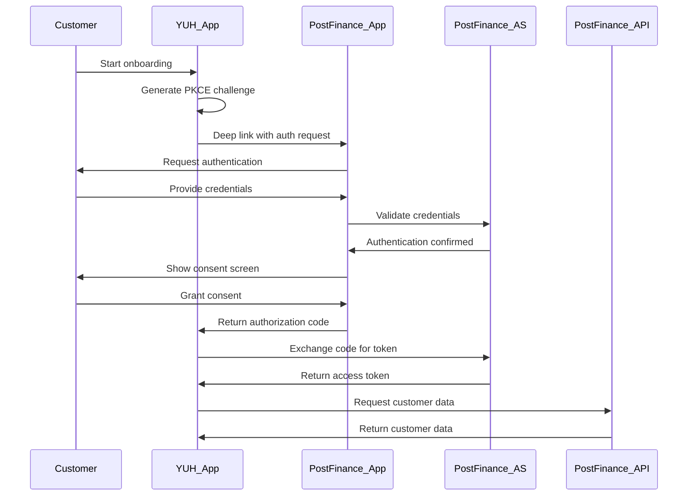
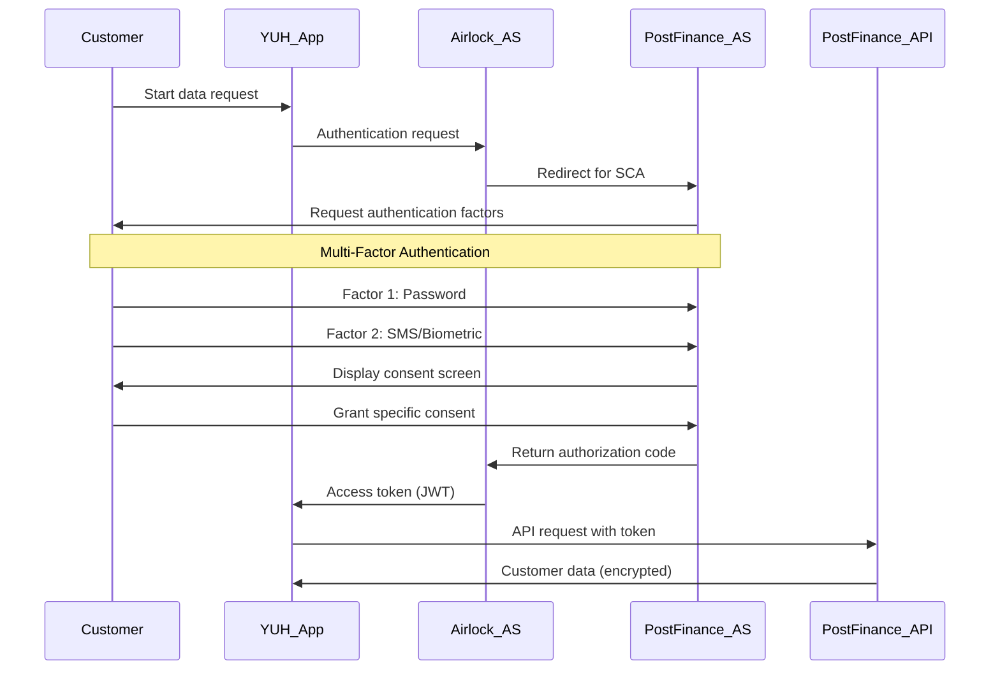

**Implementation Challenges:**
- **Complexity:** Höhere technische Komplexität vs. Standard OAuth 2.0
- **Performance:** Zusätzliche Verschlüsselung kann Performance beeinträchtigen
- **Adoption:** Noch nicht vollständig etabliert in allen Märkten
- **Skills:** Erfordert spezialisierte Entwicklungsexpertise

#### 2. OAuth 2.0 Authorization Framework

**Übersicht:**
OAuth 2.0 ist der de facto Standard für Authorization in modernen APIs und bildet die Grundlage für die meisten Open Banking Implementierungen.

**Core Components:**
```yaml
OAuth_2.0_Components:
  authorization_server:
    - "Issues access tokens to clients"
    - "Handles user authentication and consent"
    - "Manages token lifecycle and revocation"
  resource_server:
    - "Validates access tokens"
    - "Serves protected resources/APIs"
    - "Enforces authorization decisions"
  client:
    - "Requests access tokens"
    - "Calls protected resources with tokens"
    - "Handles token refresh and errors"
  resource_owner:
    - "Grants authorization (user consent)"
    - "Controls access to protected resources"
    - "Can revoke previously granted access"
```

**Flows für Open API Kundenbeziehung:**
```yaml
authorization_flows:
  authorization_code_flow:
    description: "Most secure flow for web and mobile apps"
    use_case: "Standard customer consent flow"
    security_features: ["PKCE", "State parameter", "Nonce"]
  
  client_credentials_flow:
    description: "Machine-to-machine authentication"
    use_case: "API-to-API communication between banks"
    security_features: ["Client authentication", "Scope limitations"]
    
  device_authorization_flow:
    description: "For devices with limited input capabilities"
    use_case: "IoT devices, smart TVs for financial services"
    security_features: ["Device code verification", "User confirmation"]
```

**Vorteile:**
- **Widespread Adoption:** Universell akzeptiert und implementiert
- **Mature Ecosystem:** Umfangreiches Tooling und Library Support
- **Flexible:** Verschiedene Flows für verschiedene Use Cases
- **Standardized:** IETF RFC 6749 mit klaren Spezifikationen

#### 3. OpenID Connect (OIDC) 1.0

**Übersicht:**
OIDC erweitert OAuth 2.0 um Identity Layer und ermöglicht standardisierte Authentifizierung zusätzlich zur Authorization.

**Key Features:**
```yaml
OIDC_Features:
  identity_token:
    format: "JWT (JSON Web Token)"
    contents: ["User identity claims", "Authentication context", "Security metadata"]
    validation: ["Signature verification", "Audience validation", "Expiry checks"]
    
  user_info_endpoint:
    purpose: "Retrieve additional user claims"
    authentication: "Access token required"
    claims: ["profile", "email", "address", "phone"]
    
  discovery:
    endpoint: "/.well-known/openid_configuration"
    purpose: "Automatic client configuration"
    metadata: ["Endpoints", "Supported features", "Cryptographic keys"]
```

**Claims für Open API Kundenbeziehung:**
```json
{
  "iss": "https://auth.open-api-kundenbeziehung.ch",
  "sub": "customer-456789",
  "aud": ["api.postfinance.ch", "api.yuh.com"],
  "exp": 1640995200,
  "iat": 1640991600,
  "auth_time": 1640991600,
  "nonce": "abc123xyz",
  "acr": "urn:mace:incommon:iap:silver",
  "amr": ["pwd", "sms"],
  "azp": "yuh-mobile-app",
  "customer_verification_level": "QEAA",
  "kyc_status": "verified",
  "data_categories_consented": ["identity", "address", "contact"]
}
```

#### 4. Weitere relevante Standards

**QWACS & QSEALS (eIDAS):**
- **Qualified Website Authentication Certificates:** Für sichere Website-Identifikation
- **Qualified Electronic Seals:** Für digitale Signaturen und Integrität
- **EU-Regulation:** Rechtliche Verbindlichkeit in der EU
- **Swiss Compatibility:** Integration mit Schweizer e-ID Framework

**BankID (Nordic Model):**
- **Established Identity:** Bewährtes Identitätssystem in Skandinavien
- **High Trust Level:** Breite Akzeptanz bei Banken und Bürgern
- **Mobile-First:** Optimiert für mobile Anwendungen
- **Lessons Learned:** Übertragbare Erkenntnisse für Schweizer e-ID

## Consent-Flow-Architekturen

### Übersicht der verschiedenen existierenden Modelle

#### 1. App-to-App Redirect Flow

**Beschreibung:**
Direkter Transfer zwischen Apps ohne Browser-Umweg, optimiert für Mobile Experience.

**Technischer Ablauf:**
```
Customer App (YUH) → Bank App (PostFinance) → Customer App (YUH)
        │                    │                        │
        │                    │                        │
    Initiate              Authenticate              Receive
    Request               & Consent                 Response
```

**Sequence Diagramm:**


**Vorteile:**
- **Seamless UX:** Keine Browser-Umleitung erforderlich
- **Native Experience:** Optimierte mobile Benutzererfahrung
- **Higher Conversion:** Reduzierte Abbruchrate durch nahtlosen Flow
- **Brand Control:** Banken behalten Kontrolle über UX

**Nachteile:**
- **App Dependency:** Erfordert installierte Banking-App
- **Platform Limitations:** iOS/Android spezifische Implementierungen
- **Fallback Required:** Browser-Flow als Backup notwendig

#### 2. Browser Redirect Flow

**Beschreibung:**
Traditioneller Web-basierter OAuth 2.0 Flow mit Browser-Umleitung.

**Technischer Ablauf:**
```
Customer → Service Website → Bank Website → Service Website → Customer
   │            │               │               │            │
   │            │               │               │            │
Start        Redirect        Authenticate     Callback     Complete
Request      to Bank         & Consent       with Code    Onboarding
```

**Implementation Details:**
```javascript
// Authorization Request
const authUrl = `https://auth.postfinance.ch/oauth2/authorize?` +
  `response_type=code&` +
  `client_id=yuh-web-app&` +
  `redirect_uri=https://onboarding.yuh.com/callback&` +
  `scope=openid profile customer:read&` +
  `state=${secureRandomState}&` +
  `nonce=${secureRandomNonce}&` +
  `code_challenge=${pkceChallenge}&` +
  `code_challenge_method=S256`;

// Token Exchange
const tokenResponse = await fetch('https://auth.postfinance.ch/oauth2/token', {
  method: 'POST',
  headers: {
    'Content-Type': 'application/x-www-form-urlencoded',
    'Authorization': `Basic ${base64(clientId:clientSecret)}`
  },
  body: new URLSearchParams({
    grant_type: 'authorization_code',
    code: authorizationCode,
    redirect_uri: 'https://onboarding.yuh.com/callback',
    code_verifier: pkceVerifier
  })
});
```

**Vorteile:**
- **Universal Compatibility:** Funktioniert auf allen Geräten und Browsern
- **Mature Standard:** Bewährte Implementierung mit breitem Tooling-Support
- **Security:** Etablierte Sicherheitsmechanismen und Best Practices
- **No App Required:** Funktioniert ohne installierte Apps

**Nachteile:**
- **UX Friction:** Mehrfache Weiterleitungen können verwirrend sein
- **Conversion Loss:** Höhere Abbruchrate durch komplexeren Flow
- **Performance:** Langsamere Ausführung durch Browser-Umleitungen

#### 3. Decoupled Flow

**Beschreibung:**
Getrennte Autorisierung und Datenübertragung, optimiert für asynchrone Prozesse.

**Technischer Ablauf:**
```
Phase 1: Authorization
Customer → Banking App → Authorization → Confirmation

Phase 2: Data Transfer (später)
Service Provider → API Call → Data Transfer → Processing
```

**Use Cases:**
- **Batch Processing:** Nächtliche Datenübertragungen
- **Complex Onboarding:** Multi-Step Verification Processes
- **Compliance Reviews:** Manual Review vor Data Release

**Implementation Example:**
```yaml
decoupled_flow:
  step_1_authorization:
    customer_action: "Grant consent via banking app"
    result: "Authorization reference created"
    notification: "SMS/Email confirmation to customer"
    
  step_2_polling:
    integrator_action: "Poll authorization status"
    endpoint: "/oauth2/device/status"
    interval: "5 seconds"
    timeout: "300 seconds"
    
  step_3_data_access:
    trigger: "Authorization confirmed"
    action: "Exchange reference for access token"
    data_transfer: "API calls with access token"
```

**Vorteile:**
- **Asynchronous Processing:** Keine real-time Availability erforderlich
- **Complex Workflows:** Unterstützung für mehrstufige Approval-Prozesse
- **Offline Capability:** Funktioniert auch bei temporärer Offline-Verfügbarkeit
- **Audit Trail:** Detaillierte Protokollierung des gesamten Prozesses

**Nachteile:**
- **Complexity:** Komplexere Implementierung und Fehlerbehandlung
- **Latency:** Längere Zeit bis zur Datenübertragung
- **User Experience:** Weniger immediate Gratification für Benutzer

#### 4. Embedded Flow

**Beschreibung:**
Integration der Authentifizierung direkt in die Service-Provider-Anwendung.

**Technischer Ablauf:**
```
Service Provider App
┌─────────────────────────────────┐
│  Embedded Banking Auth Widget  │
│  ┌─────────────────────────────┐│
│  │  [Bank Logo]               ││
│  │  Username: [___________]   ││
│  │  Password:  [___________]   ││
│  │  [Authenticate & Consent]   ││
│  └─────────────────────────────┘│
└─────────────────────────────────┘
```

**Security Considerations:**
```yaml
security_risks:
  credential_exposure:
    risk: "Banking credentials in third-party app"
    mitigation: "Strong encryption and secure storage"
    
  phishing_risk:
    risk: "Fake authentication interfaces"
    mitigation: "Certificate pinning and visual indicators"
    
  session_hijacking:
    risk: "Token theft in embedded context"
    mitigation: "Short-lived tokens and frequent rotation"
```

**Regulatory Constraints:**
- **PSD2 Compliance:** Möglicherweise nicht PSD2-konform
- **Strong Customer Authentication:** Schwierigkeiten bei SCA Implementation
- **Liability Issues:** Unklare Haftungsverteilung

**Empfehlung:** 
❌ **Nicht empfohlen** für Open API Kundenbeziehung aufgrund Sicherheits- und Compliance-Risiken.

### Deep Dive: Inter-App Consent Flows (Standard OAuth 2.0)

#### Detaillierte technische Implementierung

**1. Authorization Request Formation:**
```javascript
// PKCE Challenge Generation
const codeVerifier = generateRandomString(128);
const codeChallenge = base64urlEncode(sha256(codeVerifier));

// Authorization URL Construction
const authorizationRequest = {
  response_type: 'code',
  client_id: 'yuh-mobile-app',
  redirect_uri: 'ch.yuh.app://oauth/callback',
  scope: 'openid profile customer:read address:read',
  state: generateSecureRandomState(),
  nonce: generateSecureRandomNonce(),
  code_challenge: codeChallenge,
  code_challenge_method: 'S256',
  
  // FAPI 2.0 Extensions
  request: signedRequestJWT, // Signed request object
  response_mode: 'jwt', // Encrypted response
  
  // Custom Claims
  purpose: 'customer_onboarding',
  data_categories: ['identity', 'address', 'contact'],
  consent_duration: '365d'
};
```

**2. Deep Link Handling:**
```swift
// iOS Implementation
func application(_ app: UIApplication, open url: URL, options: [UIApplication.OpenURLOptionsKey : Any] = [:]) -> Bool {
    if url.scheme == "ch.yuh.app" && url.host == "oauth" {
        handleOAuthCallback(url: url)
        return true
    }
    return false
}

func handleOAuthCallback(url: URL) {
    let components = URLComponents(url: url, resolvingAgainstBaseURL: false)
    let authCode = components?.queryItems?.first(where: { $0.name == "code" })?.value
    let state = components?.queryItems?.first(where: { $0.name == "state" })?.value
    
    // Validate state parameter
    guard state == storedState else {
        handleError(.invalidState)
        return
    }
    
    // Exchange code for token
    exchangeCodeForToken(authCode: authCode)
}
```

**3. Token Exchange Process:**
```javascript
// Token Exchange Request
const tokenRequest = {
  method: 'POST',
  url: 'https://auth.postfinance.ch/oauth2/token',
  headers: {
    'Content-Type': 'application/x-www-form-urlencoded',
    'Accept': 'application/json'
  },
  // MTLS Client Certificate for FAPI 2.0
  cert: clientCertificate,
  key: clientPrivateKey,
  
  body: new URLSearchParams({
    grant_type: 'authorization_code',
    code: authorizationCode,
    client_id: 'yuh-mobile-app',
    code_verifier: codeVerifier,
    
    // FAPI 2.0 Client Assertion
    client_assertion_type: 'urn:ietf:params:oauth:client-assertion-type:jwt-bearer',
    client_assertion: generateClientAssertion()
  })
};

// Token Response Processing
const tokenResponse = await fetch(tokenRequest);
const tokens = await tokenResponse.json();

// Validate JWT Access Token
const accessToken = jwt.verify(tokens.access_token, publicKey, {
  audience: 'https://api.postfinance.ch',
  issuer: 'https://auth.postfinance.ch'
});
```

## JWT-Token Architektur und Consent Claims Definition

### JWT Token Structure für Open API Kundenbeziehung

#### Access Token Claims

```json
{
  "iss": "https://auth.postfinance.ch",
  "sub": "customer-456789",
  "aud": ["https://api.postfinance.ch", "https://api.yuh.com"],
  "exp": 1640995200,
  "iat": 1640991600,
  "jti": "token-abc123",
  "client_id": "yuh-mobile-app",
  "scope": "openid profile customer:read address:read contact:read",
  
  "consent_claims": {
    "consent_id": "consent-789xyz",
    "consent_granted_at": "2024-01-15T10:30:00Z",
    "consent_expires_at": "2025-01-15T10:30:00Z",
    "data_categories": ["identity", "address", "contact"],
    "purposes": ["customer_onboarding", "kyc_verification"],
    "data_minimization": true,
    "legal_basis": "consent"
  },
  
  "customer_claims": {
    "verification_level": "QEAA",
    "kyc_status": "verified",
    "kyc_date": "2024-01-10T14:20:00Z",
    "risk_rating": "low",
    "pep_status": false,
    "sanctions_check": "clear"
  },
  
  "technical_claims": {
    "api_version": "1.0",
    "rate_limit": 100,
    "allowed_endpoints": ["/customers/{id}/identity", "/customers/{id}/address", "/customers/{id}/contact"],
    "encryption_required": true
  }
}
```

#### ID Token Claims (OIDC)

```json
{
  "iss": "https://auth.postfinance.ch",
  "sub": "customer-456789",
  "aud": "yuh-mobile-app",
  "exp": 1640995200,
  "iat": 1640991600,
  "auth_time": 1640991600,
  "nonce": "abc123xyz",
  "acr": "urn:openbanking:psd2:sca",
  "amr": ["pwd", "sms", "fido"],
  
  "identity_claims": {
    "given_name": "Max",
    "family_name": "Mustermann",
    "birthdate": "1990-01-15",
    "nationality": ["CH"],
    "verified_at": "2024-01-10T14:20:00Z",
    "verification_method": "video_ident"
  },
  
  "address_claims": {
    "street_address": "Musterstrasse 123",
    "locality": "Zürich",
    "postal_code": "8001",
    "country": "CH",
    "verified_at": "2024-01-10T14:20:00Z"
  },
  
  "contact_claims": {
    "email": "max.mustermann@example.com",
    "email_verified": true,
    "phone_number": "+41791234567",
    "phone_number_verified": true
  }
}
```

#### Refresh Token Structure

```json
{
  "iss": "https://auth.postfinance.ch",
  "sub": "customer-456789",
  "aud": "yuh-mobile-app",
  "exp": 1672531200,
  "iat": 1640991600,
  "jti": "refresh-def456",
  "token_type": "refresh_token",
  
  "refresh_claims": {
    "max_refresh_count": 50,
    "current_refresh_count": 0,
    "original_consent_id": "consent-789xyz",
    "rotation_policy": "on_use"
  }
}
```

### Consent Claims Detailed Specification

#### Core Consent Metadata

```yaml
consent_metadata:
  consent_id:
    type: "string"
    format: "uuid"
    description: "Unique identifier for consent record"
    example: "consent-123e4567-e89b-12d3-a456-426614174000"
    
  consent_version:
    type: "string"
    description: "Version of consent framework used"
    example: "1.0"
    
  granted_at:
    type: "string"
    format: "date-time"
    description: "ISO 8601 timestamp when consent was granted"
    example: "2024-01-15T10:30:00.000Z"
    
  expires_at:
    type: "string"
    format: "date-time"
    description: "ISO 8601 timestamp when consent expires"
    example: "2025-01-15T10:30:00.000Z"
    
  status:
    type: "string"
    enum: ["active", "expired", "withdrawn", "revoked"]
    description: "Current status of consent"
```

#### Data Categories und Granularity

```yaml
data_categories:
  identity:
    included_fields: ["firstName", "lastName", "dateOfBirth", "nationality"]
    excluded_fields: ["placeOfBirth", "citizenship_history"]
    retention_period: "7_years"
    
  address:
    included_fields: ["street", "city", "postalCode", "country"]
    excluded_fields: ["previous_addresses", "coordinates"]
    retention_period: "5_years"
    
  contact:
    included_fields: ["email", "phoneNumber"]
    excluded_fields: ["emergency_contact", "social_media"]
    retention_period: "3_years"
    
  financial:
    included_fields: ["income_bracket", "employment_status"]
    excluded_fields: ["exact_salary", "bank_statements"]
    retention_period: "10_years"
    special_protections: ["extra_encryption", "audit_all_access"]
```

#### Purpose Limitation

```yaml
purpose_definitions:
  customer_onboarding:
    description: "Initial customer registration and KYC"
    data_categories: ["identity", "address", "contact"]
    retention_period: "relationship_duration + 10_years"
    sharing_allowed: false
    
  kyc_verification:
    description: "Know Your Customer compliance verification"
    data_categories: ["identity", "address", "financial"]
    retention_period: "10_years"
    sharing_allowed: ["regulatory_authorities"]
    
  age_verification:
    description: "Verify customer meets age requirements"
    data_categories: ["age_indicator_only"]
    retention_period: "transaction_completion"
    sharing_allowed: false
    
  re_identification:
    description: "Periodic customer data updates"
    data_categories: ["identity", "address", "contact"]
    retention_period: "until_next_update + 1_year"
    sharing_allowed: false
```

## Begründete Auswahl für Schweizer Implementation

### Verwendete Standards: FAPI 2.0, OAuth2, OIDC

#### Entscheidungsmatrix

```yaml
evaluation_criteria:
  security_level:
    weight: 30%
    fapi_2.0: 95/100
    oauth_2.0: 75/100
    custom_solution: 60/100
    
  regulatory_acceptance:
    weight: 25%
    fapi_2.0: 90/100
    oauth_2.0: 80/100
    custom_solution: 40/100
    
  implementation_complexity:
    weight: 20%
    fapi_2.0: 60/100
    oauth_2.0: 85/100
    custom_solution: 30/100
    
  interoperability:
    weight: 15%
    fapi_2.0: 95/100
    oauth_2.0: 90/100
    custom_solution: 20/100
    
  ecosystem_support:
    weight: 10%
    fapi_2.0: 80/100
    oauth_2.0: 95/100
    custom_solution: 10/100

final_scores:
  fapi_2.0: 84/100
  oauth_2.0: 81/100
  custom_solution: 40/100
```

#### Begründung für FAPI 2.0 + OAuth2/OIDC

**1. Security Excellence:**
- **Financial-Grade Security:** Speziell für Finanzdienstleistungen entwickelt
- **Proven in Production:** Erfolgreich in UK und Brasilien implementiert
- **Future-Proof:** Neueste Sicherheitsstandards und Kryptographie

**2. Regulatory Alignment:**
- **FINMA Acceptance:** Hohe Wahrscheinlichkeit der regulatorischen Akzeptanz
- **International Standards:** Compliance mit globalen Regulierungsstandards
- **Audit Trail:** Umfassende Protokollierung für Compliance

**3. Market Adoption:**
- **Industry Standard:** Wird zur de facto Norm für Open Banking
- **Vendor Support:** Breite Unterstützung durch Security-Anbieter
- **Developer Community:** Aktive Entwickler-Community und Dokumentation

### Referenz-Implementierung: Airlock IAM

**Warum Airlock IAM als Referenz:**
- **Swiss Company:** Ergon AG als Schweizer Unternehmen mit lokalem Support
- **FAPI 2.0 Certified:** Zertifizierte FAPI 2.0 Implementierung
- **Financial Focus:** Spezialisierung auf Finanzdienstleistungen
- **Proven Track Record:** Erfolgreiche Implementierungen bei Schweizer Banken

**Architektur-Integration:**
```yaml
airlock_iam_integration:
  components:
    authorization_server:
      product: "Airlock IAM"
      features: ["FAPI 2.0", "OAuth 2.0", "OIDC", "MTLS"]
      
    api_gateway:
      product: "Airlock Gateway"
      features: ["Rate limiting", "Request validation", "Response filtering"]
      
    threat_protection:
      product: "Airlock Microgateway"
      features: ["Bot protection", "DDoS protection", "Fraud detection"]
      
  certification:
    fapi_conformance: "OpenID Foundation Certified"
    security_standards: ["ISO 27001", "Common Criteria EAL4+"]
    regulatory_compliance: ["FINMA", "GDPR", "PCI DSS"]
```

## Consent und Security Flow Implementation

### Authentication Flow

#### 1. Strong Customer Authentication (SCA)



#### 2. Certificate-based Authentication (MTLS)

```yaml
mtls_configuration:
  client_certificate:
    issuer: "Swiss Government Root CA"
    subject: "CN=YUH AG,O=YUH,C=CH"
    san: ["api.yuh.com", "app.yuh.com"]
    key_usage: ["digital_signature", "key_encipherment"]
    extended_key_usage: ["client_auth", "server_auth"]
    
  server_certificate:
    issuer: "PostFinance Root CA"
    subject: "CN=api.postfinance.ch,O=PostFinance AG,C=CH"
    san: ["api.postfinance.ch", "auth.postfinance.ch"]
    
  validation_rules:
    certificate_chain: "Must be valid and trusted"
    revocation_check: "OCSP and CRL verification required"
    hostname_verification: "Strict hostname matching"
    certificate_transparency: "CT log verification required"
```

### Authorization Flow

#### 1. Rich Authorization Requests (RAR)

```json
{
  "authorization_details": [
    {
      "type": "customer_data",
      "locations": ["https://api.postfinance.ch/customers"],
      "actions": ["read"],
      "data_categories": ["identity", "address", "contact"],
      "purpose": "customer_onboarding",
      "retention_period": "P365D",
      "data_minimization": true
    },
    {
      "type": "kyc_data",
      "locations": ["https://api.postfinance.ch/kyc"],
      "actions": ["read"],
      "data_categories": ["verification_status", "risk_rating"],
      "purpose": "compliance_verification",
      "retention_period": "P10Y"
    }
  ],
  "consent_metadata": {
    "consent_screen_language": "de-CH",
    "consent_text_version": "2.1",
    "data_controller": "YUH AG",
    "data_processor": "YUH AG",
    "legal_basis": "Art. 6(1)(a) GDPR - Consent"
  }
}
```

#### 2. Dynamic Scope Management

```javascript
// Scope Calculation based on Use Case
function calculateRequiredScopes(useCase, customerProfile) {
  const scopeMapping = {
    'customer_onboarding': {
      base: ['openid', 'profile'],
      data: ['customer:read:identity', 'customer:read:address', 'customer:read:contact'],
      additional: customerProfile.isMinor ? ['parental_consent:required'] : []
    },
    'age_verification': {
      base: ['openid'],
      data: ['customer:read:age_indicator'],
      additional: []
    },
    're_identification': {
      base: ['openid', 'profile'],
      data: ['customer:read:identity', 'customer:update:contact'],
      additional: ['kyc:read:status']
    }
  };
  
  const scopes = scopeMapping[useCase];
  return [...scopes.base, ...scopes.data, ...scopes.additional];
}

// Dynamic Consent Screen Generation
const consentScreen = {
  title: "Datenfreigabe für YUH Kontoeröffnung",
  data_categories: [
    {
      category: "identity",
      label: "Identitätsdaten",
      fields: ["Vor- und Nachname", "Geburtsdatum", "Nationalität"],
      purpose: "Für die Kontoeröffnung und gesetzliche Identifikation",
      retention: "Während der Geschäftsbeziehung + 10 Jahre"
    },
    {
      category: "address",
      label: "Adressdaten", 
      fields: ["Wohnadresse", "Postleitzahl", "Ort"],
      purpose: "Für Korrespondenz und regulatorische Meldungen",
      retention: "Während der Geschäftsbeziehung + 5 Jahre"
    }
  ],
  legal_information: {
    data_controller: "YUH AG, Pfingstweidstrasse 96, 8005 Zürich",
    privacy_policy: "https://yuh.com/privacy",
    withdrawal_process: "Jederzeit über die YUH App oder per E-Mail an privacy@yuh.com",
    rights: ["Auskunft", "Berichtigung", "Löschung", "Datenübertragbarkeit"]
  }
};
```

### Audit und Compliance

#### 1. Comprehensive Audit Logging

```json
{
  "audit_log_entry": {
    "event_id": "audit-123e4567-e89b-12d3-a456-426614174000",
    "timestamp": "2024-01-15T10:30:00.000Z",
    "event_type": "data_access",
    "actor": {
      "type": "service",
      "identifier": "yuh-mobile-app",
      "organization": "YUH AG"
    },
    "subject": {
      "type": "customer",
      "identifier": "customer-456789",
      "pseudonym": "hash:abc123def456"
    },
    "action": {
      "type": "read",
      "resource": "/customers/456789/identity",
      "data_categories": ["identity"],
      "purpose": "customer_onboarding"
    },
    "context": {
      "consent_id": "consent-789xyz",
      "legal_basis": "consent",
      "data_minimization_applied": true,
      "encryption_level": "AES-256-GCM"
    },
    "technical_details": {
      "source_ip": "192.168.1.100",
      "user_agent": "YUH/1.0 (iOS 17.0)",
      "api_version": "1.0",
      "response_code": 200,
      "processing_time_ms": 145
    },
    "compliance": {
      "gdpr_article": "Art. 6(1)(a)",
      "retention_category": "customer_data",
      "geographic_scope": "CH",
      "cross_border_transfer": false
    }
  }
}
```

#### 2. Real-time Compliance Monitoring

```yaml
compliance_rules:
  data_access_validation:
    rule: "Data access must have valid consent"
    enforcement: "block_request"
    alert_level: "high"
    
  purpose_limitation:
    rule: "Data usage must match declared purpose"
    enforcement: "audit_flag"
    alert_level: "medium"
    
  retention_limit:
    rule: "Data must not exceed retention period"
    enforcement: "auto_delete"
    alert_level: "low"
    
  cross_border_check:
    rule: "Cross-border transfers require adequacy decision"
    enforcement: "block_request"
    alert_level: "critical"

monitoring_dashboard:
  real_time_metrics:
    - "API requests per minute"
    - "Consent grants per hour"
    - "Failed authentication attempts"
    - "Data access violations"
    
  compliance_kpis:
    - "GDPR request response time"
    - "Consent withdrawal processing time"
    - "Data breach detection time"
    - "Audit log completeness percentage"
```

## Integration Patterns

### 1. Service-to-Service Integration

#### API Gateway Pattern
```yaml
api_gateway_configuration:
  ingress:
    tls:
      certificate: "wildcard.open-api-kundenbeziehung.ch"
      protocols: ["TLSv1.3"]
      ciphers: ["ECDHE-RSA-AES256-GCM-SHA384"]
      
  authentication:
    mtls:
      required: true
      ca_certificates: ["swiss-root-ca", "postfinance-ca", "yuh-ca"]
      
  authorization:
    jwt_validation:
      issuer: "https://auth.open-api-kundenbeziehung.ch"
      audience: ["api.postfinance.ch", "api.yuh.com"]
      algorithm: "RS256"
      
  rate_limiting:
    global: "1000 requests/minute"
    per_client: "100 requests/minute"
    burst: "10 requests/second"
    
  monitoring:
    metrics: ["request_count", "response_time", "error_rate"]
    logging: "structured_json"
    tracing: "jaeger_compatible"
```

#### Circuit Breaker Pattern
```javascript
const CircuitBreaker = require('opossum');

const options = {
  timeout: 3000, // If function takes longer than 3 seconds, trigger failure
  errorThresholdPercentage: 50, // When 50% of requests fail, trip the circuit
  resetTimeout: 30000 // After 30 seconds, try again
};

const breaker = new CircuitBreaker(callPostFinanceAPI, options);

breaker.fallback(() => {
  return {
    error: 'PostFinance API temporarily unavailable',
    fallback_data: getCachedCustomerData(),
    retry_after: 30
  };
});

async function callPostFinanceAPI(customerId) {
  const response = await fetch(`https://api.postfinance.ch/customers/${customerId}`, {
    headers: {
      'Authorization': `Bearer ${accessToken}`,
      'X-Request-ID': generateRequestId()
    }
  });
  
  if (!response.ok) {
    throw new Error(`API call failed: ${response.status}`);
  }
  
  return response.json();
}
```

### 2. Event-Driven Architecture

#### Webhook Implementation
```yaml
webhook_specification:
  events:
    consent_granted:
      payload:
        consent_id: "string"
        customer_id: "string" 
        data_categories: ["array"]
        granted_at: "datetime"
        expires_at: "datetime"
      
    consent_withdrawn:
      payload:
        consent_id: "string"
        customer_id: "string"
        withdrawn_at: "datetime"
        withdrawal_reason: "string"
        
    data_accessed:
      payload:
        access_id: "string"
        customer_id: "string"
        data_categories: ["array"]
        accessing_party: "string"
        accessed_at: "datetime"

  security:
    signature:
      algorithm: "HMAC-SHA256"
      header: "X-Webhook-Signature"
      secret_rotation: "quarterly"
      
    authentication:
      method: "mutual_tls"
      client_cert_required: true
      
    delivery:
      retry_policy: "exponential_backoff"
      max_retries: 5
      timeout: "30s"
```

#### Event Processing
```javascript
// Webhook Event Handler
app.post('/webhooks/consent-events', async (req, res) => {
  // Verify webhook signature
  const signature = req.headers['x-webhook-signature'];
  const payload = JSON.stringify(req.body);
  const expectedSignature = crypto
    .createHmac('sha256', webhookSecret)
    .update(payload)
    .digest('hex');
    
  if (signature !== `sha256=${expectedSignature}`) {
    return res.status(401).json({ error: 'Invalid signature' });
  }
  
  const event = req.body;
  
  switch (event.type) {
    case 'consent_granted':
      await handleConsentGranted(event.data);
      break;
      
    case 'consent_withdrawn':
      await handleConsentWithdrawn(event.data);
      break;
      
    case 'data_accessed':
      await handleDataAccessed(event.data);
      break;
      
    default:
      console.log(`Unknown event type: ${event.type}`);
  }
  
  res.status(200).json({ received: true });
});

async function handleConsentGranted(data) {
  // Update internal consent registry
  await consentService.recordConsent({
    consentId: data.consent_id,
    customerId: data.customer_id,
    dataCategories: data.data_categories,
    grantedAt: data.granted_at,
    expiresAt: data.expires_at
  });
  
  // Trigger data synchronization
  await dataSyncService.initiateSync(data.customer_id, data.data_categories);
  
  // Send confirmation to customer
  await notificationService.sendConsentConfirmation(data.customer_id);
}
```

### 3. Data Synchronization Patterns

#### Eventually Consistent Data Model
```yaml
data_synchronization:
  strategy: "eventual_consistency"
  conflict_resolution: "last_write_wins"
  
  sync_triggers:
    - "consent_granted"
    - "data_update_notification"
    - "scheduled_refresh"
    - "manual_request"
    
  sync_process:
    1_validation:
      - "Check consent validity"
      - "Verify data categories"
      - "Validate requesting party"
      
    2_extraction:
      - "Retrieve source data"
      - "Apply data minimization"
      - "Encrypt sensitive fields"
      
    3_transformation:
      - "Map to target schema"
      - "Validate data quality"
      - "Enrich with metadata"
      
    4_loading:
      - "Update target system"
      - "Create audit trail"
      - "Send completion notification"

  error_handling:
    retry_policy: "exponential_backoff"
    max_retries: 3
    fallback: "manual_intervention"
    alerting: "real_time"
```

## Compliance and Regulatory Alignment

### 1. GDPR/Swiss DSG Compliance

#### Data Protection Implementation
```yaml
gdpr_compliance:
  lawful_basis:
    consent:
      implementation: "Explicit, informed consent with granular controls"
      withdrawal: "Easy withdrawal mechanism via API and UI"
      record_keeping: "Comprehensive consent audit trail"
      
    legitimate_interest:
      assessment: "Legitimate Interest Assessment (LIA) documented"
      balancing_test: "Customer rights vs business needs analysis"
      opt_out: "Clear opt-out mechanism provided"
      
  data_subject_rights:
    right_of_access:
      endpoint: "GET /customers/{id}/data-export"
      format: "Machine-readable JSON + Human-readable PDF"
      response_time: "72 hours maximum"
      
    right_to_rectification:
      endpoint: "PATCH /customers/{id}/personal-data"
      validation: "Real-time data quality checks"
      propagation: "Automatic updates to connected systems"
      
    right_to_erasure:
      endpoint: "DELETE /customers/{id}"
      verification: "Identity verification required"
      retention_exceptions: "Legal and regulatory requirements"
      
    right_to_portability:
      endpoint: "GET /customers/{id}/portable-data"
      format: "Structured JSON with OpenAPI schema"
      includes: "All customer-provided and derived data"

  privacy_by_design:
    data_minimization:
      principle: "Collect only necessary data for stated purpose"
      implementation: "Purpose-based data filtering in APIs"
      monitoring: "Regular data usage audits"
      
    purpose_limitation:
      principle: "Use data only for declared purposes"
      implementation: "Purpose validation in every API call"
      documentation: "Clear purpose definitions in consent"
      
    storage_limitation:
      principle: "Retain data only as long as necessary"
      implementation: "Automated data retention policies"
      deletion: "Secure deletion with cryptographic erasure"
```

#### Cross-Border Data Transfer
```yaml
international_transfers:
  adequacy_decisions:
    eu_countries: "Automatic approval for EU/EEA transfers"
    switzerland: "Adequacy decision recognized"
    uk: "Data bridge agreement applies"
    
  safeguards:
    standard_contractual_clauses:
      version: "SCCs 2021 (European Commission)"
      modules: ["Controller-to-Controller", "Controller-to-Processor"]
      additional_measures: "Encryption and access controls"
      
    binding_corporate_rules:
      scope: "Multinational financial services groups"
      approval_authority: "Lead supervisory authority"
      monitoring: "Annual compliance reports"
      
  transfer_impact_assessment:
    government_access:
      evaluation: "Assessment of third country surveillance laws"
      mitigation: "Technical and organizational measures"
      documentation: "TIA report updated annually"
      
    data_localization:
      requirements: "Analysis of local data residency laws"
      compliance: "Hybrid cloud deployment if required"
      monitoring: "Continuous regulatory monitoring"
```

### 2. Financial Services Regulation

#### FINMA Compliance Framework
```yaml
finma_requirements:
  outsourcing_regulation:
    circular_2018_3:
      scope: "Cloud and third-party service providers"
      requirements: 
        - "Risk assessment and due diligence"
        - "Contractual safeguards and SLAs"
        - "Right to audit and information"
        - "Business continuity planning"
        - "Data protection and confidentiality"
        
    implementation:
      risk_assessment: "Annual third-party risk evaluation"
      contracts: "FINMA-compliant service agreements"
      monitoring: "Continuous performance monitoring"
      
  data_protection_banking:
    banking_secrecy:
      scope: "All customer financial data"
      requirements: "Professional secrecy obligations"
      exceptions: "Legal disclosure obligations only"
      
    cross_border_disclosure:
      restrictions: "Swiss banking secrecy laws apply"
      procedures: "Legal assistance procedures required"
      safeguards: "Dual criminality and proportionality"
      
  operational_resilience:
    ict_risk_management:
      framework: "ICT risk management framework required"
      testing: "Regular resilience testing"
      incident_reporting: "Immediate incident notification to FINMA"
      
    business_continuity:
      rto_targets: "Recovery Time Objective < 4 hours"
      rpo_targets: "Recovery Point Objective < 1 hour"
      testing: "Annual disaster recovery testing"
```

#### AML/KYC Integration
```yaml
aml_kyc_framework:
  customer_due_diligence:
    standard_cdd:
      verification: "Identity verification required"
      documentation: "Official identity documents"
      risk_assessment: "Customer risk profiling"
      
    enhanced_cdd:
      triggers: ["PEP status", "High-risk countries", "Complex structures"]
      measures: ["Additional documentation", "Source of funds verification", "Enhanced monitoring"]
      approval: "Senior management approval required"
      
    ongoing_monitoring:
      transaction_monitoring: "Automated suspicious activity detection"
      periodic_review: "Annual customer review for high-risk customers"
      sanctions_screening: "Real-time sanctions list checking"
      
  data_sharing:
    permitted_sharing:
      authorities: ["FINMA", "Federal Police", "Tax authorities"]
      conditions: ["Legal obligation", "Court order", "Mutual assistance"]
      procedures: "Formal legal assistance procedures"
      
    cross_border_cooperation:
      fatca: "US tax compliance reporting"
      crs: "Common Reporting Standard implementation"
      eu_directives: "EU anti-money laundering directives"
```

## Fazit und Roadmap

### Technische Roadmap

#### Phase 1: Foundation Security (0-6 Monate)
**Deliverables:**
- **Core Security Infrastructure:**
  - FAPI 2.0 Authorization Server Implementation
  - MTLS Certificate Management
  - JWT Token Architecture
  - Basic Audit Logging

- **MVP Consent Management:**
  - Simple Consent Flow for Kontoeröffnung Use Case
  - Basic Data Category Management
  - Standard OAuth 2.0 Flows
  - Essential Compliance Logging

**Success Criteria:**
- ✅ FAPI 2.0 Conformance Test Suite passed
- ✅ Successful integration with 2 pilot banks
- ✅ < 2 seconds response time for authentication
- ✅ Zero security incidents during pilot

#### Phase 2: Enhanced Security (6-18 Monate)
**Deliverables:**
- **Advanced Security Features:**
  - Rich Authorization Requests (RAR)
  - Dynamic Consent Management
  - Advanced Threat Detection
  - Comprehensive Security Monitoring

- **Full Compliance Framework:**
  - GDPR/DSG Data Subject Rights APIs
  - Automated Compliance Monitoring
  - Cross-border Transfer Controls
  - Advanced Audit Analytics

**Success Criteria:**
- ✅ Support for all 4 priorisierten Use Cases
- ✅ 5-8 teilnehmende Banken successfully onboarded
- ✅ Full GDPR compliance certification
- ✅ 99.5% availability SLA achieved

#### Phase 3: Ecosystem Scale (18-36 Monate)
**Deliverables:**
- **Cross-Industry Security:**
  - Industry-specific security profiles
  - Advanced analytics and fraud detection
  - International interoperability
  - Quantum-ready cryptography preparation

- **Governance and Standards:**
  - Open source security components
  - Industry standards contribution
  - International collaboration
  - Certification and audit frameworks

**Success Criteria:**
- ✅ 15+ participating organizations
- ✅ 3+ industries integrated (Finance, Insurance, Mobility)
- ✅ International standards recognition
- ✅ 100,000+ successful authentications/month

### Compliance Roadmap

#### Immediate Compliance (Next 3 Monate)
1. **Legal Framework Establishment:**
   - Master Service Agreement template development
   - Data Processing Agreement templates
   - Consent framework legal review
   - FINMA preliminary consultation

2. **Privacy Impact Assessment:**
   - Comprehensive DPIA for all use cases
   - Risk assessment and mitigation strategies
   - Data flow mapping and documentation
   - Privacy by design implementation plan

#### Ongoing Compliance (3-12 Monate)
1. **Regulatory Engagement:**
   - Regular FINMA consultation and updates
   - Industry working group participation
   - International regulatory coordination
   - Policy advocacy and standard development

2. **Audit and Certification:**
   - Annual security audits and penetration testing
   - ISO 27001 certification preparation
   - SOC 2 compliance implementation
   - Regular compliance monitoring and reporting

### Strategic Recommendations

#### 1. Security Excellence as Competitive Advantage
Das Consent and Security Framework sollte nicht nur Compliance sicherstellen, sondern als **Wettbewerbsvorteil** positioniert werden:

- **Trust as Currency:** Höchste Sicherheitsstandards schaffen Vertrauen bei Kunden und Partnern
- **Regulatory Leadership:** Proaktive Compliance schafft First-Mover Advantage
- **International Recognition:** Swiss Security Standards als Qualitätsmerkmal

#### 2. Open Source Strategy
Überlegung einer **Open Source Strategie** für nicht-kompetitive Sicherheitskomponenten:

- **Community Building:** Beitrag zur globalen Open Banking Community
- **Security durch Transparenz:** Open Source Security Code Review
- **Innovation Acceleration:** Kollaborative Weiterentwicklung von Standards

#### 3. Continuous Evolution
Das Security Framework muss **evolutionär** angelegt sein:

- **Threat Landscape Monitoring:** Kontinuierliche Bedrohungsanalyse
- **Technology Evolution:** Integration neuer Sicherheitstechnologien
- **Regulatory Changes:** Anpassung an sich ändernde Regulierung
- **International Harmonization:** Alignment mit internationalen Entwicklungen

### Fazit

Das Consent and Security Flow Framework der Open API Kundenbeziehung setzt auf bewährte internationale Standards (FAPI 2.0, OAuth 2.0, OIDC) und schafft damit eine solide Grundlage für sichere und compliant Datenübertragungen im Schweizer Finanzmarkt.

**Kernstärken des Frameworks:**
- **Security by Design:** Höchste Sicherheitsstandards von Beginn an
- **Privacy by Design:** Datenschutz als integraler Architekturbestandteil  
- **Regulatory Compliance:** Vollständige GDPR/DSG und FINMA Compliance
- **International Interoperability:** Standards-basierte globale Kompatibilität
- **Scalable Architecture:** Zukunftssichere und erweiterbare Architektur

**Erfolgsfaktoren:**
1. **Technische Exzellenz:** Konsequente Umsetzung von FAPI 2.0 Standards
2. **Stakeholder Alignment:** Enge Zusammenarbeit mit Regulatoren und Industry
3. **Continuous Improvement:** Evolutionäre Weiterentwicklung basierend auf Learnings
4. **International Collaboration:** Aktive Teilnahme an globalen Standards-Entwicklung

Das Framework positioniert die Schweiz als führenden Hub für sicheres Open Banking in Europa und schafft die Grundlage für eine vertrauensvolle digitale Finanzdienstleistungslandschaft.# 06 Consent and Security Flow - Open API Kundenbeziehung

*Inspiration und zusätzliche Ressource: [OpenAPI 3.0 Specification](https://spec.openapis.org/oas/v3.0.3.html)*

## Grundlagen und Scope: Generisches Security-Framework

### Framework-Definition

Das **Consent and Security Flow Framework** der Open API Kundenbeziehung ist als **generisches, vertrauensnetzwerk-unabhängiges Sicherheitssystem** konzipiert, das gleichzeitig enge Bezüge zu den definierten Rollen im föderierten System aufweist.

#### Design-Prinzipien

**1. Security by Design**
- Sicherheit als integraler Bestandteil der Architektur
- End-to-End Security für alle Datenübertragungen
- Zero-Trust-Architektur als Grundprinzip

**2. Privacy by Design**
- Datenschutz als fundamentales Designelement  
- Datenminimierung und Purpose Limitation
- Granulare Consent-Mechanismen

**3. Regulatory Compliance**
- GDPR/DSG-konforme Implementierung
- FINMA-Anforderungen für Finanzdienstleister
- International Standards Compliance (ISO 27001, SOC 2)

**4. Interoperabilität**
- Standards-basierte Implementierung (FAPI 2.0, OAuth 2.0, OIDC)
- Cross-Platform und Cross-Industry Kompatibilität
- Future-Proof Architecture

### Scope und Anwendungsbereich

#### In Scope
- **Authentication & Authorization:** Umfassende Identitäts- und Zugriffsverwaltung
- **Consent Management:** Granulare Einwillungsverwaltung mit vollständiger Nachverfolgbarkeit
- **Data Protection:** End-to-End Verschlüsselung und Datenschutz
- **Audit & Compliance:** Vollständige Protokollierung und Compliance-Überwachung
- **Threat Detection:** Real-time Security Monitoring und Incident Response

#### Out of Scope
- **Payment Security:** PCI DSS Compliance (bleibt bei Zahlungsdienstleistern)
- **Core Banking Security:** Interne Banksystem-Sicherheit
- **Physical Security:** Rechenzentrum- und Hardware-Sicherheit
- **Business Continuity:** Disaster Recovery und Business Continuity Planning

### Bezug zu Rollen im Vertrauensnetzwerk

#### Rollen-spezifische Sicherheitsanforderungen

**Kunde/Endnutzer:**
- Multi-Factor Authentication für sensitive Operationen
- Biometrische Authentifizierung wo verfügbar
- Secure Communication Channels
- Self-Service Consent Management

**Datenhalter/Produzent:**
- API Gateway Security mit Rate Limiting
- Certificate-based Authentication für API Access
- Comprehensive Data Encryption at Rest und in Transit
- Real-time Fraud Detection

**API Provider/Integrator:**
- OAuth 2.0 Client Authentication
- Secure Data Storage und Processing
- API Security Best Practices
- Incident Response Capabilities

**Service Provider:**
- Specialized Security Certifications (z.B. ISO 27001)
- High Availability und Disaster Recovery
- Advanced Threat Protection
- Regulatory Compliance Automation

## Security Standards Evaluation

### Bereits identifizierte Standards aus der Marktanalyse

Die Marktanalyse hat verschiedene Security Standards identifiziert, die in globalen Open Banking Implementierungen verwendet werden. Diese werden hier im Detail im Bezug auf Consent Flow und Security bewertet.

#### 1. FAPI (Financial-grade API) 2.0

**Übersicht:**
FAPI 2.0 ist der neueste Standard der OpenID Foundation für Financial-grade APIs und bietet die höchsten Sicherheitsstandards für Finanzdienstleistungen.

**Technische Spezifikationen:**
```yaml
FAPI_2.0_Requirements:
  authentication:
    - "MTLS (Mutual TLS) for client authentication"
    - "Private Key JWT for additional security"
    - "PKCE (Proof Key for Code Exchange) mandatory"
  authorization:
    - "Authorization Code Flow with PKCE"
    - "Resource Indicators for fine-grained scope"
    - "Rich Authorization Requests (RAR) support"
  security:
    - "Signed and encrypted JWT tokens"
    - "Strict redirect URI matching"
    - "Request object signing mandatory"
```

**Implementierung in Open Banking Standards:**
- **UK Open Banking:** Vollständige FAPI 1.0 Implementation, Migration zu 2.0 geplant
- **Open Finance Brasil:** Native FAPI 2.0 Implementation von Beginn an
- **NextGenPSD2:** FAPI 1.0 mit Upgrade-Path zu 2.0

**Vorteile für Open API Kundenbeziehung:**
- **Highest Security Level:** Entwickelt spezifisch für Finanzdienstleistungen
- **Regulatory Acceptance:** Breite Akzeptanz durch Regulatoren weltweit
- **Future-Proof:** Neueste Sicherheitsstandards und -technologien
- **Interoperability:** Internationale Standards-Kompatibilität

**Implementation