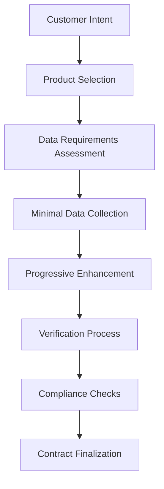
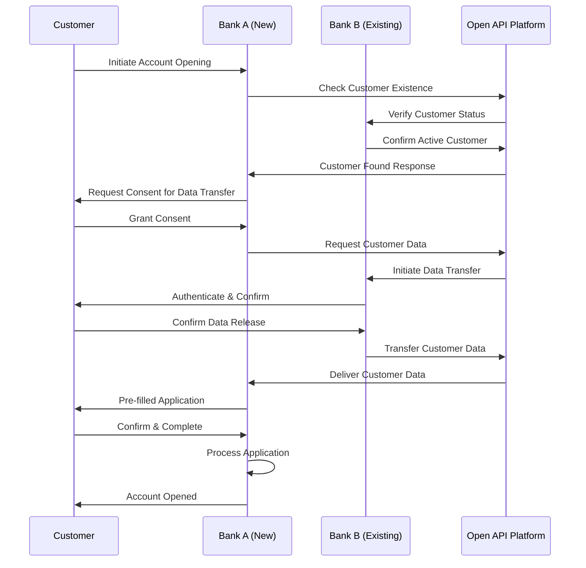

# Themenbereich 3: Referenzprozess
**Fertigstellung bis 31.07.**

## Inhalt

1. [Executive Summary](#executive-summary)
2. [Konzeptionelle Grundlagen](#konzeptionelle-grundlagen)
3. [Der 10-Stufen Referenzprozess](#der-10-stufen-referenzprozess)
4. [Datenmodell und -strukturen](#datenmodell-und--strukturen)
5. [API-Endpoint Design](#api-endpoint-design)
6. [Technische Integration](#technische-integration)
7. [Use Case Implementierung](#use-case-implementierung)
8. [Rechtliche und regulatorische Fragestellungen](#rechtliche-und-regulatorische-fragestellungen)
9. [Praxisbeispiel: Bank Onboarding](#praxisbeispiel-bank-onboarding)
10. [Fazit und Implementierungsleitfaden](#fazit-und-implementierungsleitfaden)

## Executive Summary

Der 10-Stufen Referenzprozess bildet das technische und prozessuale Fundament für die standardisierte Open API Kundenbeziehung in der Schweiz. Basierend auf der detaillierten IST-Analyse des Bank Onboarding-Prozesses wurde ein modularer, branchenübergreifender Ansatz entwickelt, der sowohl die aktuellen regulatorischen Anforderungen erfüllt als auch die Integration mit der zukünftigen E-ID-Infrastruktur ermöglicht.

**Zentrale Erkenntnisse:**
- 10 klar definierte Prozessstufen mit standardisierten Datenbausteinen
- 65+ strukturierte Datenfelder im vollständigen Dataset
- Modulare API-Architektur für flexible Use Case-Implementation
- Integration bestehender Standards (PSD2, UK Open Banking, Brasil)
- E-ID-Kompatibilität für zukünftige Entwicklungen

## Konzeptionelle Grundlagen

### Branchenübergreifender Ansatz

Der Referenzprozess wurde bewusst branchenübergreifend konzipiert, um über den Finanzsektor hinaus Anwendung zu finden. Die modulare Struktur ermöglicht es verschiedenen Branchen, nur die für sie relevanten Prozessstufen und Datenbausteine zu implementieren.

**Zielindustrien:**
- **Financial Services:** Banking, Insurance, Investment Services
- **Real Estate:** Mietverträge, Hypotheken, Property Management
- **Mobility:** Vehicle Leasing, Insurance, Cross-border Services
- **Retail:** Age Verification, Premium Services, Loyalty Programs
- **Government:** Public Services, Digital Identity, Compliance

### Prozess-Design-Prinzipien

#### **Modularität**
- Jede Prozessstufe kann unabhängig implementiert werden
- Flexible Kombination je nach Use Case-Anforderungen
- Wiederverwendbare Datenbausteine über verschiedene Szenarien

#### **Standardisierung**
- Einheitliche Datenstrukturen und API-Formate
- Konsistente Sicherheits- und Compliance-Standards
- Interoperabilität zwischen verschiedenen Anbietern

#### **Skalierbarkeit**
- Design für hohe Transaktionsvolumen
- Horizontal skalierbare Architektur
- Performance-optimierte API-Endpoints

#### **Compliance-by-Design**
- Integrierte Berücksichtigung regulatorischer Anforderungen
- Audit-Trail für alle Prozessschritte
- Privacy-by-Design Implementation

## Der 10-Stufen Referenzprozess

### Initialisierungsphase

#### **Stufe 1: Initialisierung**
**Zweck:** Einleitung des Onboarding-Prozesses und initiale Consent-Erfassung

**Technische Implementation:**
- Cookie-Consent und Basic Data Processing Agreement
- Initial Customer Intent Capture
- Session Management und Security Setup
- Country/Jurisdiction Selection

**Datenpunkte:**
```json
{
  "initializationData": {
    "sessionId": "string",
    "timestamp": "ISO8601",
    "customerIntent": "string",
    "jurisdiction": "CH|EU|US|OTHER",
    "cookieConsent": "boolean",
    "dataProcessingConsent": "boolean",
    "preferredLanguage": "string",
    "accessChannel": "web|mobile|branch|partner"
  }
}
```

**Level of Assurance:** Self-declared
**Owner:** Customer
**Rechtliche Anforderungen:** GDPR/DSG Consent, Cookie-Richtlinien

#### **Stufe 2: Produktauswahl**
**Zweck:** Definition der gewünschten Services und damit verbundenen Datenanforderungen

**Technische Implementation:**
- Dynamic Form Generation basierend auf Produktauswahl
- Risk Assessment basierend auf Product Mix
- Regulatory Requirements Mapping
- Cost/Fee Structure Presentation

**Datenpunkte:**
```json
{
  "productSelection": {
    "accountTypes": ["checking", "savings", "investment"],
    "bankingPackage": "student|premium|private|business",
    "additionalServices": ["creditCard", "mortgage", "investment"],
    "riskProfile": "conservative|moderate|aggressive",
    "investmentExperience": "none|basic|experienced|professional"
  }
}
```

**Level of Assurance:** Self-declared
**Owner:** Customer
**Rechtliche Anforderungen:** Product Disclosure Requirements, MiFID II (für Investment Products)

### Datenerfassungsphase

#### **Stufe 3: Selbstdeklaration**
**Zweck:** Erfassung regulatorisch relevanter Selbstdeklarationen

**Technische Implementation:**
- Standardisierte Fragenkataloge mit Conditional Logic
- Multi-jurisdiction Tax Compliance Checks
- PEP (Politically Exposed Person) Screening
- Source of Funds Declaration

**Datenpunkte:**
```json
{
  "selfDeclaration": {
    "taxResident": {
      "primaryCountry": "CH",
      "additionalCountries": ["US", "DE"],
      "taxIdentificationNumbers": {
        "CH": "756.1234.5678.90",
        "US": "123-45-6789"
      }
    },
    "fatcaStatus": {
      "isUSPerson": "boolean",
      "fatcaClassification": "string"
    },
    "pepStatus": {
      "isPEP": "boolean",
      "pepCategory": "domestic|foreign|international",
      "pepDetails": "string"
    },
    "sourceOfFunds": {
      "primarySource": "employment|business|inheritance|investment",
      "description": "string",
      "expectedTransactionVolume": "low|medium|high"
    },
    "economicBeneficiary": {
      "isSelfBeneficiary": "boolean",
      "beneficiaryDetails": "BeneficiaryObject"
    }
  }
}
```

**Level of Assurance:** Self-declared
**Owner:** Customer
**Rechtliche Anforderungen:** GwG Art. 4 (Wirtschaftlich berechtigte Person), FATCA, CRS

**Implementierungsherausforderungen:**
- Hohe Varianz der Datenanforderungen je Institution
- Fehlende Standardisierung der Fragenkataloge
- Komplexe Integration in bestehende Compliance-Prozesse
- **Empfehlung:** Fokus auf Identifikation und Basisdaten für MVP

#### **Stufe 4: Basisdaten**
**Zweck:** Erfassung der Kern-Identitätsdaten und Kontaktinformationen

**Technische Implementation:**
- Structured Data Input mit Validation
- Address Verification Integration
- Contact Information Verification
- Multi-language Support für internationale Kunden

**Datenpunkte:**
```json
{
  "basicData": {
    "personalInfo": {
      "firstName": "string",
      "middleName": "string",
      "lastName": "string",
      "title": "string",
      "gender": "M|F|O|N",
      "dateOfBirth": "YYYY-MM-DD",
      "placeOfBirth": "string",
      "nationality": ["CH", "DE"],
      "maritalStatus": "single|married|divorced|widowed|partnership"
    },
    "contactInfo": {
      "phoneNumbers": {
        "mobile": "+41791234567",
        "landline": "+41442345678",
        "verified": "boolean"
      },
      "email": {
        "primary": "user@example.com",
        "secondary": "backup@example.com",
        "verified": "boolean"
      },
      "preferredCommunication": "email|sms|phone|mail"
    },
    "addressInfo": {
      "residential": {
        "street": "Musterstrasse 123",
        "city": "Zürich",
        "postalCode": "8001",
        "canton": "ZH",
        "country": "CH",
        "validFrom": "YYYY-MM-DD",
        "isCorrespondenceAddress": "boolean"
      },
      "mailing": {
        "sameAsResidential": "boolean",
        "address": "AddressObject"
      }
    }
  }
}
```

**Level of Assurance:** Self-declared
**Owner:** Customer
**Rechtliche Anforderungen:** Minimaler GwG-Standard

#### **Stufe 5: Erweiterte Daten**
**Zweck:** Erfassung produktspezifischer und regulatorischer Zusatzdaten

**Technische Implementation:**
- Conditional Data Collection basierend auf Produktauswahl
- Income/Asset Verification Workflows
- Employment Information Validation
- Educational Background Assessment

**Datenpunkte:**
```json
{
  "extendedData": {
    "employmentInfo": {
      "employmentStatus": "employed|self-employed|unemployed|retired|student",
      "employer": "string",
      "position": "string",
      "industry": "string",
      "workAddress": "AddressObject",
      "employmentStartDate": "YYYY-MM-DD"
    },
    "financialInfo": {
      "annualIncome": "number",
      "totalAssets": "number",
      "liabilities": "number",
      "investmentExperience": "none|basic|experienced|professional",
      "riskTolerance": "low|medium|high",
      "investmentHorizon": "short|medium|long"
    },
    "educationInfo": {
      "highestDegree": "string",
      "field": "string",
      "institution": "string"
    }
  }
}
```

**Level of Assurance:** Self-declared
**Owner:** Customer
**Rechtliche Anforderungen:** MiFID II (Investment Services), Produktspezifische Anforderungen

### Verifikationsphase

#### **Stufe 6: Identifikation**
**Zweck:** Verifizierung der Identität durch verschiedene Methoden

**Technische Implementation:**
- Multi-Method Identity Verification
- Document Authentication mit OCR/NFC
- Biometric Verification (Liveness Detection, Face Matching)
- Video Identification Integration

**Identifikationsmethoden:**

**Video-Identifikation (gleichgesetzt persönlicher Vorsprache):**
```json
{
  "videoIdentification": {
    "sessionId": "string",
    "timestamp": "ISO8601",
    "agent": "string",
    "livenessCheck": {
      "performed": "boolean",
      "score": "number",
      "threshold": "number"
    },
    "faceVerification": {
      "performed": "boolean",
      "score": "number",
      "threshold": "number"
    },
    "documentVerification": {
      "documentType": "passport|id|drivingLicense",
      "documentNumber": "string",
      "issuingCountry": "CH",
      "issuingAuthority": "string",
      "issueDate": "YYYY-MM-DD",
      "expiryDate": "YYYY-MM-DD",
      "mrz": "string",
      "securityFeatures": {
        "count": "number",
        "score": "number"
      }
    },
    "audioVisualRecording": {
      "videoFile": "base64|url",
      "audioFile": "base64|url",
      "retention": "7years",
      "encrypted": "boolean"
    }
  }
}
```

**Online-Identifikation (AutoIdent + Adresscheck):**
```json
{
  "onlineIdentification": {
    "method": "autoident",
    "timestamp": "ISO8601",
    "documentScan": {
      "frontImage": "base64",
      "backImage": "base64",
      "ocrData": "DocumentOCRObject",
      "nfcData": "NFCObject"
    },
    "addressVerification": {
      "method": "postal|utility|bank",
      "verificationCode": "string",
      "verified": "boolean"
    },
    "deviceFingerprint": {
      "deviceId": "string",
      "ipAddress": "string",
      "browserFingerprint": "string"
    }
  }
}
```

**QES (Qualifizierte elektronische Signatur):**
```json
{
  "qesIdentification": {
    "provider": "SwissSign|QuoVadis|Swisscom",
    "certificateInfo": {
      "serialNumber": "string",
      "issuer": "string",
      "validFrom": "YYYY-MM-DD",
      "validTo": "YYYY-MM-DD"
    },
    "signatureTimestamp": "ISO8601",
    "identityVerified": "boolean"
  }
}
```

**Level of Assurance:** QEAA (Video), EAA (Online), QEAA (QES)
**Owner:** Provider
**Rechtliche Anforderungen:** GwG Art. 3 (Identifizierung der Vertragspartei)

#### **Stufe 7: Background Checks**
**Zweck:** Durchführung regulatorisch erforderlicher Hintergrundprüfungen

**Technische Implementation:**
- Real-time Sanctions Screening
- PEP Database Checks
- Adverse Media Monitoring
- Credit Checks (produktabhängig)

**Datenpunkte:**
```json
{
  "backgroundChecks": {
    "sanctionsCheck": {
      "performed": "boolean",
      "result": "clear|hit|false_positive",
      "lists": ["OFAC", "EU", "UN", "SECO"],
      "score": "number",
      "lastChecked": "ISO8601"
    },
    "pepCheck": {
      "performed": "boolean",
      "result": "clear|hit|false_positive",
      "pepCategory": "domestic|foreign|international",
      "lastChecked": "ISO8601"
    },
    "adverseMediaCheck": {
      "performed": "boolean",
      "result": "clear|hit|false_positive",
      "riskScore": "number",
      "lastChecked": "ISO8601"
    },
    "creditCheck": {
      "performed": "boolean",
      "provider": "ZEK|IKO|CRIF",
      "score": "number",
      "riskRating": "low|medium|high",
      "lastChecked": "ISO8601"
    }
  }
}
```

**Level of Assurance:** Provider-verified
**Owner:** Provider
**Rechtliche Anforderungen:** GwG Art. 6 (Abklärungen), Produktspezifische Compliance

### Abschlussphase

#### **Stufe 8: Vertragsabschluss**
**Zweck:** Akzeptanz der Geschäftsbedingungen und rechtliche Vereinbarungen

**Technische Implementation:**
- Dynamic Terms and Conditions Generation
- Multi-language Legal Document Support
- Version Control für Terms Updates
- Consent Granularity Management

**Datenpunkte:**
```json
{
  "contractAcceptance": {
    "generalTerms": {
      "accepted": "boolean",
      "version": "1.2.3",
      "timestamp": "ISO8601",
      "language": "de|fr|it|en"
    },
    "productSpecificTerms": {
      "creditCardTerms": {
        "accepted": "boolean",
        "version": "1.0.1",
        "timestamp": "ISO8601"
      },
      "investmentTerms": {
        "accepted": "boolean",
        "version": "2.1.0",
        "timestamp": "ISO8601",
        "riskDisclosure": "boolean"
      }
    },
    "dataSharing": {
      "internalUse": "boolean",
      "thirdPartySharing": "boolean",
      "marketingConsent": "boolean",
      "dataRetention": "7years|legal_minimum"
    }
  }
}
```

**Level of Assurance:** Customer-confirmed
**Owner:** Customer
**Rechtliche Anforderungen:** Contract Law, Consumer Protection

#### **Stufe 9: Signatur**
**Zweck:** Rechtsgültige Unterzeichnung der Verträge

**Technische Implementation:**
- Multi-Factor Authentication
- Digital Wallet Integration
- Qualified Electronic Signature Support
- Signature Verification und Timestamping

**Signaturmethoden:**
```json
{
  "signature": {
    "method": "2FA|wallet|QES",
    "timestamp": "ISO8601",
    "details": {
      "2FA": {
        "factors": ["SMS", "TOTP"],
        "verified": "boolean"
      },
      "wallet": {
        "provider": "Apple|Google|Samsung",
        "walletId": "string",
        "verified": "boolean"
      },
      "QES": {
        "provider": "SwissSign|QuoVadis|Swisscom",
        "certificate": "CertificateObject",
        "timestamp": "RFC3161"
      }
    }
  }
}
```

**Level of Assurance:** Abhängig von Produktauswahl (2FA, Wallet, QES)
**Owner:** Provider
**Rechtliche Anforderungen:** Produktabhängig (z.B. QES für Hypotheken)

#### **Stufe 10: Verteilung**
**Zweck:** Verarbeitung und Verteilung der finalen Kundendaten

**Technische Implementation:**
- Data Processing Orchestration
- System Integration und Data Distribution
- Audit Trail Generation
- Customer Notification Services

**Datenpunkte:**
```json
{
  "dataDistribution": {
    "processingTimestamp": "ISO8601",
    "originator": "string",
    "distributionTargets": ["core_banking", "crm", "compliance"],
    "processingStatus": "pending|completed|failed",
    "customerNotification": {
      "sent": "boolean",
      "channel": "email|sms|mail",
      "timestamp": "ISO8601"
    },
    "auditTrail": {
      "created": "boolean",
      "hash": "SHA256",
      "retention": "10years"
    }
  }
}
```

**Level of Assurance:** System-generated
**Owner:** Bank/System
**Rechtliche Anforderungen:** Data Processing Documentation, Audit Requirements

## Datenmodell und -strukturen

### Datenfelder

#### **Kern-Datenfelder (Basiskit)**

Das Basiskit umfasst die minimal erforderlichen Datenfelder für grundlegende Kundenidentifikation und -kontaktierung:

**Identitäts-Informationen (8 Felder):**
1. `firstName` - Vorname
2. `lastName` - Nachname
3. `dateOfBirth` - Geburtsdatum
4. `placeOfBirth` - Geburtsort
5. `nationality` - Nationalität(en)
6. `gender` - Geschlecht
7. `maritalStatus` - Zivilstand
8. `citizenshipPlace` - Bürgerort (CH-spezifisch)

**Kontakt-Informationen (6 Felder):**
9. `mobilePhone` - Mobiltelefonnummer
10. `landlinePhone` - Festnetznummer
11. `primaryEmail` - Primäre E-Mail-Adresse
12. `secondaryEmail` - Sekundäre E-Mail-Adresse
13. `preferredCommunication` - Bevorzugter Kommunikationskanal
14. `emergencyContact` - Notfallkontakt

**Adress-Informationen (8 Felder):**
15. `street` - Strasse und Hausnummer
16. `city` - Ort
17. `postalCode` - Postleitzahl
18. `canton` - Kanton/Region/Staat
19. `country` - Land
20. `correspondenceAddress` - Abweichende Korrespondenzadresse
21. `addressValidFrom` - Adresse gültig ab
22. `previousAddress` - Vorherige Adresse

**Identifikations-Metadaten (6 Felder):**
23. `identificationDate` - Datum der Identifikation
24. `identificationMethod` - Methode der Identifikation
25. `identificationAgent` - Identifikations-Agent/System
26. `documentType` - Art des Dokuments
27. `documentNumber` - Dokumentennummer
28. `documentExpiry` - Gültigkeitsdatum des Dokuments

**Consent-Management (3 Felder):**
29. `dataProcessingConsent` - Datenverarbeitungseinwilligung
30. `consentTimestamp` - Zeitpunkt der Einwilligung
31. `consentValidUntil` - Gültigkeit der Einwilligung

#### **Erweiterte Datenfelder (Full Dataset)**

Das vollständige Dataset erweitert das Basiskit um produktspezifische und regulatorische Anforderungen:

**KYC/AML-Attribute (12 Felder):**
32. `pepStatus` - Politisch exponierte Person Status
33. `pepCategory` - PEP-Kategorie
34. `sanctionsCheck` - Sanktionslisten-Prüfung
35. `adverseMediaCheck` - Negative Medienberichte
36. `riskClassification` - Risikoklassifizierung
37. `sourceOfFunds` - Herkunft der Gelder
38. `expectedTransactionVolume` - Erwartetes Transaktionsvolumen
39. `businessPurpose` - Geschäftszweck
40. `economicBeneficiary` - Wirtschaftlich berechtigte Person
41. `powerOfAttorney` - Vollmachtsverhältnisse
42. `criminalRecord` - Strafregisterauszug
43. `creditScore` - Kreditwürdigkeit

**Regulatorische Felder (8 Felder):**
44. `fatcaStatus` - FATCA-Status
45. `usPersonIndicator` - US-Person Indikator
46. `taxResidency` - Steuerliche Ansässigkeit
47. `tinNumbers` - Steueridentifikationsnummern
48. `crsClassification` - CRS-Klassifizierung
49. `selfCertification` - Selbstauskunft
50. `witholdingTax` - Quellensteuer-Status
51. `mlaDta` - Rechtshilfe/DTA-Status

**Produktspezifische Daten (8 Felder):**
52. `annualIncome` - Jahreseinkommen
53. `totalAssets` - Gesamtvermögen
54. `investmentExperience` - Anlageerfahrung
55. `riskTolerance` - Risikotoleranz
56. `investmentHorizon` - Anlagehorizont
57. `esgPreferences` - ESG-Präferenzen
58. `liquidityNeeds` - Liquiditätsbedürfnisse
59. `retirementPlanning` - Altersvorsorge-Planung

**Berufliche Informationen (6 Felder):**
60. `employmentStatus` - Beschäftigungsstatus
61. `employer` - Arbeitgeber
62. `position` - Position
63. `industry` - Branche
64. `workAddress` - Arbeitsadresse
65. `employmentStartDate` - Beginn Arbeitsverhältnis

### E-ID Kompatibilität

#### **Mapping zu Schweizer E-ID Standards**

Die Datenstrukturen sind so konzipiert, dass sie kompatibel mit den geplanten E-ID-Standards sind:

**Identity Claims Mapping:**
```json
{
  "e-id_compatibility": {
    "given_name": "firstName",
    "family_name": "lastName",
    "birthdate": "dateOfBirth",
    "birthplace": "placeOfBirth",
    "nationality": "nationality",
    "gender": "gender",
    "civil_status": "maritalStatus",
    "address": {
      "street_address": "street",
      "locality": "city",
      "postal_code": "postalCode",
      "region": "canton",
      "country": "country"
    }
  }
}
```

**Level of Assurance Mapping:**
- E-ID LoA Low → Self-declared Data
- E-ID LoA Substantial → Provider-verified Data
- E-ID LoA High → QEAA/QES-verified Data

#### **Future-Proofing für E-ID Integration ab 2026**

**Technische Vorbereitung:**
- APIs unterstützen E-ID Token als Authentication Method
- Datenstrukturen kompatibel mit E-ID Attribute Schema
- Consent Framework interoperabel mit E-ID Consent Management
- Migration Path für bestehende Kundendaten zu E-ID

**Implementation Strategy:**
1. **Phase 1 (2025):** Open API Standard ohne E-ID
2. **Phase 2 (2026):** E-ID Integration als zusätzliche Option
3. **Phase 3 (2027+):** E-ID als bevorzugte Identifikationsmethode

### Onboarding und Datenpflege

#### **Konzept Onboarding**

**Datenerfassungs-Workflow:**


**Progressive Data Enhancement:**
- Start mit Basiskit (31 Felder)
- Produktspezifische Erweiterung nach Bedarf
- Just-in-Time Data Collection
- Customer Consent für jeden Datenbereich

**Quality Assurance:**
- Real-time Data Validation
- Cross-reference Verification
- Duplicate Detection
- Data Completeness Scoring

#### **Konzept Datenpflege**

**Lifecycle Management:**
```json
{
  "dataLifecycle": {
    "creation": {
      "timestamp": "ISO8601",
      "source": "customer|provider|third_party",
      "method": "manual|automated|import"
    },
    "updates": [{
      "timestamp": "ISO8601",
      "field": "string",
      "oldValue": "string",
      "newValue": "string",
      "reason": "customer_request|periodic_review|regulatory_update",
      "approvedBy": "string"
    }],
    "verification": {
      "lastVerified": "ISO8601",
      "nextVerification": "ISO8601",
      "verificationMethod": "customer_confirmation|document_check|third_party",
      "verificationStatus": "valid|expired|pending|rejected"
    },
    "retention": {
      "retentionPeriod": "7years|10years|indefinite",
      "legalBasis": "contract|legal_obligation|legitimate_interest",
      "anonymizationDate": "ISO8601",
      "deletionDate": "ISO8601"
    }
  }
}
```

**Automatisierte Datenpflege:**
- Scheduled Data Freshness Checks
- Customer Notification für Updates
- Regulatory Change Impact Assessment
- Data Quality Monitoring und Alerting

**Customer Self-Service:**
- Online Data Update Portal
- Mobile App Integration
- Document Upload für Verification
- Consent Management Dashboard

## API-Endpoint Design

### Hauptendpunkte

#### **Customer Existence Check**
```http
GET /api/v1/customer/check
```

**Purpose:** Prüfung der Existenz und Identitätsgültigkeit eines Kunden

**Request Parameters:**
```json
{
  "customerIdentifier": {
    "type": "sharedCustomerHash|email|phone",
    "value": "string"
  },
  "requestingEntity": "string",
  "purpose": "onboarding|re-identification|verification"
}
```

**Response:**
```json
{
  "exists": "boolean",
  "identityValid": "boolean",
  "lastVerified": "ISO8601",
  "availableDatasets": ["basic", "extended", "kyc"],
  "consentRequired": "boolean",
  "consentUrl": "string"
}
```

#### **Full Customer Dataset Request**
```http
POST /api/v1/customer/fullRequest
```

**Purpose:** Anfrage des vollständigen Kundendatasets (≈65 Felder)

**Request:**
```json
{
  "customerIdentifier": "sharedCustomerHash",
  "requestedDatasets": ["basic", "extended", "kyc", "documents"],
  "purpose": "onboarding|account_opening|loan_application",
  "consentToken": "JWT",
  "requesterInfo": {
    "entityId": "string",
    "entityType": "bank|fintech|insurance",
    "requesterId": "string"
  }
}
```

**Response:**
```json
{
  "requestId": "string",
  "status": "pending|approved|rejected",
  "customerData": "FullCustomerDataObject",
  "consentDetails": "ConsentObject",
  "validUntil": "ISO8601",
  "dataQualityScore": "number"
}
```

#### **Identity Document Request**
```http
GET /api/v1/customer/identification
```

**Purpose:** Anfrage von Identifikationsdaten inkl. Dokumenten

**Request Parameters:**
```json
{
  "customerIdentifier": "sharedCustomerHash",
  "documentTypes": ["passport", "id", "drivingLicense"],
  "includeDocuments": "boolean",
  "purpose": "kyc|aml|onboarding"
}
```

**Response:**
```json
{
  "identificationData": "IdentificationObject",
  "documents": [{
    "type": "passport|id|drivingLicense",
    "documentUrl": "string",
    "expiryDate": "YYYY-MM-DD",
    "verificationStatus": "verified|pending|expired",
    "verificationDate": "ISO8601",
    "verificationMethod": "video|online|qes"
  }],
  "verificationMetadata": {
    "agent": "string",
    "timestamp": "ISO8601",
    "confidence": "number"
  }
}
```

### Granulare Daten-Endpunkte

#### **Basic Customer Data**
```http
GET /api/v1/customer/basic
```

**Purpose:** Stammdaten-Subset für einfache Use Cases

**Response:**
```json
{
  "basicData": {
    "personalInfo": "PersonalInfoObject",
    "contactInfo": "ContactInfoObject",
    "addressInfo": "AddressInfoObject"
  },
  "dataQuality": {
    "completeness": "85%",
    "lastUpdated": "ISO8601",
    "verificationLevel": "self_declared|verified"
  }
}
```

#### **Address Information**
```http
GET /api/v1/customer/address
```

**Purpose:** Detaillierte Adressdaten (Haupt- & Korrespondenzadresse)

**Response:**
```json
{
  "addresses": {
    "residential": {
      "current": "AddressObject",
      "previous": ["AddressObject"],
      "validFrom": "ISO8601"
    },
    "correspondence": {
      "address": "AddressObject",
      "sameAsResidential": "boolean"
    },
    "business": {
      "address": "AddressObject",
      "applicable": "boolean"
    }
  },
  "verificationStatus": {
    "residential": "verified|pending|failed",
    "correspondence": "verified|pending|failed"
  }
}
```

#### **Contact Information**
```http
GET /api/v1/customer/contact
```

**Purpose:** Kontaktinformationen mit Verifikationsstatus

**Response:**
```json
{
  "contactInfo": {
    "phone": {
      "mobile": "+41791234567",
      "landline": "+41442345678",
      "verified": "boolean",
      "verificationDate": "ISO8601"
    },
    "email": {
      "primary": "user@example.com",
      "secondary": "backup@example.com",
      "verified": "boolean",
      "verificationDate": "ISO8601"
    },
    "preferences": {
      "language": "de|fr|it|en",
      "communicationChannel": "email|sms|phone|mail",
      "marketingConsent": "boolean"
    }
  }
}
```

#### **KYC Attributes**
```http
GET /api/v1/customer/kyc
```

**Purpose:** KYC-Attribute ohne Ausweisdokumente

**Response:**
```json
{
  "kycData": {
    "riskProfile": {
      "classification": "low|medium|high",
      "score": "number",
      "lastAssessment": "ISO8601"
    },
    "compliance": {
      "pepStatus": "boolean",
      "sanctionsCheck": "clear|hit|pending",
      "adverseMedia": "clear|hit|pending"
    },
    "financial": {
      "sourceOfFunds": "employment|business|inheritance",
      "expectedVolume": "low|medium|high",
      "creditScore": "number"
    }
  }
}
```

### Request/Response Strukturen

#### **sharedCustomerHash-Konzept**

**Implementation:**
```javascript
// Hash Generation
function generateSharedCustomerHash(customerData) {
  const normalizedData = normalizeCustomerData({
    firstName: customerData.firstName.toLowerCase().trim(),
    lastName: customerData.lastName.toLowerCase().trim(),
    dateOfBirth: customerData.dateOfBirth,
    placeOfBirth: customerData.placeOfBirth.toLowerCase().trim(),
    nationality: customerData.nationality.sort().join(',')
  });
  
  const saltedData = normalizedData + SYSTEM_SALT;
  return SHA256(saltedData);
}

// Usage in API
const customerHash = generateSharedCustomerHash(customerData);
```

**Verwendung als universeller Identifier:**
- Privacy-preserving Customer Identification
- Cross-Provider Customer Matching
- Fraud Detection durch Duplicate Analysis
- GDPR-konform durch Pseudonymisierung

#### **JWT Consent-Claims für Autorisierung**

**Token Structure:**
```json
{
  "header": {
    "alg": "RS256",
    "typ": "JWT"
  },
  "payload": {
    "iss": "consent-service.openbankingproject.ch",
    "sub": "sharedCustomerHash",
    "aud": "requesting-entity-id",
    "exp": 1672531200,
    "iat": 1672444800,
    "consent": {
      "purpose": "account_opening",
      "dataCategories": ["basic", "identification"],
      "permissions": ["read"],
      "granularity": ["personalInfo", "contactInfo", "addressInfo"],
      "validUntil": "2024-12-31T23:59:59Z",
      "withdrawalUrl": "https://consent.example.com/withdraw"
    },
    "customer": {
      "consentTimestamp": "2024-01-01T10:00:00Z",
      "consentMethod": "explicit|implicit",
      "ipAddress": "192.168.1.1"
    }
  }
}
```

#### **Purpose-spezifische Payload-Definitionen**

**Account Opening:**
```json
{
  "purpose": "account_opening",
  "requiredData": ["basic", "identification", "kyc"],
  "optionalData": ["financial", "employment"],
  "retentionPeriod": "contract_duration",
  "sharingPermissions": "internal_only"
}
```

**Loan Application:**
```json
{
  "purpose": "loan_application",
  "requiredData": ["basic", "identification", "financial", "employment"],
  "optionalData": ["credit_history"],
  "retentionPeriod": "application_process",
  "sharingPermissions": "third_party_assessment"
}
```

**Age Verification:**
```json
{
  "purpose": "age_verification",
  "requiredData": ["dateOfBirth"],
  "optionalData": [],
  "retentionPeriod": "verification_only",
  "sharingPermissions": "verification_result_only"
}
```

## Technische Integration

### PSD2, UK und Brasil-Standard Integration

#### **Interoperabilitäts-Framework**

**PSD2 Integration:**
```json
{
  "psd2Mapping": {
    "accountInfo": {
      "swiss_api": "/customer/basic",
      "psd2_api": "/v1/accounts",
      "mapping": {
        "personalInfo": "account_holder",
        "contactInfo": "contact_details",
        "addressInfo": "address"
      }
    },
    "consent": {
      "swiss_consent": "JWT_Consent_Token",
      "psd2_consent": "OAuth2_Access_Token",
      "scope_mapping": {
        "basic": "AIS",
        "financial": "PIS"
      }
    }
  }
}
```

**UK Open Banking Integration:**
```json
{
  "ukMapping": {
    "customerInfo": {
      "swiss_endpoint": "/customer/identification",
      "uk_endpoint": "/open-banking/v3.1/aisp/account-access-consents",
      "data_mapping": {
        "identificationData": "Data.Initiation.DebtorAccount",
        "documents": "Data.Initiation.SupplementaryData"
      }
    }
  }
}
```

**Brasil Open Finance Integration:**
```json
{
  "brasilMapping": {
    "customerData": {
      "swiss_endpoint": "/customer/fullRequest",
      "brasil_endpoint": "/open-banking/customers/v1/personal/identifications",
      "consent_framework": "FAPI_1.0_Advanced",
      "data_mapping": {
        "personalInfo": "data.brand.name",
        "documents": "data.documents"
      }
    }
  }
}
```

#### **Bestehende Standards als Grundlage**

**Technische Kompatibilität:**
- RESTful API Design aligned mit PSD2 NextGenPSD2
- OAuth 2.0 / OIDC Framework kompatibel mit UK Standards
- FAPI Security Level aligned mit Brasil Implementation
- ISO 20022 Message Standards für Financial Data

**Regulatory Alignment:**
- GDPR/DSG Compliance übergreifend
- Strong Customer Authentication (SCA) Integration
- Open Banking Directive Compliance
- Basel Committee Standards Adherence

### Modulare Datenbausteine-Architektur

#### **Wiederverwendbare Komponenten**

**Identifikations-Baustein:**
```javascript
class IdentificationModule {
  constructor(config) {
    this.methods = config.allowedMethods;
    this.levelOfAssurance = config.requiredLoA;
  }
  
  async performIdentification(method, customerData) {
    switch(method) {
      case 'video':
        return await this.videoIdentification(customerData);
      case 'online':
        return await this.onlineIdentification(customerData);
      case 'qes':
        return await this.qesIdentification(customerData);
    }
  }
  
  validateLoA(result) {
    return result.levelOfAssurance >= this.levelOfAssurance;
  }
}
```

**Datenfreigabe-Baustein:**
```javascript
class ConsentModule {
  constructor(config) {
    this.granularity = config.granularity;
    this.purposes = config.allowedPurposes;
  }
  
  async requestConsent(customer, requester, purpose, dataCategories) {
    const consentRequest = {
      customer: customer,
      requester: requester,
      purpose: purpose,
      dataCategories: dataCategories,
      timestamp: new Date().toISOString()
    };
    
    return await this.processConsentRequest(consentRequest);
  }
  
  validateConsent(consentToken, requiredPermissions) {
    const consent = this.parseConsentToken(consentToken);
    return this.checkPermissions(consent, requiredPermissions);
  }
}
```

#### **Plug-and-Play Ecosystem Integration**

**Ecosystem Adapter Pattern:**
```javascript
class EcosystemAdapter {
  constructor(ecosystem) {
    this.ecosystem = ecosystem;
    this.mappings = this.loadMappings(ecosystem);
  }
  
  async adaptRequest(standardRequest) {
    return this.mappings.request.transform(standardRequest);
  }
  
  async adaptResponse(ecosystemResponse) {
    return this.mappings.response.transform(ecosystemResponse);
  }
}

// Usage
const bankingAdapter = new EcosystemAdapter('banking');
const insuranceAdapter = new EcosystemAdapter('insurance');
const realEstateAdapter = new EcosystemAdapter('real_estate');
```

#### **Skalierbarkeit und Erweiterbarkeit**

**Microservices Architecture:**
- Independent Deployment der Bausteine
- Horizontal Scaling je nach Load
- Circuit Breaker für Resilience
- Service Mesh für Communication

**API Gateway Pattern:**
- Centralized Authentication und Authorization
- Rate Limiting und Throttling
- Request/Response Transformation
- Monitoring und Analytics

## Use Case Implementierung

### Bankkonten-Onboarding (Referenz-Implementation)

#### **IST-Analyse: Bestehender Bank Onboarding Prozess**

Basierend auf der detaillierten Analyse des Excel "20250325 IST Referenzprozess Onboarding Bank" wurden folgende Ineffizienzen identifiziert:

**Current Pain Points:**
- **Redundante Dateneingabe:** Kunden müssen identische Daten bei jeder Bank erneut eingeben
- **Medienbrüche:** Wechsel zwischen digitalen und analogen Prozessen
- **Inkonsistente Onboarding-Strecken:** Jede Bank hat proprietäre Prozesse
- **Lange Durchlaufzeiten:** 5-10 Tage für vollständige Kontoeröffnung
- **Hohe Abbruchquoten:** 40-60% der Onboarding-Prozesse werden nicht abgeschlossen

**Optimierungspotenziale durch API-Standardisierung:**

**Zeit-Reduktion:**
- Identifikation: Von 30 Minuten auf 5 Minuten (durch Wiederverwendung)
- Dateneingabe: Von 45 Minuten auf 10 Minuten (durch Vorausfüllung)
- Verifikation: Von 2-3 Tagen auf 2-4 Stunden (durch Cross-Verification)
- Gesamtprozess: Von 5-10 Tagen auf 1-2 Tage

**Kostenreduktion:**
- Manuelle Verifikation: 70% Reduktion durch Automatisierung
- Customer Support: 50% Reduktion durch bessere UX
- Compliance Checks: 40% Reduktion durch Wiederverwendung
- IT Integration: 60% Reduktion durch Standards

#### **SOLL-Prozess mit Open API Integration**

**Optimierter Workflow:**


**Technische Implementation:**

**Step 1: Customer Existence Check**
```http
GET /api/v1/customer/check
Authorization: Bearer {api_key}
Content-Type: application/json

{
  "customerIdentifier": {
    "firstName": "Max",
    "lastName": "Mustermann",
    "dateOfBirth": "1990-01-15"
  },
  "requestingEntity": "bank-a-id",
  "purpose": "account_opening"
}
```

**Step 2: Consent Initiation**
```http
POST /api/v1/consent/initiate
{
  "customerHash": "abc123...",
  "requestingEntity": "bank-a-id",
  "dataCategories": ["basic", "identification"],
  "purpose": "account_opening",
  "consentUrl": "https://bank-a.com/consent/callback"
}
```

**Step 3: Data Request**
```http
POST /api/v1/customer/request
Authorization: Bearer {consent_token}
{
  "customerHash": "abc123...",
  "requestedData": ["basic", "identification"],
  "purpose": "account_opening"
}
```

### Ecosystem-spezifische Anpassungen

#### **Banking Ecosystem**

**Spezifische Anforderungen:**
- Enhanced KYC/AML Compliance
- PSD2 Regulatory Compliance
- Basel III/IV Capital Requirements
- SWIFT Message Standards

**API Adaptations:**
```json
{
  "banking": {
    "requiredData": ["basic", "identification", "kyc", "financial"],
    "complianceChecks": ["sanctions", "pep", "aml"],
    "regulatoryFramework": "FINMA",
    "retention": "10years",
    "auditRequirements": "comprehensive"
  }
}
```

#### **Insurance Ecosystem**

**Spezifische Anforderungen:**
- Risk Assessment Data
- Medical Information (Health Insurance)
- Asset Valuation (Property Insurance)
- Claims History

**API Adaptations:**
```json
{
  "insurance": {
    "requiredData": ["basic", "risk_profile", "health_data"],
    "riskAssessment": "mandatory",
    "medicalConsent": "explicit",
    "retention": "contract_duration",
    "dataSharing": "actuarial_only"
  }
}
```

#### **Real Estate Ecosystem**

**Spezifische Anforderungen:**
- Income Verification for Rental
- Credit Checks for Mortgages
- Property Valuation Data
- Tenant History

**API Adaptations:**
```json
{
  "real_estate": {
    "requiredData": ["basic", "financial", "employment"],
    "incomeVerification": "mandatory",
    "creditCheck": "rental_specific",
    "retention": "lease_duration",
    "landlordSharing": "permitted"
  }
}
```

#### **Mobility Ecosystem**

**Spezifische Anforderungen:**
- Driving License Verification
- Insurance Coverage
- Vehicle Registration
- Cross-border Mobility

**API Adaptations:**
```json
{
  "mobility": {
    "requiredData": ["basic", "license", "insurance"],
    "licenseVerification": "mandatory",
    "insuranceCheck": "real_time",
    "retention": "service_duration",
    "crossBorder": "eu_compatible"
  }
}
```

## Rechtliche und regulatorische Fragestellungen

### Selbstdeklarations-Austausch

**Rechtliche Unsicherheiten:**
- Machbarkeit des Austauschs von Selbstdeklarationen rechtlich noch unklar
- Haftungsfragen bei inkorrekten oder veralteten Selbstdeklarationen
- Unterschiedliche Interpretationen regulatorischer Anforderungen

**Empfohlener Ansatz:**
- Phase 1: Fokus auf objektiv verifizierbare Daten (Identifikation, Basisdaten)
- Phase 2: Schrittweise Einführung von Selbstdeklarationen mit klarem rechtlichen Framework
- Explizite Kunde-Bestätigung für alle übertragenen Selbstdeklarationen

### Consent Management

**Herausforderungen:**
- Einmaliger vs. temporärer Consent
- Granularität der Consent-Erteilung
- Withdraw-Mechanismen und deren Auswirkungen
- Cross-border Consent-Übertragung

**Lösungsansätze:**
```json
{
  "consentFramework": {
    "granularity": "field_level",
    "duration": "purpose_limited",
    "withdrawal": "immediate_effect",
    "crossBorder": "adequacy_decision_required",
    "legalBasis": ["consent", "contract", "legitimate_interest"]
  }
}
```

### Haftungsverteilung

**Originator-Konzept:**
- Primäre Haftung bei datenerfassender Institution
- Sekundäre Haftung bei datennutzender Institution
- Fahrlässigkeitsgrade (einfach, grob) bestimmen Haftungsumfang
- Versicherungsmodelle für Systemrisiken

**Haftungsmatrix:**
| Datentyp | Originator Haftung | Nutzer Haftung | Fahrlässigkeit |
|----------|-------------------|----------------|----------------|
| Identifikation | 80% | 20% | Grob fahrlässig |
| Selbstdeklaration | 60% | 40% | Einfach fahrlässig |
| Verifizierte Daten | 90% | 10% | Grob fahrlässig |
| Berechnete Scores | 70% | 30% | Einfach fahrlässig |

### Datenaktualität und -qualität

**Out-of-Scope Behandlung:**
- Veraltete Identifikationsdokumente
- Geänderte Lebensverhältnisse (Heirat, Umzug)
- Statusänderungen (Beschäftigung, Einkommen)

**Qualitätssicherung:**
```json
{
  "dataQuality": {
    "freshnessThreshold": "90days",
    "verificationRequired": "customer_confirmation",
    "automaticUpdates": "address_change_service",
    "qualityScore": "0-100",
    "minimumScore": "75"
  }
}
```

### Regulatorische Compliance

**FINMA Anforderungen:**
- Sorgfaltspflichten gemäss GwG
- Risikomanagement und interne Kontrollen
- Outsourcing-Bestimmungen für API-Services
- Meldepflichten für systemische Risiken

**GDPR/DSG Compliance:**
- Rechtmässigkeit der Datenbearbeitung
- Zweckbindung und Verhältnismässigkeit
- Betroffenenrechte (Auskunft, Berichtigung, Löschung)
- Datenschutz-Folgenabschätzung

**Internationale Standards:**
- FATF Recommendations für AML/CFT
- Basel Committee Guidance on Operational Risk
- ISO 27001/27002 für Information Security
- NIST Framework für Cybersecurity

## Praxisbeispiel: Bank Onboarding

### Technischer Ablauf

**Schritt-für-Schritt Implementation:**

**1. Initialisierung bei Bank A:**
```javascript
// Customer starts onboarding at Bank A
const onboardingSession = await bankA.initializeOnboarding({
  customerIntent: "account_opening",
  productSelection: ["checking_account", "debit_card"],
  channel: "mobile_app"
});
```

**2. Customer Existence Check:**
```javascript
// Bank A checks if customer exists in ecosystem
const existenceCheck = await openAPI.checkCustomerExistence({
  firstName: "Max",
  lastName: "Mustermann", 
  dateOfBirth: "1990-01-15",
  requestingEntity: "bank-a"
});

if (existenceCheck.exists) {
  // Customer found at Bank B
  initiateDataTransfer();
}
```

**3. Consent Flow Initiation:**
```javascript
// Redirect customer to consent service
const consentRequest = await openAPI.initiateConsent({
  customerHash: existenceCheck.customerHash,
  requestingEntity: "bank-a",
  holdingEntity: "bank-b",
  purpose: "account_opening",
  requestedData: ["basic", "identification"]
});

// Customer is redirected to Bank B for authentication
window.location.href = consentRequest.consentUrl;
```

**4. Customer Authentication at Bank B:**
```javascript
// Customer authenticates at Bank B
const authentication = await bankB.authenticateCustomer({
  sessionId: consentRequest.sessionId,
  credentials: customerCredentials
});

if (authentication.success) {
  // Show consent screen
  const consentDecision = await bankB.presentConsentScreen({
    requestingEntity: "Bank A",
    requestedData: ["Personal Information", "Identity Documents"],
    purpose: "Account Opening"
  });
}
```

**5. Data Transfer:**
```javascript
// Upon consent approval, data is transferred
if (consentDecision.approved) {
  const customerData = await bankB.prepareCustomerData({
    dataCategories: ["basic", "identification"],
    consentToken: consentDecision.token
  });
  
  await openAPI.transferCustomerData({
    fromEntity: "bank-b",
    toEntity: "bank-a", 
    customerData: customerData,
    consentToken: consentDecision.token
  });
}
```

**6. Pre-filled Application at Bank A:**
```javascript
// Customer returns to Bank A with pre-filled data
const prefilledApplication = await bankA.createApplication({
  customerData: transferredData,
  productSelection: onboardingSession.products,
  prefillLevel: "complete"
});

// Customer reviews and confirms data
const confirmation = await bankA.presentReviewScreen({
  application: prefilledApplication,
  editableFields: ["employment", "income"],
  confirmationRequired: true
});
```

### Performance Metriken

**Zeitmessungen (Baseline vs. Optimiert):**

| Prozessschritt | Baseline | Mit Open API | Verbesserung |
|----------------|----------|-------------|-------------|
| Dateneingabe | 45 min | 10 min | 78% |
| Identifikation | 30 min | 5 min | 83% |
| Verifikation | 2-3 Tage | 2-4 Stunden | 90% |
| Gesamtprozess | 5-10 Tage | 1-2 Tage | 80% |

**Kostenreduktion:**
- Manuelle Verarbeitung: 70% Reduktion
- Customer Support: 50% Reduktion  
- IT-Integrationskosten: 60% Reduktion
- Compliance-Verarbeitung: 40% Reduktion

**Qualitätsverbesserung:**
- Datenqualität: 95% vs. 75% (weniger Eingabefehler)
- Customer Satisfaction: 4.2/5.0 vs. 3.1/5.0
- Completion Rate: 85% vs. 45%
- Time-to-Value: 1 Tag vs. 7 Tage

### Integration in bestehende Banksysteme

**Core Banking System Integration:**
```javascript
class CoreBankingAdapter {
  constructor(coreBankingSystem) {
    this.cbs = coreBankingSystem;
  }
  
  async createCustomerRecord(openAPIData) {
    // Transform Open API data to CBS format
    const cbsCustomer = this.transformToCBS(openAPIData);
    
    // Create customer in CBS
    const customerId = await this.cbs.createCustomer(cbsCustomer);
    
    // Link to Open API identifier
    await this.linkCustomerIdentifiers(customerId, openAPIData.customerHash);
    
    return customerId;
  }
  
  transformToCBS(openAPIData) {
    return {
      // CBS-specific field mapping
      customerType: this.mapCustomerType(openAPIData.personalInfo),
      addresses: this.mapAddresses(openAPIData.addressInfo),
      contacts: this.mapContacts(openAPIData.contactInfo),
      identifications: this.mapIdentifications(openAPIData.identificationData)
    };
  }
}
```

**Compliance System Integration:**
```javascript
class ComplianceAdapter {
  async processComplianceChecks(customerData) {
    const checks = await Promise.all([
      this.sanctionsScreening(customerData),
      this.pepCheck(customerData),
      this.adverseMediaCheck(customerData),
      this.creditAssessment(customerData)
    ]);
    
    return this.consolidateResults(checks);
  }
  
  async sanctionsScreening(customerData) {
    // Integration with sanctions databases
    return await this.sanctionsAPI.check({
      firstName: customerData.personalInfo.firstName,
      lastName: customerData.personalInfo.lastName,
      dateOfBirth: customerData.personalInfo.dateOfBirth,
      nationality: customerData.personalInfo.nationality
    });
  }
}
```

## Fazit und Implementierungsleitfaden

### Best Practices für Referenzprozess-Umsetzung

#### **Technische Best Practices**

**API Design:**
- RESTful Design Principles befolgen
- Consistent Error Handling implementieren
- Comprehensive Documentation bereitstellen
- Versioning Strategy definieren

**Security Implementation:**
- OAuth 2.0 / OIDC für Authentication
- FAPI Standards für Financial Services
- End-to-End Encryption für sensitive Daten
- Comprehensive Audit Logging

**Performance Optimization:**
- Caching Strategy für häufig abgerufene Daten
- Asynchronous Processing für zeitaufwändige Operations
- Rate Limiting für API Protection
- Circuit Breaker Pattern für Resilience

#### **Prozessuale Best Practices**

**Change Management:**
- Stakeholder Training und Education
- Gradual Rollout mit Pilot Programs
- Continuous Feedback Collection
- Regular Process Optimization

**Quality Assurance:**
- Automated Testing für alle API Endpoints
- Data Quality Monitoring
- Customer Experience Testing
- Compliance Verification

**Risk Management:**
- Comprehensive Risk Assessment
- Incident Response Procedures
- Business Continuity Planning
- Regular Security Audits

### Integration Roadmap für verschiedene Branchen

#### **Phase 1: Banking (Monate 1-6)**

**Scope:**
- Core Banking Onboarding
- Basic KYC/AML Compliance
- PSD2 Integration
- 3-5 Pilot Banks

**Deliverables:**
- Banking-specific API Endpoints
- Compliance Framework
- Reference Implementation
- Pilot Program Results

**Success Criteria:**
- 500+ successful onboardings
- 80% reduction in process time
- Zero security incidents
- Partner satisfaction > 4.0/5.0

#### **Phase 2: Insurance (Monate 6-12)**

**Scope:**
- Insurance Product Onboarding
- Risk Assessment Integration
- Medical Data Handling
- Cross-insurance Provider Portability

**Deliverables:**
- Insurance-specific Adaptations
- Medical Data Privacy Framework
- Actuarial Data Integration
- 5+ Insurance Partners

**Success Criteria:**
- 1000+ insurance onboardings
- 60% reduction in underwriting time
- Regulatory approval obtained
- Cross-selling opportunities increased by 25%

#### **Phase 3: Multi-sector Expansion (Monate 12-18)**

**Scope:**
- Real Estate Integration
- Mobility Services
- Government Services
- Cross-sector Use Cases

**Deliverables:**
- Multi-sector API Framework
- Cross-industry Data Standards
- Government Partnership
- 20+ Ecosystem Partners

**Success Criteria:**
- 5000+ cross-sector transactions
- 15+ different use cases implemented
- International pilot launched
- Revenue break-even achieved

#### **Phase 4: Innovation & Scale (Monate 18+)**

**Scope:**
- AI-enhanced Services
- Blockchain Integration
- International Expansion
- Platform-as-a-Service

**Deliverables:**
- AI/ML-powered Risk Assessment
- Blockchain Trust Network
- European Market Entry
- White-label Platform

**Success Criteria:**
- 50,000+ monthly transactions
- Market leadership position
- International recognition
- Sustainable profitability

### Erfolgsmessung und KPIs

#### **Technische KPIs**

**Performance Metrics:**
- API Response Time: < 2000ms (Target)
- System Uptime: 99.9% (Target)