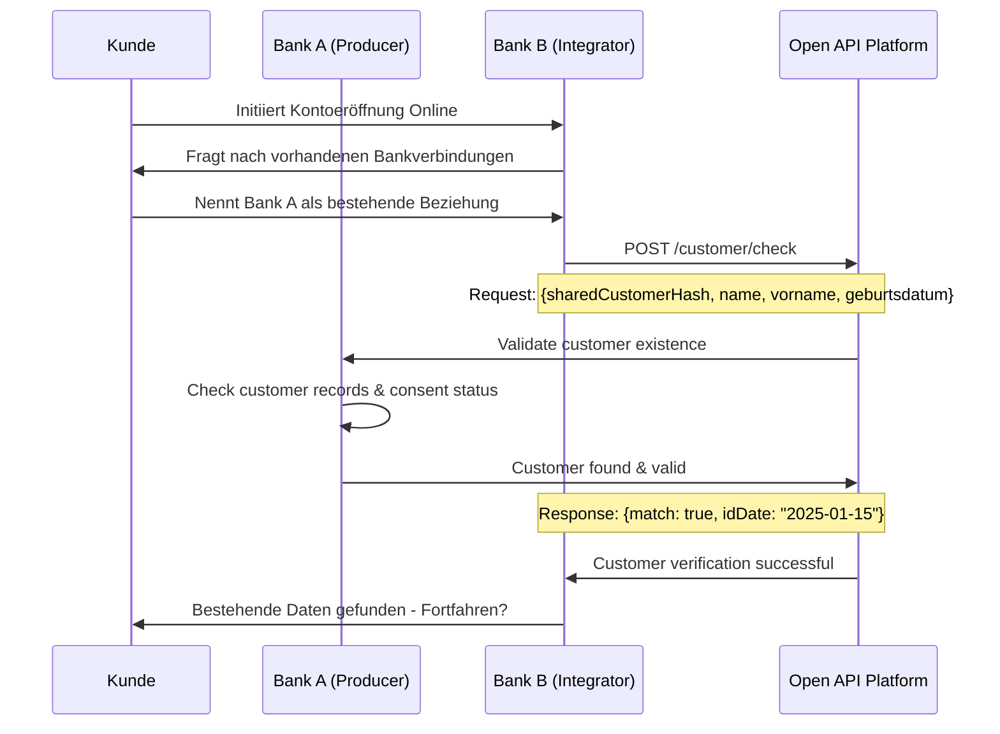
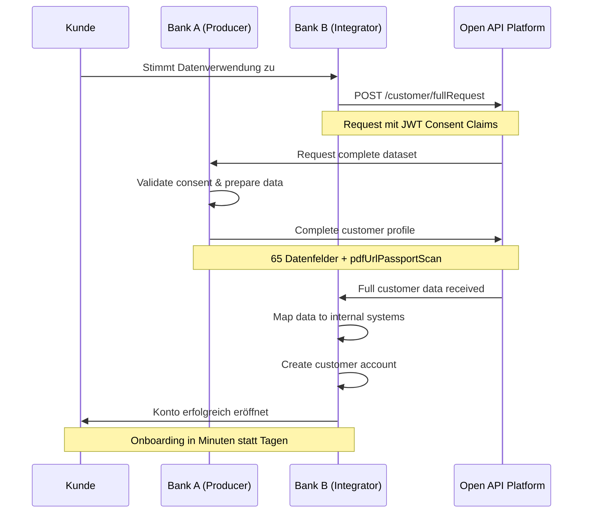

# Use Case Implementation Examples

## Overview

This document contains detailed implementation examples for the Open API Kundenbeziehung use cases, including technical API call sequences, integration patterns, and business process implementations.

**Note:** This document complements the [API Endpoint Design Conclusion](../Fachliche%20Conclusions%20Open%20API%20Kundenbeziehung/04%20API%20Endpoint%20Design.md) by providing practical implementation guidance and detailed examples.

---

## Use Case: Bank Onboarding Implementation

### Scenario: Bankwechsel mit Open API Integration

**Ausgangslage:** Ein Kunde möchte von Bank A (Producer) zu Bank B (Integrator) wechseln und seine bestehenden, bereits verifizierten Kundendaten wiederverwenden.

**Akteure:**
- **Kunde:** Bankkunde mit bestehender Beziehung zu Bank A
- **Bank A (Producer):** Datenbereitstellende Bank mit vollständigem KYC
- **Bank B (Integrator):** Neue Bank, die Onboarding vereinfachen möchte
- **Open API:** Vermittlungssystem für sicheren Datenaustausch

### Detaillierte Implementierung

#### Phase 1: Customer Discovery & Verification



#### Phase 2: Consent Management & Data Request



### Technical Implementation Details

#### API Call Sequence für Bank Onboarding

**1. Customer Check:**
```json
POST /customer/check
{
  "sharedCustomerHash": "a1b2c3d4e5f6...",
  "lastName": "Müller", 
  "firstName": "Anna",
  "dateOfBirth": "1985-03-15"
}

Response:
{
  "match": true,
  "identificationDate": "2025-02-01",
  "verificationLevel": "QEAA",
  "lastUpdate": "2025-02-01T10:00:00Z"
}
```

**2. Full Data Request:**
```json
POST /customer/fullRequest
Header: JWT with consent claims
{
  "sharedCustomerHash": "a1b2c3d4e5f6...",
  "purpose": "accountOpening",
  "requestedDataCategories": ["identity", "address", "contact", "identification", "kyc"]
}

Response: 
{
  // Modulare Datenbausteine entsprechend Referenzprozess
  "identity": {
    "personalData": {
      "firstName": "Anna",
      "lastName": "Müller",
      "dateOfBirth": "1985-03-15",
      "nationality": ["CH"],
      "gender": "female",
      "maritalStatus": "single"
    },
    "verificationLevel": "QEAA",
    "verificationDate": "2025-02-01T10:00:00Z"
  },
  "address": {
    "addressType": "residential",
    "street": "Bahnhofstrasse",
    "houseNumber": "42",
    "postalCode": "8001",
    "city": "Zürich",
    "country": "CH",
    "canton": "ZH"
  },
  "contact": {
    "emailAddress": "anna.mueller@example.ch",
    "mobileNumber": "+41791234567",
    "preferredChannel": "email"
  },
  "kycData": {
    "economicBeneficiary": true,
    "taxDomicile": "CH",
    "amlRiskClass": "low",
    "pepStatus": "no",
    "fatcaStatus": "non_us_person"
  }
}
```

### Business Impact Metriken

**Effizienzgewinn für Integrator Bank:**
- **Onboarding-Zeit:** Reduktion der Bearbeitungszeit
- **Dokumentensammlung:** Reduktion des manuellen Aufwands
- **Compliance-Prüfungen:** Wiederverwendung bestehender KYC-Verfahren
- **Conversion Rate:** Erwartete Steigerung

**Kundenvorteile:**
- **Nahtloser Bankwechsel:** Keine erneute Dokumentenvorlage
- **Sofortige Kontoaktivierung:** Online-Abschluss möglich
- **Datenschutzkonforme Wiederverwendung:** Granulare Consent-Kontrolle

---

## Additional Use Cases

### Use Case 2: Re-Identification
*TODO: Add detailed implementation for re-identification use case*

### Use Case 3: Age Verification
*TODO: Add detailed implementation for age verification use case*

### Use Case 4: EVV (Investment Advisory)
*TODO: Add detailed implementation for investment advisory use case*

---

**Version:** 1.0  
**Date:** August 2025  
**Status:** Implementation Guide

---

[Back to API Endpoint Design](../Fachliche%20Conclusions%20Open%20API%20Kundenbeziehung/04%20API%20Endpoint%20Design.md)