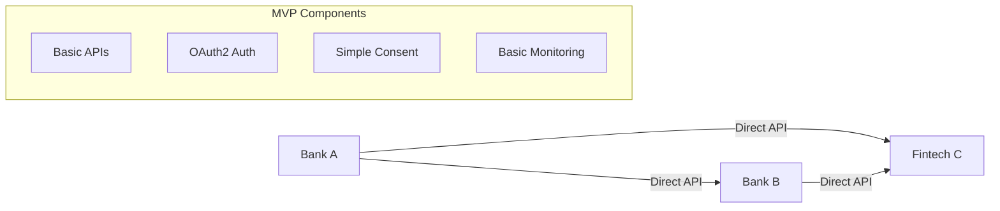
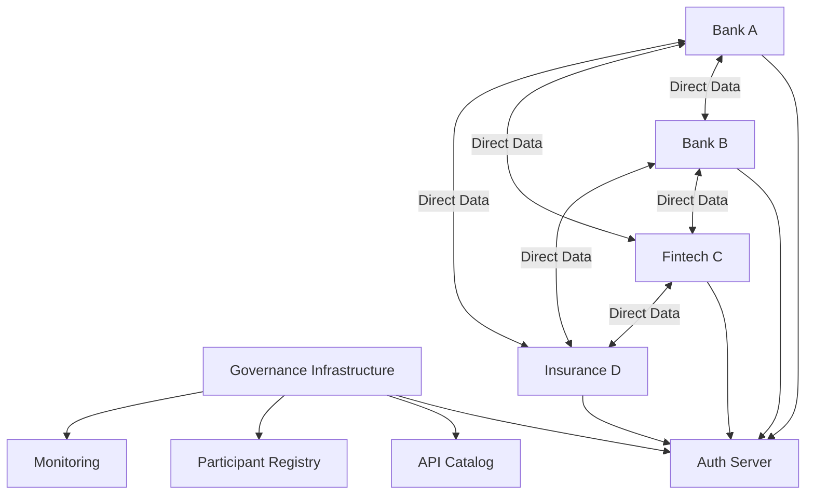
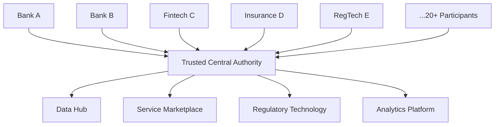
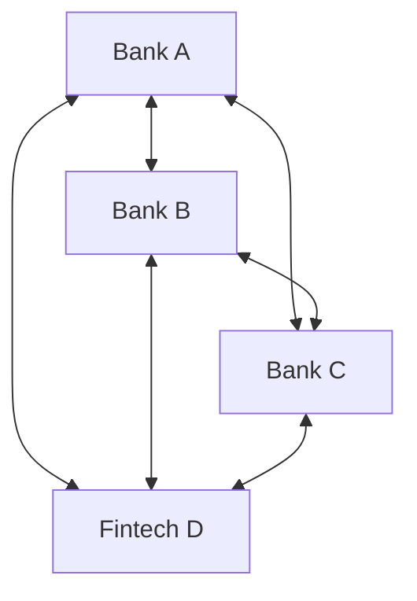
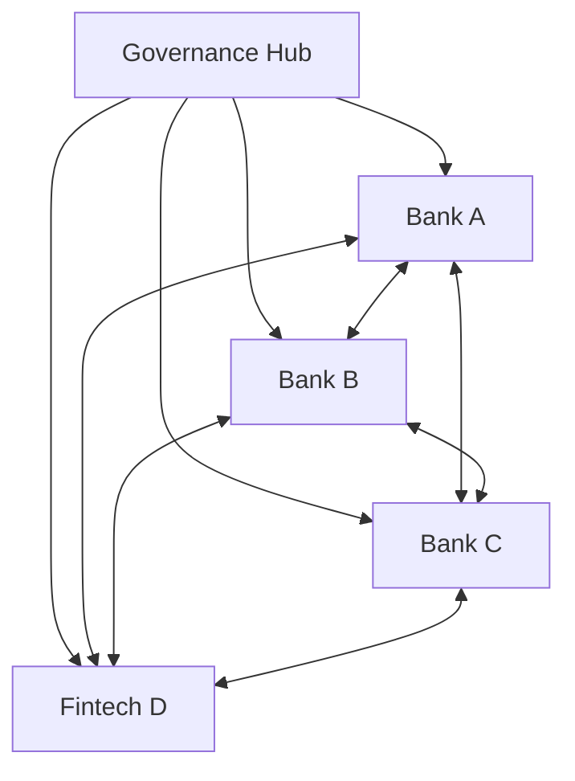
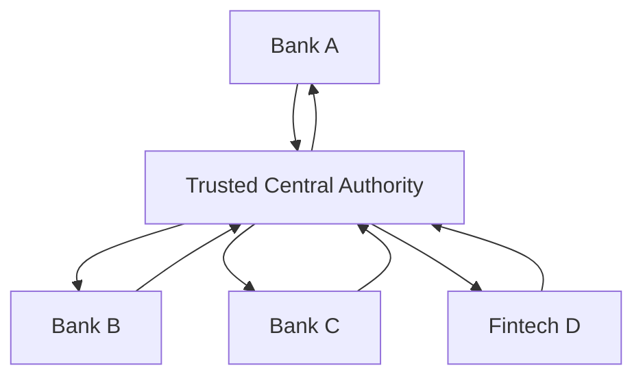

**Struktur:**
```json
{
  "apiCatalog": {
    "baseUrl": "https://catalog.openbankingproject.ch",
    "apis": {
      "customer_data": {
        "version": "1.2.0",
        "specification": "openapi_3.0",
        "endpoints": [
          "/api/v1/customer/basic",
          "/api/v1/customer/identification",
          "/api/v1/customer/kyc"
        ],
        "providers": ["bank-a", "bank-b", "bank-c"],
        "consumers": ["fintech-x", "fintech-y"],
        "compliance": ["GDPR", "FINMA", "PCI-DSS"]
      },
      "consent_management": {
        "version": "2.0.1",
        "specification": "openapi_3.0",
        "endpoints": [
          "/api/v2/consent/initiate",
          "/api/v2/consent/verify",
          "/api/v2/consent/revoke"
        ],
        "standards": ["OAuth2", "OIDC", "FAPI"]
      }
    },
    "versioning": {
      "strategy": "semantic_versioning",
      "deprecation_policy": "12_months_notice",
      "migration_support": "automated_tools"
    }
  }
}
```

**Funktionalitäten:**
- **Service Discovery:** Automated API endpoint discovery
- **Version Management:** Semantic versioning mit compatibility tracking
- **Documentation:** Interactive API documentation mit live examples
- **Testing:** Integrated sandbox environments für API testing
- **Analytics:** Usage statistics und performance metrics

#### **Teilnehmerverzeichnis (Participant Registry)**

**Registry Structure:**
```json
{
  "participantRegistry": {
    "participants": {
      "bank-a": {
        "legalName": "Alpha Bank AG",
        "participantId": "CH-BANK-001",
        "status": "active",
        "roles": ["producer", "integrator"],
        "certifications": {
          "technical": {
            "api_compliance": "certified",
            "security_audit": "passed",
            "performance_benchmark": "tier_1"
          },
          "regulatory": {
            "finma_license": "valid",
            "gdpr_compliance": "verified",
            "iso27001": "certified"
          }
        },
        "capabilities": {
          "customer_data": ["basic", "identification", "kyc"],
          "consent_management": "full_compliance",
          "data_formats": ["JSON", "XML"],
          "protocols": ["HTTPS", "mTLS"]
        },
        "sla": {
          "uptime": "99.8%",
          "response_time": "avg_1200ms",
          "support": "24x7"
        },
        "contacts": {
          "technical": "api-support@alpha-bank.ch",
          "business": "partnerships@alpha-bank.ch",
          "compliance": "compliance@alpha-bank.ch"
        }
      }
    },
    "relationships": {
      "data_sharing_agreements": [
        {
          "producer": "bank-a",
          "consumer": "fintech-x",
          "scope": ["customer_onboarding"],
          "status": "active",
          "expires": "2025-12-31"
        }
      ]
    }
  }
}
```

**Registry Features:**
- **Real-time Status:** Live participant status and health monitoring
- **Capability Matrix:** Service offerings and technical capabilities
- **Compliance Tracking:** Regulatory compliance status and audit results
- **Relationship Management:** Inter-participant agreements and dependencies
- **Search and Discovery:** Advanced filtering and search capabilities

### Zentrale Governance-Komponenten

#### **Authentifizierungsregeln (OAuth2/OIDC Standards)**

**Authentication Architecture:**
```json
{
  "authenticationFramework": {
    "standards": ["OAuth2", "OpenID_Connect", "FAPI_1.0"],
    "providers": {
      "primary": "https://auth.openbankingproject.ch",
      "backup": "https://auth-backup.openbankingproject.ch"
    },
    "flows": {
      "authorization_code": {
        "use_cases": ["customer_facing_applications"],
        "pkce": "mandatory",
        "state": "required"
      },
      "client_credentials": {
        "use_cases": ["machine_to_machine"],
        "mutual_tls": "required",
        "scope": "limited"
      }
    },
    "tokens": {
      "access_token": {
        "format": "JWT",
        "lifetime": "3600_seconds",
        "refresh": "supported"
      },
      "id_token": {
        "format": "JWT",
        "claims": ["sub", "aud", "iss", "exp", "iat", "participant_role"],
        "signature": "RS256"
      }
    }
  }
}
```

**Identity Provider Configuration:**
```json
{
  "identityProvider": {
    "endpoints": {
      "authorization": "/oauth2/authorize",
      "token": "/oauth2/token",
      "userinfo": "/oauth2/userinfo",
      "jwks": "/.well-known/jwks.json",
      "discovery": "/.well-known/openid_configuration"
    },
    "clients": {
      "registration": "dynamic_client_registration",
      "authentication": "mutual_tls_required",
      "authorization": "scope_based_access_control"
    },
    "security": {
      "tls_version": "1.3_minimum",
      "cipher_suites": "fapi_approved_only",
      "certificate_bound_tokens": "mandatory"
    }
  }
}
```

#### **Consent-Standards (Einheitliche Consent-Verwaltung)**

**Consent Framework:**
```json
{
  "consentFramework": {
    "standards": ["ISO29184", "GDPR_Article_7", "FAPI_Consent"],
    "granularity": {
      "purpose": "use_case_specific",
      "data_categories": "field_level_control",
      "duration": "time_bound_consent",
      "scope": "service_specific"
    },
    "lifecycle": {
      "creation": {
        "method": "explicit_opt_in",
        "documentation": "clear_plain_language",
        "evidence": "cryptographic_proof"
      },
      "management": {
        "dashboard": "customer_self_service",
        "notifications": "consent_status_changes",
        "renewal": "proactive_re_consent"
      },
      "revocation": {
        "method": "instant_withdrawal",
        "effect": "immediate_data_processing_stop",
        "confirmation": "customer_notification"
      }
    },
    "technical_implementation": {
      "format": "JWT_consent_tokens",
      "claims": ["purpose", "data_categories", "expiry", "granularity"],
      "validation": "real_time_verification",
      "audit": "immutable_consent_log"
    }
  }
}
```

**Consent Token Structure:**
```json
{
  "consent_token": {
    "header": {
      "alg": "RS256",
      "typ": "JWT",
      "kid": "consent_signing_key_1"
    },
    "payload": {
      "iss": "consent.openbankingproject.ch",
      "sub": "customer_shared_hash",
      "aud": "requesting_participant_id",
      "exp": 1672531200,
      "iat": 1672444800,
      "consent_id": "consent_unique_identifier",
      "purpose": "account_opening",
      "data_categories": ["basic", "identification"],
      "granularity": {
        "personal_info": "full_access",
        "financial_info": "limited_access",
        "documents": "read_only"
      },
      "duration": "single_use",
      "revocation_endpoint": "https://consent.openbankingproject.ch/revoke"
    }
  }
}
```

#### **Logging und Monitoring (Audit-Trail für alle Transaktionen)**

**Comprehensive Audit Framework:**
```json
{
  "auditFramework": {
    "scope": "all_api_transactions",
    "retention": "10_years_regulatory_requirement",
    "standards": ["ISO27040", "NIST_800-92", "GDPR_Article_30"],
    "components": {
      "transaction_logging": {
        "events": ["api_request", "api_response", "consent_change", "error_occurrence"],
        "data_points": ["timestamp", "participant_ids", "customer_hash", "purpose", "data_accessed"],
        "format": "structured_json_logs",
        "encryption": "field_level_encryption"
      },
      "security_monitoring": {
        "threat_detection": "ml_based_anomaly_detection",
        "incident_response": "automated_alert_escalation",
        "forensics": "detailed_investigation_capabilities"
      },
      "compliance_reporting": {
        "regulatory_reports": "automated_generation",
        "audit_trails": "tamper_proof_blockchain",
        "data_lineage": "complete_data_flow_tracking"
      }
    }
  }
}
```

**Real-time Monitoring Dashboard:**
```json
{
  "monitoringDashboard": {
    "metrics": {
      "system_health": ["api_response_times", "error_rates", "uptime_statistics"],
      "business_metrics": ["transaction_volumes", "participant_activity", "customer_satisfaction"],
      "security_metrics": ["failed_authentications", "anomalous_patterns", "threat_indicators"],
      "compliance_metrics": ["consent_compliance", "data_retention_adherence", "audit_readiness"]
    },
    "alerting": {
      "thresholds": "configurable_per_metric",
      "channels": ["email", "sms", "slack", "webhook"],
      "escalation": "tiered_response_procedures",
      "automation": "self_healing_capabilities"
    },
    "reporting": {
      "frequency": ["real_time", "daily", "weekly", "monthly"],
      "recipients": ["technical_teams", "business_stakeholders", "regulators"],
      "formats": ["interactive_dashboards", "pdf_reports", "api_access"]
    }
  }
}
```

#### **Zertifikatsdienst (PKI-Management für Sicherheit)**

**PKI Infrastructure:**
```json
{
  "pkiInfrastructure": {
    "hierarchy": {
      "root_ca": "swiss_open_banking_root_ca",
      "intermediate_ca": "participant_certificate_authority",
      "end_entity": "individual_participant_certificates"
    },
    "certificate_types": {
      "participant_identity": {
        "purpose": "participant_authentication",
        "validity": "2_years",
        "key_size": "RSA_4096_or_ECC_P384"
      },
      "api_tls": {
        "purpose": "api_endpoint_security",
        "validity": "1_year",
        "san": "multiple_domain_support"
      },
      "signing": {
        "purpose": "data_integrity_verification",
        "validity": "3_years",
        "algorithm": "RSA_PSS_or_ECDSA"
      }
    },
    "lifecycle_management": {
      "issuance": "automated_certificate_provisioning",
      "renewal": "proactive_certificate_renewal",
      "revocation": "real_time_crl_and_ocsp",
      "monitoring": "certificate_expiry_tracking"
    }
  }
}
```

### Föderative Anforderungen

#### **Auswirkungen auf API-Design und Architektur**

**Federation-aware API Design:**
```json
{
  "federationRequirements": {
    "interoperability": {
      "standards": ["OpenAPI_3.0", "JSON_Schema", "OAuth2", "OIDC"],
      "data_formats": "standardized_across_participants",
      "error_handling": "consistent_error_responses",
      "versioning": "coordinated_version_management"
    },
    "scalability": {
      "horizontal_scaling": "stateless_api_design",
      "load_balancing": "participant_load_distribution",
      "caching": "intelligent_response_caching",
      "rate_limiting": "fair_usage_policies"
    },
    "security": {
      "authentication": "federated_identity_management",
      "authorization": "fine_grained_access_control",
      "encryption": "end_to_end_data_protection",
      "audit": "comprehensive_transaction_logging"
    }
  }
}
```

#### **Cross-System Interoperability**

**Technical Interoperability Stack:**
```json
{
  "interoperabilityStack": {
    "transport_layer": {
      "protocols": ["HTTPS", "HTTP/2", "WebSocket"],
      "security": ["TLS_1.3", "mTLS", "Certificate_Pinning"]
    },
    "message_layer": {
      "formats": ["JSON", "JWT", "XML"],
      "schemas": ["JSON_Schema", "OpenAPI_Spec"],
      "validation": "real_time_schema_validation"
    },
    "business_layer": {
      "workflows": "standardized_business_processes",
      "state_management": "distributed_state_coordination",
      "transactions": "atomic_cross_participant_operations"
    },
    "governance_layer": {
      "standards": "centrally_managed_specifications",
      "compliance": "automated_conformance_testing",
      "evolution": "coordinated_standard_updates"
    }
  }
}
```

## Skalierungs-Strategien

### MVP-Ansatz (Start dezentral)

#### **Scope und Ziele**

**MVP Characteristics:**
```json
{
  "mvp_scope": {
    "participants": "2-5_initial_partners",
    "use_cases": ["basic_customer_onboarding"],
    "data_types": ["identity", "basic_contact_info"],
    "architecture": "peer_to_peer_connections",
    "governance": "bilateral_agreements",
    "timeline": "3-6_months"
  },
  "success_criteria": {
    "technical": "successful_data_exchange",
    "business": "demonstrated_value_creation",
    "regulatory": "compliance_verification",
    "user": "positive_customer_feedback"
  }
}
```

**Implementation Strategy:**
1. **Partner Selection:** Choose 2-3 committed participants with complementary capabilities
2. **Use Case Focus:** Implement single, high-value use case (account opening)
3. **Technical MVP:** Basic API implementation with essential security
4. **Governance Light:** Simple agreements and manual processes
5. **Rapid Iteration:** Weekly deployments and continuous feedback

**Technical Architecture (Dezentral):**


### Ausbauphase (Übergang hybrid)

#### **Evolution zum Hybrid-Modell**

**Transition Strategy:**
```json
{
  "transition_approach": {
    "trigger_conditions": ["5+_participants", "multiple_use_cases", "governance_complexity"],
    "migration_path": "gradual_centralization",
    "timeline": "6-12_months",
    "investment": "CHF_2-5_million"
  },
  "hybrid_components": {
    "centralized": {
      "api_catalog": "standardized_service_definitions",
      "participant_registry": "verified_participant_directory",
      "auth_server": "federated_authentication",
      "monitoring": "system_wide_observability"
    },
    "decentralized": {
      "data_storage": "participant_sovereignty",
      "business_logic": "domain_specific_processing",
      "customer_relationships": "direct_interaction"
    }
  }
}
```

**Implementation Phases:**
1. **Phase 1:** API Catalog und Standards Definition
2. **Phase 2:** Centralized Authentication Infrastructure
3. **Phase 3:** Participant Registry und Onboarding Automation
4. **Phase 4:** Enhanced Monitoring und Analytics
5. **Phase 5:** Advanced Governance und Compliance Tools

**Hybrid Architecture:**


### Reifephase (Optional zentral)

#### **Evolution zur zentralen Plattform**

**Decision Criteria:**
```json
{
  "centralization_triggers": {
    "scale": "20+_participants",
    "complexity": "cross_industry_use_cases",
    "efficiency": "operational_cost_optimization",
    "innovation": "platform_based_services",
    "regulation": "regulatory_requirement_for_oversight"
  },
  "investment_requirement": {
    "infrastructure": "CHF_10-20_million",
    "licensing": "comprehensive_financial_services_license",
    "team": "50+_specialists",
    "timeline": "18-24_months"
  }
}
```

**Central Platform Features:**
```json
{
  "platform_capabilities": {
    "data_hub": {
      "aggregation": "real_time_data_consolidation",
      "analytics": "cross_participant_insights",
      "ml_services": "ai_powered_risk_assessment"
    },
    "service_marketplace": {
      "third_party_services": "curated_service_catalog",
      "api_monetization": "revenue_sharing_models",
      "innovation_sandbox": "rapid_prototyping_environment"
    },
    "regulatory_tech": {
      "compliance_automation": "real_time_regulatory_reporting",
      "risk_management": "system_wide_risk_monitoring",
      "audit_support": "comprehensive_audit_trails"
    }
  }
}
```

**Central Architecture:**


## Existierende Beispiele und Best Practices

### Internationale Referenzen

#### **UK Open Banking Implementation Entity (OBIE)**

**Architektur-Modell:** Hybrid mit starker zentraler Governance

**Key Features:**
```json
{
  "uk_obie": {
    "governance": {
      "model": "industry_utility_with_regulatory_oversight",
      "participants": "mandatory_for_cma9_banks",
      "standards": "centrally_defined_technical_specifications"
    },
    "technical_architecture": {
      "data_flows": "decentralized_peer_to_peer",
      "apis": "standardized_openapi_specifications",
      "security": "fapi_financial_grade_security",
      "consent": "customer_controlled_consent_dashboard"
    },
    "lessons_learned": {
      "positives": ["rapid_ecosystem_development", "innovation_acceleration"],
      "challenges": ["complex_technical_implementation", "high_compliance_costs"],
      "evolution": ["expansion_to_variable_recurring_payments", "open_finance_roadmap"]
    }
  }
}
```

**Applicable Lessons für Switzerland:**
- Strong regulatory backing beschleunigt Adoption
- Standardized APIs reduce integration complexity
- Customer consent dashboards erhöhen Trust
- Phased rollout approach minimiert Risks

#### **Brasil Open Finance (Banco Central do Brasil)**

**Architektur-Modell:** Zentralisiert mit umfassender Regulatory Oversight

**Key Features:**
```json
{
  "brasil_open_finance": {
    "governance": {
      "model": "central_bank_mandated_ecosystem",
      "scope": "comprehensive_financial_services",
      "participants": "all_licensed_financial_institutions"
    },
    "technical_implementation": {
      "security": "fapi_1.0_advanced_mandatory",
      "consent": "granular_purpose_based_consent",
      "data_scope": ["banking", "credit", "investment", "insurance"],
      "infrastructure": "centralized_discovery_and_monitoring"
    },
    "innovation_aspects": {
      "pix_integration": "real_time_payment_system_integration",
      "comprehensive_scope": "beyond_banking_to_full_financial_services",
      "regulatory_sandbox": "innovation_friendly_testing_environment"
    }
  }
}
```

**Applicable Lessons für Switzerland:**
- Comprehensive scope von Anfang an reduziert future fragmentation
- Strong central coordination enables rapid ecosystem development
- Integration mit existing payment infrastructure (PIX) provides customer value
- Regulatory sandbox enables safe innovation

#### **Australia Consumer Data Right (CDR)**

**Architektur-Modell:** Cross-sector Federation mit sector-specific implementation

**Key Features:**
```json
{
  "australia_cdr": {
    "unique_aspects": {
      "cross_sector": ["banking", "energy", "telecommunications"],
      "consumer_centric": "comprehensive_consumer_data_rights",
      "accreditation": "tiered_accreditation_framework"
    },
    "governance": {
      "oversight": "australian_competition_consumer_commission",
      "technical_standards": "data_standards_body",
      "implementation": "sector_specific_approach"
    },
    "learnings": {
      "challenges": ["complex_cross_sector_coordination", "high_implementation_costs"],
      "successes": ["strong_consumer_protection", "innovation_in_energy_sector"],
      "evolution": ["gradual_sector_expansion", "enhanced_consumer_tools"]
    }
  }
}
```

**Applicable Lessons für Switzerland:**
- Cross-sector approach maximizes consumer value
- Tiered accreditation enables participation by different player types
- Strong consumer protection builds public trust
- Sector-specific implementation reduces complexity

#### **Singapore Account Information Service (AIS)**

**Architektur-Modell:** Government-supported industry collaboration

**Key Features:**
```json
{
  "singapore_ais": {
    "characteristics": {
      "government_support": "monetary_authority_of_singapore_backing",
      "industry_collaboration": "voluntary_industry_initiative",
      "innovation_focus": "fintech_ecosystem_development"
    },
    "technical_approach": {
      "standards": "api_standardization_through_industry_working_groups",
      "security": "enhanced_security_frameworks",
      "interoperability": "cross_border_compatibility_focus"
    },
    "market_impact": {
      "fintech_growth": "accelerated_fintech_ecosystem_development",
      "consumer_adoption": "gradual_but_steady_uptake",
      "innovation": "emergence_of_innovative_financial_products"
    }
  }
}
```

**Applicable Lessons für Switzerland:**
- Government support without mandate can drive adoption
- Industry collaboration creates buy-in from all stakeholders
- Focus on innovation attracts fintech ecosystem
- Cross-border compatibility important for international financial center

### Schweizer Kontext

#### **Bestehende Initiativen und Infrastrukturen**

**SIX bLink:**
```json
{
  "six_blink": {
    "scope": "multi_banking_platform",
    "architecture": "centralized_hub_model",
    "participants": "swiss_banks_and_fintechs",
    "services": ["account_aggregation", "payment_initiation"],
    "lessons": {
      "market_acceptance": "gradual_adoption_by_banks",
      "technical_challenges": "legacy_system_integration",
      "competitive_dynamics": "balance_between_collaboration_and_competition"
    },
    "synergies_with_open_api": {
      "complementary": "blink_as_integrator_using_open_api_standards",
      "technical": "shared_api_specifications_and_security_standards",
      "business": "expanded_ecosystem_through_standardization"
    }
  }
}
```

**Swiss FinTech Innovations (SFTI):**
```json
{
  "sfti_initiatives": {
    "mortgage_api": {
      "scope": "standardized_mortgage_application_apis",
      "participants": "banks_and_mortgage_brokers",
      "status": "pilot_phase"
    },
    "identity_verification": {
      "scope": "standardized_kyc_and_identity_verification",
      "technology": "video_identification_and_document_verification",
      "market_adoption": "growing_usage_across_financial_services"
    },
    "learnings": {
      "domain_specific_apis": "sector_specific_standards_drive_faster_adoption",
      "pilot_approach": "small_scale_pilots_validate_concepts",
      "industry_collaboration": "voluntary_standards_require_strong_business_case"
    }
  }
}
```

**SwissID und zukünftige E-ID:**
```json
{
  "identity_infrastructure": {
    "swissid": {
      "current_status": "operational_private_sector_identity",
      "usage": "growing_adoption_for_digital_services",
      "limitations": "not_universally_accepted_government_id"
    },
    "future_e_id": {
      "timeline": "expected_launch_2026",
      "characteristics": "government_backed_digital_identity",
      "integration_potential": "strong_synergies_with_open_api_customer_relationship"
    },
    "implications": {
      "identity_verification": "simplified_customer_onboarding_processes",
      "trust_framework": "government_backed_trust_anchor",
      "interoperability": "cross_sector_identity_usage"
    }
  }
}
```

#### **Regulatorisches Umfeld**

**FINMA Regulatory Approach:**
```json
{
  "finma_considerations": {
    "current_stance": {
      "innovation_friendly": "regulatory_sandbox_and_fintech_license",
      "proportionate_regulation": "risk_based_regulatory_approach",
      "international_cooperation": "alignment_with_international_standards"
    },
    "open_banking_readiness": {
      "regulatory_framework": "existing_banking_laws_provide_foundation",
      "data_protection": "strong_data_protection_framework_in_place",
      "consumer_protection": "established_consumer_protection_mechanisms"
    },
    "potential_evolution": {
      "open_banking_regulation": "potential_future_open_banking_directive",
      "cross_sector_expansion": "consideration_of_broader_open_finance_framework",
      "international_alignment": "coordination_with_eu_and_uk_developments"
    }
  }
}
```

**Datenschutz und Privacy:**
```json
{
  "privacy_framework": {
    "current_law": "swiss_data_protection_act_revised_2023",
    "gdpr_compatibility": "substantial_equivalence_with_eu_gdpr",
    "consent_requirements": {
      "explicit_consent": "required_for_sensitive_data_processing",
      "granular_consent": "recommended_best_practice",
      "consent_withdrawal": "easy_withdrawal_mechanisms_required"
    },
    "implications_for_open_api": {
      "consent_management": "sophisticated_consent_frameworks_needed",
      "data_minimization": "purpose_limitation_and_data_minimization_principles",
      "cross_border_transfers": "adequacy_decisions_or_safeguards_required"
    }
  }
}
```

## Implementierungs-Roadmap

### Phase 1 (bis Open Banking Summit)

#### **Konzeptionelle Ausarbeitung (Q3 2025)**

**Deliverables:**
```json
{
  "phase_1_deliverables": {
    "governance_framework": {
      "architectural_decisions": "hybrid_model_selection_rationale",
      "role_definitions": "clear_participant_roles_and_responsibilities",
      "onboarding_processes": "standardized_participant_onboarding"
    },
    "technical_specifications": {
      "api_standards": "openapi_3.0_specifications_for_core_apis",
      "security_framework": "oauth2_oidc_fapi_implementation_guide",
      "data_models": "standardized_customer_data_schemas"
    },
    "pilot_preparation": {
      "participant_selection": "committed_pilot_participants_identified",
      "use_case_definition": "detailed_use_case_specifications",
      "success_metrics": "measurable_success_criteria_defined"
    }
  },
  "timeline": "july_august_2025",
  "budget": "CHF_500000_conceptual_work",
  "team": "10_specialists_cross_functional"
}
```

**Key Activities:**
1. **Stakeholder Alignment:** Finalize governance model with key participants
2. **Technical Design:** Complete API specifications and security frameworks
3. **Legal Framework:** Develop participant agreements and compliance procedures
4. **Pilot Design:** Design comprehensive pilot program
5. **Summit Presentation:** Prepare comprehensive presentation for Open Banking Summit

#### **MVP Vorbereitung**

**Technical MVP Scope:**
```json
{
  "mvp_technical_scope": {
    "core_apis": [
      "customer_existence_check",
      "basic_customer_data",
      "identity_verification"
    ],
    "security": "oauth2_with_basic_fapi_compliance",
    "participants": "3_committed_partners",
    "use_case": "simplified_account_opening",
    "infrastructure": "cloud_based_development_environment"
  }
}
```

**Pilot Partner Preparation:**
```json
{
  "pilot_partners": {
    "selection_criteria": [
      "technical_readiness",
      "business_commitment",
      "regulatory_compliance",
      "customer_base_size"
    ],
    "onboarding_process": {
      "legal": "pilot_agreements_signed",
      "technical": "api_integration_completed",
      "testing": "comprehensive_testing_completed",
      "go_live": "limited_customer_pilot_launched"
    }
  }
}
```

### Phase 2 (Post-Summit)

#### **MVP Implementation (Q4 2025 - Q1 2026)**

**Implementation Plan:**
```json
{
  "mvp_implementation": {
    "development": {
      "duration": "3_months",
      "approach": "agile_development_with_weekly_sprints",
      "testing": "continuous_integration_and_testing",
      "security": "regular_security_assessments"
    },
    "deployment": {
      "environment": "production_ready_cloud_infrastructure",
      "monitoring": "comprehensive_monitoring_and_alerting",
      "support": "24x7_technical_support",
      "backup": "disaster_recovery_procedures"
    },
    "pilot_execution":# Themenbereich 4: Vertrauensnetzwerk (Föderiertes System)
**Fertigstellung bis 31.07.**

## Inhalt

1. [Executive Summary](#executive-summary)
2. [Konzeptionelle Grundlagen](#konzeptionelle-grundlagen)
3. [Architekturmodelle-Evaluation](#architekturmodelle-evaluation)
4. [Technische Rollen-Definition](#technische-rollen-definition)
5. [Governance-Infrastruktur](#governance-infrastruktur)
6. [Skalierungs-Strategien](#skalierungs-strategien)
7. [Existierende Beispiele und Best Practices](#existierende-beispiele-und-best-practices)
8. [Implementierungs-Roadmap](#implementierungs-roadmap)
9. [Technische Implementierung](#technische-implementierung)
10. [Fazit und Empfehlungen](#fazit-und-empfehlungen)

## Executive Summary

Das föderierte System (ehem. Vertrauensnetzwerk) definiert die organisatorische und technische Zusammenarbeitsform für die Open API Kundenbeziehung. Nach umfassender Evaluation wird ein **hybrides Modell** als optimale Lösung empfohlen, das zentrale Governance mit dezentralen Datenflüssen kombiniert. Der Ansatz ermöglicht eine schrittweise Evolution vom MVP (dezentral) über die Ausbauphase (hybrid) bis zur optionalen Reifephase (zentral).

**Zentrale Erkenntnisse:**
- Hybrides Modell als optimaler Kompromiss zwischen Autonomie und Standardisierung
- Klare Rollen-Definition für nachhaltige Governance
- Schrittweise Skalierungsstrategie beginnend mit dezentralem MVP
- Internationale Best Practices als Grundlage für Schweizer Implementation

## Konzeptionelle Grundlagen

### Definition und Scope

#### **Föderiertes System vs. Vertrauensnetzwerk**

**Föderiertes System:**
- **Definition:** Architekturmodell für die Zusammenarbeit autonomer Teilnehmer unter gemeinsamen Standards
- **Charakteristika:** Gemeinsame Governance bei erhaltener Datenhoheit
- **Fokus:** Technische Interoperabilität und organisatorische Koordination

**Abgrenzung zu Vertrauensnetzwerk:**
- **Vertrauensnetzwerk:** Impliziert primär zwischenmenschliche/institutionelle Vertrauensbeziehungen
- **Föderiertes System:** Fokussiert auf technische und prozessuale Frameworks für systematische Zusammenarbeit

#### **Abgrenzung zu zentralisierten Plattformen**

**Zentralisierte Plattformen:**
- Single Point of Control und Data Ownership
- Monopolistische Tendenz der Plattform-Betreiber
- Eingeschränkte Autonomie der Teilnehmer
- Skalierungsvorteile durch zentrale Kontrolle

**Föderiertes System:**
- Verteilte Kontrolle mit gemeinsamen Standards
- Erhaltene Datenhoheit bei den ursprünglichen Besitzern
- Autonomie der Teilnehmer bei kooperativen Vorteilen
- Balanced Governance zwischen Zentralisierung und Dezentralisierung

#### **Interoperabilität und Datenhoheit als Kernprinzipien**

**Interoperabilität:**
- Technische Standards für nahtlose System-Integration
- Einheitliche API-Spezifikationen und Datenformate
- Cross-Platform Authentication und Authorization
- Einheitliche Error-Handling und Status-Codes

**Datenhoheit:**
- Data Sovereignty bleibt bei ursprünglichen Datenbesitzern
- Purpose-based Data Sharing mit expliziter Consent
- Data Minimization Principle
- Right to Data Portability und Deletion

### Anforderungsanalyse

#### **Stakeholder-Erwartungen aus Workshop-Phase**

**Banken/Finanzinstitute:**
- Erhaltung der Kontrolle über Kundendaten
- Standardisierung zur Kostenreduktion
- Compliance-Sicherheit und Regulierungskonformität
- Wettbewerbsvorteile durch verbesserte Services

**Fintechs/Integratoren:**
- Vereinfachter Zugang zu Finanzdienstleistungen
- Reduzierte Integration-Komplexität
- Innovation-freundliche Frameworks
- Level Playing Field mit etablierten Playern

**Regulatoren:**
- Consumer Protection und Data Privacy
- Market Stability und Systemic Risk Mitigation
- Innovation Förderung bei Risikokontrolle
- International Compatibility und Standards Alignment

**Kunden:**
- Verbesserte User Experience und Service Quality
- Data Privacy und Consent Control
- Service Portability zwischen Anbietern
- Transparency über Data Usage

#### **Technische vs. fachliche Trust-Mechanismen**

**Technischer Trust:**
- **PKI (Public Key Infrastructure):** Cryptographic Identity Verification
- **Digital Signatures:** Non-repudiation und Data Integrity
- **TLS/mTLS:** Secure Communication Channels
- **OAuth2/OIDC:** Standardized Authentication und Authorization
- **FAPI:** Financial-grade Security Standards

**Fachlicher Trust:**
- **Regulatory Compliance:** Adherence zu Banking und Financial Regulations
- **Business Reputation:** Track Record und Market Standing
- **SLA Compliance:** Service Level Agreement Performance
- **Audit Results:** Third-party Security und Compliance Assessments
- **Insurance Coverage:** Financial Protection gegen Operational Risks

#### **Skalierbarkeits-Anforderungen**

**MVP Phase (2-5 Teilnehmer):**
- Simple bilateral Agreements
- Basic Technical Standards
- Manual Onboarding Processes
- Limited Monitoring Infrastructure

**Growth Phase (5-20 Teilnehmer):**
- Automated Onboarding und Discovery
- Enhanced Governance Mechanisms
- Real-time Monitoring und Alerting
- Dispute Resolution Procedures

**Mature Phase (20+ Teilnehmer):**
- Industrial-grade Infrastructure
- Advanced Analytics und Insights
- Cross-border Interoperability
- Ecosystem Innovation Frameworks

## Architekturmodelle-Evaluation

### Dezentralisiert (Peer-to-Peer)

#### **Architektur-Beschreibung**
Bilateraler Datenaustausch zwischen Produzent und Integrator ohne zentrale Koordinationsinstanz. Jeder Teilnehmer verwaltet eigene Verzeichnisse und APIs.

#### **Technische Charakteristika**


**Implementation Details:**
- Point-to-Point API Connections
- Individual Participant Registries
- Bilateral Security Agreements
- Direct Data Flows ohne Intermediäre

#### **Vorteile**
- **Schneller Go-Live:** Minimaler organisatorischer Overhead
- **Volle Autonomie:** Komplette Kontrolle über eigene Daten und Prozesse
- **Resilience:** Kein Single Point of Failure
- **Privacy:** Direkte Datenübertragung ohne Zwischenspeicherung
- **Kosteneffizienz:** Keine zentrale Infrastruktur erforderlich

#### **Nachteile**
- **Skalierungsprobleme:** O(n²) Komplexität bei wachsender Teilnehmerzahl
- **Hohe technische Komplexität:** Jeder Teilnehmer muss alle anderen kennen
- **Begrenzte zentrale Kontrolle:** Schwierige Durchsetzung von Standards
- **Inkonsistente Implementation:** Verschiedene API-Versionen und Standards
- **Monitoring-Herausforderungen:** Dezentrale Logs und Metrics

#### **Use Case: MVP-Phase**
```json
{
  "participants": ["bank-a", "bank-b", "fintech-c"],
  "connections": [
    {"from": "bank-a", "to": "bank-b", "purpose": "account_opening"},
    {"from": "bank-a", "to": "fintech-c", "purpose": "investment_advice"}
  ],
  "governance": "bilateral_agreements",
  "monitoring": "individual_dashboards"
}
```

### Hybrides Modell (Empfohlene Lösung)

#### **Architektur-Beschreibung**
Zentrale Governance-Komponenten (API-Katalog, Authentifizierung, Standards) kombiniert mit dezentralen Datenflüssen zwischen Teilnehmern.

#### **Technische Charakteristika**


**Zentrale Komponenten:**
- **API Katalog:** Standardized Service Definitions
- **Participant Registry:** Verified Participant Directory
- **Authentication Server:** Centralized OAuth2/OIDC Provider
- **Monitoring Dashboard:** Aggregated System Health Metrics
- **Governance Portal:** Standards Management und Compliance Tracking

**Dezentrale Komponenten:**
- **Data Storage:** Participants maintain data sovereignty
- **Business Logic:** Domain-specific processing remains local
- **Customer Relationships:** Direct customer interaction

#### **Vorteile**
- **Einheitliche Standards:** Zentral verwaltete API Specifications
- **Dezentrale Datenhoheit:** Data bleibt bei ursprünglichen Owners
- **Gute Transparenz:** Comprehensive Participant und Service Visibility
- **Skalierbarkeit:** Efficient Onboarding neuer Teilnehmer
- **Balance:** Optimal zwischen Kontrolle und Autonomie

#### **Nachteile**
- **Komplexe Skalierung:** Governance muss mit Netzwerk-Growth mithalten
- **Potenzielle Inkonsistenzen:** Dezentrale Implementation kann divergieren
- **Governance Overhead:** Continuous Standards Management erforderlich
- **Dependency Risk:** Teilnehmer abhängig von Governance-Infrastruktur

#### **Use Case: Ausbaustufe (5-20 Teilnehmer)**
```json
{
  "governance": {
    "apiCatalog": "https://catalog.openbankingproject.ch",
    "participantRegistry": "https://registry.openbankingproject.ch",
    "authServer": "https://auth.openbankingproject.ch",
    "monitoringDashboard": "https://monitor.openbankingproject.ch"
  },
  "participants": 15,
  "dataFlows": "peer_to_peer",
  "standardsCompliance": "mandatory",
  "onboarding": "automated"
}
```

### Zentralisiert (Hub/Plattform)

#### **Architektur-Beschreibung**
Alle Datenflüsse und Koordination erfolgen über eine zentrale "Trusted Central Authority (TCA)" als Hub.

#### **Technische Charakteristika**


**Zentrale Plattform-Funktionen:**
- **Request Routing:** Intelligente Anfrage-Weiterleitung
- **Data Aggregation:** Consolidated Data Views
- **Consent Management:** Centralized Consent Orchestration
- **Compliance Monitoring:** Real-time Regulatory Oversight
- **Analytics Platform:** Cross-participant Insights

#### **Vorteile**
- **Hohe Standardisierung:** Einheitliche Implementation durch zentrale Kontrolle
- **Effizientes Onboarding:** Single Integration Point für neue Teilnehmer
- **Zentrale Überwachung:** Comprehensive Monitoring und Compliance
- **Skalierbarkeit:** Optimized für grosse Netzwerke (20+ Participants)
- **Innovation Platform:** Central Hub für neue Services und Features

#### **Nachteile**
- **Single Point of Failure:** System-wide Risk bei Hub-Ausfall
- **Höhere Kosten:** Significant Infrastructure und Operational Costs
- **Vendor Lock-in:** Dependency auf Hub-Provider
- **Data Privacy Concerns:** Zentrale Data Processing kann problematisch sein
- **Regulatory Complexity:** Hub benötigt comprehensive Financial Services Licensing

#### **Use Case: Grosse Netzwerke (20+ Teilnehmer)**
```json
{
  "hub": {
    "provider": "swiss_financial_hub_ag",
    "license": "finma_banking_license",
    "infrastructure": "multi_region_cloud",
    "sla": "99.95_percent_uptime"
  },
  "participants": 50,
  "dataRouting": "hub_mediated",
  "compliance": "real_time_monitoring",
  "analytics": "cross_participant_insights"
}
```

### Architektur-Vergleich Matrix

| Kriterium | Dezentral | Hybrid | Zentral |
|-----------|-----------|--------|---------|
| **Skalierbarkeit** | Niedrig (O(n²)) | Mittel-Hoch | Hoch (O(n)) |
| **Autonomie** | Sehr Hoch | Hoch | Mittel |
| **Standardisierung** | Niedrig | Hoch | Sehr Hoch |
| **Resilience** | Sehr Hoch | Hoch | Niedrig |
| **Kosten (Setup)** | Niedrig | Mittel | Hoch |
| **Kosten (Operations)** | Hoch (ab 10+ Participants) | Mittel | Niedrig (per Participant) |
| **Go-to-Market** | Schnell | Mittel | Langsam |
| **Innovation** | Fragmentiert | Koordiniert | Zentralisiert |
| **Compliance** | Schwierig | Gut | Excellent |

## Technische Rollen-Definition

### Kern-Rollen

#### **Produzent (Data Provider)**
**Verantwortlichkeiten:**
- Originäre Datenhoheit und -verwaltung
- API-Bereitstellung für Datenabfrage
- Consent-Verifikation und -Management
- Datenqualität und -aktualität sicherstellen
- Compliance mit regulatorischen Anforderungen

**Technische Anforderungen:**
```json
{
  "apis": {
    "customerData": "/api/v1/customer/{hash}",
    "consentManagement": "/api/v1/consent",
    "healthCheck": "/api/v1/health"
  },
  "security": ["OAuth2", "FAPI", "mTLS"],
  "compliance": ["GDPR", "FINMA", "AML"],
  "sla": {
    "uptime": "99.5%",
    "responseTime": "<2000ms",
    "dataFreshness": "<24hours"
  }
}
```

**Beispiele:** Banken, Versicherungen, Finanzdienstleister

#### **Integrator (Data Consumer)**
**Verantwortlichkeiten:**
- Datenanfragen gemäss Use Case-Anforderungen
- Customer Consent Einholung und -verwaltung
- Integration der erhaltenen Daten in eigene Services
- Einhaltung von Data Processing Agreements
- Customer Experience Optimierung

**Technische Anforderungen:**
```json
{
  "capabilities": {
    "consentManagement": "customer_facing_ui",
    "dataIntegration": "real_time_processing",
    "customerAuth": "multi_factor_authentication"
  },
  "compliance": ["data_minimization", "purpose_limitation"],
  "integration": {
    "patterns": ["webhook", "polling", "batch"],
    "formats": ["JSON", "XML"],
    "protocols": ["HTTPS", "WebSocket"]
  }
}
```

**Beispiele:** Fintechs, Neue Banken, Beratungsunternehmen, E-Commerce Platforms

#### **Provider (Identity/Service Provider)**
**Verantwortlichkeiten:**
- Identitätsverifikation und -management
- Spezialisierte Services (KYC, AML, Scoring)
- Cross-participant Service Delivery
- Quality Assurance und Monitoring

**Technische Anforderungen:**
```json
{
  "services": {
    "identity": "verification_as_a_service",
    "kyc": "automated_kyc_checks",
    "aml": "real_time_screening",
    "scoring": "risk_assessment_apis"
  },
  "certifications": ["ISO27001", "SOC2", "FINMA_approved"],
  "integration": {
    "standards": ["OIDC", "SAML", "FIDO"],
    "apis": "RESTful_JSON",
    "monitoring": "real_time_dashboards"
  }
}
```

**Beispiele:** Identitätsverifikations-Services, KYC-Provider, Credit-Scoring-Agenturen

#### **TCA (Trusted Central Authority)** 
*Nur bei zentralisiertem Modell*

**Verantwortlichkeiten:**
- Zentrale Orchestration aller Data Flows
- Governance und Standards Enforcement
- Participant Onboarding und Monitoring
- Dispute Resolution und Conflict Management
- Regulatory Compliance Coordination

**Technische Anforderungen:**
```json
{
  "infrastructure": {
    "scalability": "cloud_native_microservices",
    "availability": "multi_region_deployment",
    "security": "zero_trust_architecture",
    "monitoring": "real_time_observability"
  },
  "governance": {
    "participantRegistry": "blockchain_based_immutable",
    "apiCatalog": "version_controlled_specifications",
    "complianceMonitoring": "automated_rule_enforcement"
  },
  "licensing": ["banking_license", "data_processor_certification"]
}
```

### Rollen-Matrix

#### **Aufgaben- und Verantwortungsverteilung**

| Aufgabe | Produzent | Integrator | Provider | TCA |
|---------|-----------|------------|----------|-----|
| **Data Ownership** | ✓ Primary | - | - | - |
| **Data Processing** | ✓ Original | ✓ Secondary | ✓ Specialized | ✓ Orchestration |
| **Customer Consent** | ✓ Verification | ✓ Collection | - | ✓ Oversight |
| **API Provision** | ✓ Data APIs | - | ✓ Service APIs | ✓ Platform APIs |
| **Compliance Monitoring** | ✓ Self | ✓ Self | ✓ Self | ✓ System-wide |
| **Security** | ✓ Endpoint | ✓ Client | ✓ Service | ✓ Infrastructure |
| **Incident Response** | ✓ Own Systems | ✓ Own Systems | ✓ Own Systems | ✓ Coordination |

#### **Governance-Mechanismen zwischen Rollen**

**Produzent ↔ Integrator:**
```json
{
  "agreement": "bilateral_data_sharing_agreement",
  "consent": "customer_mediated_authorization",
  "monitoring": "mutual_sla_tracking",
  "dispute": "escalation_to_governance_body"
}
```

**Provider → All Participants:**
```json
{
  "certification": "annual_compliance_audit",
  "sla": "service_level_agreements",
  "monitoring": "real_time_performance_tracking",
  "billing": "usage_based_pricing"
}
```

**TCA → All Participants:**
```json
{
  "standards": "mandatory_compliance_frameworks",
  "monitoring": "continuous_system_oversight",
  "enforcement": "automated_violation_detection",
  "support": "24_7_technical_assistance"
}
```

### Onboarding-Prozesse

#### **Teilnehmer-Zertifizierung und -Validierung**

**Phase 1: Initial Assessment**
```json
{
  "requirements": {
    "legal": ["business_license", "regulatory_approvals"],
    "technical": ["api_capability_assessment", "security_audit"],
    "financial": ["insurance_coverage", "financial_stability"],
    "operational": ["business_continuity_plan", "incident_response"]
  },
  "timeline": "4-6_weeks",
  "cost": "CHF_10000-25000"
}
```

**Phase 2: Technical Integration**
```json
{
  "sandbox": {
    "environment": "isolated_test_environment",
    "duration": "30_days",
    "testing": ["api_integration", "security_penetration", "load_testing"]
  },
  "certification": {
    "criteria": ["api_compliance", "security_standards", "performance_benchmarks"],
    "validation": "third_party_audit"
  }
}
```

**Phase 3: Production Deployment**
```json
{
  "deployment": {
    "gradual_rollout": "pilot_customers_first",
    "monitoring": "enhanced_observability",
    "support": "dedicated_integration_team"
  },
  "governance": {
    "ongoing_compliance": "quarterly_reviews",
    "performance_monitoring": "sla_tracking",
    "relationship_management": "regular_stakeholder_meetings"
  }
}
```

#### **Technical Due Diligence Anforderungen**

**Security Assessment:**
- Penetration Testing Results
- Vulnerability Assessment Reports
- Security Architecture Review
- Data Protection Impact Assessment
- Incident Response Capability Testing

**API Readiness:**
- OpenAPI 3.0 Specification Compliance
- Rate Limiting und Error Handling
- Versioning und Backward Compatibility
- Performance Benchmarking Results
- Documentation Quality Assessment

**Operational Readiness:**
- Business Continuity Planning
- Disaster Recovery Procedures
- Monitoring und Alerting Capabilities
- Support und Escalation Processes
- Change Management Procedures

#### **Kontinuierliche Compliance-Überwachung**

**Automated Monitoring:**
```json
{
  "metrics": {
    "api_performance": ["response_time", "error_rate", "throughput"],
    "security": ["failed_auth_attempts", "anomalous_access_patterns"],
    "compliance": ["data_retention_policy", "consent_validity"],
    "business": ["sla_compliance", "customer_satisfaction"]
  },
  "alerting": {
    "thresholds": "configurable_per_participant",
    "escalation": "automated_notification_chain",
    "response": "defined_remediation_procedures"
  }
}
```

**Periodic Reviews:**
- Quarterly Business Reviews
- Annual Security Audits
- Regulatory Compliance Assessments
- Performance Optimization Reviews
- Strategic Roadmap Alignment Sessions

## Governance-Infrastruktur

### API-Katalog und Teilnehmerverzeichnis

#### **API-Katalog Architecture**

**Struktur:**
```json
{
  "apiCatalog": {
    "baseUrl": "https://catalog.openbankingproject.ch",
    "apis": {
      