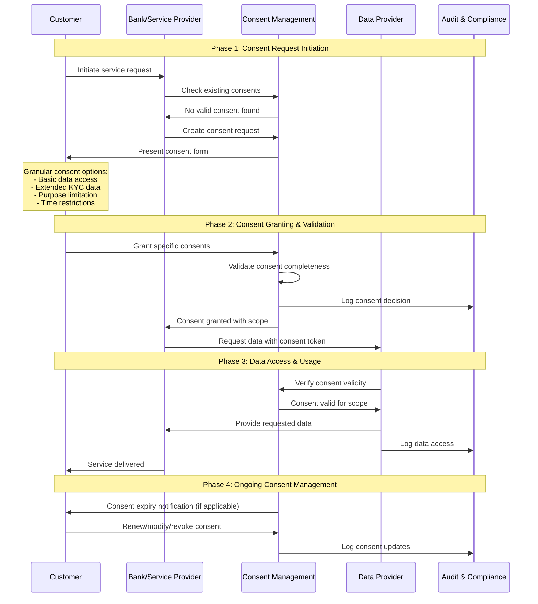

# Context and Guidelines for the API Demos

## Context and Sources

**Demos Context:**
- Reference files: 
    - `documentation/Fachliche Conclusions Open API Kundenbeziehung/02 Anforderungen.md`
    - `documentation/Fachliche Conclusions Open API Kundenbeziehung/03 Referenzprozess.md`
    - `documentation/Fachliche Conclusions Open API Kundenbeziehung/04 API Endpoint Design.md`
    - `documentation/Fachliche Conclusions Open API Kundenbeziehung/05 Vertrauensnetzwerk.md`
    - `documentation/Fachliche Conclusions Open API Kundenbeziehung/06 Consent und Security Flow.md`
    - `documentation/Fachliche Conclusions Open API Kundenbeziehung/08 Testing und Verifikation.md`
- Demos must be coherent with the content of the conclusions!!

**Demos Guidelines and Requirements:**
- Demos should visualize the functionality of the Open API Kundenbeziehung, not be a full implementation
- The demos should be simple and concise, but still provide a good overview of the functionality of the Open API Kundenbeziehung.
- Use visually appealing graphics and animations for the demos and use the color scheme provided: 'api/demo/colors.txt'
- Demos will be displayed in a browser, so they should be HTML based
- Demos should be interactive, allowing users to explore the functionality of the Open API Kundenbeziehung
- Demos should be easy to understand and follow, even for users who are not familiar with the Open API Kundenbeziehung
- Demos should be coherent with the content of the conclusions and especially with the graphical representations of the processes and flows in the conclusions (see graphics in 'Dokumentation Fachliche Perspektive/Fachliche Conclusions Open API Kundenbeziehung/Resources/graphics')
- Demos should appeal to an audience mostly from the financial industry, with an extensive theoretical and professional background, but not necessarily with a deep technical understanding of APIs or software development

## Demo Implementation:  Generic Demo showing core functionality

- The demo should show the general core functionality of the Open API Kundenbeziehung without addressing specific use cases
- Processes and flows to be shown:
    - **Referenzprozess**: Show the 10 step Referenzprozess as a basic functionality of the Open API Kundenbeziehung
        - reference file: `documentation/Fachliche Conclusions Open API Kundenbeziehung/03 Referenzprozess.md`
        - graphic: 'Dokumentation Fachliche Perspektive/Fachliche Conclusions Open API Kundenbeziehung/Resources/graphics/03-referenzprozess/Referenzprozess Generisch.png'
    - **Daten Onboarding und Pflege**: Show the functionality of the Open API Kundenbeziehung for Daten Onboarding und Pflege
        - reference file: `documentation/Fachliche Conclusions Open API Kundenbeziehung/04 API Endpoint Design.md`
        - graphic: 'Dokumentation Fachliche Perspektive/Fachliche Conclusions Open API Kundenbeziehung/Resources/graphics/03-referenzprozess/Daten Onboarding.png'
    - **Generic Consent Flow**: Show the generic Consent Flow of the Open API Kundenbeziehung 
        - reference file: `documentation/Fachliche Conclusions Open API Kundenbeziehung/06 Consent und Security Flow.md`
        - graphic: 'Dokumentation Fachliche Perspektive/Fachliche Conclusions Open API Kundenbeziehung/Resources/graphics/06-consent-security/generic-consent-flow.mmd'

### Demo-Spezifikation

Erstelle eine interaktive HTML-Demo für die **Open API Kundenbeziehung Alpha Version**, die generische API-Funktionalität für Finanzindustrie-Profis visualisiert.

#### Layout-Struktur (Responsive Design)

##### UI Elemente
- **Boxen**: Alle Container verwenden scharfe Ecken (border-radius: 0), Padding auf 10px reduziert
- **Farben**: Vollständige Implementierung mit CSS-Variablen basierend auf `api/demo/colors.txt`
- **Icons**: 60px große Piktogramme für alle Referenzprozess-Schritte
- **Hintergrund**: Hintergrundgrafik mit 50% grauer Überlagerung (`linear-gradient(rgba(128, 128, 128, 0.5))`)
- **Schriftart**: Verdana für alle Titel und Überschriften

##### Hintergrund
- **Hintergrundfarbe**: CSS-Variablen aus `api/demo/colors.txt` (--background, --surface, etc.)
- **Hintergrundbild**: `background-graphic-standard.jpg` mit `background-size: cover` und `background-attachment: fixed`
- **Überlagerung**: 50% graue Überlagerung für bessere Lesbarkeit

##### Header
- **Kompaktes Design**: Header-Padding von 30px auf 5px reduziert für platzsparenderes Layout
- **Zweispaltiges Grid-Layout**: 
  - **Linke Spalte**: "Open API Kundenbeziehung Demo Alpha Version 1.0" (text-align: left)
  - **Rechte Spalte**: "Interaktive Visualisierung der Basisimplementation: Referenzprozess, Daten Onboarding und Consent Flow" (text-align: center)
- **Logo**: 60px Höhe, absolute Positionierung (top: 20px, left: 20px)
- **Demo-Controls**: Play/Pause/Reset-Buttons mit State-Management (rechts oben positioniert)

##### Erste Spalte (85% Bildschirmbreite)

###### Oberer Bereich: 10-Stufen Referenzprozess
- **Layout**: 4 Phasen-Container mit CSS-Grid (2fr 3fr 2fr 3fr Spalten-Verteilung)
- **Phase-Boxen**: Rechteckige Phase-Bezeichnungen mit Primary-Color-Hintergrund (#253165), 25px Höhe
- **Schritt-Boxen**: 
  - Einheitliche Größe: 110px Höhe, 100% Breite, 8px Margin-Bottom
  - 60px große Piktogramme mit 2-zeiliger Beschriftung (Bindestrich-getrennt)
  - Tooltip-Funktion für detaillierte Beschreibungen
- **Visueller Status**: 
  - **Nicht gestartet**: Standard-Styling (weiß mit Border)
  - **Aktiv**: #FA9F8A Hintergrund, #F85F3D Border (2px)
  - **Abgeschlossen**: Weißer Hintergrund, #4cb867ff Border
- **Interaktion**: Click-Navigation durch alle Schritte mit Progressive Building

**Die 10 Referenzprozess-Schritte (mit 2-zeiliger Darstellung):**
1. **Initiali-sierung** - Information des Kunden
2. **Produkt-auswahl** - Bedürfnisbefriedigung  
3. **Selbst-deklaration** - FATCA/MIFID Information
4. **Basis-daten** - Kontaktangaben erfassen
5. **Erweiterte Daten** - Risiko-/Potenzialermittlung
6. **Identifi-kation** - Vertragspartei-Identifikation
7. **Background Checks** - KYC-Prozesse
8. **Vertrags-abschluss** - Geschäftsbedingungen
9. **Signatur** - Vertragsunterzeichnung
10. **Metadaten/Verteilung** - Systemintegration

###### Unterer Bereich: Generischer Consent Flow
- **Layout**: Kompaktes Design mit 600px Höhe, 10px Container-Padding
- **Participants**: 
  - Einheitliche Boxen: 150px Breite, 45px Höhe
  - Horizontales Layout: 24px Icon links, Text rechtsbündig
  - Ohne dunkelblauen Header-Hintergrund, scharfe Ecken
  - 10px Padding, zentriert zwischen den Spalten
- **Sequence Diagram**:
  - **Progressive Building**: Nachrichten akkumulieren ohne Reset zwischen Schritten
  - **18 Messages**: Gleichmäßig auf 25px Abstände verteilt (kompakte Darstellung)
  - **Message-Text**: Perfekt zentriert auf Pfeilen (horizontal und vertikal)
  - **Step-spezifische Farben**: 10 verschiedene Farben aus colors.txt für abgeschlossene Nachrichten
  - **Lifelines**: Präzise auf Participant-Zentren ausgerichtet
- **Phase-Anzeige**: Links positioniert mit 10px Abstand vom Container-Rand *TODO: only change when moving to different phase*
- **Granular Consent Info**: 
  - Erscheint automatisch bei Step 6 ("Grant specific consents")
  - Links positioniert, synchron mit Sequence-Flow
- **Step-Mapping**: 18 Consent-Flow-Messages auf 10 Referenzprozess-Schritte verteilt:
  - Step 1: Messages 1-2 (Initialisierung)
  - Step 2: Messages 3-4 (Produktauswahl)
  - Step 3: Messages 5-6 (Selbstdeklaration)
  - Step 4: Messages 7-8 (Basisdaten)
  - Step 5: Messages 9-10 (Erweiterte Daten)
  - Step 6: Messages 11-12 (Identifikation)
  - Step 7: Messages 13-14 (Background Checks)
  - Step 8: Message 15 (Vertragsabschluss)
  - Step 9: Messages 16-17 (Signatur)
  - Step 10: Message 18 (Metadaten/Verteilung)

- **Basis:** Mermaid-Diagramm als Visualisierung: 

- Als seperates File verfügbar: 'Dokumentation Fachliche Perspektive/Fachliche Conclusions Open API Kundenbeziehung/Resources/graphics/06-consent-security/generic-consent-flow.mmd'

- **Interaktion:** Wenn User durch Referenzprozess-Schritte klickt, erscheinen entsprechende Pfeile und Beschreibungen schrittweise im Consent Flow
- **Animation:** Smooth erscheinen der Sequenz-Elemente entsprechend der Referenzprozess-Navigation
- **Hover-Effekte:** Tooltip mit Schritt-Beschreibung und Details
- **Icons:** Verwende die Piktogramme in `api/demo/graphics/pictograms` für die participants

##### Zweite Spalte (15% Bildschirmbreite): Data Onboarding Process

- **Layout**: Sidebar-Container mit 10px Padding, flex-direction: column
- **Titel**: "Data Onboarding Process" mit reduzierter Schriftgrösse für Konsistenz
- **Zwei-Spalten-Layout**: Datenfelder werden in 2 Spalten angezeigt (CSS Grid: grid-template-columns: 1fr 1fr)
- **Progressive Erscheinung**: Datenfeld-Kategorien erscheinen entsprechend der Referenzprozess-Navigation

###### Datenfeld-Kategorien (progressive Anzeige):

**Consent & Metadata (Schritte 1-2):**
- `cookieConsent` (Boolean)
- `initialConsent` (Boolean)
- `serviceSelection` (Array)
- `consentValidUntil` (Date)

**Basic Identity Data (Schritte 3-4):**
- `customerId` (String)
- `firstName` (String)
- `lastName` (String)
- `dateOfBirth` (Date)
- `emailAddress` (String)
- `phoneNumber` (String)
- `streetAddress` (String)
- `postalCode` (String)
- `city` (String)
- `country` (String)

**Self-Declaration & Extended Data (Schritt 5):**
- `fatcaStatus` (Object)
- `mifidClassification` (String)
- `riskTolerance` (String)
- `investmentExperience` (Object)
- `estimatedIncome` (Number)
- `employmentStatus` (String)
- `employer` (String)

**Identification & Verification (Schritte 6-7):**
- `identificationDate` (Date)
- `identificationMethod` (String)
- `verificationLevel` (String)
- `kycStatus` (Object)
- `pepStatus` (Boolean)
- `sanctionsCheck` (Boolean)

**Contract & Signature (Schritte 8-9):**
- `contractAcceptance` (Boolean)
- `termsVersion` (String)
- `signatureMethod` (String)
- `signatureTimestamp` (Date)
- `qualifiedSignature` (Boolean)

**Process Metadata (Schritt 10):**
- `processId` (String)
- `completionStatus` (String)
- `documentReferences` (Array)
- `auditTrail` (Array)
- `systemIntegrationStatus` (Object)

##### Full-Width Console Output unter den 2 Spalten
- **Layout**: Full-width Container unterhalb der Hauptspalten
- **Styling**: Console-ähnliches Design mit dunklem Hintergrund (#1e293b), heller Text (#f9fafb)
- **Zweck**: Zeigt die durchgeführten API-Calls und deren Ergebnisse
- **Progressive Updates**: Console-Ausgabe wird bei jedem Referenzprozess-Schritt erweitert
- **Inhalt**:
    - API-Call-Details (z.B. `GET /customers`, `POST /consents`)
    - Request- und Response-Daten
    - Status-Codes und Fehlermeldungen
    - Farbkodierung für verschiedene API-Call-Typen

#### Design-Spezifikationen

##### Farbschema (Open Banking Project)
- **Implementierung**: CSS Custom Properties basierend auf `api/demo/colors.txt`
- **Primärfarben**: #253165 (Primary), #F85F3D (Secondary), #0070C0 (Tertiary)
- **Hintergrund**: #f9fafb mit Hintergrundgrafik und 50% grauer Überlagerung
- **Step-spezifische Farben**: 10 verschiedene Farben für abgeschlossene Consent-Flow-Schritte

##### Responsive Design
- **Desktop**: 2-Spalten-Layout (85% Hauptbereich, 15% Data Onboarding Sidebar)
- **Tablet**: CSS Grid angepasst für kleinere Bildschirme
- **Mobile**: Vertikale Stapelung mit kompakteren Elementen
- **Breakpoints**: Standard responsive Breakpoints für optimale Darstellung

##### Animationen
- **CSS Transitions**: 300ms ease-in-out für alle Übergänge
- **Progressive Building**: Echtes akkumulatives Aufbauen ohne Resets
- **Granular Consent Visibility**: Smooth fade-in/fade-out bei Step 6
- **Hover-Effekte**: Tooltips und interaktive Feedback-Animationen
- **Data Field Animation**: 500ms fade-in mit slide-up für neue Datenfelder

##### Accessibility
- **Keyboard Navigation** für alle interaktiven Elemente
- **Screen Reader Support** mit aria-labels
- **High Contrast Mode** kompatibel
- **Focus Indicators** deutlich sichtbar

#### Technische Anforderungen

##### Implementation
- **HTML5/CSS3/Vanilla JavaScript** (keine externen Dependencies)
- **CSS Grid/Flexbox** für Layout
- **CSS Custom Properties** für Theming
- **Local State Management** für Demo-Fortschritt
-> **WILL BE RUN ON LOCALHOST** (no server-side code)

#### Interaktions-Spezifikation

##### Referenzprozess Navigation
1. **Initialer Zustand**: Schritt 1 aktiv, alle anderen inaktiv
2. **Click Behavior**: Sequenzielle Navigation durch alle Schritte
3. **Visueller Status**: Aktiv (#FA9F8A), Abgeschlossen (#4cb867ff), Standard (weiss)
4. **Progressive Building**: Vorherige Schritte bleiben permanent sichtbar
5. **Hover Details**: Tooltips mit detaillierter Schritt-Beschreibung

##### Consent Flow Synchronisation
- **True Progressive Building**: Nachrichten akkumulieren ohne Reset zwischen Schritten
- **18-Message-Mapping**: Gleichmäßige Verteilung auf 10 Referenzprozess-Schritte
- **Step-spezifische Farben**: 10 verschiedene Farben für abgeschlossene Nachrichten
- **Granular Consent Control**: Erscheint bei Step 6, verschwindet wenn Step 6 nicht aktiv

##### Data Field Animation
- **Timing**: Sofortige Anzeige nach Referenzprozess-Schritt-Activation
- **Effect**: Fade-in mit slide-up Animation (500ms)
- **Gruppierung**: Kategorien erscheinen als zusammenhängende Blöcke
- **Zwei-Spalten-Layout**: CSS Grid für kompakte Darstellung

#### Zielgruppe-Anpassung

##### Finanzindustrie-Profis ohne tiefe API-Kenntnisse
- **Klare Business-Terminologie** statt technische API-Details
- **Visueller Fokus** auf Prozessverständnis
- **Hover-Hilfen** für komplexe Konzepte
- **Professional Design** ohne "spielerische" Elemente

##### Content-Sprache
- **Deutsch** als Primärsprache (Schweizer Kontext)
- **Englisch** als Fallback für technische Begriffe
- **Keine Emojis** im professionellen Kontext
- **Präzise Fachterminologie** aus der Finanzbranche

Die vollständig funktionsfähige Demo ist implementiert und verfügbar als standalone HTML-Datei unter `/api/demo/context-demo.html`.

**!!!!! NEW LINEAR DEMO STEP ORDER!!!!!**

**Complete Linear Demo Flow Order**

NEUTRAL STATE (Initial)

- All process steps: inactive/neutral
- All consent messages: hidden
- All data categories: hidden
- Console: "Ready - waiting for user interaction"

STEP 1: Initialisierung

- Process Step: Step 1 → active
- Data Category: Service Discovery & Initialisierung → active
- Phase Display: "Phase 1: Consent Request Initiation"
- Consent Messages: 1-2 → active
- Message 1: Customer → Bank: "Initiate service request"
- Message 2: Bank → ConsentMgmt: "Check existing consents"
- Consent Messages: 1-2 → completed
- Data Category: Service Discovery & Initialisierung → completed

STEP 2: Produktauswahl

- Process Step: Step 1 → completed, Step 2 → active
- Data Category: Service Discovery → completed, Produktkonfiguration → active
- Consent Messages: 3-4 → active
- Message 3: ConsentMgmt → Bank: "No valid consent found"
- Message 4: Bank → ConsentMgmt: "Create consent request"
- Consent Messages: 3-4 → completed
- Data Category: Produktkonfiguration → completed

STEP 3: Selbstdeklaration

- Process Step: Step 2 → completed, Step 3 → active
- Phase Display: "Phase 2: Consent Granting & Validation"
- Data Category: Compliance & Selbstdeklaration → active
- Consent Messages: 5-6 → active
- Message 5: ConsentMgmt → Customer: "Present consent form"
- Message 6: Customer → ConsentMgmt: "Grant specific consents"
- Consent Messages: 5-6 → completed
- Consent Messages: 7-8 → active
- Message 7: ConsentMgmt → ConsentMgmt: "Validate consent completeness"
- Message 8: ConsentMgmt → AuditLog: "Log consent decision"
- Message 9: ConsentMgmt → Bank: "Consent granted with scope"
- Consent Messages: 7-9 → completed
- Data Category: Compliance & Selbstdeklaration → completed

STEP 4: Basisdaten

- Process Step: Step 3 → completed, Step 4 → active
- Phase Display: "Phase 3: Data Access & Usage"
- Consent Messages: 10 → active
- Message 10: Bank → DataProvider: "Request data with consent token"
- Data Category: Basisdaten → active

STEP 5: Erweiterte Daten

- Process Step: Step 4 → completed, Step 5 → active
- Data Category: Erweiterte Profildaten → active

STEP 6: Identifikation

- Process Step: Step 5 → completed, Step 6 → active
- Data Category: Identifikation → active
- Consent Messages: 11-12 → active
- Message 11: DataProvider → ConsentMgmt: "Verify consent validity"

STEP 7: Background Checks

- Process Step: Step 6 → completed, Step 7 → active
- Data Category: KYC & Background Checks → active
- Message 12: ConsentMgmt → DataProvider: "Consent valid for scope"
- Consent Messages: 10-12 → completed
- Data Category: Identifikation → completed
- Data Category: KYC & Background Checks → completed
- Consent Messages: 13-14 → active
- Message 13: DataProvider → Bank: "Provide requested data"
- Data Category: Basisdaten → completed
- Data Category: Erweiterte Profildaten → completed
- Message 14: DataProvider → AuditLog: "Log data access"
- Consent Messages: 13-14 → completed

STEP 8: Vertragsabschluss

- Process Step: Step 7 → completed, Step 8 → active
- Data Category: Vertragsgestaltung → active
- Data Category: Vertragsgestaltung → completed

STEP 9: Signatur

- Process Step: Step 8 → completed, Step 9 → active
- Data Category: Digitale Signatur → active
- Consent Messages: 15 → active
- Message 15: Bank → Customer: "Service delivered"
- Consent Messages: 15 → completed
- Data Category: Digitale Signatur → completed

STEP 10: Metadaten/Verteilung

- Process Step: Step 9 → completed, Step 10 → active
- Phase Display: "Phase 4: Ongoing Consent Management"
- Data Category: Systemintegration → active
- Consent Messages: 15 → completed, 16-17 → active
- Message 16: ConsentMgmt → Customer: "Consent expiry notification"
- Message 17: Customer → ConsentMgmt: "Renew/modify/revoke consent"
- Consent Messages: 16-17 → completed
- Consent Messages: 18 → active
- Message 18: ConsentMgmt → AuditLog: "Log consent updates"
- Consent Messages: 18 → completed
- Data Category: Systemintegration → completed

COMPLETION STATE

Process Step: All steps → completed
Consent Messages: All messages → completed
Data Category: All categories → completed
Phase Display: "Process Complete"
