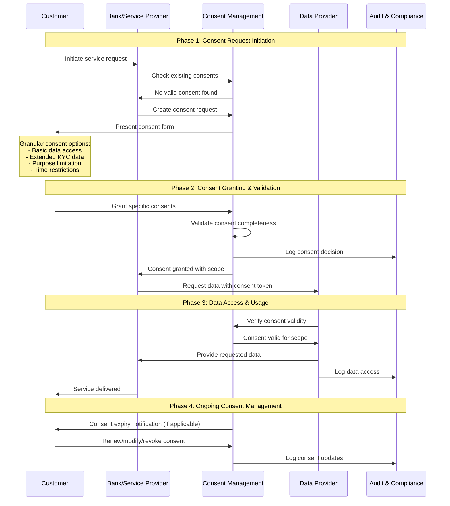

# Context and Guidelines for the API Demos

## Context and Sources

**Demos Context:**
- Reference files: 
    - `documentation/Fachliche Conclusions Open API Kundenbeziehung/02 Anforderungen.md`
    - `documentation/Fachliche Conclusions Open API Kundenbeziehung/03 Referenzprozess.md`
    - `documentation/Fachliche Conclusions Open API Kundenbeziehung/04 API Endpoint Design.md`
    - `documentation/Fachliche Conclusions Open API Kundenbeziehung/05 Vertrauensnetzwerk.md`
    - `documentation/Fachliche Conclusions Open API Kundenbeziehung/06 Consent und Security Flow.md`
    - `documentation/Fachliche Conclusions Open API Kundenbeziehung/08 Testing und Verifikation.md`
- Demos must be coherent with the content of the conclusions!!

**Demos Guidelines and Requirements:**
- Demos should visualize the functionality of the Open API Kundenbeziehung, not be a full implementation
- The demos should be simple and concise, but still provide a good overview of the functionality of the Open API Kundenbeziehung.
- Use visually appealing graphics and animations for the demos and use the color scheme provided: 'api/demo/colors.txt'
- Demos will be displayed in a browser, so they should be HTML based
- Demos should be interactive, allowing users to explore the functionality of the Open API Kundenbeziehung
- Demos should be easy to understand and follow, even for users who are not familiar with the Open API Kundenbeziehung
- Demos should be coherent with the content of the conclusions and especially with the graphical representations of the processes and flows in the conclusions (see graphics in 'Dokumentation Fachliche Perspektive/Fachliche Conclusions Open API Kundenbeziehung/Resources/graphics')
- Demos should appeal to an audience mostly from the financial industry, with an extensive theoretical and professional background, but not necessarily with a deep technical understanding of APIs or software development

## Demo Implementation:  Generic Demo showing core functionality

- The demo should show the general core functionality of the Open API Kundenbeziehung without addressing specific use cases
- Processes and flows to be shown:
    - **Referenzprozess**: Show the 10 step Referenzprozess as a basic functionality of the Open API Kundenbeziehung
        - reference file: `documentation/Fachliche Conclusions Open API Kundenbeziehung/03 Referenzprozess.md`
        - graphic: 'Dokumentation Fachliche Perspektive/Fachliche Conclusions Open API Kundenbeziehung/Resources/graphics/03-referenzprozess/Referenzprozess Generisch.png'
    - **Daten Onboarding und Pflege**: Show the functionality of the Open API Kundenbeziehung for Daten Onboarding und Pflege
        - reference file: `documentation/Fachliche Conclusions Open API Kundenbeziehung/04 API Endpoint Design.md`
        - graphic: 'Dokumentation Fachliche Perspektive/Fachliche Conclusions Open API Kundenbeziehung/Resources/graphics/03-referenzprozess/Daten Onboarding.png'
    - **Generic Consent Flow**: Show the generic Consent Flow of the Open API Kundenbeziehung 
        - reference file: `documentation/Fachliche Conclusions Open API Kundenbeziehung/06 Consent und Security Flow.md`
        - graphic: 'Dokumentation Fachliche Perspektive/Fachliche Conclusions Open API Kundenbeziehung/Resources/graphics/06-consent-security/generic-consent-flow.mmd'

### Demo-Spezifikation

Erstelle eine interaktive HTML-Demo für die **Open API Kundenbeziehung Alpha Version**, die generische API-Funktionalität für Finanzindustrie-Profis visualisiert.

#### Layout-Struktur (Responsive Design)

##### UI Elemente
- **Boxen** Eckig (nicht abgerundet)
- **Farben**: Verwende die in `api/demo/colors.txt` definierten Farben
- **Icons**: Verwende die Piktogramme in `api/demo/graphics/pictograms`
- **Hintergrund**: Verwende die Grafiken in `api/demo/graphics/background`
- **KEINE EMOJIS VERWENDEN!**

##### Hintergrund
- **Hintergrundfarbe:** wie in `api/demo/colors.txt` definiert
- **Hintergrundbild:** Verwende die zu Verfügung stehenden Grafiken in 'api/demo/graphics/background'

##### Full-Width Header
- **Titel:** "Open API Kundenbeziehung Demo Alpha Version 1.0"
- **Untertitel:** "Interaktive Visualisierung der Basisimplementation: Referenzprozess, Daten Onboarding und Consent Flow"
- **Logo:** Open Banking Project Logo (links oben) ('api/demo/graphics/logos')

##### Erste Spalte (85% Bildschirmbreite)

###### Oberer Bereich: 10-Stufen Referenzprozess
- **Darstellung:** Eine horizontale Reihe von 10 Blöcken (Boxen)
- **Inhalt pro Block:** 
  - Schritt-Name
  - Entsprechendes Piktogramm/Icon ('api/demo/graphics/pictograms')
  - Hover-Funktion für detaillierte Beschreibung
- **Interaktion:** Click-through Navigation durch alle Schritte
- **Visueller Status:** Hervorhebung des aktuellen Schritts

**Die 10 Referenzprozess-Schritte:**
1. **Initialisierung** - Information des Kunden
2. **Produktauswahl** - Bedürfnisbefriedigung  
3. **Selbstdeklaration** - FATCA/MIFID Information
4. **Basisdaten** - Kontaktangaben erfassen
5. **Erweiterte Daten** - Risiko-/Potenzialermittlung
6. **Identifikation** - Vertragspartei-Identifikation
7. **Background Checks** - KYC-Prozesse
8. **Vertragsabschluss** - Geschäftsbedingungen
9. **Signatur** - Vertragsunterzeichnung
10. **Metadaten/Verteilung** - Systemintegration

###### Unterer Bereich: Generischer Consent Flow
- **Basis:** Folgender Mermaid-Diagramm als Visualisierung: 

- Als seperates File verfügbar: 'Dokumentation Fachliche Perspektive/Fachliche Conclusions Open API Kundenbeziehung/Resources/graphics/06-consent-security/generic-consent-flow.mmd'

- **Interaktion:** Wenn User durch Referenzprozess-Schritte klickt, erscheinen entsprechende Pfeile und Beschreibungen schrittweise im Consent Flow
- **Animation:** Smooth erscheinen der Sequenz-Elemente entsprechend der Referenzprozess-Navigation
- **Hover-Effekte:** Tooltip mit Schritt-Beschreibung und Details
- **Icons:** Verwende die Piktogramme in `api/demo/graphics/pictograms` für die participants

##### Zweite Spalte (15% Bildschirmbreite): Data Onboarding Process

###### Datenfeld-Kategorien (erscheinen progressiv):

**Consent & Metadata (Schritte 1-2):**
- `cookieConsent` (Boolean)
- `initialConsent` (Boolean)
- `serviceSelection` (Array)
- `consentValidUntil` (Date)

**Basic Identity Data (Schritte 3-4):**
- `customerId` (String)
- `firstName` (String)
- `lastName` (String)
- `dateOfBirth` (Date)
- `emailAddress` (String)
- `phoneNumber` (String)
- `streetAddress` (String)
- `postalCode` (String)
- `city` (String)
- `country` (String)

**Self-Declaration & Extended Data (Schritt 5):**
- `fatcaStatus` (Object)
- `mifidClassification` (String)
- `riskTolerance` (String)
- `investmentExperience` (Object)
- `estimatedIncome` (Number)
- `employmentStatus` (String)
- `employer` (String)

**Identification & Verification (Schritte 6-7):**
- `identificationDate` (Date)
- `identificationMethod` (String)
- `verificationLevel` (String)
- `kycStatus` (Object)
- `pepStatus` (Boolean)
- `sanctionsCheck` (Boolean)

**Contract & Signature (Schritte 8-9):**
- `contractAcceptance` (Boolean)
- `termsVersion` (String)
- `signatureMethod` (String)
- `signatureTimestamp` (Date)
- `qualifiedSignature` (Boolean)

**Process Metadata (Schritt 10):**
- `processId` (String)
- `completionStatus` (String)
- `documentReferences` (Array)
- `auditTrail` (Array)
- `systemIntegrationStatus` (Object)

##### Full-Width Console Output unter den 2 Spalten
- **Zweck:** Zeigt die durchgeführten API-Calls und deren Ergebnisse
- **Inhalt:**
    - API-Call-Details (z.B. `GET /customers`, `POST /consents`)
    - Request- und Response-Daten
    - Status-Codes und Fehlermeldungen

#### Design-Spezifikationen

##### Farbschema (Open Banking Project)
- see `api/demo/colors.txt` for the color scheme

##### Responsive Design
- **Desktop:** Vollständige 2-Spalten-Darstellung
- **Tablet:** Gestapelte Darstellung, Referenzprozess scrollbar
- **Mobile:** Vertikale Darstellung, kompakte Icons

##### Animationen
- **Smooth CSS Transitions** (300ms ease-in-out)
- **Progressive Content Reveal** beim Click-through
- **Hover-Effekte** für Interaktivität
- **Loading Animations** für Datenfeld-Erscheinen

##### Accessibility
- **Keyboard Navigation** für alle interaktiven Elemente
- **Screen Reader Support** mit aria-labels
- **High Contrast Mode** kompatibel
- **Focus Indicators** deutlich sichtbar

#### Technische Anforderungen

##### Implementation
- **HTML5/CSS3/Vanilla JavaScript** (keine externen Dependencies)
- **CSS Grid/Flexbox** für Layout
- **CSS Custom Properties** für Theming
- **Local State Management** für Demo-Fortschritt
-> **WILL BE RUN ON LOCALHOST** (no server-side code)

#### Interaktions-Spezifikation

##### Referenzprozess Navigation
1. **Initialer Zustand:** Schritt 1 aktiv, alle anderen grau
2. **Click Behavior:** Nächster Schritt wird aktiv, vorherige bleiben sichtbar
3. **Hover Details:** Tooltip mit Schritt-Beschreibung
4. **Progress Tracking:** Visueller Indikator für Completion

##### Consent Flow Synchronisation
- **Schritte 1-2:** Customer → Bank Interaction
- **Schritte 3-4:** Bank → ConsentMgmt Flow
- **Schritte 5-6:** ConsentMgmt → Customer Interaction
- **Schritte 7-8:** ConsentMgmt → DataProvider Flow
- **Schritte 9-10:** DataProvider → AuditLog & Completion

##### Data Field Animation
- **Timing:** 500ms nach Referenzprozess-Schritt-Activation
- **Effect:** Fade-in mit slight slide-up
- **Grouping:** Kategorien erscheinen als Block
- **Highlighting:** Neue Felder kurz hervorgehoben

#### Zielgruppe-Anpassung

##### Finanzindustrie-Profis ohne tiefe API-Kenntnisse
- **Klare Business-Terminologie** statt technische API-Details
- **Visueller Fokus** auf Prozessverständnis
- **Hover-Hilfen** für komplexe Konzepte
- **Professional Design** ohne "spielerische" Elemente

##### Content-Sprache
- **Deutsch** als Primärsprache (Schweizer Kontext)
- **Englisch** als Fallback für technische Begriffe
- **Keine Emojis** im professionellen Kontext
- **Präzise Fachterminologie** aus der Finanzbranche

**TODO**: Erstelle eine vollständig funktionsfähige Demo, die diese Spezifikation umsetzt und als standalone HTML-Datei ausgeführt werden kann.
